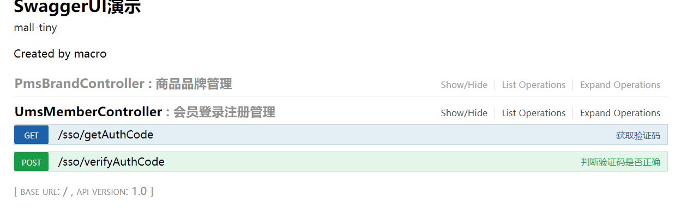

mall项目全套学习教程连载中，[关注公众号](#公众号)第一时间获取。

# mall整合Redis实现缓存功能

> 本文主要讲解mall整合Redis的过程，以短信验证码的存储验证为例。

## Redis的安装和启动

> Redis是用C语言开发的一个高性能键值对数据库，可用于数据缓存，主要用于处理大量数据的高访问负载。


- 下载Redis,下载地址：https://github.com/MicrosoftArchive/redis/releases


- 下载完后解压到指定目录


- 在当前地址栏输入cmd后，执行redis的启动命令：redis-server.exe redis.windows.conf


## 整合Redis

### 添加项目依赖
> 在pom.xml中新增Redis相关依赖

```xml
<!--redis依赖配置-->
<dependency>
  <groupId>org.springframework.boot</groupId>
  <artifactId>spring-boot-starter-data-redis</artifactId>
</dependency>
```
### 修改SpringBoot配置文件

> 在application.yml中添加Redis的配置及Redis中自定义key的配置。
#### 在spring节点下添加Redis的配置

```yml
  redis:
    host: localhost # Redis服务器地址
    database: 0 # Redis数据库索引（默认为0）
    port: 6379 # Redis服务器连接端口
    password: # Redis服务器连接密码（默认为空）
    jedis:
      pool:
        max-active: 8 # 连接池最大连接数（使用负值表示没有限制）
        max-wait: -1ms # 连接池最大阻塞等待时间（使用负值表示没有限制）
        max-idle: 8 # 连接池中的最大空闲连接
        min-idle: 0 # 连接池中的最小空闲连接
    timeout: 3000ms # 连接超时时间（毫秒）
```

#### 在根节点下添加Redis自定义key的配置

```yml
# 自定义redis key
redis:
  key:
    prefix:
      authCode: "portal:authCode:"
    expire:
      authCode: 120 # 验证码超期时间
```

### 添加RedisService接口用于定义一些常用Redis操作

```java
package com.macro.mall.tiny.service;

/**
 * redis操作Service,
 * 对象和数组都以json形式进行存储
 * Created by macro on 2018/8/7.
 */
public interface RedisService {
    /**
     * 存储数据
     */
    void set(String key, String value);

    /**
     * 获取数据
     */
    String get(String key);

    /**
     * 设置超期时间
     */
    boolean expire(String key, long expire);

    /**
     * 删除数据
     */
    void remove(String key);

    /**
     * 自增操作
     * @param delta 自增步长
     */
    Long increment(String key, long delta);

}

```

### 注入StringRedisTemplate，实现RedisService接口

```java
package com.macro.mall.tiny.service.impl;

import com.macro.mall.tiny.service.RedisService;
import org.springframework.beans.factory.annotation.Autowired;
import org.springframework.data.redis.core.StringRedisTemplate;
import org.springframework.stereotype.Service;

import java.util.concurrent.TimeUnit;

/**
 * redis操作Service的实现类
 * Created by macro on 2018/8/7.
 */
@Service
public class RedisServiceImpl implements RedisService {
    @Autowired
    private StringRedisTemplate stringRedisTemplate;

    @Override
    public void set(String key, String value) {
        stringRedisTemplate.opsForValue().set(key, value);
    }

    @Override
    public String get(String key) {
        return stringRedisTemplate.opsForValue().get(key);
    }

    @Override
    public boolean expire(String key, long expire) {
        return stringRedisTemplate.expire(key, expire, TimeUnit.SECONDS);
    }

    @Override
    public void remove(String key) {
        stringRedisTemplate.delete(key);
    }

    @Override
    public Long increment(String key, long delta) {
        return stringRedisTemplate.opsForValue().increment(key,delta);
    }
}

```

### 添加UmsMemberController
> 添加根据电话号码获取验证码的接口和校验验证码的接口

```java
package com.macro.mall.tiny.controller;

import com.macro.mall.tiny.common.api.CommonResult;
import com.macro.mall.tiny.service.UmsMemberService;
import io.swagger.annotations.Api;
import io.swagger.annotations.ApiOperation;
import org.springframework.beans.factory.annotation.Autowired;
import org.springframework.stereotype.Controller;
import org.springframework.web.bind.annotation.RequestMapping;
import org.springframework.web.bind.annotation.RequestMethod;
import org.springframework.web.bind.annotation.RequestParam;
import org.springframework.web.bind.annotation.ResponseBody;

/**
 * 会员登录注册管理Controller
 * Created by macro on 2018/8/3.
 */
@Controller
@Api(tags = "UmsMemberController", description = "会员登录注册管理")
@RequestMapping("/sso")
public class UmsMemberController {
    @Autowired
    private UmsMemberService memberService;

    @ApiOperation("获取验证码")
    @RequestMapping(value = "/getAuthCode", method = RequestMethod.GET)
    @ResponseBody
    public CommonResult getAuthCode(@RequestParam String telephone) {
        return memberService.generateAuthCode(telephone);
    }

    @ApiOperation("判断验证码是否正确")
    @RequestMapping(value = "/verifyAuthCode", method = RequestMethod.POST)
    @ResponseBody
    public CommonResult updatePassword(@RequestParam String telephone,
                                 @RequestParam String authCode) {
        return memberService.verifyAuthCode(telephone,authCode);
    }
}

```

### 添加UmsMemberService接口

```java
package com.macro.mall.tiny.service;

import com.macro.mall.tiny.common.api.CommonResult;

/**
 * 会员管理Service
 * Created by macro on 2018/8/3.
 */
public interface UmsMemberService {

    /**
     * 生成验证码
     */
    CommonResult generateAuthCode(String telephone);

    /**
     * 判断验证码和手机号码是否匹配
     */
    CommonResult verifyAuthCode(String telephone, String authCode);

}

```

### 添加UmsMemberService接口的实现类UmsMemberServiceImpl

> 生成验证码时，将自定义的Redis键值加上手机号生成一个Redis的key,以验证码为value存入到Redis中，并设置过期时间为自己配置的时间（这里为120s）。校验验证码时根据手机号码来获取Redis里面存储的验证码，并与传入的验证码进行比对。

```java
package com.macro.mall.tiny.service.impl;

import com.macro.mall.tiny.common.api.CommonResult;
import com.macro.mall.tiny.service.RedisService;
import com.macro.mall.tiny.service.UmsMemberService;
import org.springframework.beans.factory.annotation.Autowired;
import org.springframework.beans.factory.annotation.Value;
import org.springframework.stereotype.Service;
import org.springframework.util.StringUtils;

import java.util.Random;

/**
 * 会员管理Service实现类
 * Created by macro on 2018/8/3.
 */
@Service
public class UmsMemberServiceImpl implements UmsMemberService {
    @Autowired
    private RedisService redisService;
    @Value("${redis.key.prefix.authCode}")
    private String REDIS_KEY_PREFIX_AUTH_CODE;
    @Value("${redis.key.expire.authCode}")
    private Long AUTH_CODE_EXPIRE_SECONDS;

    @Override
    public CommonResult generateAuthCode(String telephone) {
        StringBuilder sb = new StringBuilder();
        Random random = new Random();
        for (int i = 0; i < 6; i++) {
            sb.append(random.nextInt(10));
        }
        //验证码绑定手机号并存储到redis
        redisService.set(REDIS_KEY_PREFIX_AUTH_CODE + telephone, sb.toString());
        redisService.expire(REDIS_KEY_PREFIX_AUTH_CODE + telephone, AUTH_CODE_EXPIRE_SECONDS);
        return CommonResult.success(sb.toString(), "获取验证码成功");
    }


    //对输入的验证码进行校验
    @Override
    public CommonResult verifyAuthCode(String telephone, String authCode) {
        if (StringUtils.isEmpty(authCode)) {
            return CommonResult.failed("请输入验证码");
        }
        String realAuthCode = redisService.get(REDIS_KEY_PREFIX_AUTH_CODE + telephone);
        boolean result = authCode.equals(realAuthCode);
        if (result) {
            return CommonResult.success(null, "验证码校验成功");
        } else {
            return CommonResult.failed("验证码不正确");
        }
    }

}

```
### 运行项目
> 访问Swagger的API文档地址http://localhost:8080/swagger-ui.html ,对接口进行测试。



## 项目源码地址
[https://github.com/macrozheng/mall-learning/tree/master/mall-tiny-03](https://github.com/macrozheng/mall-learning/tree/master/mall-tiny-03)

## 公众号


