mall项目全套学习教程连载中，[关注公众号](#公众号)第一时间获取。

# mall整合SpringSecurity和JWT实现认证和授权（二）

> 接上一篇，controller和service层的代码实现及登录授权流程演示。

## 登录注册功能实现

### 添加UmsAdminController类
> 实现了后台用户登录、注册及获取权限的接口

```java
package com.macro.mall.tiny.controller;

import com.macro.mall.tiny.common.api.CommonResult;
import com.macro.mall.tiny.dto.UmsAdminLoginParam;
import com.macro.mall.tiny.mbg.model.UmsAdmin;
import com.macro.mall.tiny.mbg.model.UmsPermission;
import com.macro.mall.tiny.service.UmsAdminService;
import io.swagger.annotations.Api;
import io.swagger.annotations.ApiOperation;
import org.springframework.beans.factory.annotation.Autowired;
import org.springframework.beans.factory.annotation.Value;
import org.springframework.stereotype.Controller;
import org.springframework.validation.BindingResult;
import org.springframework.web.bind.annotation.*;

import java.util.HashMap;
import java.util.List;
import java.util.Map;

/**
 * 后台用户管理
 * Created by macro on 2018/4/26.
 */
@Controller
@Api(tags = "UmsAdminController", description = "后台用户管理")
@RequestMapping("/admin")
public class UmsAdminController {
    @Autowired
    private UmsAdminService adminService;
    @Value("${jwt.tokenHeader}")
    private String tokenHeader;
    @Value("${jwt.tokenHead}")
    private String tokenHead;

    @ApiOperation(value = "用户注册")
    @RequestMapping(value = "/register", method = RequestMethod.POST)
    @ResponseBody
    public CommonResult<UmsAdmin> register(@RequestBody UmsAdmin umsAdminParam, BindingResult result) {
        UmsAdmin umsAdmin = adminService.register(umsAdminParam);
        if (umsAdmin == null) {
            CommonResult.failed();
        }
        return CommonResult.success(umsAdmin);
    }

    @ApiOperation(value = "登录以后返回token")
    @RequestMapping(value = "/login", method = RequestMethod.POST)
    @ResponseBody
    public CommonResult login(@RequestBody UmsAdminLoginParam umsAdminLoginParam, BindingResult result) {
        String token = adminService.login(umsAdminLoginParam.getUsername(), umsAdminLoginParam.getPassword());
        if (token == null) {
            return CommonResult.validateFailed("用户名或密码错误");
        }
        Map<String, String> tokenMap = new HashMap<>();
        tokenMap.put("token", token);
        tokenMap.put("tokenHead", tokenHead);
        return CommonResult.success(tokenMap);
    }

    @ApiOperation("获取用户所有权限（包括+-权限）")
    @RequestMapping(value = "/permission/{adminId}", method = RequestMethod.GET)
    @ResponseBody
    public CommonResult<List<UmsPermission>> getPermissionList(@PathVariable Long adminId) {
        List<UmsPermission> permissionList = adminService.getPermissionList(adminId);
        return CommonResult.success(permissionList);
    }
}

```

### 添加UmsAdminService接口

```java
package com.macro.mall.tiny.service;

import com.macro.mall.tiny.mbg.model.UmsAdmin;
import com.macro.mall.tiny.mbg.model.UmsPermission;

import java.util.List;

/**
 * 后台管理员Service
 * Created by macro on 2018/4/26.
 */
public interface UmsAdminService {
    /**
     * 根据用户名获取后台管理员
     */
    UmsAdmin getAdminByUsername(String username);

    /**
     * 注册功能
     */
    UmsAdmin register(UmsAdmin umsAdminParam);

    /**
     * 登录功能
     * @param username 用户名
     * @param password 密码
     * @return 生成的JWT的token
     */
    String login(String username, String password);

    /**
     * 获取用户所有权限（包括角色权限和+-权限）
     */
    List<UmsPermission> getPermissionList(Long adminId);
}

```

### 添加UmsAdminServiceImpl类

```java
package com.macro.mall.tiny.service.impl;

import com.macro.mall.tiny.common.utils.JwtTokenUtil;
import com.macro.mall.tiny.dao.UmsAdminRoleRelationDao;
import com.macro.mall.tiny.dto.UmsAdminLoginParam;
import com.macro.mall.tiny.mbg.mapper.UmsAdminMapper;
import com.macro.mall.tiny.mbg.model.UmsAdmin;
import com.macro.mall.tiny.mbg.model.UmsAdminExample;
import com.macro.mall.tiny.mbg.model.UmsPermission;
import com.macro.mall.tiny.service.UmsAdminService;
import org.slf4j.Logger;
import org.slf4j.LoggerFactory;
import org.springframework.beans.BeanUtils;
import org.springframework.beans.factory.annotation.Autowired;
import org.springframework.beans.factory.annotation.Value;
import org.springframework.security.authentication.AuthenticationManager;
import org.springframework.security.authentication.BadCredentialsException;
import org.springframework.security.authentication.UsernamePasswordAuthenticationToken;
import org.springframework.security.core.AuthenticationException;
import org.springframework.security.core.context.SecurityContextHolder;
import org.springframework.security.core.userdetails.UserDetails;
import org.springframework.security.core.userdetails.UserDetailsService;
import org.springframework.security.crypto.password.PasswordEncoder;
import org.springframework.stereotype.Service;

import java.util.Date;
import java.util.List;

/**
 * UmsAdminService实现类
 * Created by macro on 2018/4/26.
 */
@Service
public class UmsAdminServiceImpl implements UmsAdminService {
    private static final Logger LOGGER = LoggerFactory.getLogger(UmsAdminServiceImpl.class);
    @Autowired
    private UserDetailsService userDetailsService;
    @Autowired
    private JwtTokenUtil jwtTokenUtil;
    @Autowired
    private PasswordEncoder passwordEncoder;
    @Value("${jwt.tokenHead}")
    private String tokenHead;
    @Autowired
    private UmsAdminMapper adminMapper;
    @Autowired
    private UmsAdminRoleRelationDao adminRoleRelationDao;

    @Override
    public UmsAdmin getAdminByUsername(String username) {
        UmsAdminExample example = new UmsAdminExample();
        example.createCriteria().andUsernameEqualTo(username);
        List<UmsAdmin> adminList = adminMapper.selectByExample(example);
        if (adminList != null && adminList.size() > 0) {
            return adminList.get(0);
        }
        return null;
    }

    @Override
    public UmsAdmin register(UmsAdmin umsAdminParam) {
        UmsAdmin umsAdmin = new UmsAdmin();
        BeanUtils.copyProperties(umsAdminParam, umsAdmin);
        umsAdmin.setCreateTime(new Date());
        umsAdmin.setStatus(1);
        //查询是否有相同用户名的用户
        UmsAdminExample example = new UmsAdminExample();
        example.createCriteria().andUsernameEqualTo(umsAdmin.getUsername());
        List<UmsAdmin> umsAdminList = adminMapper.selectByExample(example);
        if (umsAdminList.size() > 0) {
            return null;
        }
        //将密码进行加密操作
        String encodePassword = passwordEncoder.encode(umsAdmin.getPassword());
        umsAdmin.setPassword(encodePassword);
        adminMapper.insert(umsAdmin);
        return umsAdmin;
    }

    @Override
    public String login(String username, String password) {
        String token = null;
        try {
            UserDetails userDetails = userDetailsService.loadUserByUsername(username);
            if (!passwordEncoder.matches(password, userDetails.getPassword())) {
                throw new BadCredentialsException("密码不正确");
            }
            UsernamePasswordAuthenticationToken authentication = new UsernamePasswordAuthenticationToken(userDetails, null, userDetails.getAuthorities());
            SecurityContextHolder.getContext().setAuthentication(authentication);
            token = jwtTokenUtil.generateToken(userDetails);
        } catch (AuthenticationException e) {
            LOGGER.warn("登录异常:{}", e.getMessage());
        }
        return token;
    }


    @Override
    public List<UmsPermission> getPermissionList(Long adminId) {
        return adminRoleRelationDao.getPermissionList(adminId);
    }
}

```

### 修改Swagger的配置
> 通过修改配置实现调用接口自带Authorization头，这样就可以访问需要登录的接口了。

```java
package com.macro.mall.tiny.config;

import org.springframework.context.annotation.Bean;
import org.springframework.context.annotation.Configuration;
import springfox.documentation.builders.ApiInfoBuilder;
import springfox.documentation.builders.PathSelectors;
import springfox.documentation.builders.RequestHandlerSelectors;
import springfox.documentation.service.ApiInfo;
import springfox.documentation.service.ApiKey;
import springfox.documentation.service.AuthorizationScope;
import springfox.documentation.service.SecurityReference;
import springfox.documentation.spi.DocumentationType;
import springfox.documentation.spi.service.contexts.SecurityContext;
import springfox.documentation.spring.web.plugins.Docket;
import springfox.documentation.swagger2.annotations.EnableSwagger2;

import java.util.ArrayList;
import java.util.List;

/**
 * Swagger2API文档的配置
 */
@Configuration
@EnableSwagger2
public class Swagger2Config {
    @Bean
    public Docket createRestApi(){
        return new Docket(DocumentationType.SWAGGER_2)
                .apiInfo(apiInfo())
                .select()
                //为当前包下controller生成API文档
                .apis(RequestHandlerSelectors.basePackage("com.macro.mall.tiny.controller"))
                .paths(PathSelectors.any())
                .build()
                //添加登录认证
                .securitySchemes(securitySchemes())
                .securityContexts(securityContexts());
    }

    private ApiInfo apiInfo() {
        return new ApiInfoBuilder()
                .title("SwaggerUI演示")
                .description("mall-tiny")
                .contact("macro")
                .version("1.0")
                .build();
    }

    private List<ApiKey> securitySchemes() {
        //设置请求头信息
        List<ApiKey> result = new ArrayList<>();
        ApiKey apiKey = new ApiKey("Authorization", "Authorization", "header");
        result.add(apiKey);
        return result;
    }

    private List<SecurityContext> securityContexts() {
        //设置需要登录认证的路径
        List<SecurityContext> result = new ArrayList<>();
        result.add(getContextByPath("/brand/.*"));
        return result;
    }

    private SecurityContext getContextByPath(String pathRegex){
        return SecurityContext.builder()
                .securityReferences(defaultAuth())
                .forPaths(PathSelectors.regex(pathRegex))
                .build();
    }

    private List<SecurityReference> defaultAuth() {
        List<SecurityReference> result = new ArrayList<>();
        AuthorizationScope authorizationScope = new AuthorizationScope("global", "accessEverything");
        AuthorizationScope[] authorizationScopes = new AuthorizationScope[1];
        authorizationScopes[0] = authorizationScope;
        result.add(new SecurityReference("Authorization", authorizationScopes));
        return result;
    }
}

```

### 给PmsBrandController接口中的方法添加访问权限
- 给查询接口添加pms:brand:read权限
- 给修改接口添加pms:brand:update权限
- 给删除接口添加pms:brand:delete权限
- 给添加接口添加pms:brand:create权限

例子：
```java
@PreAuthorize("hasAuthority('pms:brand:read')")
public CommonResult<List<PmsBrand>> getBrandList() {
    return CommonResult.success(brandService.listAllBrand());
}
```

## 认证与授权流程演示

### 运行项目，访问API
Swagger api地址：http://localhost:8080/swagger-ui.html

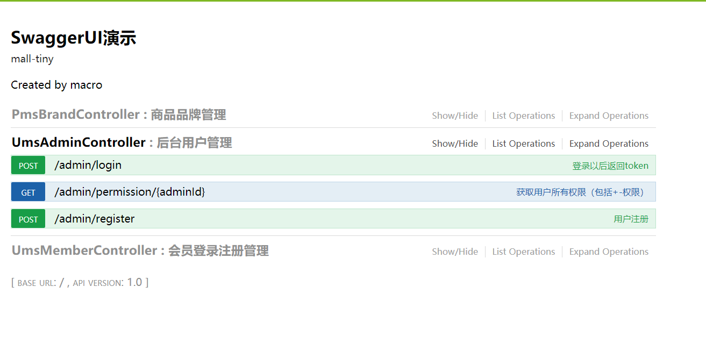

### 未登录前访问接口

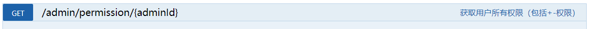

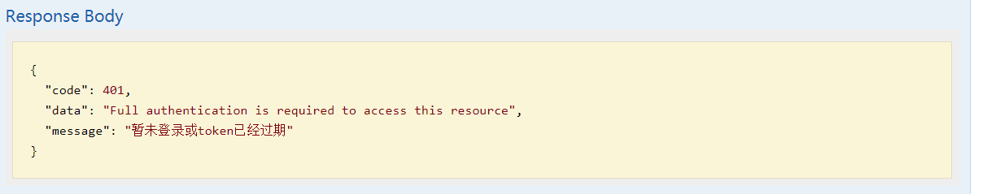

### 登录后访问接口

- 进行登录操作：登录帐号test 123456

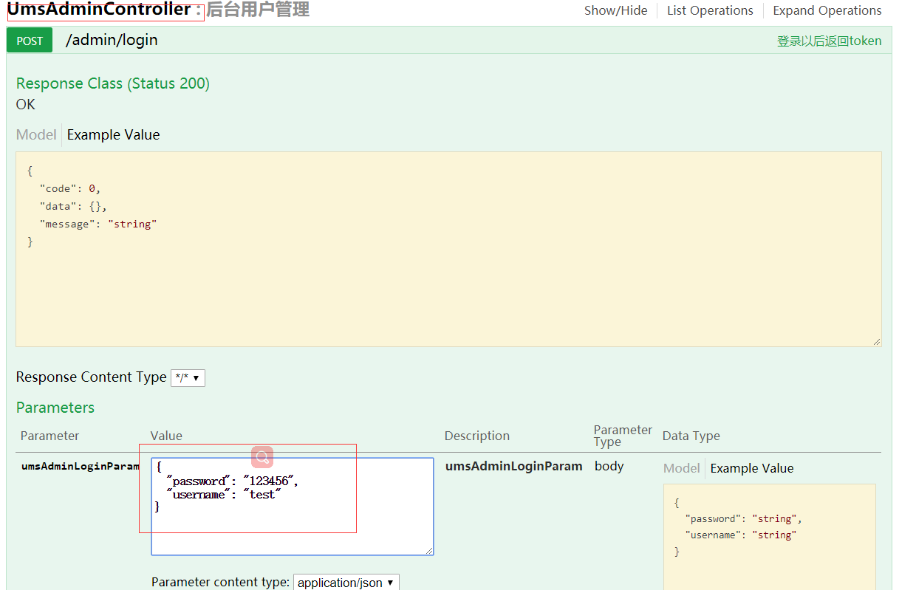

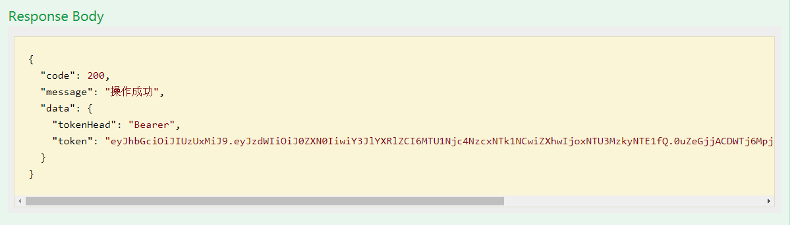

- 点击Authorize按钮，在弹框中输入登录接口中获取到的token信息

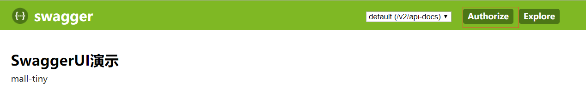

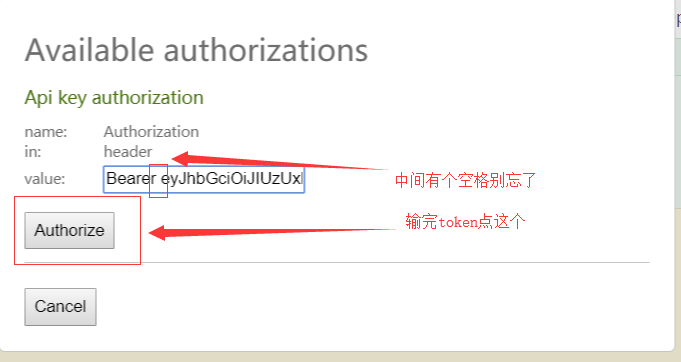

- 登录后访问获取权限列表接口，发现已经可以正常访问


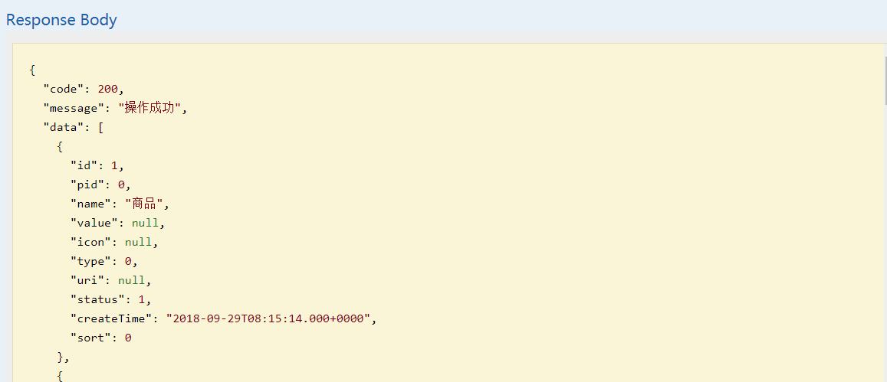

### 访问需要权限的接口

> 由于test帐号并没有设置任何权限，所以他无法访问具有pms:brand:read权限的获取品牌列表接口。

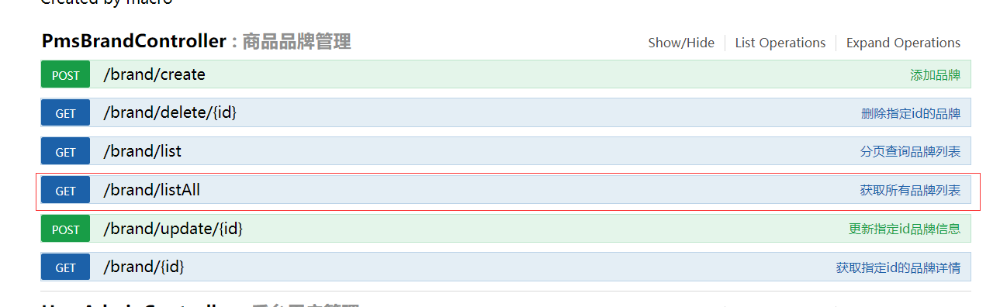

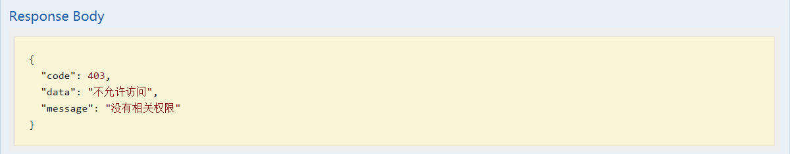

### 改用其他有权限的帐号登录

> 改用admin 123456登录后访问，点击Authorize按钮打开弹框,点击logout登出后再重新输入新token。


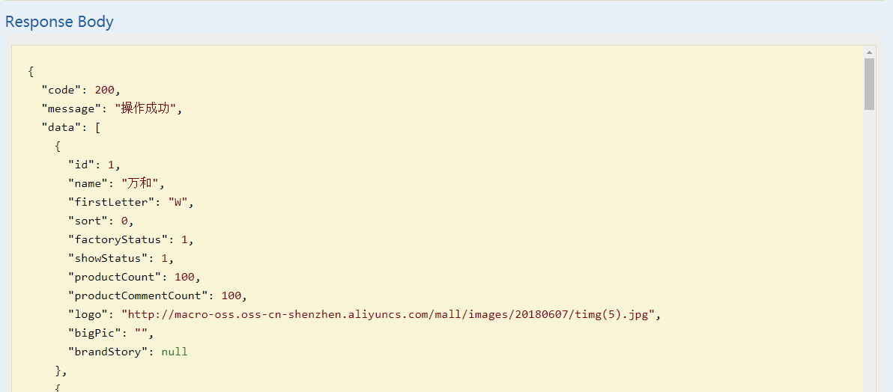

## 项目源码地址
[https://github.com/macrozheng/mall-learning/tree/master/mall-tiny-04](https://github.com/macrozheng/mall-learning/tree/master/mall-tiny-04)

## 公众号


