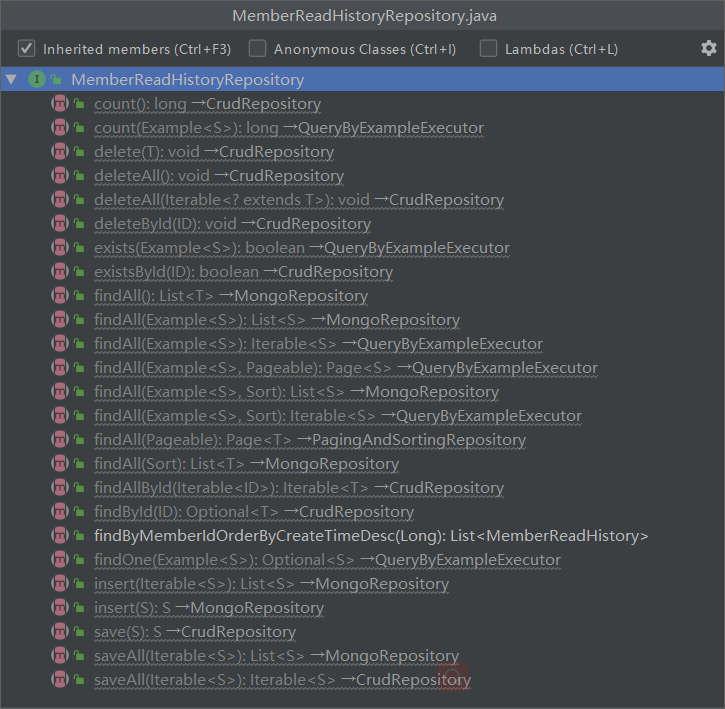
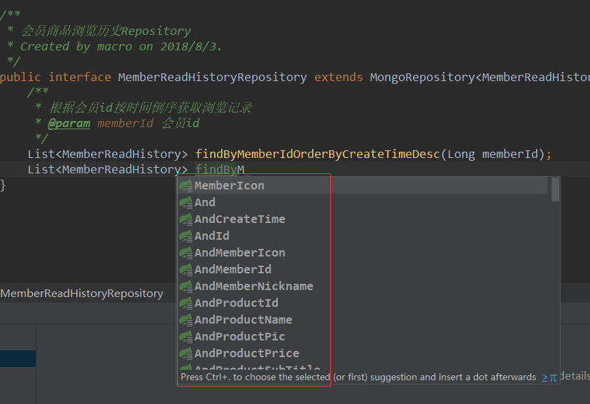
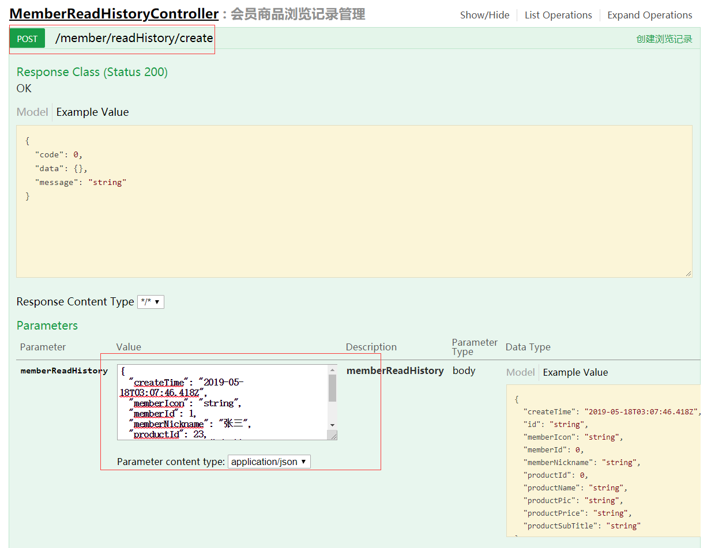
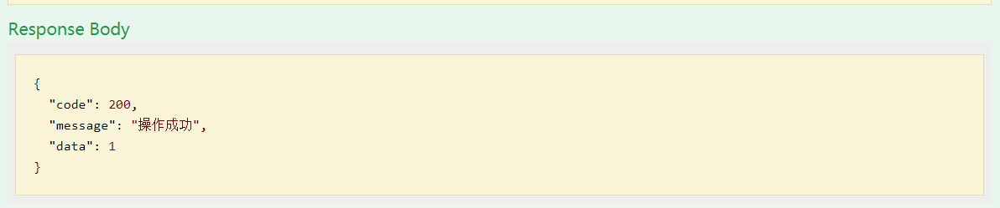
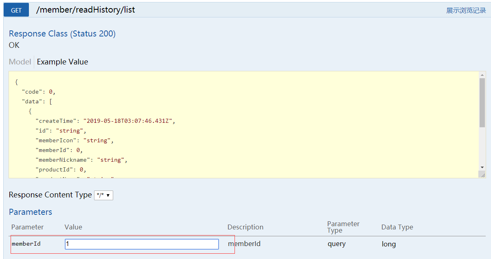
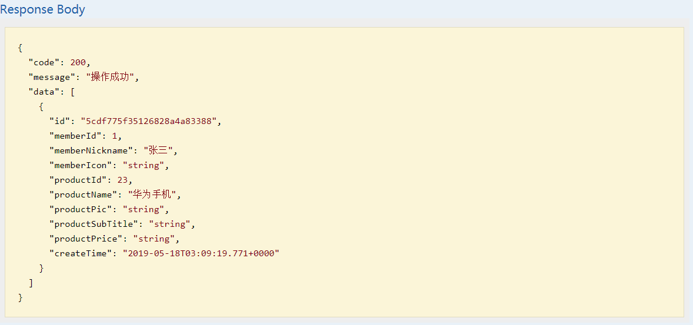

mall项目全套学习教程连载中，[关注公众号](#公众号)第一时间获取。

# mall整合Mongodb实现文档操作

> 本文主要讲解mall整合Mongodb的过程，以实现商品浏览记录在Mongodb中的添加、删除、查询为例。

## 项目使用框架介绍

### Mongodb

> Mongodb是为快速开发互联网Web应用而构建的数据库系统，其数据模型和持久化策略就是为了构建高读/写吞吐量和高自动灾备伸缩性的系统。

#### Mongodb的安装和使用

1. 下载Mongodb安装包，下载地址：[https://fastdl.mongodb.org/win32/mongodb-win32-x86_64-2008plus-ssl-3.2.21-signed.msi](https://fastdl.mongodb.org/win32/mongodb-win32-x86_64-2008plus-ssl-3.2.21-signed.msi)

2. 选择安装路径进行安装


3. 在安装路径下创建data\\db和data\\log两个文件夹


4. 在安装路径下创建mongod.cfg配置文件
```
systemLog:
    destination: file
    path: D:\developer\env\MongoDB\data\log\mongod.log
storage:
    dbPath: D:\developer\env\MongoDB\data\db
```

5. 安装为服务（运行命令需要用管理员权限）
```
D:\developer\env\MongoDB\bin\mongod.exe --config "D:\developer\env\MongoDB\mongod.cfg" --install
```


6. 服务相关命令
```
启动服务：net start MongoDB
关闭服务：net stop MongoDB
移除服务：D:\developer\env\MongoDB\bin\mongod.exe --remove
```

7. 下载客户端程序：[https://download.robomongo.org/1.2.1/windows/robo3t-1.2.1-windows-x86_64-3e50a65.zip](https://download.robomongo.org/1.2.1/windows/robo3t-1.2.1-windows-x86_64-3e50a65.zip)

7. 解压到指定目录，打开robo3t.exe并连接到localhost:27017


### Spring Data Mongodb

> 和Spring Data Elasticsearch类似，Spring Data Mongodb是Spring提供的一种以Spring Data风格来操作数据存储的方式，它可以避免编写大量的样板代码。

#### 常用注解

- @Document:标示映射到Mongodb文档上的领域对象
- @Id:标示某个域为ID域
- @Indexed:标示某个字段为Mongodb的索引字段

#### Sping Data方式的数据操作

##### 继承MongoRepository接口可以获得常用的数据操作方法



##### 可以使用衍生查询
> 在接口中直接指定查询方法名称便可查询，无需进行实现，以下为根据会员id按时间倒序获取浏览记录的例子。

```java
/**
 * 会员商品浏览历史Repository
 * Created by macro on 2018/8/3.
 */
public interface MemberReadHistoryRepository extends MongoRepository<MemberReadHistory,String> {
    /**
     * 根据会员id按时间倒序获取浏览记录
     * @param memberId 会员id
     */
    List<MemberReadHistory> findByMemberIdOrderByCreateTimeDesc(Long memberId);
}
```

> 在idea中直接会提示对应字段



##### 使用@Query注解可以用Mongodb的JSON查询语句进行查询
```java
@Query("{ 'memberId' : ?0 }")
List<MemberReadHistory> findByMemberId(Long memberId);
```

## 整合Mongodb实现文档操作

### 在pom.xml中添加相关依赖
```xml
<!---mongodb相关依赖-->
<dependency>
  <groupId>org.springframework.boot</groupId>
  <artifactId>spring-boot-starter-data-mongodb</artifactId>
</dependency>
```

### 修改SpringBoot配置文件
> 修改application.yml文件，在spring:data节点下添加Mongodb相关配置。

```yml
mongodb:
  host: localhost # mongodb的连接地址
  port: 27017 # mongodb的连接端口号
  database: mall-port # mongodb的连接的数据库
```

### 添加会员浏览记录文档对象MemberReadHistory
> 文档对象的ID域添加@Id注解，需要检索的字段添加@Indexed注解。

```java
package com.macro.mall.tiny.nosql.mongodb.document;

import org.springframework.data.annotation.Id;
import org.springframework.data.mongodb.core.index.Indexed;
import org.springframework.data.mongodb.core.mapping.Document;

import java.util.Date;

/**
 * 用户商品浏览历史记录
 * Created by macro on 2018/8/3.
 */
@Document
public class MemberReadHistory {
    @Id
    private String id;
    @Indexed
    private Long memberId;
    private String memberNickname;
    private String memberIcon;
    @Indexed
    private Long productId;
    private String productName;
    private String productPic;
    private String productSubTitle;
    private String productPrice;
    private Date createTime;

    //省略了所有getter和setter方法

}

```

### 添加MemberReadHistoryRepository接口用于操作Mongodb
> 继承MongoRepository接口，这样就拥有了一些基本的Mongodb数据操作方法，同时定义了一个衍生查询方法。

```java
package com.macro.mall.tiny.nosql.mongodb.repository;


import com.macro.mall.tiny.nosql.mongodb.document.MemberReadHistory;
import org.springframework.data.mongodb.repository.MongoRepository;

import java.util.List;

/**
 * 会员商品浏览历史Repository
 * Created by macro on 2018/8/3.
 */
public interface MemberReadHistoryRepository extends MongoRepository<MemberReadHistory,String> {
    /**
     * 根据会员id按时间倒序获取浏览记录
     * @param memberId 会员id
     */
    List<MemberReadHistory> findByMemberIdOrderByCreateTimeDesc(Long memberId);
}
```

### 添加MemberReadHistoryService接口

```java
package com.macro.mall.tiny.service;


import com.macro.mall.tiny.nosql.mongodb.document.MemberReadHistory;

import java.util.List;

/**
 * 会员浏览记录管理Service
 * Created by macro on 2018/8/3.
 */
public interface MemberReadHistoryService {
    /**
     * 生成浏览记录
     */
    int create(MemberReadHistory memberReadHistory);

    /**
     * 批量删除浏览记录
     */
    int delete(List<String> ids);

    /**
     * 获取用户浏览历史记录
     */
    List<MemberReadHistory> list(Long memberId);
}

```

### 添加MemberReadHistoryService接口实现类MemberReadHistoryServiceImpl

```java
package com.macro.mall.tiny.service.impl;

import com.macro.mall.tiny.nosql.mongodb.document.MemberReadHistory;
import com.macro.mall.tiny.nosql.mongodb.repository.MemberReadHistoryRepository;
import com.macro.mall.tiny.service.MemberReadHistoryService;
import org.springframework.beans.factory.annotation.Autowired;
import org.springframework.stereotype.Service;

import java.util.ArrayList;
import java.util.Date;
import java.util.List;

/**
 * 会员浏览记录管理Service实现类
 * Created by macro on 2018/8/3.
 */
@Service
public class MemberReadHistoryServiceImpl implements MemberReadHistoryService {
    @Autowired
    private MemberReadHistoryRepository memberReadHistoryRepository;
    @Override
    public int create(MemberReadHistory memberReadHistory) {
        memberReadHistory.setId(null);
        memberReadHistory.setCreateTime(new Date());
        memberReadHistoryRepository.save(memberReadHistory);
        return 1;
    }

    @Override
    public int delete(List<String> ids) {
        List<MemberReadHistory> deleteList = new ArrayList<>();
        for(String id:ids){
            MemberReadHistory memberReadHistory = new MemberReadHistory();
            memberReadHistory.setId(id);
            deleteList.add(memberReadHistory);
        }
        memberReadHistoryRepository.deleteAll(deleteList);
        return ids.size();
    }

    @Override
    public List<MemberReadHistory> list(Long memberId) {
        return memberReadHistoryRepository.findByMemberIdOrderByCreateTimeDesc(memberId);
    }
}
```

### 添加MemberReadHistoryController定义接口

```java
package com.macro.mall.tiny.controller;

import com.macro.mall.tiny.common.api.CommonResult;
import com.macro.mall.tiny.nosql.mongodb.document.MemberReadHistory;
import com.macro.mall.tiny.service.MemberReadHistoryService;
import io.swagger.annotations.Api;
import io.swagger.annotations.ApiOperation;
import org.springframework.beans.factory.annotation.Autowired;
import org.springframework.stereotype.Controller;
import org.springframework.web.bind.annotation.*;

import java.util.List;

/**
 * 会员商品浏览记录管理Controller
 * Created by macro on 2018/8/3.
 */
@Controller
@Api(tags = "MemberReadHistoryController", description = "会员商品浏览记录管理")
@RequestMapping("/member/readHistory")
public class MemberReadHistoryController {
    @Autowired
    private MemberReadHistoryService memberReadHistoryService;

    @ApiOperation("创建浏览记录")
    @RequestMapping(value = "/create", method = RequestMethod.POST)
    @ResponseBody
    public CommonResult create(@RequestBody MemberReadHistory memberReadHistory) {
        int count = memberReadHistoryService.create(memberReadHistory);
        if (count > 0) {
            return CommonResult.success(count);
        } else {
            return CommonResult.failed();
        }
    }

    @ApiOperation("删除浏览记录")
    @RequestMapping(value = "/delete", method = RequestMethod.POST)
    @ResponseBody
    public CommonResult delete(@RequestParam("ids") List<String> ids) {
        int count = memberReadHistoryService.delete(ids);
        if (count > 0) {
            return CommonResult.success(count);
        } else {
            return CommonResult.failed();
        }
    }

    @ApiOperation("展示浏览记录")
    @RequestMapping(value = "/list", method = RequestMethod.GET)
    @ResponseBody
    public CommonResult<List<MemberReadHistory>> list(Long memberId) {
        List<MemberReadHistory> memberReadHistoryList = memberReadHistoryService.list(memberId);
        return CommonResult.success(memberReadHistoryList);
    }
}

```

## 进行接口测试

### 添加商品浏览记录到Mongodb




### 查询Mongodb中的商品浏览记录




## 项目源码地址
[https://github.com/macrozheng/mall-learning/tree/master/mall-tiny-07](https://github.com/macrozheng/mall-learning/tree/master/mall-tiny-07)

## 公众号


