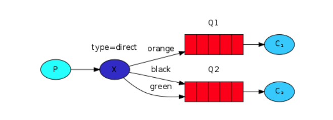
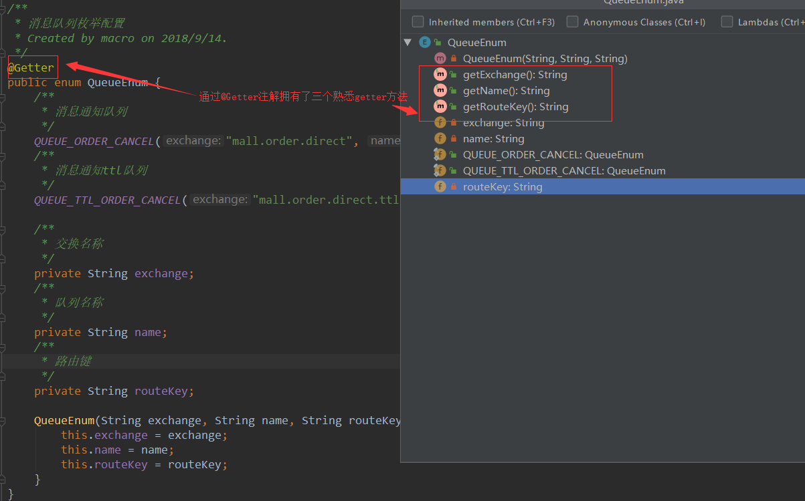
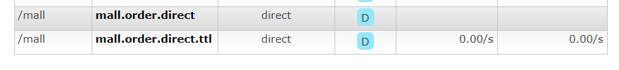
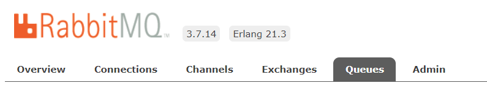
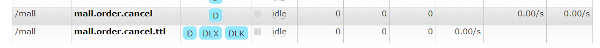
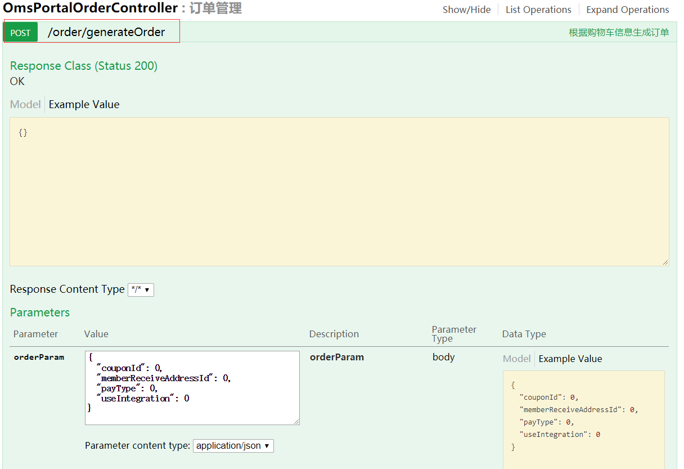
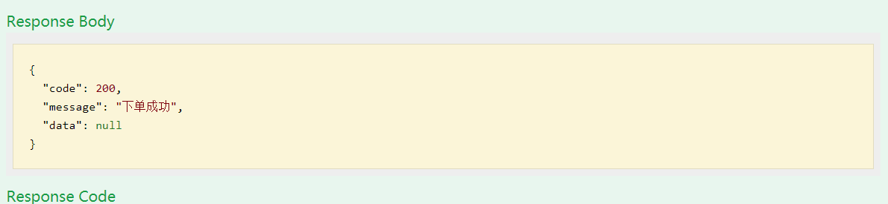
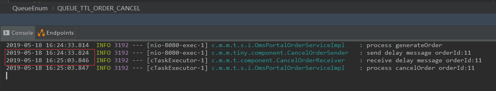

mall项目全套学习教程连载中，[关注公众号](#公众号)第一时间获取。

# mall整合RabbitMQ实现延迟消息

> 本文主要讲解mall整合RabbitMQ实现延迟消息的过程，以发送延迟消息取消超时订单为例。

## 项目使用框架介绍

### RabbitMQ

> RabbitMQ是一个被广泛使用的开源消息队列。它是轻量级且易于部署的，它能支持多种消息协议。RabbitMQ可以部署在分布式和联合配置中，以满足高规模、高可用性的需求。

#### RabbitMQ的安装和使用

1. 安装Erlang，下载地址：[http://erlang.org/download/otp_win64_21.3.exe](http://erlang.org/download/otp_win64_21.3.exe)


2. 安装RabbitMQ，下载地址：[https://dl.bintray.com/rabbitmq/all/rabbitmq-server/3.7.14/rabbitmq-server-3.7.14.exe](https://dl.bintray.com/rabbitmq/all/rabbitmq-server/3.7.14/rabbitmq-server-3.7.14.exe)


3. 安装完成后，进入RabbitMQ安装目录下的sbin目录


4. 在地址栏输入cmd并回车启动命令行，然后输入以下命令启动管理功能：
```
rabbitmq-plugins enable rabbitmq_management
```


5. 访问地址查看是否安装成功：[http://localhost:15672/](http://localhost:15672/)


6. 输入账号密码并登录：guest guest

7. 创建帐号并设置其角色为管理员：mall mall


8. 创建一个新的虚拟host为：/mall


9. 点击mall用户进入用户配置页面


10. 给mall用户配置该虚拟host的权限


11. 至此，RabbitMQ的安装和配置完成。

#### RabbitMQ的消息模型



标志 | 中文名 | 英文名| 描述
----|----|----|----
P	|生产者	|Producer |消息的发送者，可以将消息发送到交换机
C	|消费者	|Consumer |消息的接收者，从队列中获取消息进行消费
X	|交换机	|Exchange |接收生产者发送的消息，并根据路由键发送给指定队列
Q	|队列	|Queue |存储从交换机发来的消息
type | 交换机类型 |type |direct表示直接根据路由键（orange/black）发送消息

### Lombok

> Lombok为Java语言添加了非常有趣的附加功能，你可以不用再为实体类手写getter,setter等方法，通过一个注解即可拥有。

注意：需要安装idea的Lombok插件，并在项目中的pom文件中添加依赖。



## 业务场景说明
> 用于解决用户下单以后，订单超时如何取消订单的问题。

- 用户进行下单操作（会有锁定商品库存、使用优惠券、积分一系列的操作）；
- 生成订单，获取订单的id；
- 获取到设置的订单超时时间（假设设置的为60分钟不支付取消订单）；
- 按订单超时时间发送一个延迟消息给RabbitMQ，让它在订单超时后触发取消订单的操作；
- 如果用户没有支付，进行取消订单操作（释放锁定商品库存、返还优惠券、返回积分一系列操作）。

## 整合RabbitMQ实现延迟消息

### 在pom.xml中添加相关依赖

```xml
<!--消息队列相关依赖-->
<dependency>
    <groupId>org.springframework.boot</groupId>
    <artifactId>spring-boot-starter-amqp</artifactId>
</dependency>
<!--lombok依赖-->
<dependency>
    <groupId>org.projectlombok</groupId>
    <artifactId>lombok</artifactId>
    <optional>true</optional>
</dependency>
```

### 修改SpringBoot配置文件

> 修改application.yml文件，在spring节点下添加Mongodb相关配置。

```yml
  rabbitmq:
    host: localhost # rabbitmq的连接地址
    port: 5672 # rabbitmq的连接端口号
    virtual-host: /mall # rabbitmq的虚拟host
    username: mall # rabbitmq的用户名
    password: mall # rabbitmq的密码
    publisher-confirms: true #如果对异步消息需要回调必须设置为true
```

### 添加消息队列的枚举配置类QueueEnum

> 用于延迟消息队列及处理取消订单消息队列的常量定义，包括交换机名称、队列名称、路由键名称。

```java
package com.macro.mall.tiny.dto;

import lombok.Getter;

/**
 * 消息队列枚举配置
 * Created by macro on 2018/9/14.
 */
@Getter
public enum QueueEnum {
    /**
     * 消息通知队列
     */
    QUEUE_ORDER_CANCEL("mall.order.direct", "mall.order.cancel", "mall.order.cancel"),
    /**
     * 消息通知ttl队列
     */
    QUEUE_TTL_ORDER_CANCEL("mall.order.direct.ttl", "mall.order.cancel.ttl", "mall.order.cancel.ttl");

    /**
     * 交换名称
     */
    private String exchange;
    /**
     * 队列名称
     */
    private String name;
    /**
     * 路由键
     */
    private String routeKey;

    QueueEnum(String exchange, String name, String routeKey) {
        this.exchange = exchange;
        this.name = name;
        this.routeKey = routeKey;
    }
}

```

### 添加RabbitMQ的配置
> 用于配置交换机、队列及队列与交换机的绑定关系。

```java
package com.macro.mall.tiny.config;

import com.macro.mall.tiny.dto.QueueEnum;
import org.springframework.amqp.core.*;
import org.springframework.context.annotation.Bean;
import org.springframework.context.annotation.Configuration;

/**
 * 消息队列配置
 * Created by macro on 2018/9/14.
 */
@Configuration
public class RabbitMqConfig {

    /**
     * 订单消息实际消费队列所绑定的交换机
     */
    @Bean
    DirectExchange orderDirect() {
        return (DirectExchange) ExchangeBuilder
                .directExchange(QueueEnum.QUEUE_ORDER_CANCEL.getExchange())
                .durable(true)
                .build();
    }

    /**
     * 订单延迟队列队列所绑定的交换机
     */
    @Bean
    DirectExchange orderTtlDirect() {
        return (DirectExchange) ExchangeBuilder
                .directExchange(QueueEnum.QUEUE_TTL_ORDER_CANCEL.getExchange())
                .durable(true)
                .build();
    }

    /**
     * 订单实际消费队列
     */
    @Bean
    public Queue orderQueue() {
        return new Queue(QueueEnum.QUEUE_ORDER_CANCEL.getName());
    }

    /**
     * 订单延迟队列（死信队列）
     */
    @Bean
    public Queue orderTtlQueue() {
        return QueueBuilder
                .durable(QueueEnum.QUEUE_TTL_ORDER_CANCEL.getName())
                .withArgument("x-dead-letter-exchange", QueueEnum.QUEUE_ORDER_CANCEL.getExchange())//到期后转发的交换机
                .withArgument("x-dead-letter-routing-key", QueueEnum.QUEUE_ORDER_CANCEL.getRouteKey())//到期后转发的路由键
                .build();
    }

    /**
     * 将订单队列绑定到交换机
     */
    @Bean
    Binding orderBinding(DirectExchange orderDirect,Queue orderQueue){
        return BindingBuilder
                .bind(orderQueue)
                .to(orderDirect)
                .with(QueueEnum.QUEUE_ORDER_CANCEL.getRouteKey());
    }

    /**
     * 将订单延迟队列绑定到交换机
     */
    @Bean
    Binding orderTtlBinding(DirectExchange orderTtlDirect,Queue orderTtlQueue){
        return BindingBuilder
                .bind(orderTtlQueue)
                .to(orderTtlDirect)
                .with(QueueEnum.QUEUE_TTL_ORDER_CANCEL.getRouteKey());
    }

}
```

#### 在RabbitMQ管理页面可以看到以下交换机和队列







#### 交换机及队列说明

- mall.order.direct（取消订单消息队列所绑定的交换机）:绑定的队列为mall.order.cancel，一旦有消息以mall.order.cancel为路由键发过来，会发送到此队列。
- mall.order.direct.ttl（订单延迟消息队列所绑定的交换机）:绑定的队列为mall.order.cancel.ttl，一旦有消息以mall.order.cancel.ttl为路由键发送过来，会转发到此队列，并在此队列保存一定时间，等到超时后会自动将消息发送到mall.order.cancel（取消订单消息消费队列）。

### 添加延迟消息的发送者CancelOrderSender

> 用于向订单延迟消息队列（mall.order.cancel.ttl）里发送消息。

```java
package com.macro.mall.tiny.component;

import com.macro.mall.tiny.dto.QueueEnum;
import org.slf4j.Logger;
import org.slf4j.LoggerFactory;
import org.springframework.amqp.AmqpException;
import org.springframework.amqp.core.AmqpTemplate;
import org.springframework.amqp.core.Message;
import org.springframework.amqp.core.MessagePostProcessor;
import org.springframework.beans.factory.annotation.Autowired;
import org.springframework.stereotype.Component;

/**
 * 取消订单消息的发出者
 * Created by macro on 2018/9/14.
 */
@Component
public class CancelOrderSender {
    private static Logger LOGGER =LoggerFactory.getLogger(CancelOrderSender.class);
    @Autowired
    private AmqpTemplate amqpTemplate;

    public void sendMessage(Long orderId,final long delayTimes){
        //给延迟队列发送消息
        amqpTemplate.convertAndSend(QueueEnum.QUEUE_TTL_ORDER_CANCEL.getExchange(), QueueEnum.QUEUE_TTL_ORDER_CANCEL.getRouteKey(), orderId, new MessagePostProcessor() {
            @Override
            public Message postProcessMessage(Message message) throws AmqpException {
                //给消息设置延迟毫秒值
                message.getMessageProperties().setExpiration(String.valueOf(delayTimes));
                return message;
            }
        });
        LOGGER.info("send delay message orderId:{}",orderId);
    }
}

```

### 添加取消订单消息的接收者CancelOrderReceiver

> 用于从取消订单的消息队列（mall.order.cancel）里接收消息。

```java
package com.macro.mall.tiny.component;

import com.macro.mall.tiny.service.OmsPortalOrderService;
import org.slf4j.Logger;
import org.slf4j.LoggerFactory;
import org.springframework.amqp.rabbit.annotation.RabbitHandler;
import org.springframework.amqp.rabbit.annotation.RabbitListener;
import org.springframework.beans.factory.annotation.Autowired;
import org.springframework.stereotype.Component;

/**
 * 取消订单消息的处理者
 * Created by macro on 2018/9/14.
 */
@Component
@RabbitListener(queues = "mall.order.cancel")
public class CancelOrderReceiver {
    private static Logger LOGGER =LoggerFactory.getLogger(CancelOrderReceiver.class);
    @Autowired
    private OmsPortalOrderService portalOrderService;
    @RabbitHandler
    public void handle(Long orderId){
        LOGGER.info("receive delay message orderId:{}",orderId);
        portalOrderService.cancelOrder(orderId);
    }
}

```

### 添加OmsPortalOrderService接口

```java
package com.macro.mall.tiny.service;

import com.macro.mall.tiny.common.api.CommonResult;
import com.macro.mall.tiny.dto.OrderParam;
import org.springframework.transaction.annotation.Transactional;

/**
 * 前台订单管理Service
 * Created by macro on 2018/8/30.
 */
public interface OmsPortalOrderService {

    /**
     * 根据提交信息生成订单
     */
    @Transactional
    CommonResult generateOrder(OrderParam orderParam);

    /**
     * 取消单个超时订单
     */
    @Transactional
    void cancelOrder(Long orderId);
}

```

### 添加OmsPortalOrderService的实现类OmsPortalOrderServiceImpl

```java
package com.macro.mall.tiny.service.impl;

import com.macro.mall.tiny.common.api.CommonResult;
import com.macro.mall.tiny.component.CancelOrderSender;
import com.macro.mall.tiny.dto.OrderParam;
import com.macro.mall.tiny.service.OmsPortalOrderService;
import org.slf4j.Logger;
import org.slf4j.LoggerFactory;
import org.springframework.beans.factory.annotation.Autowired;
import org.springframework.stereotype.Service;

/**
 * 前台订单管理Service
 * Created by macro on 2018/8/30.
 */
@Service
public class OmsPortalOrderServiceImpl implements OmsPortalOrderService {
    private static Logger LOGGER = LoggerFactory.getLogger(OmsPortalOrderServiceImpl.class);
    @Autowired
    private CancelOrderSender cancelOrderSender;

    @Override
    public CommonResult generateOrder(OrderParam orderParam) {
        //todo 执行一系类下单操作，具体参考mall项目
        LOGGER.info("process generateOrder");
        //下单完成后开启一个延迟消息，用于当用户没有付款时取消订单（orderId应该在下单后生成）
        sendDelayMessageCancelOrder(11L);
        return CommonResult.success(null, "下单成功");
    }

    @Override
    public void cancelOrder(Long orderId) {
        //todo 执行一系类取消订单操作，具体参考mall项目
        LOGGER.info("process cancelOrder orderId:{}",orderId);
    }

    private void sendDelayMessageCancelOrder(Long orderId) {
        //获取订单超时时间，假设为60分钟
        long delayTimes = 30 * 1000;
        //发送延迟消息
        cancelOrderSender.sendMessage(orderId, delayTimes);
    }

}

```

### 添加OmsPortalOrderController定义接口

```java
package com.macro.mall.tiny.controller;

import com.macro.mall.tiny.dto.OrderParam;
import com.macro.mall.tiny.service.OmsPortalOrderService;
import io.swagger.annotations.Api;
import io.swagger.annotations.ApiOperation;
import org.springframework.beans.factory.annotation.Autowired;
import org.springframework.stereotype.Controller;
import org.springframework.web.bind.annotation.RequestBody;
import org.springframework.web.bind.annotation.RequestMapping;
import org.springframework.web.bind.annotation.RequestMethod;
import org.springframework.web.bind.annotation.ResponseBody;

/**
 * 订单管理Controller
 * Created by macro on 2018/8/30.
 */
@Controller
@Api(tags = "OmsPortalOrderController", description = "订单管理")
@RequestMapping("/order")
public class OmsPortalOrderController {
    @Autowired
    private OmsPortalOrderService portalOrderService;

    @ApiOperation("根据购物车信息生成订单")
    @RequestMapping(value = "/generateOrder", method = RequestMethod.POST)
    @ResponseBody
    public Object generateOrder(@RequestBody OrderParam orderParam) {
        return portalOrderService.generateOrder(orderParam);
    }
}

```

## 进行接口测试

### 调用下单接口

注意：已经将延迟消息时间设置为30秒








## 项目源码地址

[https://github.com/macrozheng/mall-learning/tree/master/mall-tiny-08](https://github.com/macrozheng/mall-learning/tree/master/mall-tiny-08)

## 公众号


