mall项目全套学习教程连载中，[关注公众号](#公众号)第一时间获取。

# mall整合OSS实现文件上传

> 本文主要讲解mall整合OSS实现文件上传的过程，采用的是服务端签名后前端直传的方式。

## OSS
> 阿里云对象存储服务（Object Storage Service，简称 OSS），是阿里云提供的海量、安全、低成本、高可靠的云存储服务。OSS可用于图片、音视频、日志等海量文件的存储。各种终端设备、Web网站程序、移动应用可以直接向OSS写入或读取数据。

### OSS中的相关概念

- Endpoint：访问域名，通过该域名可以访问OSS服务的API，进行文件上传、下载等操作。
- Bucket：存储空间，是存储对象的容器，所有存储对象都必须隶属于某个存储空间。
- Object：对象，对象是 OSS 存储数据的基本单元，也被称为 OSS 的文件。
- AccessKey：访问密钥，指的是访问身份验证中用到的 AccessKeyId 和 AccessKeySecret。

### OSS的相关设置

#### 开通OSS服务

- 登录阿里云官网；
- 将鼠标移至产品标签页，单击对象存储 OSS，打开OSS 产品详情页面；
- 在OSS产品详情页，单击立即开通。

#### 创建存储空间

- 点击网页右上角控制台按钮进入控制台


- 选择我的云产品中的对象存储OSS


- 点击左侧存储空间的加号新建存储空间


- 新建存储空间并设置读写权限为公共读


#### 跨域资源共享（CORS）的设置

> 由于浏览器处于安全考虑，不允许跨域资源访问，所以我们要设置OSS的跨域资源共享。

- 选择一个存储空间，打开其基础设置


- 点击跨越设置的设置按钮


- 点击创建规则


- 进行跨域规则设置


### 服务端签名后前端直传的相关说明

#### 流程示例图

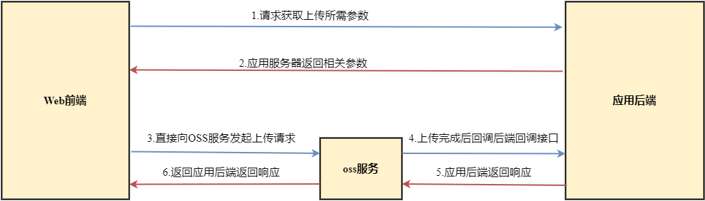

#### 流程介绍

1. Web前端请求应用服务器，获取上传所需参数（如OSS的accessKeyId、policy、callback等参数）
2. 应用服务器返回相关参数
3. Web前端直接向OSS服务发起上传文件请求
4. 等上传完成后OSS服务会回调应用服务器的回调接口
5. 应用服务器返回响应给OSS服务
6. OSS服务将应用服务器回调接口的内容返回给Web前端

## 整合OSS实现文件上传

### 在pom.xml中添加相关依赖

```xml
<!-- OSS SDK 相关依赖 -->
<dependency>
    <groupId>com.aliyun.oss</groupId>
    <artifactId>aliyun-sdk-oss</artifactId>
    <version>2.5.0</version>
</dependency>
```

### 修改SpringBoot配置文件

> 修改application.yml文件，添加OSS相关配置。

注意：endpoint、accessKeyId、accessKeySecret、bucketName、callback、prefix都要改为你自己帐号OSS相关的，callback需要是公网可以访问的地址。

```yml
# OSS相关配置信息
aliyun:
  oss:
    endpoint: oss-cn-shenzhen.aliyuncs.com # oss对外服务的访问域名
    accessKeyId: test # 访问身份验证中用到用户标识
    accessKeySecret: test # 用户用于加密签名字符串和oss用来验证签名字符串的密钥
    bucketName: macro-oss # oss的存储空间
    policy:
      expire: 300 # 签名有效期(S)
    maxSize: 10 # 上传文件大小(M)
    callback: http://localhost:8080/aliyun/oss/callback # 文件上传成功后的回调地址
    dir:
      prefix: mall/images/ # 上传文件夹路径前缀
```

### 添加OSS的相关Java配置

> 用于配置OSS的连接客户端OSSClient。

```java
package com.macro.mall.tiny.config;

import com.aliyun.oss.OSSClient;
import org.springframework.beans.factory.annotation.Value;
import org.springframework.context.annotation.Bean;
import org.springframework.context.annotation.Configuration;

/**
 * Created by macro on 2018/5/17.
 */
@Configuration
public class OssConfig {
    @Value("${aliyun.oss.endpoint}")
    private String ALIYUN_OSS_ENDPOINT;
    @Value("${aliyun.oss.accessKeyId}")
    private String ALIYUN_OSS_ACCESSKEYID;
    @Value("${aliyun.oss.accessKeySecret}")
    private String ALIYUN_OSS_ACCESSKEYSECRET;
    @Bean
    public OSSClient ossClient(){
        return new OSSClient(ALIYUN_OSS_ENDPOINT,ALIYUN_OSS_ACCESSKEYID,ALIYUN_OSS_ACCESSKEYSECRET);
    }
}
```

### 添加OSS上传策略封装对象OssPolicyResult

> 前端直接上传文件时所需参数，从后端返回过来。

```java
package com.macro.mall.tiny.dto;

import io.swagger.annotations.ApiModelProperty;

/**
 * 获取OSS上传文件授权返回结果
 * Created by macro on 2018/5/17.
 */
public class OssPolicyResult {
    @ApiModelProperty("访问身份验证中用到用户标识")
    private String accessKeyId;
    @ApiModelProperty("用户表单上传的策略,经过base64编码过的字符串")
    private String policy;
    @ApiModelProperty("对policy签名后的字符串")
    private String signature;
    @ApiModelProperty("上传文件夹路径前缀")
    private String dir;
    @ApiModelProperty("oss对外服务的访问域名")
    private String host;
    @ApiModelProperty("上传成功后的回调设置")
    private String callback;

    //省略了所有getter,setter方法
}

```

### 添加OSS上传成功后的回调参数对象OssCallbackParam

> 当OSS上传成功后，会根据该配置参数来回调对应接口。

```java
package com.macro.mall.tiny.dto;

import io.swagger.annotations.ApiModelProperty;

/**
 * oss上传成功后的回调参数
 * Created by macro on 2018/5/17.
 */
public class OssCallbackParam {
    @ApiModelProperty("请求的回调地址")
    private String callbackUrl;
    @ApiModelProperty("回调是传入request中的参数")
    private String callbackBody;
    @ApiModelProperty("回调时传入参数的格式，比如表单提交形式")
    private String callbackBodyType;

    //省略了所有getter,setter方法
}

```

### OSS上传成功后的回调结果对象OssCallbackResult

> 回调接口中返回的数据对象，封装了上传文件的信息。

```java
package com.macro.mall.tiny.dto;

import io.swagger.annotations.ApiModelProperty;

/**
 * oss上传文件的回调结果
 * Created by macro on 2018/5/17.
 */
public class OssCallbackResult {
    @ApiModelProperty("文件名称")
    private String filename;
    @ApiModelProperty("文件大小")
    private String size;
    @ApiModelProperty("文件的mimeType")
    private String mimeType;
    @ApiModelProperty("图片文件的宽")
    private String width;
    @ApiModelProperty("图片文件的高")
    private String height;

    //省略了所有getter,setter方法
}

```

### 添加OSS业务接口OssService

```java
package com.macro.mall.tiny.service;

import com.macro.mall.tiny.dto.OssCallbackResult;
import com.macro.mall.tiny.dto.OssPolicyResult;

import javax.servlet.http.HttpServletRequest;

/**
 * oss上传管理Service
 * Created by macro on 2018/5/17.
 */
public interface OssService {
    /**
     * oss上传策略生成
     */
    OssPolicyResult policy();

    /**
     * oss上传成功回调
     */
    OssCallbackResult callback(HttpServletRequest request);
}

```

### 添加OSS业务接口OssService的实现类OssServiceImpl

```java
package com.macro.mall.tiny.service.impl;

import cn.hutool.json.JSONUtil;
import com.aliyun.oss.OSSClient;
import com.aliyun.oss.common.utils.BinaryUtil;
import com.aliyun.oss.model.MatchMode;
import com.aliyun.oss.model.PolicyConditions;
import com.macro.mall.tiny.dto.OssCallbackParam;
import com.macro.mall.tiny.dto.OssCallbackResult;
import com.macro.mall.tiny.dto.OssPolicyResult;
import com.macro.mall.tiny.service.OssService;
import org.slf4j.Logger;
import org.slf4j.LoggerFactory;
import org.springframework.beans.factory.annotation.Autowired;
import org.springframework.beans.factory.annotation.Value;
import org.springframework.stereotype.Service;

import javax.servlet.http.HttpServletRequest;
import java.text.SimpleDateFormat;
import java.util.Date;

/**
 * oss上传管理Service实现类
 * Created by macro on 2018/5/17.
 */
@Service
public class OssServiceImpl implements OssService {

	private static final Logger LOGGER = LoggerFactory.getLogger(OssServiceImpl.class);
	@Value("${aliyun.oss.policy.expire}")
	private int ALIYUN_OSS_EXPIRE;
	@Value("${aliyun.oss.maxSize}")
	private int ALIYUN_OSS_MAX_SIZE;
	@Value("${aliyun.oss.callback}")
	private String ALIYUN_OSS_CALLBACK;
	@Value("${aliyun.oss.bucketName}")
	private String ALIYUN_OSS_BUCKET_NAME;
	@Value("${aliyun.oss.endpoint}")
	private String ALIYUN_OSS_ENDPOINT;
	@Value("${aliyun.oss.dir.prefix}")
	private String ALIYUN_OSS_DIR_PREFIX;

	@Autowired
	private OSSClient ossClient;

	/**
	 * 签名生成
	 */
	@Override
	public OssPolicyResult policy() {
		OssPolicyResult result = new OssPolicyResult();
		// 存储目录
		SimpleDateFormat sdf = new SimpleDateFormat("yyyyMMdd");
		String dir = ALIYUN_OSS_DIR_PREFIX+sdf.format(new Date());
		// 签名有效期
		long expireEndTime = System.currentTimeMillis() + ALIYUN_OSS_EXPIRE * 1000;
		Date expiration = new Date(expireEndTime);
		// 文件大小
		long maxSize = ALIYUN_OSS_MAX_SIZE * 1024 * 1024;
		// 回调
		OssCallbackParam callback = new OssCallbackParam();
		callback.setCallbackUrl(ALIYUN_OSS_CALLBACK);
		callback.setCallbackBody("filename=${object}&size=${size}&mimeType=${mimeType}&height=${imageInfo.height}&width=${imageInfo.width}");
		callback.setCallbackBodyType("application/x-www-form-urlencoded");
		// 提交节点
		String action = "http://" + ALIYUN_OSS_BUCKET_NAME + "." + ALIYUN_OSS_ENDPOINT;
		try {
			PolicyConditions policyConds = new PolicyConditions();
			policyConds.addConditionItem(PolicyConditions.COND_CONTENT_LENGTH_RANGE, 0, maxSize);
			policyConds.addConditionItem(MatchMode.StartWith, PolicyConditions.COND_KEY, dir);
			String postPolicy = ossClient.generatePostPolicy(expiration, policyConds);
			byte[] binaryData = postPolicy.getBytes("utf-8");
			String policy = BinaryUtil.toBase64String(binaryData);
			String signature = ossClient.calculatePostSignature(postPolicy);
			String callbackData = BinaryUtil.toBase64String(JSONUtil.parse(callback).toString().getBytes("utf-8"));
			// 返回结果
			result.setAccessKeyId(ossClient.getCredentialsProvider().getCredentials().getAccessKeyId());
			result.setPolicy(policy);
			result.setSignature(signature);
			result.setDir(dir);
			result.setCallback(callbackData);
			result.setHost(action);
		} catch (Exception e) {
			LOGGER.error("签名生成失败", e);
		}
		return result;
	}

	@Override
	public OssCallbackResult callback(HttpServletRequest request) {
		OssCallbackResult result= new OssCallbackResult();
		String filename = request.getParameter("filename");
		filename = "http://".concat(ALIYUN_OSS_BUCKET_NAME).concat(".").concat(ALIYUN_OSS_ENDPOINT).concat("/").concat(filename);
		result.setFilename(filename);
		result.setSize(request.getParameter("size"));
		result.setMimeType(request.getParameter("mimeType"));
		result.setWidth(request.getParameter("width"));
		result.setHeight(request.getParameter("height"));
		return result;
	}

}

```

### 添加OssController定义接口

```java
package com.macro.mall.tiny.controller;


import com.macro.mall.tiny.common.api.CommonResult;
import com.macro.mall.tiny.dto.OssCallbackResult;
import com.macro.mall.tiny.dto.OssPolicyResult;
import com.macro.mall.tiny.service.impl.OssServiceImpl;
import io.swagger.annotations.Api;
import io.swagger.annotations.ApiOperation;
import org.springframework.beans.factory.annotation.Autowired;
import org.springframework.stereotype.Controller;
import org.springframework.web.bind.annotation.RequestMapping;
import org.springframework.web.bind.annotation.RequestMethod;
import org.springframework.web.bind.annotation.ResponseBody;

import javax.servlet.http.HttpServletRequest;

/**
 * Oss相关操作接口
 * Created by macro on 2018/4/26.
 */
@Controller
@Api(tags = "OssController", description = "Oss管理")
@RequestMapping("/aliyun/oss")
public class OssController {
    @Autowired
    private OssServiceImpl ossService;

    @ApiOperation(value = "oss上传签名生成")
    @RequestMapping(value = "/policy", method = RequestMethod.GET)
    @ResponseBody
    public CommonResult<OssPolicyResult> policy() {
        OssPolicyResult result = ossService.policy();
        return CommonResult.success(result);
    }

    @ApiOperation(value = "oss上传成功回调")
    @RequestMapping(value = "callback", method = RequestMethod.POST)
    @ResponseBody
    public CommonResult<OssCallbackResult> callback(HttpServletRequest request) {
        OssCallbackResult ossCallbackResult = ossService.callback(request);
        return CommonResult.success(ossCallbackResult);
    }

}

```

## 进行接口测试

### 测试获取上传策略的接口

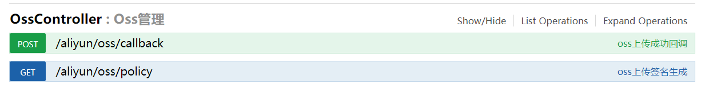

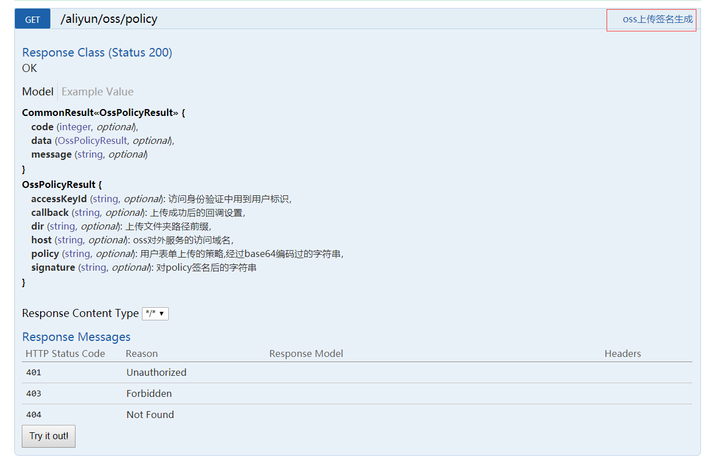

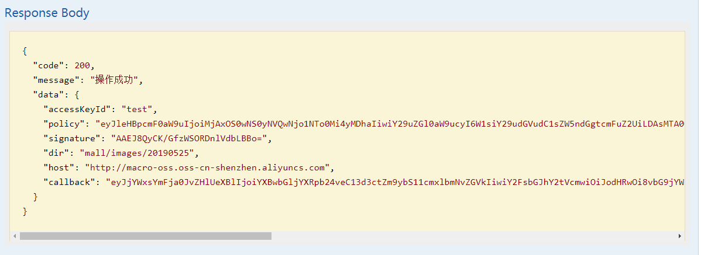

### 启动mall-admin-web前端项目来测试上传接口

- 如何启动前端项目，具体参考该项目的readme文档：[https://github.com/macrozheng/mall-admin-web](https://github.com/macrozheng/mall-admin-web)

- 点击添加商品品牌的上传按钮进行测试

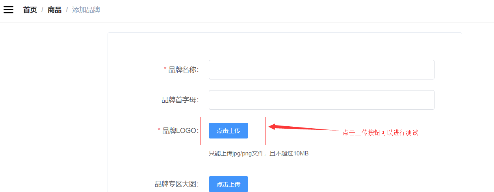

- 会调用两次请求，第一次访问本地接口获取上传的策略

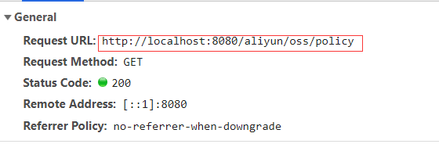

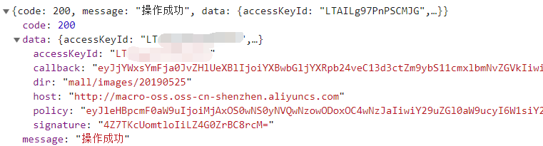

- 第二次调用oss服务 的接口进行文件上传

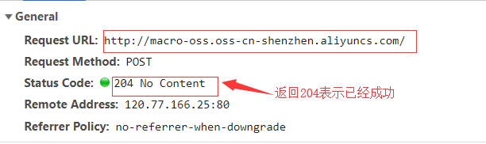

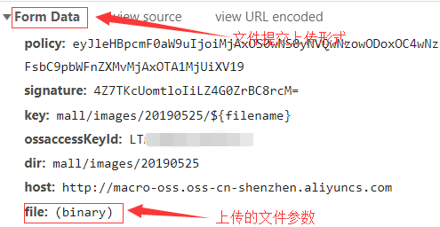

- 可以看到上面接口调用并没有传入回调参数callback,所以接口返回了204 no content,这次我们传入回调参数callback试试，可以发现oss服务回调了我们自己定义的回调接口，并返回了相应结果。

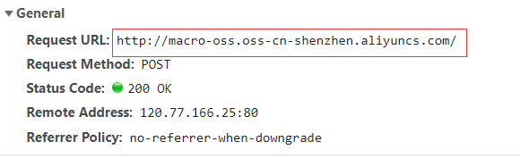

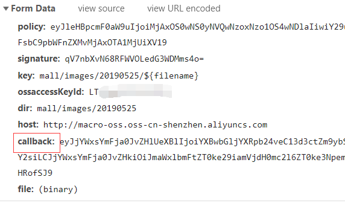

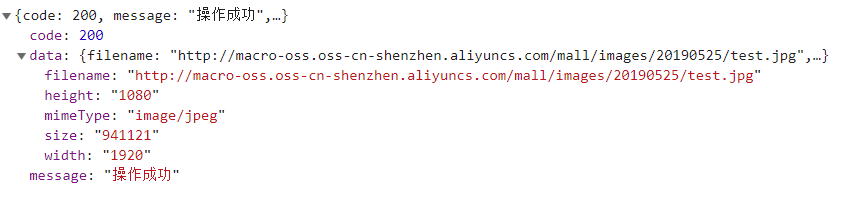

## 项目源码地址

[https://github.com/macrozheng/mall-learning/tree/master/mall-tiny-09](https://github.com/macrozheng/mall-learning/tree/master/mall-tiny-09)

## 参考资料

- 开通OSS服务：[https://help.aliyun.com/document_detail/31884.html?spm=a2c4g.11186623.6.566.74b87eaebrfQno](https://help.aliyun.com/document_detail/31884.html?spm=a2c4g.11186623.6.566.74b87eaebrfQno)

- 创建存储空间：[https://help.aliyun.com/document_detail/31885.html?spm=a2c4g.11186623.6.567.496228bcVZUZqB](https://help.aliyun.com/document_detail/31885.html?spm=a2c4g.11186623.6.567.496228bcVZUZqB)

- 跨域资源共享（CORS）:[https://help.aliyun.com/document_detail/31928.html?spm=5176.11065259.1996646101.searchclickresult.4d1a5607Pf3e9i](https://help.aliyun.com/document_detail/31928.html?spm=5176.11065259.1996646101.searchclickresult.4d1a5607Pf3e9i)

- 服务端签名直传并设置上传回调:[https://help.aliyun.com/document_detail/31927.html?spm=a2c4g.11186623.6.1268.2c256506mNqV1t](https://help.aliyun.com/document_detail/31927.html?spm=a2c4g.11186623.6.1268.2c256506mNqV1t)

## 公众号


