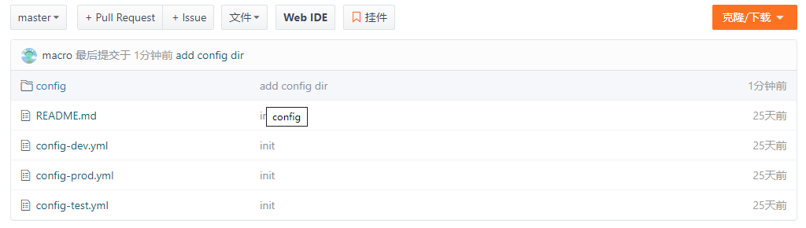
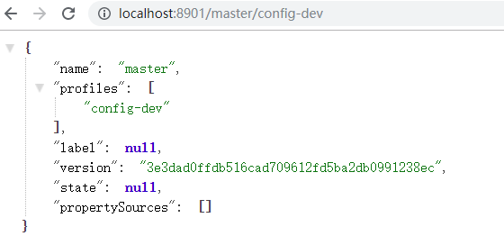
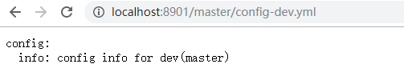
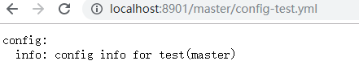
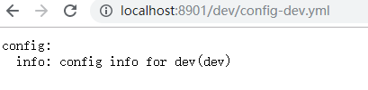
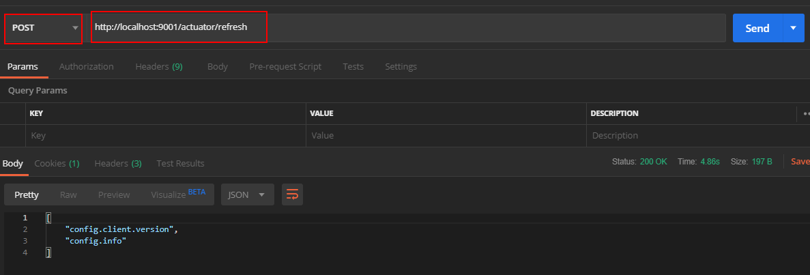
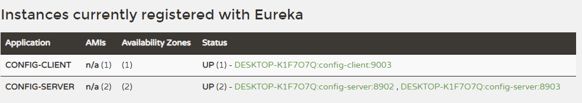

mall项目全套学习教程连载中，[关注公众号](#公众号)第一时间获取。

# Spring Cloud Config：外部集中化配置管理

> Spring Cloud Config 可以为微服务架构中的应用提供集中化的外部配置支持，它分为服务端和客户端两个部分，本文将对其用法进行详细介绍。

## Spring Cloud Config 简介

Spring Cloud Config 分为服务端和客户端两个部分。服务端被称为分布式配置中心，它是个独立的应用，可以从配置仓库获取配置信息并提供给客户端使用。客户端可以通过配置中心来获取配置信息，在启动时加载配置。Spring Cloud Config 的配置中心默认采用Git来存储配置信息，所以天然就支持配置信息的版本管理，并且可以使用Git客户端来方便地管理和访问配置信息。

## 在Git仓库中准备配置信息

> 由于Spring Cloud Config 需要一个存储配置信息的Git仓库，这里我们先在Git仓库中添加好配置文件再演示其功能，Git仓库地址为：[https://gitee.com/macrozheng/springcloud-config](https://gitee.com/macrozheng/springcloud-config)。

### 配置仓库目录结构



### master分支下的配置信息

-  config-dev.yml:

```yaml
config:
  info: "config info for dev(master)"
```

-  config-test.yml:

```yaml
config:
  info: "config info for test(master)"
```

-  config-prod.yml:

```yaml
config:
  info: "config info for prod(master)"
```

### dev分支下的配置信息

-  config-dev.yml:

```yaml
config:
  info: "config info for dev(dev)"
```

-  config-test.yml:

```yaml
config:
  info: "config info for test(dev)"
```

-  config-prod.yml:

```yaml
config:
  info: "config info for prod(dev)"
```

## 创建config-server模块

> 这里我们创建一个config-server模块来演示Spring Cloud Config 作为配置中心的功能。  

### 在pom.xml中添加相关依赖

```xml
<dependency>
    <groupId>org.springframework.cloud</groupId>
    <artifactId>spring-cloud-config-server</artifactId>
</dependency>
<dependency>
    <groupId>org.springframework.cloud</groupId>
    <artifactId>spring-cloud-starter-netflix-eureka-client</artifactId>
</dependency>
```

### 在application.yml中进行配置

```yaml
server:
  port: 8901
spring:
  application:
    name: config-server
  cloud:
    config:
      server:
        git: #配置存储配置信息的Git仓库
          uri: https://gitee.com/macrozheng/springcloud-config.git
          username: macro
          password: 123456
          clone-on-start: true #开启启动时直接从git获取配置
eureka:
  client:
    service-url:
      defaultZone: http://localhost:8001/eureka/
```

### 在启动类上添加@EnableConfigServer注解来启用配置中心功能

```java
@EnableConfigServer
@EnableDiscoveryClient
@SpringBootApplication
public class ConfigServerApplication {

    public static void main(String[] args) {
        SpringApplication.run(ConfigServerApplication.class, args);
    }

}
```

### 通过config-server获取配置信息

> 这里我们通过config-server来演示下如何获取配置信息。

#### 获取配置文件信息的访问格式

```bash
# 获取配置信息
/{label}/{application}-{profile}
# 获取配置文件信息
/{label}/{application}-{profile}.yml
```

#### 占位符相关解释

- application：代表应用名称，默认为配置文件中的spring.application.name，如果配置了spring.cloud.config.name，则为该名称；
- label：代表分支名称，对应配置文件中的spring.cloud.config.label；
- profile：代表环境名称，对应配置文件中的spring.cloud.config.profile。

#### 获取配置信息演示

- 启动eureka-server、config-server服务；

- 访问[http://localhost:8901/master/config-dev](http://localhost:8901/master/config-dev)来获取master分支上dev环境的配置信息；



- 访问[http://localhost:8901/master/config-dev.yml](http://localhost:8901/master/config-dev.yml)来获取master分支上dev环境的配置文件信息，对比上面信息，可以看出配置信息和配置文件信息并不是同一个概念；



- 访问[http://localhost:8901/master/config-test.yml](http://localhost:8901/dev/config-dev.yml)来获取master分支上test环境的配置文件信息:



- 访问[http://localhost:8901/dev/config-dev.yml](http://localhost:8901/dev/config-dev.yml)来获取dev分支上dev环境的配置文件信息:



## 创建config-client模块

> 我们创建一个config-client模块来从config-server获取配置。

### 在pom.xml中添加相关依赖

```xml
<dependency>
    <groupId>org.springframework.cloud</groupId>
    <artifactId>spring-cloud-starter-config</artifactId>
</dependency>
<dependency>
    <groupId>org.springframework.cloud</groupId>
    <artifactId>spring-cloud-starter-netflix-eureka-client</artifactId>
</dependency>
<dependency>
    <groupId>org.springframework.boot</groupId>
    <artifactId>spring-boot-starter-web</artifactId>
</dependency>
```

### 在bootstrap.yml中进行配置

```yaml
server:
  port: 9001
spring:
  application:
    name: config-client
  cloud:
    config: #Config客户端配置
      profile: dev #启用配置后缀名称
      label: dev #分支名称
      uri: http://localhost:8901 #配置中心地址
      name: config #配置文件名称
eureka:
  client:
    service-url:
      defaultZone: http://localhost:8001/eureka/
```

### 添加ConfigClientController类用于获取配置

```java
/**
 * Created by macro on 2019/9/11.
 */
@RestController
public class ConfigClientController {

    @Value("${config.info}")
    private String configInfo;

    @GetMapping("/configInfo")
    public String getConfigInfo() {
        return configInfo;
    }
}
```

### 演示从配置中心获取配置

- 启动config-client服务；

- 访问[http://localhost:9001/configInfo](http://localhost:9001/configInfo)，可以获取到dev分支下dev环境的配置；

```bash
config info for dev(dev)
```

### 获取子目录下的配置

> 我们不仅可以把每个项目的配置放在不同的Git仓库存储，也可以在一个Git仓库中存储多个项目的配置，此时就会用到在子目录中搜索配置信息的配置。

- 首先我们需要在config-server中添加相关配置，用于搜索子目录中的配置，这里我们用到了application占位符，表示对于不同的应用，我们从对应应用名称的子目录中搜索配置，比如config子目录中的配置对应config应用；

```yaml
spring:
  cloud:
    config:
      server:
        git: 
          search-paths: '{application}'
```

- 访问[http://localhost:9001/configInfo](http://localhost:9001/configInfo)进行测试，可以发现获取的是config子目录下的配置信息。

```bash
config info for config dir dev(dev)
```

### 刷新配置

> 当Git仓库中的配置信息更改后，我们可以通过SpringBoot Actuator的refresh端点来刷新客户端配置信息，以下更改都需要在config-client中进行。

- 在pom.xml中添加Actuator的依赖：

```xml
<dependency>
   <groupId>org.springframework.boot</groupId>
   <artifactId>spring-boot-starter-actuator</artifactId>
</dependency>
```

- 在bootstrap.yml中开启refresh端点：

```yaml
management:
  endpoints:
    web:
      exposure:
        include: 'refresh'
```

- 在ConfigClientController类添加@RefreshScope注解用于刷新配置：

```java
/**
 * Created by macro on 2019/9/11.
 */
@RestController
@RefreshScope
public class ConfigClientController {

    @Value("${config.info}")
    private String configInfo;

    @GetMapping("/configInfo")
    public String getConfigInfo() {
        return configInfo;
    }
}
```

- 重新启动config-client后，调用refresh端点进行配置刷新：



- 访问[http://localhost:9001/configInfo](http://localhost:9001/configInfo)进行测试，可以发现配置信息已经刷新。

```bash
update config info for config dir dev(dev)
```

## 配置中心添加安全认证

> 我们可以通过整合SpringSecurity来为配置中心添加安全认证。

### 创建config-security-server模块

- 在pom.xml中添加相关依赖：

```xml
<dependency>
    <groupId>org.springframework.cloud</groupId>
    <artifactId>spring-cloud-config-server</artifactId>
</dependency>
<dependency>
    <groupId>org.springframework.boot</groupId>
    <artifactId>spring-boot-starter-security</artifactId>
</dependency>
```

- 在application.yml中进行配置：

```yaml
server:
  port: 8905
spring:
  application:
    name: config-security-server
  cloud:
    config:
      server:
        git:
          uri: https://gitee.com/macrozheng/springcloud-config.git
          username: macro
          password: 123456
          clone-on-start: true #开启启动时直接从git获取配置
  security: #配置用户名和密码
    user:
      name: macro
      password: 123456
```

- 启动config-security-server服务。

### 修改config-client的配置

- 添加bootstrap-security.yml配置文件，主要是配置了配置中心的用户名和密码：

```yaml
server:
  port: 9002
spring:
  application:
    name: config-client
  cloud:
    config:
      profile: dev #启用配置后缀名称
      label: dev #分支名称
      uri: http://localhost:8905 #配置中心地址
      name: config #配置文件名称
      username: macro
      password: 123456
```

- 使用bootstrap-security.yml启动config-client服务；

- 访问[http://localhost:9002/configInfo](http://localhost:9002/configInfo)进行测试，发现可以获取到配置信息。

```bash
config info for dev(dev)
```

## config-sever集群搭建

> 在微服务架构中，所有服务都从配置中心获取配置，配置中心一旦宕机，会发生很严重的问题，下面我们搭建一个双节点的配置中心集群来解决该问题。

- 启动两个config-server分别运行在8902和8903端口上；

- 添加config-client的配置文件bootstrap-cluster.yml，主要是添加了从注册中心获取配置中心地址的配置并去除了配置中心uri的配置：

```yaml
spring:
  cloud:
    config:
      profile: dev #启用环境名称
      label: dev #分支名称
      name: config #配置文件名称
      discovery:
        enabled: true
        service-id: config-server
eureka:
  client:
    service-url:
      defaultZone: http://localhost:8001/eureka/
```

- 以bootstrap-cluster.yml启动config-client服务，注册中心显示信息如下：



- 访问[http://localhost:9003/configInfo](http://localhost:9003/configInfo)，发现config-client可以获取到配置信息。

```bash
config info for config dir dev(dev)
```

## 使用到的模块

```lua
springcloud-learning
├── eureka-server -- eureka注册中心
├── config-server -- 配置中心服务
├── config-security-server -- 带安全认证的配置中心服务
└── config-client -- 获取配置的客户端服务
```

## 项目源码地址

[https://github.com/macrozheng/springcloud-learning](https://github.com/macrozheng/springcloud-learning)

## 公众号

