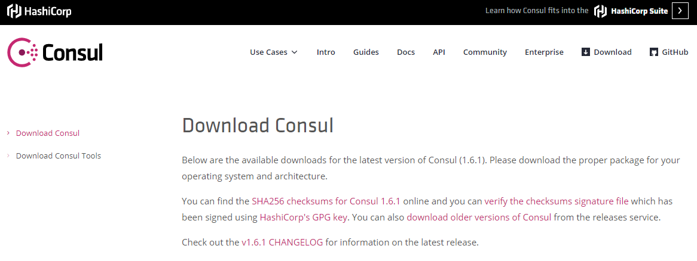
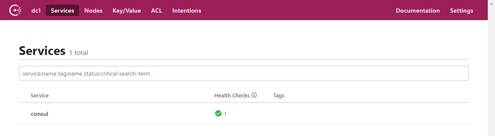
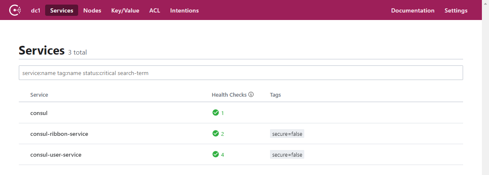
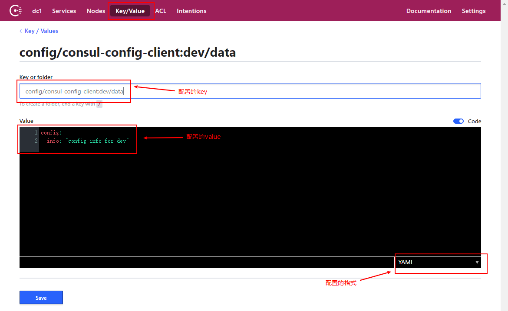

mall项目全套学习教程连载中，[关注公众号](#公众号)第一时间获取。

# Spring Cloud Consul：服务治理与配置中心

> Spring Cloud Consul 为 SpringBoot 应用提供了 Consul的支持，Consul既可以作为注册中心使用，也可以作为配置中心使用，本文将对其用法进行详细介绍。

## Consul 简介

Consul是HashiCorp公司推出的开源软件，提供了微服务系统中的服务治理、配置中心、控制总线等功能。这些功能中的每一个都可以根据需要单独使用，也可以一起使用以构建全方位的服务网格，总之Consul提供了一种完整的服务网格解决方案。

Spring Cloud Consul 具有如下特性：

- 支持服务治理：Consul作为注册中心时，微服务中的应用可以向Consul注册自己，并且可以从Consul获取其他应用信息；
- 支持客户端负责均衡：包括Ribbon和Spring Cloud LoadBalancer；
- 支持Zuul：当Zuul作为网关时，可以从Consul中注册和发现应用；
- 支持分布式配置管理：Consul作为配置中心时，使用键值对来存储配置信息；
- 支持控制总线：可以在整个微服务系统中通过 Control Bus 分发事件消息。

## 使用Consul作为注册中心

### 安装并运行Consul

- 首先我们从官网下载Consul，地址：https://www.consul.io/downloads.html



- 下载完成后只有一个exe文件，双击运行；

- 在命令行中输入以下命令可以查看版本号：

```shell
consul --version
```
-  查看版本号信息如下：

```bash
Consul v1.6.1
Protocol 2 spoken by default, understands 2 to 3 (agent will automatically use protocol >2 when speaking to compatible agents)
```

- 使用开发模式启动：

```shell
consul agent -dev 
```

- 通过以下地址可以访问Consul的首页：http://localhost:8500



### 创建应用注册到Consul

> 我们通过改造user-service和ribbon-service来演示下服务注册与发现的功能，主要是将应用原来的Eureka注册中心支持改为Consul注册中心支持。

- 创建consul-user-service模块和consul-ribbon-service模块；

- 修改相关依赖，把原来的Eureka注册发现的依赖改为Consul的，并添加SpringBoot Actuator的依赖：

```xml
<dependency>
    <groupId>org.springframework.cloud</groupId>
    <artifactId>spring-cloud-starter-consul-discovery</artifactId>
</dependency>
<dependency>
    <groupId>org.springframework.boot</groupId>
    <artifactId>spring-boot-starter-actuator</artifactId>
</dependency>
```

- 修改配置文件application.yml，将Eureka的注册发现配置改为Consul的：

```yaml
server:
  port: 8206
spring:
  application:
    name: consul-user-service
  cloud:
    consul: #Consul服务注册发现配置
      host: localhost
      port: 8500
      discovery:
        service-name: ${spring.application.name}
```

- 运行两个consul-user-service和一个consul-ribbon-service，在Consul页面上可以看到如下信息：



### 负载均衡功能

> 由于我们运行了两个consul-user-service，而consul-ribbon-service默认会去调用它的接口，我们调用consul-ribbon-service的接口来演示下负载均衡功能。

多次调用接口：http://localhost:8308/user/1 ，可以发现两个consul-user-service的控制台交替打印如下信息。

```bash
2019-10-20 10:39:32.580  INFO 12428 --- [io-8206-exec-10] c.macro.cloud.controller.UserController  : 根据id获取用户信息，用户名称为：macro
```

## 使用Consul作为配置中心

> 我们通过创建consul-config-client模块，并在Consul中添加配置信息来演示下配置管理的功能。

### 创建consul-config-client模块

- 在pom.xml中添加相关依赖：

```xml
<dependency>
    <groupId>org.springframework.cloud</groupId>
    <artifactId>spring-cloud-starter-consul-config</artifactId>
</dependency>
<dependency>
    <groupId>org.springframework.cloud</groupId>
    <artifactId>spring-cloud-starter-consul-discovery</artifactId>
</dependency>
```

- 添加配置文件application.yml，启用的是dev环境的配置：

```yaml
spring:
  profiles:
    active: dev
```

- 添加配置文件bootstrap.yml，主要是对Consul的配置功能进行配置：

```yaml
server:
  port: 9101
spring:
  application:
    name: consul-config-client
  cloud:
    consul:
      host: localhost
      port: 8500
      discovery:
        serviceName: consul-config-client
      config:
        enabled: true #是否启用配置中心功能
        format: yaml #设置配置值的格式
        prefix: config #设置配置所在目录
        profile-separator: ':' #设置配置的分隔符
        data-key: data #配置key的名字，由于Consul是K/V存储，配置存储在对应K的V中
```

- 创建ConfigClientController，从Consul配置中心中获取配置信息：

```java
/**
 * Created by macro on 2019/9/11.
 */
@RestController
@RefreshScope
public class ConfigClientController {

    @Value("${config.info}")
    private String configInfo;

    @GetMapping("/configInfo")
    public String getConfigInfo() {
        return configInfo;
    }
}
```

### 在Consul中添加配置

- 在consul中添加配置存储的key为:

```bash
config/consul-config-client:dev/data
```

- 在consul中添加配置存储的value为：

```yaml
config:
  info: "config info for dev"
```

- 存储信息截图如下：



- 启动consul-config-client，调用接口查看配置信息：http://localhost:9101/configInfo

```bash
config info for dev
```

### Consul的动态刷新配置

我们只要修改下Consul中的配置信息，再次调用查看配置的接口，就会发现配置已经刷新。回想下在使用Spring Cloud Config的时候，我们需要调用接口，通过Spring Cloud Bus才能刷新配置。Consul使用其自带的Control Bus 实现了一种事件传递机制，从而实现了动态刷新功能。

## 使用到的模块

``` lua
springcloud-learning
├── consul-config-client -- 用于演示consul作为配置中心的consul客户端
├── consul-user-service -- 注册到consul的提供User对象CRUD接口的服务
└── consul-service -- 注册到consul的ribbon服务调用测试服务
```

## 项目源码地址

[https://github.com/macrozheng/springcloud-learning](https://github.com/macrozheng/springcloud-learning)

## 公众号

