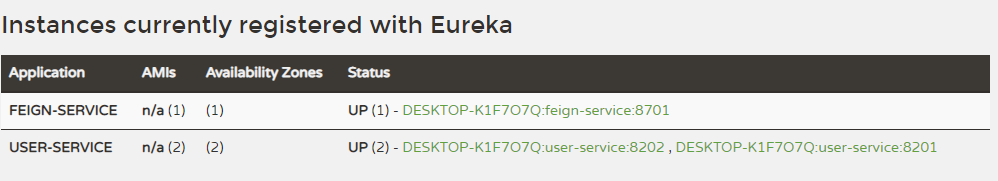
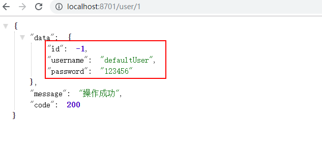

mall项目全套学习教程连载中，[关注公众号](#公众号)第一时间获取。

# Spring Cloud OpenFeign：基于Ribbon和Hystrix的声明式服务调用

> Spring Cloud OpenFeign 是声明式的服务调用工具，它整合了Ribbon和Hystrix，拥有负载均衡和服务容错功能，本文将对其用法进行详细介绍。

## Feign简介

Feign是声明式的服务调用工具，我们只需创建一个接口并用注解的方式来配置它，就可以实现对某个服务接口的调用，简化了直接使用RestTemplate来调用服务接口的开发量。Feign具备可插拔的注解支持，同时支持Feign注解、JAX-RS注解及SpringMvc注解。当使用Feign时，Spring Cloud集成了Ribbon和Eureka以提供负载均衡的服务调用及基于Hystrix的服务容错保护功能。

## 创建一个feign-service模块

> 这里我们创建一个feign-service模块来演示feign的常用功能。

### 在pom.xml中添加相关依赖

```xml
<dependency>
    <groupId>org.springframework.cloud</groupId>
    <artifactId>spring-cloud-starter-netflix-eureka-client</artifactId>
</dependency>
<dependency>
    <groupId>org.springframework.cloud</groupId>
    <artifactId>spring-cloud-starter-openfeign</artifactId>
</dependency>
<dependency>
    <groupId>org.springframework.boot</groupId>
    <artifactId>spring-boot-starter-web</artifactId>
</dependency>
```

### 在application.yml中进行配置

```yaml
server:
  port: 8701
spring:
  application:
    name: feign-service
eureka:
  client:
    register-with-eureka: true
    fetch-registry: true
    service-url:
      defaultZone: http://localhost:8001/eureka/
```

### 在启动类上添加@EnableFeignClients注解来启用Feign的客户端功能

```java
@EnableFeignClients
@EnableDiscoveryClient
@SpringBootApplication
public class FeignServiceApplication {

    public static void main(String[] args) {
        SpringApplication.run(FeignServiceApplication.class, args);
    }

}
```

### 添加UserService接口完成对user-service服务的接口绑定

> 我们通过@FeignClient注解实现了一个Feign客户端，其中的value为user-service表示这是对user-service服务的接口调用客户端。我们可以回想下user-service中的UserController，只需将其改为接口，保留原来的SpringMvc注释即可。

```java
/**
 * Created by macro on 2019/9/5.
 */
@FeignClient(value = "user-service")
public interface UserService {
    @PostMapping("/user/create")
    CommonResult create(@RequestBody User user);

    @GetMapping("/user/{id}")
    CommonResult<User> getUser(@PathVariable Long id);

    @GetMapping("/user/getByUsername")
    CommonResult<User> getByUsername(@RequestParam String username);

    @PostMapping("/user/update")
    CommonResult update(@RequestBody User user);

    @PostMapping("/user/delete/{id}")
    CommonResult delete(@PathVariable Long id);
}
```

### 添加UserFeignController调用UserService实现服务调用

```java
/**
 * Created by macro on 2019/8/29.
 */
@RestController
@RequestMapping("/user")
public class UserFeignController {
    @Autowired
    private UserService userService;

    @GetMapping("/{id}")
    public CommonResult getUser(@PathVariable Long id) {
        return userService.getUser(id);
    }

    @GetMapping("/getByUsername")
    public CommonResult getByUsername(@RequestParam String username) {
        return userService.getByUsername(username);
    }

    @PostMapping("/create")
    public CommonResult create(@RequestBody User user) {
        return userService.create(user);
    }

    @PostMapping("/update")
    public CommonResult update(@RequestBody User user) {
        return userService.update(user);
    }

    @PostMapping("/delete/{id}")
    public CommonResult delete(@PathVariable Long id) {
        return userService.delete(id);
    }
}
```

## 负载均衡功能演示

- 启动eureka-service，两个user-service，feign-service服务，启动后注册中心显示如下：



- 多次调用[http://localhost:8701/user/1](http://localhost:8701/user/1)进行测试，可以发现运行在8201和8202的user-service服务交替打印如下信息：

```bash
2019-10-04 15:15:34.829  INFO 9236 --- [nio-8201-exec-5] c.macro.cloud.controller.UserController  : 根据id获取用户信息，用户名称为：macro
2019-10-04 15:15:35.492  INFO 9236 --- [io-8201-exec-10] c.macro.cloud.controller.UserController  : 根据id获取用户信息，用户名称为：macro
2019-10-04 15:15:35.825  INFO 9236 --- [nio-8201-exec-9] c.macro.cloud.controller.UserController  : 根据id获取用户信息，用户名称为：macro
```

## Feign中的服务降级

> Feign中的服务降级使用起来非常方便，只需要为Feign客户端定义的接口添加一个服务降级处理的实现类即可，下面我们为UserService接口添加一个服务降级实现类。

### 添加服务降级实现类UserFallbackService

> 需要注意的是它实现了UserService接口，并且对接口中的每个实现方法进行了服务降级逻辑的实现。

```java
/**
 * Created by macro on 2019/9/5.
 */
@Component
public class UserFallbackService implements UserService {
    @Override
    public CommonResult create(User user) {
        User defaultUser = new User(-1L, "defaultUser", "123456");
        return new CommonResult<>(defaultUser);
    }

    @Override
    public CommonResult<User> getUser(Long id) {
        User defaultUser = new User(-1L, "defaultUser", "123456");
        return new CommonResult<>(defaultUser);
    }

    @Override
    public CommonResult<User> getByUsername(String username) {
        User defaultUser = new User(-1L, "defaultUser", "123456");
        return new CommonResult<>(defaultUser);
    }

    @Override
    public CommonResult update(User user) {
        return new CommonResult("调用失败，服务被降级",500);
    }

    @Override
    public CommonResult delete(Long id) {
        return new CommonResult("调用失败，服务被降级",500);
    }
}
```

### 修改UserService接口，设置服务降级处理类为UserFallbackService

> 修改@FeignClient注解中的参数，设置fallback为UserFallbackService.class即可。

```java
@FeignClient(value = "user-service",fallback = UserFallbackService.class)
public interface UserService {
}
```

### 修改application.yml，开启Hystrix功能

```yaml
feign:
  hystrix:
    enabled: true #在Feign中开启Hystrix
```

## 服务降级功能演示

- 关闭两个user-service服务，重新启动feign-service;

- 调用[http://localhost:8701/user/1](http://localhost:8701/user/1)进行测试，可以发现返回了服务降级信息。



## 日志打印功能

> Feign提供了日志打印功能，我们可以通过配置来调整日志级别，从而了解Feign中Http请求的细节。

### 日志级别

- NONE：默认的，不显示任何日志；
- BASIC：仅记录请求方法、URL、响应状态码及执行时间；
- HEADERS：除了BASIC中定义的信息之外，还有请求和响应的头信息；
- FULL：除了HEADERS中定义的信息之外，还有请求和响应的正文及元数据。

### 通过配置开启更为详细的日志

> 我们通过java配置来使Feign打印最详细的Http请求日志信息。

```java
/**
 * Created by macro on 2019/9/5.
 */
@Configuration
public class FeignConfig {
    @Bean
    Logger.Level feignLoggerLevel() {
        return Logger.Level.FULL;
    }
}
```

### 在application.yml中配置需要开启日志的Feign客户端

> 配置UserService的日志级别为debug。

```yaml
logging:
  level:
    com.macro.cloud.service.UserService: debug
```

### 查看日志

> 调用[http://localhost:8701/user/1](http://localhost:8701/user/1)进行测试，可以看到以下日志。

```bash
2019-10-04 15:44:03.248 DEBUG 5204 --- [-user-service-2] com.macro.cloud.service.UserService      : [UserService#getUser] ---> GET http://user-service/user/1 HTTP/1.1
2019-10-04 15:44:03.248 DEBUG 5204 --- [-user-service-2] com.macro.cloud.service.UserService      : [UserService#getUser] ---> END HTTP (0-byte body)
2019-10-04 15:44:03.257 DEBUG 5204 --- [-user-service-2] com.macro.cloud.service.UserService      : [UserService#getUser] <--- HTTP/1.1 200 (9ms)
2019-10-04 15:44:03.257 DEBUG 5204 --- [-user-service-2] com.macro.cloud.service.UserService      : [UserService#getUser] content-type: application/json;charset=UTF-8
2019-10-04 15:44:03.258 DEBUG 5204 --- [-user-service-2] com.macro.cloud.service.UserService      : [UserService#getUser] date: Fri, 04 Oct 2019 07:44:03 GMT
2019-10-04 15:44:03.258 DEBUG 5204 --- [-user-service-2] com.macro.cloud.service.UserService      : [UserService#getUser] transfer-encoding: chunked
2019-10-04 15:44:03.258 DEBUG 5204 --- [-user-service-2] com.macro.cloud.service.UserService      : [UserService#getUser] 
2019-10-04 15:44:03.258 DEBUG 5204 --- [-user-service-2] com.macro.cloud.service.UserService      : [UserService#getUser] {"data":{"id":1,"username":"macro","password":"123456"},"message":"操作成功","code":200}
2019-10-04 15:44:03.258 DEBUG 5204 --- [-user-service-2] com.macro.cloud.service.UserService      : [UserService#getUser] <--- END HTTP (92-byte body)
```

## Feign的常用配置

### Feign自己的配置

```yaml
feign:
  hystrix:
    enabled: true #在Feign中开启Hystrix
  compression:
    request:
      enabled: false #是否对请求进行GZIP压缩
      mime-types: text/xml,application/xml,application/json #指定压缩的请求数据类型
      min-request-size: 2048 #超过该大小的请求会被压缩
    response:
      enabled: false #是否对响应进行GZIP压缩
logging:
  level: #修改日志级别
    com.macro.cloud.service.UserService: debug
```

### Feign中的Ribbon配置

在Feign中配置Ribbon可以直接使用Ribbon的配置，具体可以参考[Spring Cloud Ribbon：负载均衡的服务调用](https://mp.weixin.qq.com/s/uKteoRrFjUbbl08NG522YQ)。

### Feign中的Hystrix配置

在Feign中配置Hystrix可以直接使用Hystrix的配置，具体可以参考[Spring Cloud Hystrix：服务容错保护](https://mp.weixin.qq.com/s/lEjojtuH7XOM9emXkd0TkQ)。

## 使用到的模块

``` lua
springcloud-learning
├── eureka-server -- eureka注册中心
├── user-service -- 提供User对象CRUD接口的服务
└── feign-service -- feign服务调用测试服务
```

## 项目源码地址

[https://github.com/macrozheng/springcloud-learning](https://github.com/macrozheng/springcloud-learning)

## 公众号

