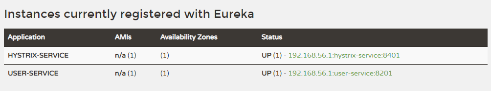
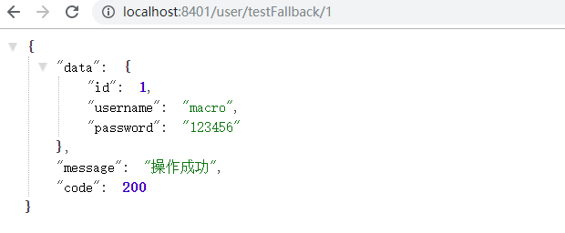
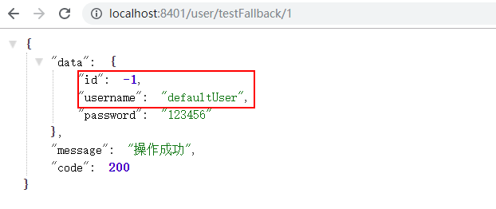
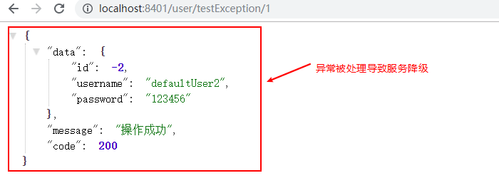
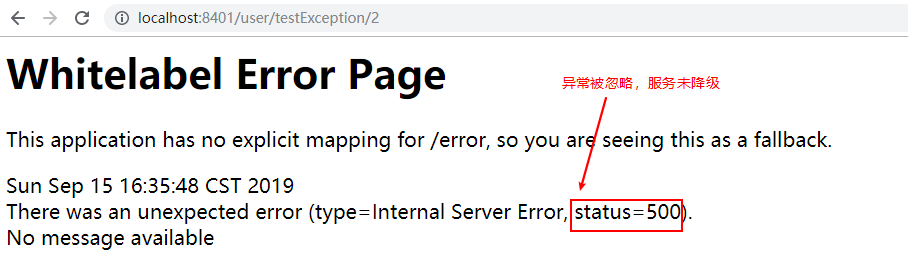
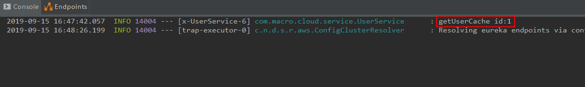
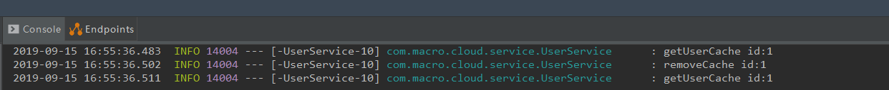
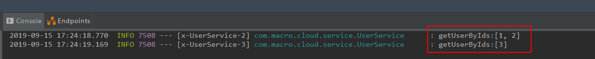

mall项目全套学习教程连载中，[关注公众号](#公众号)第一时间获取。

# Spring Cloud Hystrix：服务容错保护

> Spring Cloud Hystrix 是Spring Cloud Netflix 子项目的核心组件之一，具有服务容错及线程隔离等一系列服务保护功能，本文将对其用法进行详细介绍。

## Hystrix 简介

在微服务架构中，服务与服务之间通过远程调用的方式进行通信，一旦某个被调用的服务发生了故障，其依赖服务也会发生故障，此时就会发生故障的蔓延，最终导致系统瘫痪。Hystrix实现了断路器模式，当某个服务发生故障时，通过断路器的监控，给调用方返回一个错误响应，而不是长时间的等待，这样就不会使得调用方由于长时间得不到响应而占用线程，从而防止故障的蔓延。Hystrix具备服务降级、服务熔断、线程隔离、请求缓存、请求合并及服务监控等强大功能。

## 创建一个hystrix-service模块

> 这里我们创建一个hystrix-service模块来演示hystrix的常用功能。

### 在pom.xml中添加相关依赖

```xml
<dependency>
    <groupId>org.springframework.cloud</groupId>
    <artifactId>spring-cloud-starter-netflix-eureka-client</artifactId>
</dependency>
<dependency>
    <groupId>org.springframework.cloud</groupId>
    <artifactId>spring-cloud-starter-netflix-hystrix</artifactId>
</dependency>
<dependency>
    <groupId>org.springframework.boot</groupId>
    <artifactId>spring-boot-starter-web</artifactId>
</dependency>
```

### 在application.yml进行配置

> 主要是配置了端口、注册中心地址及user-service的调用路径。

```yaml
server:
  port: 8401
spring:
  application:
    name: hystrix-service
eureka:
  client:
    register-with-eureka: true
    fetch-registry: true
    service-url:
      defaultZone: http://localhost:8001/eureka/
service-url:
  user-service: http://user-service
```

### 在启动类上添加@EnableCircuitBreaker来开启Hystrix的断路器功能

```java
@EnableCircuitBreaker
@EnableDiscoveryClient
@SpringBootApplication
public class HystrixServiceApplication {

    public static void main(String[] args) {
        SpringApplication.run(HystrixServiceApplication.class, args);
    }
```

### 创建UserHystrixController接口用于调用user-service服务

## 服务降级演示

- 在UserHystrixController中添加用于测试服务降级的接口：

```java
@GetMapping("/testFallback/{id}")
public CommonResult testFallback(@PathVariable Long id) {
    return userService.getUser(id);
}
```

- 在UserService中添加调用方法与服务降级方法，方法上需要添加@HystrixCommand注解：

```java
@HystrixCommand(fallbackMethod = "getDefaultUser")
public CommonResult getUser(Long id) {
    return restTemplate.getForObject(userServiceUrl + "/user/{1}", CommonResult.class, id);
}

public CommonResult getDefaultUser(@PathVariable Long id) {
    User defaultUser = new User(-1L, "defaultUser", "123456");
    return new CommonResult<>(defaultUser);
}
```

- 启动eureka-server、user-service、hystrix-service服务；



- 调用接口进行测试：[http://localhost:8401/user/testFallback/1](http://localhost:8401/user/testFallback/1)



- 关闭user-service服务重新测试该接口，发现已经发生了服务降级：




## @HystrixCommand详解

### @HystrixCommand中的常用参数

- fallbackMethod：指定服务降级处理方法；
- ignoreExceptions：忽略某些异常，不发生服务降级；
- commandKey：命令名称，用于区分不同的命令；
- groupKey：分组名称，Hystrix会根据不同的分组来统计命令的告警及仪表盘信息；
- threadPoolKey：线程池名称，用于划分线程池。

### 设置命令、分组及线程池名称

- 在UserHystrixController中添加测试接口：

```java
@GetMapping("/testCommand/{id}")
public CommonResult testCommand(@PathVariable Long id) {
    return userService.getUserCommand(id);
}
```

- 在UserService中添加方式实现功能：

```java
 @HystrixCommand(fallbackMethod = "getDefaultUser",
    commandKey = "getUserCommand",
    groupKey = "getUserGroup",
    threadPoolKey = "getUserThreadPool")
public CommonResult getUserCommand(@PathVariable Long id) {
    return restTemplate.getForObject(userServiceUrl + "/user/{1}", CommonResult.class, id);
 }
```

### 使用ignoreExceptions忽略某些异常降级

- 在UserHystrixController中添加测试接口：
```java
@GetMapping("/testException/{id}")
public CommonResult testException(@PathVariable Long id) {
    return userService.getUserException(id);
}
```
- 在UserService中添加实现方法，这里忽略了NullPointerException，当id为1时抛出IndexOutOfBoundsException，id为2时抛出NullPointerException：

```java
@HystrixCommand(fallbackMethod = "getDefaultUser2", ignoreExceptions = {NullPointerException.class})
public CommonResult getUserException(Long id) {
    if (id == 1) {
        throw new IndexOutOfBoundsException();
    } else if (id == 2) {
        throw new NullPointerException();
    }
    return restTemplate.getForObject(userServiceUrl + "/user/{1}", CommonResult.class, id);
}

public CommonResult getDefaultUser2(@PathVariable Long id, Throwable e) {
    LOGGER.error("getDefaultUser2 id:{},throwable class:{}", id, e.getClass());
    User defaultUser = new User(-2L, "defaultUser2", "123456");
    return new CommonResult<>(defaultUser);
}
```

- 调用接口进行测试：[http://localhost:8401/user/tesException/1](http://localhost:8401/user/tesException/1)



- 调用接口进行测试：[http://localhost:8401/user/tesException/1](http://localhost:8401/user/tesException/2)




## Hystrix的请求缓存

> 当系统并发量越来越大时，我们需要使用缓存来优化系统，达到减轻并发请求线程数，提供响应速度的效果。

### 相关注解

- @CacheResult：开启缓存，默认所有参数作为缓存的key，cacheKeyMethod可以通过返回String类型的方法指定key；
- @CacheKey：指定缓存的key，可以指定参数或指定参数中的属性值为缓存key，cacheKeyMethod还可以通过返回String类型的方法指定；
- @CacheRemove：移除缓存，需要指定commandKey。

### 测试使用缓存

- 在UserHystrixController中添加使用缓存的测试接口，直接调用三次getUserCache方法：

```java
@GetMapping("/testCache/{id}")
public CommonResult testCache(@PathVariable Long id) {
    userService.getUserCache(id);
    userService.getUserCache(id);
    userService.getUserCache(id);
    return new CommonResult("操作成功", 200);
}
```

- 在UserService中添加具有缓存功能的getUserCache方法：

```java
@CacheResult(cacheKeyMethod = "getCacheKey")
@HystrixCommand(fallbackMethod = "getDefaultUser", commandKey = "getUserCache")
    public CommonResult getUserCache(Long id) {
    LOGGER.info("getUserCache id:{}", id);
    return restTemplate.getForObject(userServiceUrl + "/user/{1}", CommonResult.class, id);
}

/**
 * 为缓存生成key的方法
 */
public String getCacheKey(Long id) {
    return String.valueOf(id);
}
```

- 调用接口测试[http://localhost:8401/user/testCache/1](http://localhost:8401/user/testCache/1),这个接口中调用了三次getUserCache方法，但是只打印了一次日志，说明有两次走的是缓存：



### 测试移除缓存

- 在UserHystrixController中添加移除缓存的测试接口，调用一次removeCache方法：

```java
@GetMapping("/testRemoveCache/{id}")
public CommonResult testRemoveCache(@PathVariable Long id) {
    userService.getUserCache(id);
    userService.removeCache(id);
    userService.getUserCache(id);
    return new CommonResult("操作成功", 200);
}
```

- 在UserService中添加具有移除缓存功能的removeCache方法：

```java
@CacheRemove(commandKey = "getUserCache", cacheKeyMethod = "getCacheKey")
@HystrixCommand
public CommonResult removeCache(Long id) {
    LOGGER.info("removeCache id:{}", id);
    return restTemplate.postForObject(userServiceUrl + "/user/delete/{1}", null, CommonResult.class, id);
}
```

- 调用接口测试[http://localhost:8401/user/testRemoveCache/1](http://localhost:8401/user/testRemoveCache/1)，可以发现有两次查询都走的是接口：



### 缓存使用过程中的问题

- 在缓存使用过程中，我们需要在每次使用缓存的请求前后对HystrixRequestContext进行初始化和关闭，否则会出现如下异常：

```java
java.lang.IllegalStateException: Request caching is not available. Maybe you need to initialize the HystrixRequestContext?
	at com.netflix.hystrix.HystrixRequestCache.get(HystrixRequestCache.java:104) ~[hystrix-core-1.5.18.jar:1.5.18]
	at com.netflix.hystrix.AbstractCommand$7.call(AbstractCommand.java:478) ~[hystrix-core-1.5.18.jar:1.5.18]
	at com.netflix.hystrix.AbstractCommand$7.call(AbstractCommand.java:454) ~[hystrix-core-1.5.18.jar:1.5.18]
```

- 这里我们通过使用过滤器，在每个请求前后初始化和关闭HystrixRequestContext来解决该问题：

```java
/**
 * Created by macro on 2019/9/4.
 */
@Component
@WebFilter(urlPatterns = "/*",asyncSupported = true)
public class HystrixRequestContextFilter implements Filter {
    @Override
    public void doFilter(ServletRequest servletRequest, ServletResponse servletResponse, FilterChain filterChain) throws IOException, ServletException {
        HystrixRequestContext context = HystrixRequestContext.initializeContext();
        try {
            filterChain.doFilter(servletRequest, servletResponse);
        } finally {
            context.close();
        }
    }
}
```

## 请求合并

> 微服务系统中的服务间通信，需要通过远程调用来实现，随着调用次数越来越多，占用线程资源也会越来越多。Hystrix中提供了@HystrixCollapser用于合并请求，从而达到减少通信消耗及线程数量的效果。

### @HystrixCollapser的常用属性

- batchMethod：用于设置请求合并的方法；
- collapserProperties：请求合并属性，用于控制实例属性，有很多；
- timerDelayInMilliseconds：collapserProperties中的属性，用于控制每隔多少时间合并一次请求；

### 功能演示

- 在UserHystrixController中添加testCollapser方法，这里我们先进行两次服务调用，再间隔200ms以后进行第三次服务调用：

```java
@GetMapping("/testCollapser")
public CommonResult testCollapser() throws ExecutionException, InterruptedException {
    Future<User> future1 = userService.getUserFuture(1L);
    Future<User> future2 = userService.getUserFuture(2L);
    future1.get();
    future2.get();
    ThreadUtil.safeSleep(200);
    Future<User> future3 = userService.getUserFuture(3L);
    future3.get();
    return new CommonResult("操作成功", 200);
}
```

- 使用@HystrixCollapser实现请求合并，所有对getUserFuture的的多次调用都会转化为对getUserByIds的单次调用：

```java
@HystrixCollapser(batchMethod = "getUserByIds",collapserProperties = {
    @HystrixProperty(name = "timerDelayInMilliseconds", value = "100")
})
public Future<User> getUserFuture(Long id) {
    return new AsyncResult<User>(){
    @Override
    public User invoke() {
        CommonResult commonResult = restTemplate.getForObject(userServiceUrl + "/user/{1}", CommonResult.class, id);
        Map data = (Map) commonResult.getData();
        User user = BeanUtil.mapToBean(data,User.class,true);
        LOGGER.info("getUserById username:{}", user.getUsername());
        return user;
        }
    };
}

@HystrixCommand
public List<User> getUserByIds(List<Long> ids) {
    LOGGER.info("getUserByIds:{}", ids);
    CommonResult commonResult = restTemplate.getForObject(userServiceUrl + "/user/getUserByIds?ids={1}", CommonResult.class, CollUtil.join(ids,","));
    return (List<User>) commonResult.getData();
}
```

- 访问接口测试[http://localhost:8401/user/testCollapser](http://localhost:8401/user/testCollapser)，由于我们设置了100毫秒进行一次请求合并，前两次被合并，最后一次自己单独合并了。



## Hystrix的常用配置

### 全局配置

```yaml
hystrix:
  command: #用于控制HystrixCommand的行为
    default:
      execution:
        isolation:
          strategy: THREAD #控制HystrixCommand的隔离策略，THREAD->线程池隔离策略(默认)，SEMAPHORE->信号量隔离策略
          thread:
            timeoutInMilliseconds: 1000 #配置HystrixCommand执行的超时时间，执行超过该时间会进行服务降级处理
            interruptOnTimeout: true #配置HystrixCommand执行超时的时候是否要中断
            interruptOnCancel: true #配置HystrixCommand执行被取消的时候是否要中断
          timeout:
            enabled: true #配置HystrixCommand的执行是否启用超时时间
          semaphore:
            maxConcurrentRequests: 10 #当使用信号量隔离策略时，用来控制并发量的大小，超过该并发量的请求会被拒绝
      fallback:
        enabled: true #用于控制是否启用服务降级
      circuitBreaker: #用于控制HystrixCircuitBreaker的行为
        enabled: true #用于控制断路器是否跟踪健康状况以及熔断请求
        requestVolumeThreshold: 20 #超过该请求数的请求会被拒绝
        forceOpen: false #强制打开断路器，拒绝所有请求
        forceClosed: false #强制关闭断路器，接收所有请求
      requestCache:
        enabled: true #用于控制是否开启请求缓存
  collapser: #用于控制HystrixCollapser的执行行为
    default:
      maxRequestsInBatch: 100 #控制一次合并请求合并的最大请求数
      timerDelayinMilliseconds: 10 #控制多少毫秒内的请求会被合并成一个
      requestCache:
        enabled: true #控制合并请求是否开启缓存
  threadpool: #用于控制HystrixCommand执行所在线程池的行为
    default:
      coreSize: 10 #线程池的核心线程数
      maximumSize: 10 #线程池的最大线程数，超过该线程数的请求会被拒绝
      maxQueueSize: -1 #用于设置线程池的最大队列大小，-1采用SynchronousQueue，其他正数采用LinkedBlockingQueue
      queueSizeRejectionThreshold: 5 #用于设置线程池队列的拒绝阀值，由于LinkedBlockingQueue不能动态改版大小，使用时需要用该参数来控制线程数
```

### 实例配置

> 实例配置只需要将全局配置中的default换成与之对应的key即可。


```yaml
hystrix:
  command:
    HystrixComandKey: #将default换成HystrixComrnandKey
      execution:
        isolation:
          strategy: THREAD
  collapser:
    HystrixCollapserKey: #将default换成HystrixCollapserKey
      maxRequestsInBatch: 100
  threadpool:
    HystrixThreadPoolKey: #将default换成HystrixThreadPoolKey
      coreSize: 10
```

#### 配置文件中相关key的说明

- HystrixComandKey对应@HystrixCommand中的commandKey属性；
- HystrixCollapserKey对应@HystrixCollapser注解中的collapserKey属性；
- HystrixThreadPoolKey对应@HystrixCommand中的threadPoolKey属性。

## 使用到的模块

``` lua
springcloud-learning
├── eureka-server -- eureka注册中心
├── user-service -- 提供User对象CRUD接口的服务
└── hystrix-service -- hystrix服务调用测试服务
```

## 项目源码地址

[https://github.com/macrozheng/springcloud-learning](https://github.com/macrozheng/springcloud-learning)

## 公众号


