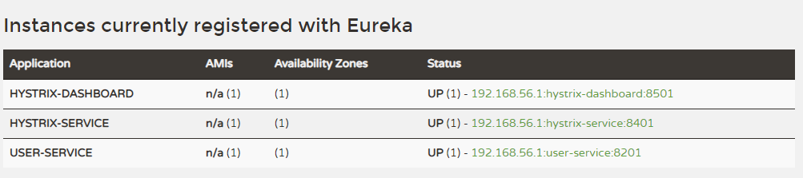
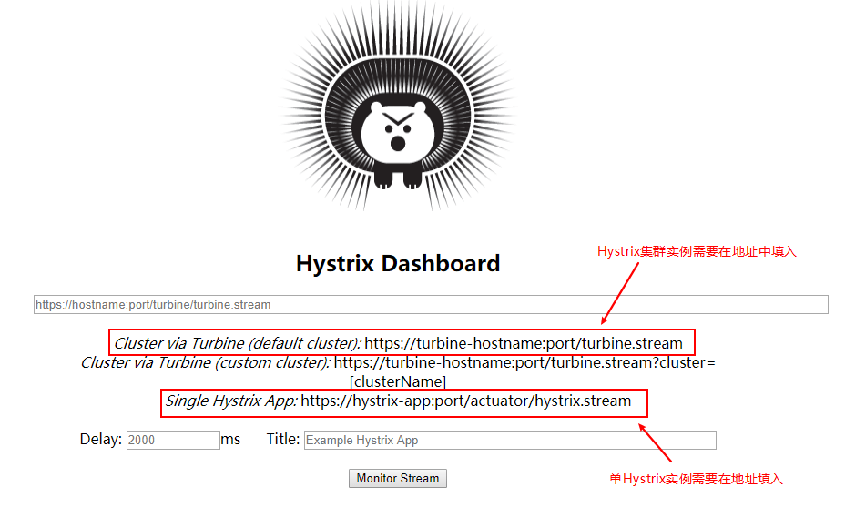
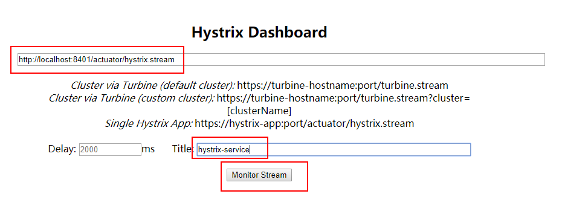
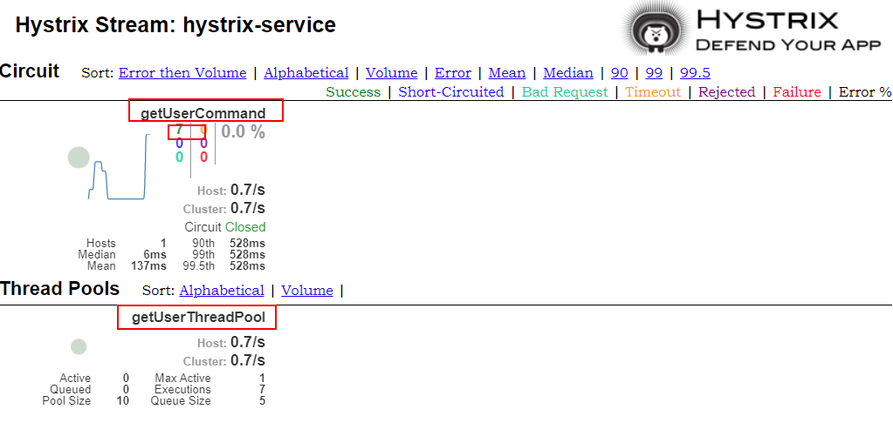
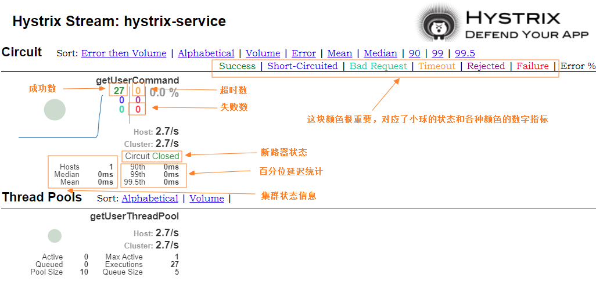
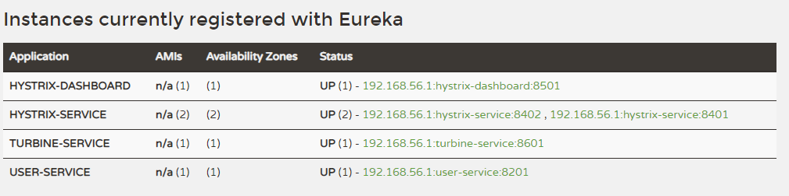
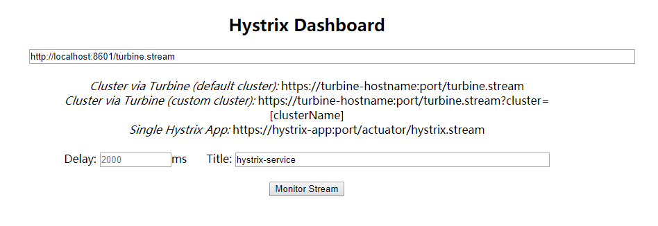
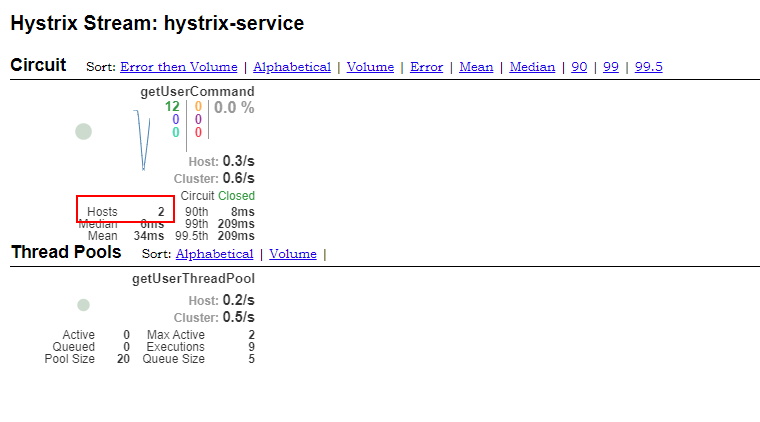

mall项目全套学习教程连载中，[关注公众号](#公众号)第一时间获取。

# Hystrix Dashboard：断路器执行监控

> Hystrix Dashboard 是Spring Cloud中查看Hystrix实例执行情况的一种仪表盘组件，支持查看单个实例和查看集群实例，本文将对其用法进行详细介绍。

## 简介

Hystrix提供了Hystrix Dashboard来实时监控HystrixCommand方法的执行情况。 Hystrix Dashboard可以有效地反映出每个Hystrix实例的运行情况，帮助我们快速发现系统中的问题，从而采取对应措施。

## Hystrix 单个实例监控

> 我们先通过使用Hystrix Dashboard监控单个Hystrix实例来了解下它的使用方法。

### 创建一个hystrix-dashboard模块

> 用来监控hystrix实例的执行情况。

- 在pom.xml中添加相关依赖：

```xml
<dependency>
    <groupId>org.springframework.cloud</groupId>
    <artifactId>spring-cloud-starter-netflix-eureka-client</artifactId>
</dependency>
<dependency>
    <groupId>org.springframework.cloud</groupId>
    <artifactId>spring-cloud-starter-netflix-hystrix-dashboard</artifactId>
</dependency>
<dependency>
    <groupId>org.springframework.boot</groupId>
    <artifactId>spring-boot-starter-actuator</artifactId>
</dependency>
```

- 在application.yml进行配置：

```yaml
server:
  port: 8501
spring:
  application:
    name: hystrix-dashboard
eureka:
  client:
    register-with-eureka: true
    fetch-registry: true
    service-url:
      defaultZone: http://localhost:8001/eureka/
```

- 在启动类上添加@EnableHystrixDashboard来启用监控功能：

```java
@EnableHystrixDashboard
@EnableDiscoveryClient
@SpringBootApplication
public class HystrixDashboardApplication {

    public static void main(String[] args) {
        SpringApplication.run(HystrixDashboardApplication.class, args);
    }

}
```

### 启动相关服务

> 这次我们需要启动如下服务：eureka-server、user-service、hystrix-service、hystrix-dashboard，启动后注册中心显示如下。



### Hystrix实例监控演示

- 访问Hystrix Dashboard：[http://localhost:8501/hystrix](http://localhost:8501/hystrix)



- 填写好信息后点击监控按钮，这里我们需要注意的是，由于我们本地不支持https，所以我们的地址需要填入的是http，否则会无法获取监控信息；



- 还有一点值得注意的是，被监控的hystrix-service服务需要开启Actuator的hystrix.stream端点，配置信息如下：

```yaml
management:
  endpoints:
    web:
      exposure:
        include: 'hystrix.stream' #暴露hystrix监控端点
```

- 调用几次hystrix-service的接口：[http://localhost:8401/user/testCommand/1](http://localhost:8401/user/testCommand/1)



- 可以发现曾经我们在@HystrixCommand中添加的commandKey和threadPoolKey属性都显示在上面了，并且有7次调用都成功了。


### Hystrix Dashboard 图表解读

> 图表解读如下，需要注意的是，小球代表该实例健康状态及流量情况，颜色越显眼，表示实例越不健康，小球越大，表示实例流量越大。曲线表示Hystrix实例的实时流量变化。



## Hystrix 集群实例监控

> 这里我们使用Turbine来聚合hystrix-service服务的监控信息，然后我们的hystrix-dashboard服务就可以从Turbine获取聚合好的监控信息展示给我们了。

### 创建一个turbine-service模块

> 用来聚合hystrix-service的监控信息。

- 在pom.xml中添加相关依赖：

```xml
<dependency>
    <groupId>org.springframework.cloud</groupId>
    <artifactId>spring-cloud-starter-netflix-eureka-client</artifactId>
</dependency>
<dependency>
    <groupId>org.springframework.cloud</groupId>
    <artifactId>spring-cloud-starter-netflix-turbine</artifactId>
</dependency>
<dependency>
    <groupId>org.springframework.boot</groupId>
    <artifactId>spring-boot-starter-actuator</artifactId>
</dependency>
```

- 在application.yml进行配置，主要是添加了Turbine相关配置：

```yaml
server:
  port: 8601
spring:
  application:
    name: turbine-service
eureka:
  client:
    register-with-eureka: true
    fetch-registry: true
    service-url:
      defaultZone: http://localhost:8001/eureka/
turbine:
  app-config: hystrix-service #指定需要收集信息的服务名称
  cluster-name-expression: new String('default') #指定服务所属集群
  combine-host-port: true #以主机名和端口号来区分服务
```

- 在启动类上添加@EnableTurbine来启用Turbine相关功能：

```java
@EnableTurbine
@EnableDiscoveryClient
@SpringBootApplication
public class TurbineServiceApplication {

    public static void main(String[] args) {
        SpringApplication.run(TurbineServiceApplication.class, args);
    }

}
```

### 启动相关服务

> 使用application-replica1.yml配置再启动一个hystrix-service服务，启动turbine-service服务，此时注册中心显示如下。



### Hystrix集群监控演示

- 访问Hystrix Dashboard：[http://localhost:8501/hystrix](http://localhost:8501/hystrix)

- 添加集群监控地址，需要注意的是我们需要添加的是turbine-service的监控端点地址：



- 调用几次hystrix-service的接口：[http://localhost:8401/user/testCommand/1](http://localhost:8401/user/testCommand/1)以及[http://localhost:8402/user/testCommand/1](http://localhost:8402/user/testCommand/1)



- 可以看到我们的Hystrix实例数量变成了两个。

## 使用到的模块

``` lua
springcloud-learning
├── eureka-server -- eureka注册中心
├── user-service -- 提供User对象CRUD接口的服务
├── hystrix-service -- hystrix服务调用测试服务
├── turbine-service -- 聚合收集hystrix实例监控信息的服务
└── hystrix-dashboard -- 展示hystrix实例监控信息的仪表盘
```

## 项目源码地址

[https://github.com/macrozheng/springcloud-learning](https://github.com/macrozheng/springcloud-learning)

## 公众号


