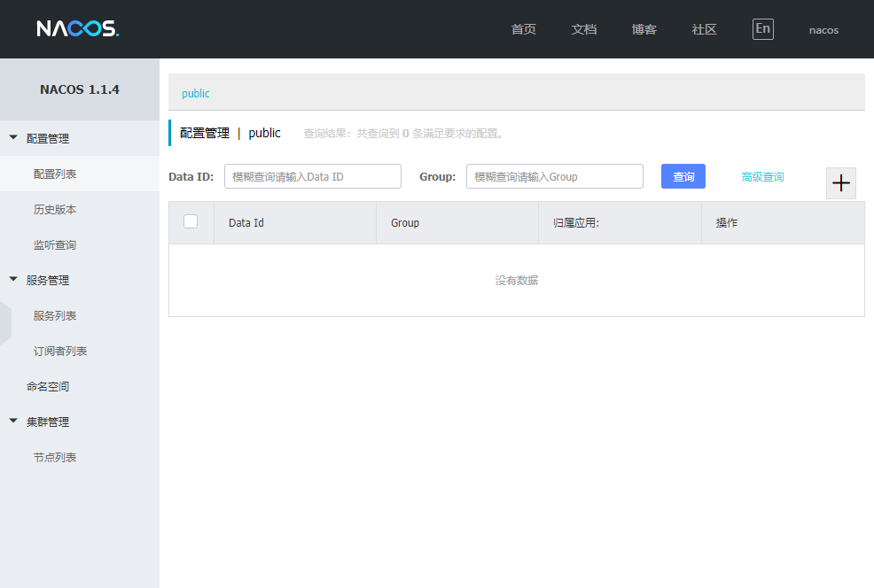
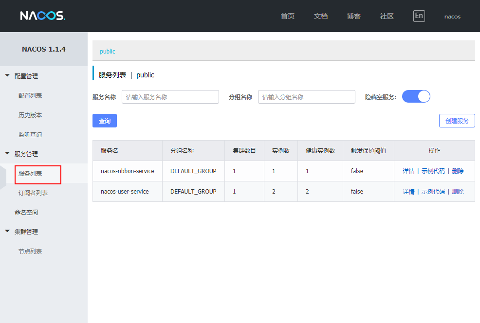
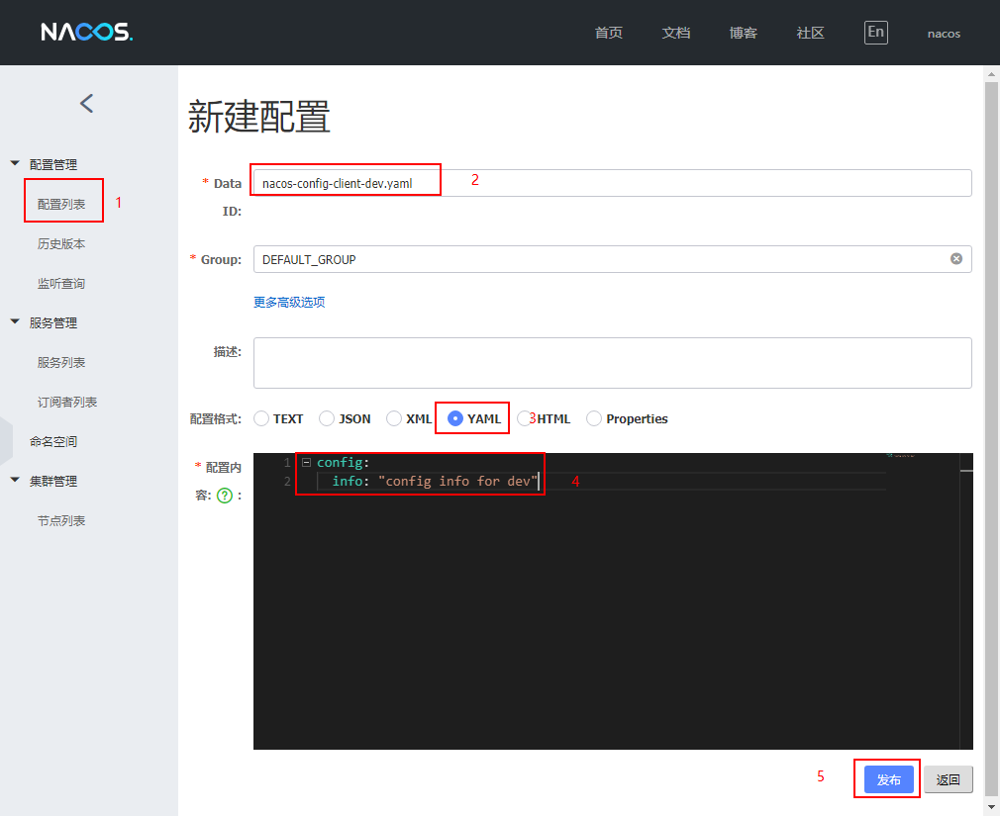

mall项目全套学习教程连载中，[关注公众号](#公众号)第一时间获取。

# Spring Cloud Alibaba：Nacos 作为注册中心和配置中心使用

> Spring Cloud Alibaba 致力于提供微服务开发的一站式解决方案，Nacos 作为其核心组件之一，可以作为注册中心和配置中心使用，本文将对其用法进行详细介绍。

## Nacos简介

Nacos 致力于帮助您发现、配置和管理微服务。Nacos 提供了一组简单易用的特性集，帮助您快速实现动态服务发现、服务配置、服务元数据及流量管理。

Nacos 具有如下特性:

- 服务发现和服务健康监测：支持基于DNS和基于RPC的服务发现，支持对服务的实时的健康检查，阻止向不健康的主机或服务实例发送请求；
- 动态配置服务：动态配置服务可以让您以中心化、外部化和动态化的方式管理所有环境的应用配置和服务配置；
- 动态 DNS 服务：动态 DNS 服务支持权重路由，让您更容易地实现中间层负载均衡、更灵活的路由策略、流量控制以及数据中心内网的简单DNS解析服务；
- 服务及其元数据管理：支持从微服务平台建设的视角管理数据中心的所有服务及元数据。

## 使用Nacos作为注册中心

### 安装并运行Nacos

- 我们先从官网下载Nacos，这里下载的是`nacos-server-1.1.4.zip`文件，下载地址：https://github.com/alibaba/nacos/releases

- 配置`JAVA_HOME`环境变量，不配置会导致无法运行Nacos；

```bash
JAVA_HOME=D:\developer\env\Java\jdk1.8.0_91
```

- 解压安装包，直接运行`bin`目录下的`startup.cmd`；

- 运行成功后，访问`http://localhost:8848/nacos`可以查看Nacos的主页，默认账号密码都是nacos。



### 创建应用注册到Nacos

> 我们通过改造consul-user-service和consul-ribbon-service来演示下服务注册与发现的功能，主要是将应用原来的Consul注册中心支持改为Nacos注册中心支持。

- 创建nacos-user-service模块和nacos-ribbon-service模块；

- 如果要使用Spring Cloud Alibaba 的组件都需要在pom.xml中添加如下的配置；

```xml
    <dependencyManagement>
        <dependencies>
            <dependency>
                <groupId>com.alibaba.cloud</groupId>
                <artifactId>spring-cloud-alibaba-dependencies</artifactId>
                <version>2.1.0.RELEASE</version>
                <type>pom</type>
                <scope>import</scope>
            </dependency>
        </dependencies>
    </dependencyManagement>
```

- 修改相关依赖，把原来的Consul注册发现的依赖改为Nacos的：

```xml
<dependency>
    <groupId>com.alibaba.cloud</groupId>
    <artifactId>spring-cloud-starter-alibaba-nacos-discovery</artifactId>
</dependency>
```

- 修改配置文件application.yml，将Consul的注册发现配置改为Nacos的：

```yaml
server:
  port: 8206
spring:
  application:
    name: nacos-user-service
  cloud:
    nacos:
      discovery:
        server-addr: localhost:8848 #配置Nacos地址
management:
  endpoints:
    web:
      exposure:
        include: '*'
```

- 运行两个nacos-user-service和一个nacos-ribbon-service，在Nacos页面上可以看到如下信息：



### 负载均衡功能

> 由于我们运行了两个nacos-user-service，而nacos-ribbon-service默认会去调用它的接口，我们调用nacos-ribbon-service的接口来演示下负载均衡功能。

多次调用接口：http://localhost:8308/user/1 ，可以发现两个nacos-user-service的控制台交替打印如下信息。

```bash
2019-11-06 14:28:06.458  INFO 12092 --- [nio-8207-exec-2] c.macro.cloud.controller.UserController  : 根据id获取用户信息，用户名称为：macro
```

## 使用Nacos作为配置中心

> 我们通过创建nacos-config-client模块，并在Nacos页面中添加配置信息来演示下配置管理的功能。

### 创建nacos-config-client模块

- 在pom.xml中添加相关依赖：

```xml
<dependency>
    <groupId>com.alibaba.cloud</groupId>
    <artifactId>spring-cloud-starter-alibaba-nacos-config</artifactId>
</dependency>
<dependency>
    <groupId>com.alibaba.cloud</groupId>
    <artifactId>spring-cloud-starter-alibaba-nacos-discovery</artifactId>
</dependency>
```

- 添加配置文件application.yml，启用的是dev环境的配置：

```yaml
spring:
  profiles:
    active: dev
```

- 添加配置文件bootstrap.yml，主要是对Nacos的作为配置中心的功能进行配置：

```yaml
server:
  port: 9101
spring:
  application:
    name: nacos-config-client
  cloud:
    nacos:
      discovery:
        server-addr: localhost:8848 #Nacos地址
      config:
        server-addr: localhost:8848 #Nacos地址
        file-extension: yaml #这里我们获取的yaml格式的配置
```

- 创建ConfigClientController，从Nacos配置中心中获取配置信息：

```java
/**
 * Created by macro on 2019/9/11.
 */
@RestController
@RefreshScope
public class ConfigClientController {

    @Value("${config.info}")
    private String configInfo;

    @GetMapping("/configInfo")
    public String getConfigInfo() {
        return configInfo;
    }
}
```

### 在Nacos中添加配置

- 我们先来讲下Nacos中的dataid的组成格式及与SpringBoot配置文件中的属性对应关系：

```bash
${spring.application.name}-${spring.profiles.active}.${spring.cloud.nacos.config.file-extension}
```

- 比如说我们现在要获取应用名称为`nacos-config-client`的应用在`dev`环境下的`yaml`配置，dataid如下：

```bash
nacos-config-client-dev.yaml
```

- 按照以上dataid添加如下配置：

```yaml
config:
  info: "config info for dev"
```

- 填写配置示意图：



- 启动nacos-config-client，调用接口查看配置信息：http://localhost:9101/configInfo

```bash
config info for dev
```

## Nacos的动态刷新配置

我们只要修改下Nacos中的配置信息，再次调用查看配置的接口，就会发现配置已经刷新，Nacos和Consul一样都支持动态刷新配置。当我们在Nacos页面上修改配置并发布后，应用会刷新配置并打印如下信息

```bash
2019-11-06 14:50:49.460  INFO 12372 --- [-localhost_8848] trationDelegate$BeanPostProcessorChecker : Bean 'org.springframework.cloud.autoconfigure.ConfigurationPropertiesRebinderAutoConfiguration' of type [org.springframework.cloud.autoconfigure.ConfigurationPropertiesRebinderAutoConfiguration$$EnhancerBySpringCGLIB$$ec395f8e] is not eligible for getting processed by all BeanPostProcessors (for example: not eligible for auto-proxying)
2019-11-06 14:50:49.608  INFO 12372 --- [-localhost_8848] c.a.c.n.c.NacosPropertySourceBuilder     : Loading nacos data, dataId: 'nacos-config-client-dev.yaml', group: 'DEFAULT_GROUP'
2019-11-06 14:50:49.609  INFO 12372 --- [-localhost_8848] b.c.PropertySourceBootstrapConfiguration : Located property source: CompositePropertySource {name='NACOS', propertySources=[NacosPropertySource {name='nacos-config-client-dev.yaml'}, NacosPropertySource {name='nacos-config-client.yaml'}]}
2019-11-06 14:50:49.610  INFO 12372 --- [-localhost_8848] o.s.boot.SpringApplication               : The following profiles are active: dev
2019-11-06 14:50:49.620  INFO 12372 --- [-localhost_8848] o.s.boot.SpringApplication               : Started application in 0.328 seconds (JVM running for 172.085)
2019-11-06 14:50:49.638  INFO 12372 --- [-localhost_8848] o.s.c.e.event.RefreshEventListener       : Refresh keys changed: [config.info]
```
## 参考资料

Spring Cloud Alibaba 官方文档：https://github.com/alibaba/spring-cloud-alibaba/wiki

## 使用到的模块

```lua
springcloud-learning
├── nacos-config-client -- 用于演示nacos作为配置中心的nacos客户端
├── nacos-user-service -- 注册到nacos的提供User对象CRUD接口的服务
└── nacos-ribbon-service -- 注册到nacos的ribbon服务调用测试服务
```

## 项目源码地址

[https://github.com/macrozheng/springcloud-learning](https://github.com/macrozheng/springcloud-learning)

## 公众号


