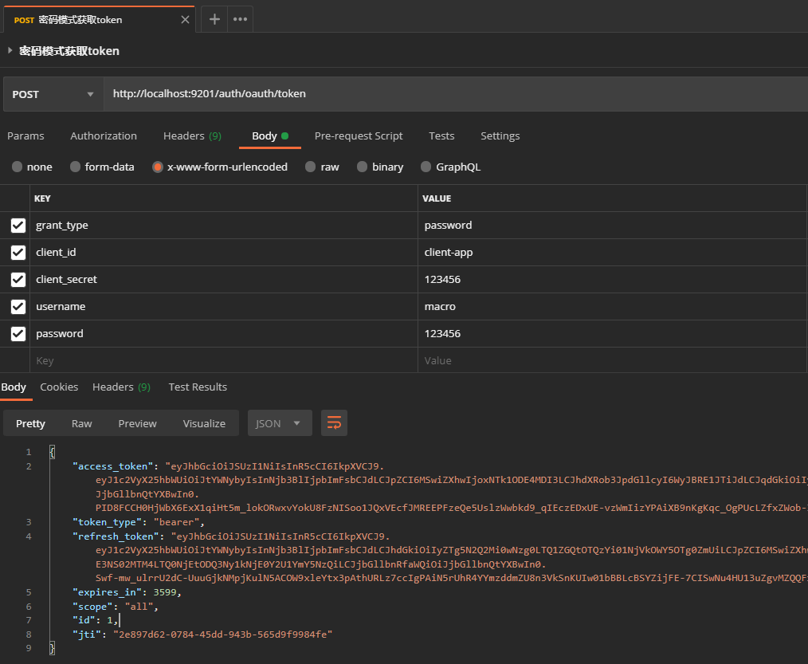
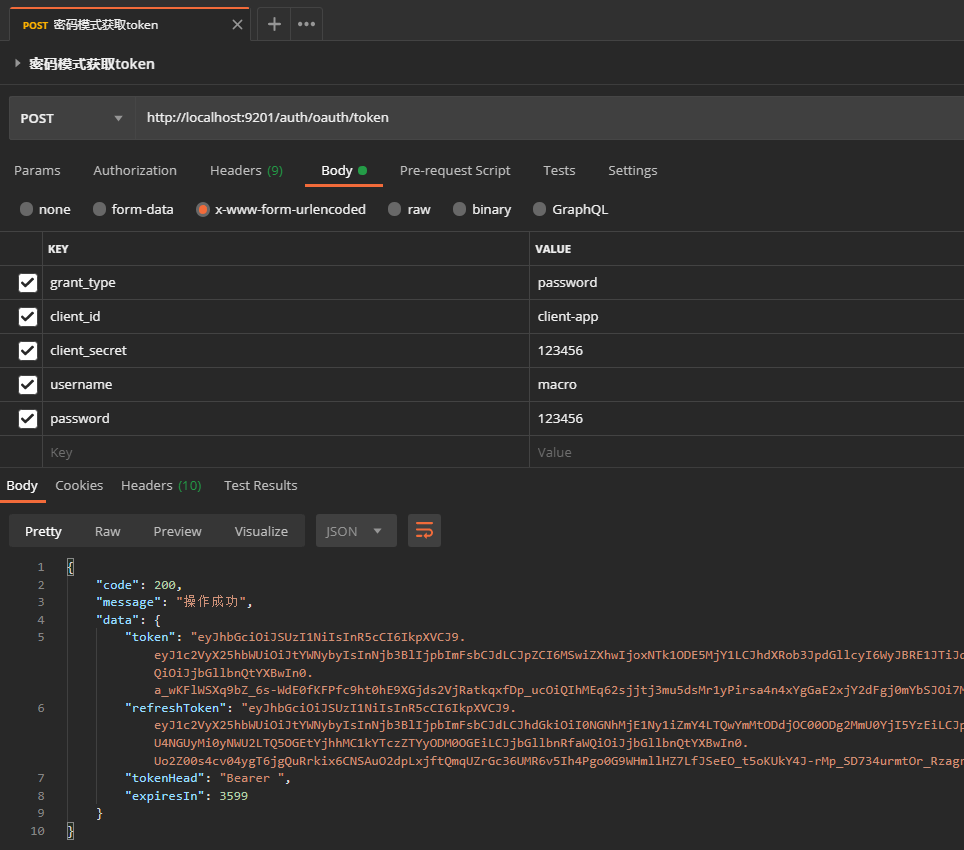
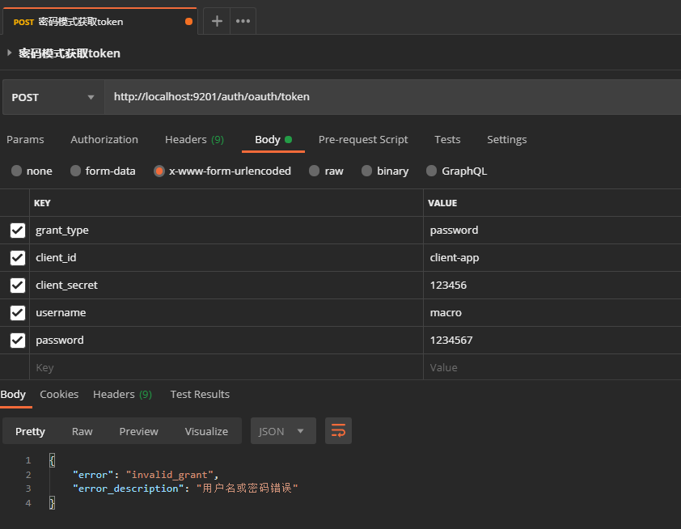
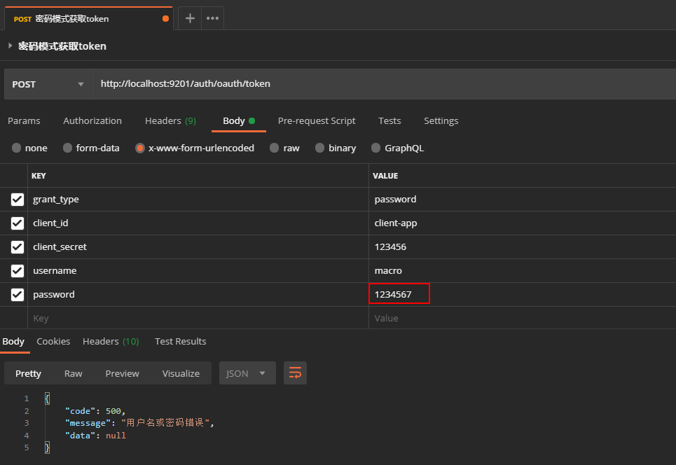
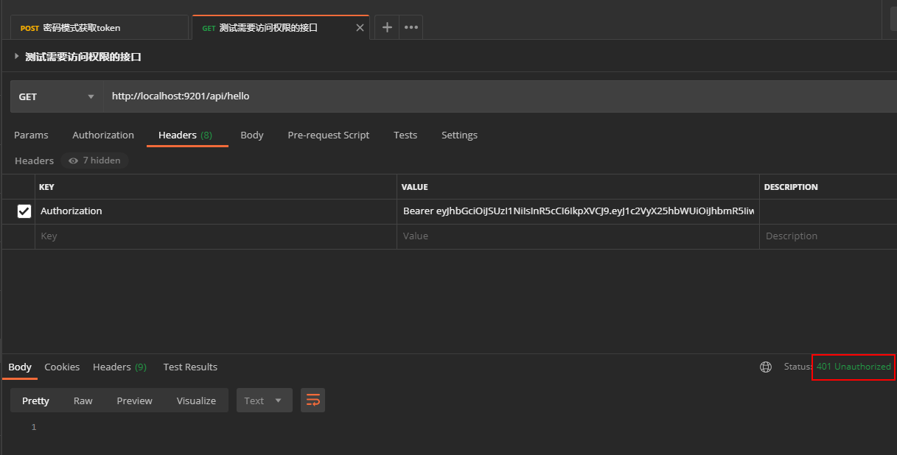
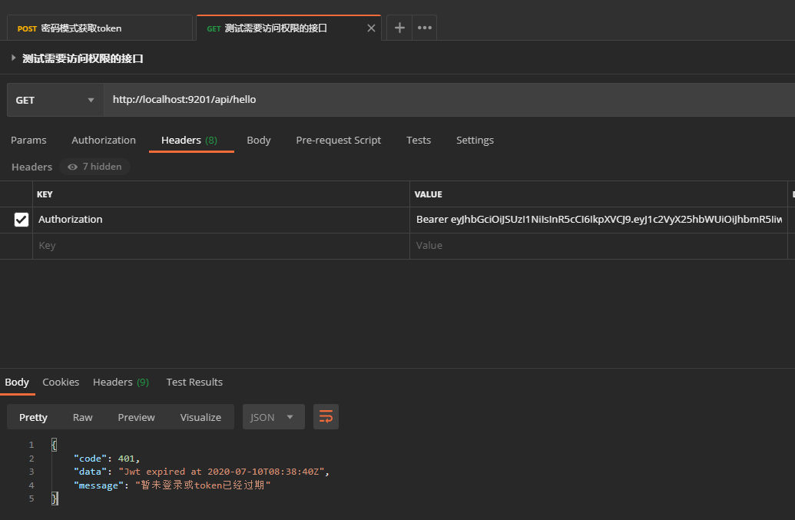
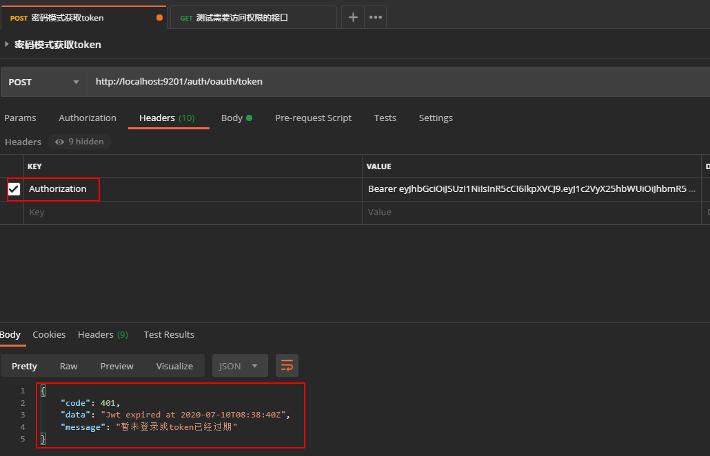
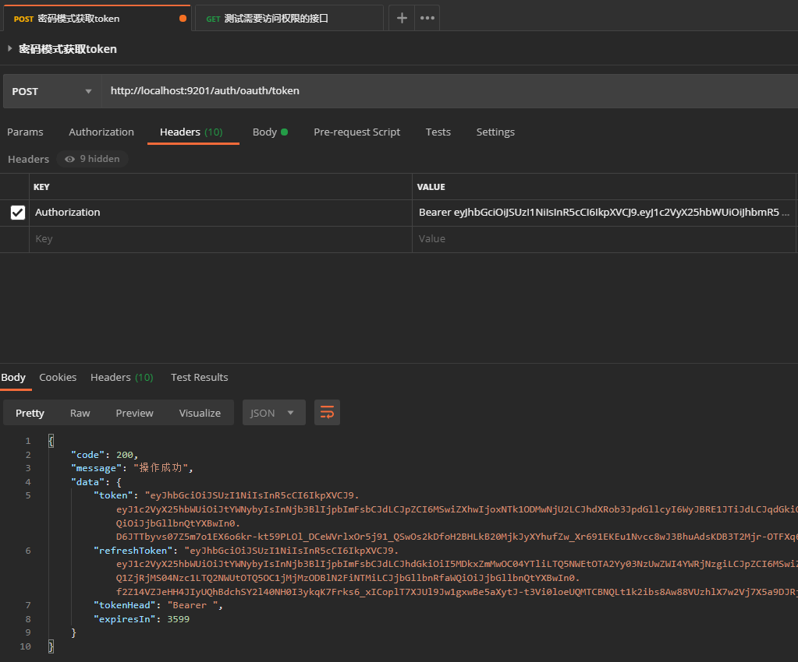

学习不走弯路，[关注公众号](#公众号) 回复「学习路线」，获取mall项目专属学习路线！

# 我扒了半天源码，终于找到了Oauth2自定义处理结果的最佳方案！

> 在[《微服务权限终极解决方案，Spring Cloud Gateway + Oauth2 实现统一认证和鉴权！》](https://mp.weixin.qq.com/s/npyZsa4p30PLULxjskxKSA)一文中我们介绍了Oauth2在微服务中的使用，但是我们没有自定义Oauth2默认的处理结果。有时候我们真的很希望Oauth2中的认证授权能返回我们指定格式的结果，比如登录认证的结果、网关鉴权不通过的结果等等。本文将详细介绍Oauth2中自定义处理结果的方案，希望对大家有所帮助！

## 解决什么问题

> 自定义Oauth2处理结果，主要是为了统一接口返回信息的格式，从下面几个方面着手。

- 自定义Oauth2登录认证成功和失败的返回结果；
- JWT令牌过期或者签名不正确，网关认证失败的返回结果；
- 携带过期或者签名不正确的JWT令牌访问白名单接口，网关直接认证失败。

## 自定义登录认证结果

### 认证成功返回结果

- 我们先来看看默认的返回结果，访问Oauth2登录认证接口：http://localhost:9201/auth/oauth/token



- 我们之前使用的都是统一的通用返回结果`CommonResult`，Oauth2的这个结果显然不符合，需要统一下，通用返回结果格式如下；

```java
/**
 * 通用返回对象
 * Created by macro on 2019/4/19.
 */
public class CommonResult<T> {
    private long code;
    private String message;
    private T data;
}
```

- 其实我们只要找到一个关键类就可以自定义Oauth2的登录认证接口了，它就是`org.springframework.security.oauth2.provider.endpoint.TokenEndpoint`,其中定义了我们非常熟悉的登录认证接口，我们只要自己重写登录认证接口，直接调用默认的实现逻辑，然后把默认返回的结果处理下即可，下面是默认的实现逻辑；

```java
@FrameworkEndpoint
public class TokenEndpoint extends AbstractEndpoint {

	@RequestMapping(value = "/oauth/token", method=RequestMethod.POST)
	public ResponseEntity<OAuth2AccessToken> postAccessToken(Principal principal, @RequestParam
	Map<String, String> parameters) throws HttpRequestMethodNotSupportedException {

		if (!(principal instanceof Authentication)) {
			throw new InsufficientAuthenticationException(
					"There is no client authentication. Try adding an appropriate authentication filter.");
		}

		String clientId = getClientId(principal);
		ClientDetails authenticatedClient = getClientDetailsService().loadClientByClientId(clientId);

		TokenRequest tokenRequest = getOAuth2RequestFactory().createTokenRequest(parameters, authenticatedClient);

		if (clientId != null && !clientId.equals("")) {
			// Only validate the client details if a client authenticated during this
			// request.
			if (!clientId.equals(tokenRequest.getClientId())) {
				// double check to make sure that the client ID in the token request is the same as that in the
				// authenticated client
				throw new InvalidClientException("Given client ID does not match authenticated client");
			}
		}
		if (authenticatedClient != null) {
			oAuth2RequestValidator.validateScope(tokenRequest, authenticatedClient);
		}
		if (!StringUtils.hasText(tokenRequest.getGrantType())) {
			throw new InvalidRequestException("Missing grant type");
		}
		if (tokenRequest.getGrantType().equals("implicit")) {
			throw new InvalidGrantException("Implicit grant type not supported from token endpoint");
		}

		if (isAuthCodeRequest(parameters)) {
			// The scope was requested or determined during the authorization step
			if (!tokenRequest.getScope().isEmpty()) {
				logger.debug("Clearing scope of incoming token request");
				tokenRequest.setScope(Collections.<String> emptySet());
			}
		}

		if (isRefreshTokenRequest(parameters)) {
			// A refresh token has its own default scopes, so we should ignore any added by the factory here.
			tokenRequest.setScope(OAuth2Utils.parseParameterList(parameters.get(OAuth2Utils.SCOPE)));
		}

		OAuth2AccessToken token = getTokenGranter().grant(tokenRequest.getGrantType(), tokenRequest);
		if (token == null) {
			throw new UnsupportedGrantTypeException("Unsupported grant type: " + tokenRequest.getGrantType());
		}

		return getResponse(token);

	}
}
```

- 我们将需要的JWT信息封装成对象，然后放入到我们的通用返回结果的`data`属性中去；

```java
/**
 * Oauth2获取Token返回信息封装
 * Created by macro on 2020/7/17.
 */
@Data
@EqualsAndHashCode(callSuper = false)
@Builder
public class Oauth2TokenDto {
    /**
     * 访问令牌
     */
    private String token;
    /**
     * 刷新令牌
     */
    private String refreshToken;
    /**
     * 访问令牌头前缀
     */
    private String tokenHead;
    /**
     * 有效时间（秒）
     */
    private int expiresIn;
}
```

- 创建一个`AuthController`，自定义实现Oauth2默认的登录认证接口；

```java
/**
 * 自定义Oauth2获取令牌接口
 * Created by macro on 2020/7/17.
 */
@RestController
@RequestMapping("/oauth")
public class AuthController {

    @Autowired
    private TokenEndpoint tokenEndpoint;

    /**
     * Oauth2登录认证
     */
    @RequestMapping(value = "/token", method = RequestMethod.POST)
    public CommonResult<Oauth2TokenDto> postAccessToken(Principal principal, @RequestParam Map<String, String> parameters) throws HttpRequestMethodNotSupportedException {
        OAuth2AccessToken oAuth2AccessToken = tokenEndpoint.postAccessToken(principal, parameters).getBody();
        Oauth2TokenDto oauth2TokenDto = Oauth2TokenDto.builder()
                .token(oAuth2AccessToken.getValue())
                .refreshToken(oAuth2AccessToken.getRefreshToken().getValue())
                .expiresIn(oAuth2AccessToken.getExpiresIn())
                .tokenHead("Bearer ").build();

        return CommonResult.success(oauth2TokenDto);
    }
}
```

- 再次调用登录认证接口，我们可以发现返回结果已经变成了符合我们通用返回结果的格式了！




### 认证失败返回结果

- 认证成功的结果统一了，认证失败的结果我们也得统一下吧，先来看下原来认证失败的结果；



- 我们仔细查看下登录认证的默认实现可以发现，很多认证失败的操作都会直接抛出`OAuth2Exception`异常，对于在`Controller`中抛出的异常，我们可以使用`@ControllerAdvice`注解来进行全局处理；

```java
/**
 * 全局处理Oauth2抛出的异常
 * Created by macro on 2020/7/17.
 */
@ControllerAdvice
public class Oauth2ExceptionHandler {
    @ResponseBody
    @ExceptionHandler(value = OAuth2Exception.class)
    public CommonResult handleOauth2(OAuth2Exception e) {
        return CommonResult.failed(e.getMessage());
    }
}
```

- 当我们输错密码，再次调用登录认证接口时，发现认证失败的结果也统一了。




## 自定义网关鉴权失败结果

- 当我们使用过期或签名不正确的JWT令牌访问需要权限的接口时，会直接返回状态码`401`；



- 这个返回结果不符合我们的通用结果格式，其实我们想要的是返回状态码为`200`，然后返回如下格式信息；

```json
{
    "code": 401,
    "data": "Jwt expired at 2020-07-10T08:38:40Z",
    "message": "暂未登录或token已经过期"
}
```

- 这里有个非常简单的改法，只需添加一行代码，修改网关的安全配置`ResourceServerConfig`，设置好资源服务器的`ServerAuthenticationEntryPoint`即可；

```java
/**
 * 资源服务器配置
 * Created by macro on 2020/6/19.
 */
@AllArgsConstructor
@Configuration
@EnableWebFluxSecurity
public class ResourceServerConfig {
    private final AuthorizationManager authorizationManager;
    private final IgnoreUrlsConfig ignoreUrlsConfig;
    private final RestfulAccessDeniedHandler restfulAccessDeniedHandler;
    private final RestAuthenticationEntryPoint restAuthenticationEntryPoint;

    @Bean
    public SecurityWebFilterChain springSecurityFilterChain(ServerHttpSecurity http) {
        http.oauth2ResourceServer().jwt()
                .jwtAuthenticationConverter(jwtAuthenticationConverter());
        //自定义处理JWT请求头过期或签名错误的结果（新添加的）
        http.oauth2ResourceServer().authenticationEntryPoint(restAuthenticationEntryPoint);
        http.authorizeExchange()
                .pathMatchers(ArrayUtil.toArray(ignoreUrlsConfig.getUrls(),String.class)).permitAll()//白名单配置
                .anyExchange().access(authorizationManager)//鉴权管理器配置
                .and().exceptionHandling()
                .accessDeniedHandler(restfulAccessDeniedHandler)//处理未授权
                .authenticationEntryPoint(restAuthenticationEntryPoint)//处理未认证
                .and().csrf().disable();
        return http.build();
    }
}
```

- 添加完成后，再次访问需要权限的接口，就会返回我们想要的结果了。




## 兼容白名单接口

- 其实对于白名单接口一直有个问题，当携带过期或签名不正确的JWT令牌访问时，会直接返回token过期的结果，我们可以访问下登录认证接口试试；



- 明明就是个白名单接口，只不过携带的token不对就不让访问了，显然有点不合理。如何解决呢，我们先看看不带token访问怎么样；


- 其实我们只要在Oauth2默认的认证过滤器前面再加个过滤器，如果是白名单接口，直接移除认证头即可，首先定义好我们的过滤器；

```java
/**
 * 白名单路径访问时需要移除JWT请求头
 * Created by macro on 2020/7/24.
 */
@Component
public class IgnoreUrlsRemoveJwtFilter implements WebFilter {
    @Autowired
    private IgnoreUrlsConfig ignoreUrlsConfig;
    @Override
    public Mono<Void> filter(ServerWebExchange exchange, WebFilterChain chain) {
        ServerHttpRequest request = exchange.getRequest();
        URI uri = request.getURI();
        PathMatcher pathMatcher = new AntPathMatcher();
        //白名单路径移除JWT请求头
        List<String> ignoreUrls = ignoreUrlsConfig.getUrls();
        for (String ignoreUrl : ignoreUrls) {
            if (pathMatcher.match(ignoreUrl, uri.getPath())) {
                request = exchange.getRequest().mutate().header("Authorization", "").build();
                exchange = exchange.mutate().request(request).build();
                return chain.filter(exchange);
            }
        }
        return chain.filter(exchange);
    }
}
```

- 然后把这个过滤器配置到默认的认证过滤器之前即可，在ResourceServerConfig中进行配置；

```java
/**
 * 资源服务器配置
 * Created by macro on 2020/6/19.
 */
@AllArgsConstructor
@Configuration
@EnableWebFluxSecurity
public class ResourceServerConfig {
    private final AuthorizationManager authorizationManager;
    private final IgnoreUrlsConfig ignoreUrlsConfig;
    private final RestfulAccessDeniedHandler restfulAccessDeniedHandler;
    private final RestAuthenticationEntryPoint restAuthenticationEntryPoint;
    private final IgnoreUrlsRemoveJwtFilter ignoreUrlsRemoveJwtFilter;

    @Bean
    public SecurityWebFilterChain springSecurityFilterChain(ServerHttpSecurity http) {
        http.oauth2ResourceServer().jwt()
                .jwtAuthenticationConverter(jwtAuthenticationConverter());
        //自定义处理JWT请求头过期或签名错误的结果
        http.oauth2ResourceServer().authenticationEntryPoint(restAuthenticationEntryPoint);
        //对白名单路径，直接移除JWT请求头（新添加的）
        http.addFilterBefore(ignoreUrlsRemoveJwtFilter, SecurityWebFiltersOrder.AUTHENTICATION);
        http.authorizeExchange()
                .pathMatchers(ArrayUtil.toArray(ignoreUrlsConfig.getUrls(),String.class)).permitAll()//白名单配置
                .anyExchange().access(authorizationManager)//鉴权管理器配置
                .and().exceptionHandling()
                .accessDeniedHandler(restfulAccessDeniedHandler)//处理未授权
                .authenticationEntryPoint(restAuthenticationEntryPoint)//处理未认证
                .and().csrf().disable();
        return http.build();
    }

}
```

- 携带过期请求头再次访问，发现已经可以正常访问了。



## 总结

至此，微服务中使用Oauth2实现统一认证和鉴权方案终于完善了！

## 项目源码地址

https://github.com/macrozheng/springcloud-learning/tree/master/micro-oauth2

## 公众号


