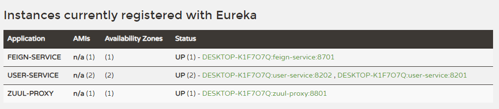
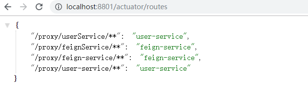
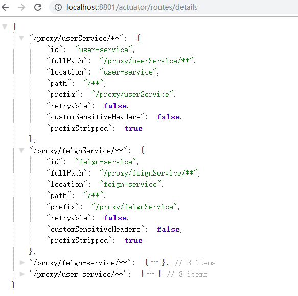

mall项目全套学习教程连载中，[关注公众号](#公众号)第一时间获取。

# Spring Cloud Zuul：API网关服务

> Spring Cloud Zuul 是Spring Cloud Netflix 子项目的核心组件之一，可以作为微服务架构中的API网关使用，支持动态路由与过滤功能，本文将对其用法进行详细介绍。

## Zuul简介

API网关为微服务架构中的服务提供了统一的访问入口，客户端通过API网关访问相关服务。API网关的定义类似于设计模式中的门面模式，它相当于整个微服务架构中的门面，所有客户端的访问都通过它来进行路由及过滤。它实现了请求路由、负载均衡、校验过滤、服务容错、服务聚合等功能。

## 创建一个zuul-proxy模块

> 这里我们创建一个zuul-proxy模块来演示zuul的常用功能。  

### 在pom.xml中添加相关依赖

```xml
<dependency>
    <groupId>org.springframework.cloud</groupId>
    <artifactId>spring-cloud-starter-netflix-eureka-client</artifactId>
</dependency>
<dependency>
    <groupId>org.springframework.cloud</groupId>
    <artifactId>spring-cloud-starter-netflix-zuul</artifactId>
</dependency>
```

### 在application.yml中进行配置

```yaml
server:
  port: 8801
spring:
  application:
    name: zuul-proxy
eureka:
  client:
    register-with-eureka: true
    fetch-registry: true
    service-url:
      defaultZone: http://localhost:8001/eureka/
```

### 在启动类上添加@EnableZuulProxy注解来启用Zuul的API网关功能

```java
@EnableZuulProxy
@EnableDiscoveryClient
@SpringBootApplication
public class ZuulProxyApplication {

    public static void main(String[] args) {
        SpringApplication.run(ZuulProxyApplication.class, args);
    }

}
```

## 常用功能

### 启动相关服务

这里我们通过启动eureka-server，两个user-service，feign-service和zuul-proxy来演示Zuul的常用功能，启动后注册中心显示如下。



### 配置路由规则

- 我们可以通过修改application.yml中的配置来配置路由规则，这里我们将匹配`/userService/**`的请求路由到user-service服务上去，匹配`/feignService/**`的请求路由到feign-service上去。

```yaml
zuul:
  routes: #给服务配置路由
    user-service:
      path: /userService/**
    feign-service:
      path: /feignService/**
```

- 访问[http://localhost:8801/userService/user/1](http://localhost:8801/userService/user/1)可以发现请求路由到了user-service上了；

- 访问[http://localhost:8801/feignService/user/1](http://localhost:8801/feignService/user/1)可以发现请求路由到了feign-service上了。

### 默认路由规则

- Zuul和Eureka结合使用，可以实现路由的自动配置，自动配置的路由以服务名称为匹配路径，相当于如下配置：

```yaml
zuul:
  routes: #给服务配置路由
    user-service:
      path: /user-service/**
    feign-service:
      path: /feign-service/**
```

- 访问[http://localhost:8801/user-service/user/1](http://localhost:8801/user-service/user/1)同样可以路由到了user-service上了；

- 访问[http://localhost:8801/feign-service/user/1](http://localhost:8801/feign-service/user/1)同样可以路由到了feign-service上了。

- 如果不想使用默认的路由规则，可以添加以下配置来忽略默认路由配置：

```yaml
zuul:
  ignored-services: user-service,feign-service #关闭默认路由配置
```

### 负载均衡功能

多次调用[http://localhost:8801/user-service/user/1](http://localhost:8801/user-service/user/1)进行测试，可以发现运行在8201和8202的user-service服务交替打印如下信息。

```bash
2019-10-05 10:31:58.738  INFO 11520 --- [nio-8202-exec-5] c.macro.cloud.controller.UserController  : 根据id获取用户信息，用户名称为：macro
2019-10-05 10:32:00.356  INFO 11520 --- [nio-8202-exec-6] c.macro.cloud.controller.UserController  : 根据id获取用户信息，用户名称为：macro
```

### 配置访问前缀

我们可以通过以下配置来给网关路径添加前缀，此处添加了/proxy前缀，这样我们需要访问[http://localhost:8801/proxy/user-service/user/1](http://localhost:8801/proxy/user-service/user/1)才能访问到user-service中的接口。

```yaml
zuul:
  prefix: /proxy #给网关路由添加前缀
```

### Header过滤及重定向添加Host

- Zuul在请求路由时，默认会过滤掉一些敏感的头信息，以下配置可以防止路由时的Cookie及Authorization的丢失：

```yaml
zuul:
  sensitive-headers: Cookie,Set-Cookie,Authorization #配置过滤敏感的请求头信息，设置为空就不会过滤
```

- Zuul在请求路由时，不会设置最初的host头信息，以下配置可以解决：

```yaml
zuul:
  add-host-header: true #设置为true重定向是会添加host请求头
```

### 查看路由信息

> 我们可以通过SpringBoot Actuator来查看Zuul中的路由信息。

- 在pom.xml中添加相关依赖：

```xml
<dependency>
    <groupId>org.springframework.boot</groupId>
    <artifactId>spring-boot-starter-actuator</artifactId>
</dependency>
```
- 修改application.yaml配置文件，开启查看路由的端点：

```yaml
management:
  endpoints:
    web:
      exposure:
        include: 'routes'
```

- 通过访问[http://localhost:8801/actuator/routes](http://localhost:8801/actuator/routes)查看简单路由信息：



- 通过访问[http://localhost:8801/actuator/routes/details](http://localhost:8801/actuator/routes)查看详细路由信息：



## 过滤器

> 路由与过滤是Zuul的两大核心功能，路由功能负责将外部请求转发到具体的服务实例上去，是实现统一访问入口的基础，过滤功能负责对请求过程进行额外的处理，是请求校验过滤及服务聚合的基础。

### 过滤器类型

> Zuul中有以下几种典型的过滤器类型。

- pre：在请求被路由到目标服务前执行，比如权限校验、打印日志等功能；
- routing：在请求被路由到目标服务时执行，这是使用Apache HttpClient或Netflix Ribbon构建和发送原始HTTP请求的地方；
- post：在请求被路由到目标服务后执行，比如给目标服务的响应添加头信息，收集统计数据等功能；
- error：请求在其他阶段发生错误时执行。

### 过滤器的生命周期

> 下图描述了一个HTTP请求到达API网关后，如何在各种不同类型的过滤器中流转的过程。


### 自定义过滤器

> 接下来我们自定义一个过滤器来演示下过滤器的作用。

#### 添加PreLogFilter类继承ZuulFilter

> 这是一个前置过滤器，用于在请求路由到目标服务前打印请求日志。

```java
/**
 * Created by macro on 2019/9/9.
 */
@Component
public class PreLogFilter extends ZuulFilter {
    private Logger LOGGER = LoggerFactory.getLogger(this.getClass());

    /**
     * 过滤器类型，有pre、routing、post、error四种。
     */
    @Override
    public String filterType() {
        return "pre";
    }

    /**
     * 过滤器执行顺序，数值越小优先级越高。
     */
    @Override
    public int filterOrder() {
        return 1;
    }

    /**
     * 是否进行过滤，返回true会执行过滤。
     */
    @Override
    public boolean shouldFilter() {
        return true;
    }

    /**
     * 自定义的过滤器逻辑，当shouldFilter()返回true时会执行。
     */
    @Override
    public Object run() throws ZuulException {
        RequestContext requestContext = RequestContext.getCurrentContext();
        HttpServletRequest request = requestContext.getRequest();
        String host = request.getRemoteHost();
        String method = request.getMethod();
        String uri = request.getRequestURI();
        LOGGER.info("Remote host:{},method:{},uri:{}", host, method, uri);
        return null;
    }
}
```

#### 过滤器功能演示

添加过滤器后，我们访问[http://localhost:8801/user-service/user/1](http://localhost:8801/user-service/user/1)测试下，会打印如下日志。

```bash
2019-10-05 15:13:10.232  INFO 11040 --- [nio-8801-exec-7] com.macro.cloud.filter.PreLogFilter      : Remote host:0:0:0:0:0:0:0:1,method:GET,uri:/user-service/user/1
```

### 核心过滤器

| 过滤器名称              | 过滤类型 | 优先级 | 过滤器的作用                                                 |
| :---------------------- | :------- | :----- | :----------------------------------------------------------- |
| ServletDetectionFilter  | pre      | -3     | 检测当前请求是通过DispatcherServlet处理运行的还是ZuulServlet运行处理的。 |
| Servlet30WrapperFilter  | pre      | -2     | 对原始的HttpServletRequest进行包装。                         |
| FormBodyWrapperFilter   | pre      | -1     | 将Content-Type为application/x-www-form-urlencoded或multipart/form-data的请求包装成FormBodyRequestWrapper对象。 |
| DebugFilter             | route    | 1      | 根据zuul.debug.request的配置来决定是否打印debug日志。        |
| PreDecorationFilter     | route    | 5      | 对当前请求进行预处理以便执行后续操作。                       |
| RibbonRoutingFilter     | route    | 10     | 通过Ribbon和Hystrix来向服务实例发起请求，并将请求结果进行返回。 |
| SimpleHostRoutingFilter | route    | 100    | 只对请求上下文中有routeHost参数的进行处理，直接使用HttpClient向routeHost对应的物理地址进行转发。 |
| SendForwardFilter       | route    | 500    | 只对请求上下文中有forward.to参数的进行处理，进行本地跳转。   |
| SendErrorFilter         | post     | 0      | 当其他过滤器内部发生异常时的会由它来进行处理，产生错误响应。 |
| SendResponseFilter      | post     | 1000   | 利用请求上下文的响应信息来组织请求成功的响应内容。           |

### 禁用过滤器

- 我们可以对过滤器进行禁用的配置，配置格式如下：

```yaml
zuul:
  filterClassName:
    filter:
      disable: true 
```

- 以下是禁用PreLogFilter的示例配置：

```yaml
zuul:
  PreLogFilter:
    pre:
      disable: true 
```

## Ribbon和Hystrix的支持

> 由于Zuul自动集成了Ribbon和Hystrix，所以Zuul天生就有负载均衡和服务容错能力，我们可以通过Ribbon和Hystrix的配置来配置Zuul中的相应功能。

- 可以使用Hystrix的配置来设置路由转发时HystrixCommand的执行超时时间：

```yaml
hystrix:
  command: #用于控制HystrixCommand的行为
    default:
      execution:
        isolation:
          thread:
            timeoutInMilliseconds: 1000 #配置HystrixCommand执行的超时时间，执行超过该时间会进行服务降级处理
```

- 可以使用Ribbon的配置来设置路由转发时请求连接及处理的超时时间：

```yaml
ribbon: #全局配置
  ConnectTimeout: 1000 #服务请求连接超时时间（毫秒）
  ReadTimeout: 3000 #服务请求处理超时时间（毫秒）
```

## 常用配置

```yaml
zuul:
  routes: #给服务配置路由
    user-service:
      path: /userService/**
    feign-service:
      path: /feignService/**
  ignored-services: user-service,feign-service #关闭默认路由配置
  prefix: /proxy #给网关路由添加前缀
  sensitive-headers: Cookie,Set-Cookie,Authorization #配置过滤敏感的请求头信息，设置为空就不会过滤
  add-host-header: true #设置为true重定向是会添加host请求头
  retryable: true # 关闭重试机制
  PreLogFilter:
    pre:
      disable: false #控制是否启用过滤器
```

## 使用到的模块

```lua
springcloud-learning
├── eureka-server -- eureka注册中心
├── user-service -- 提供User对象CRUD接口的服务
├── feign-service -- feign服务调用测试服务
└── zuul-proxy -- zuul作为网关的测试服务
```

## 项目源码地址

[https://github.com/macrozheng/springcloud-learning](https://github.com/macrozheng/springcloud-learning)

## 公众号

