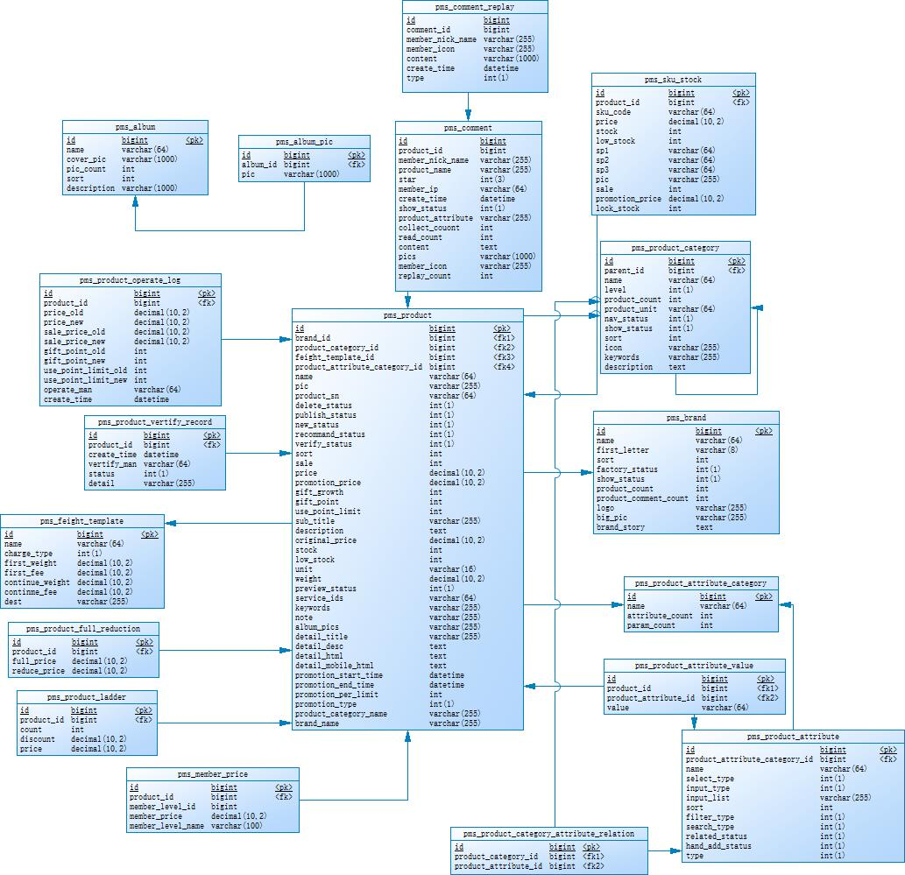
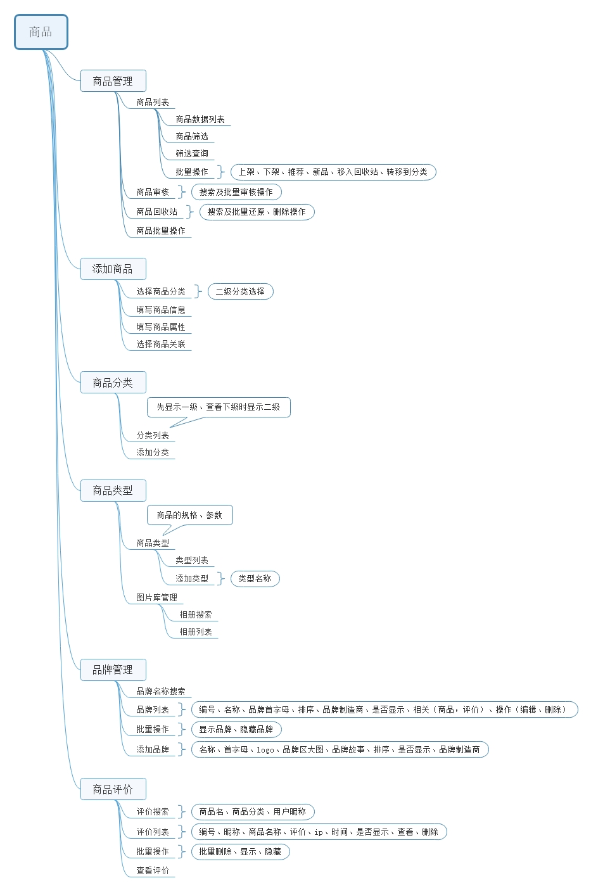
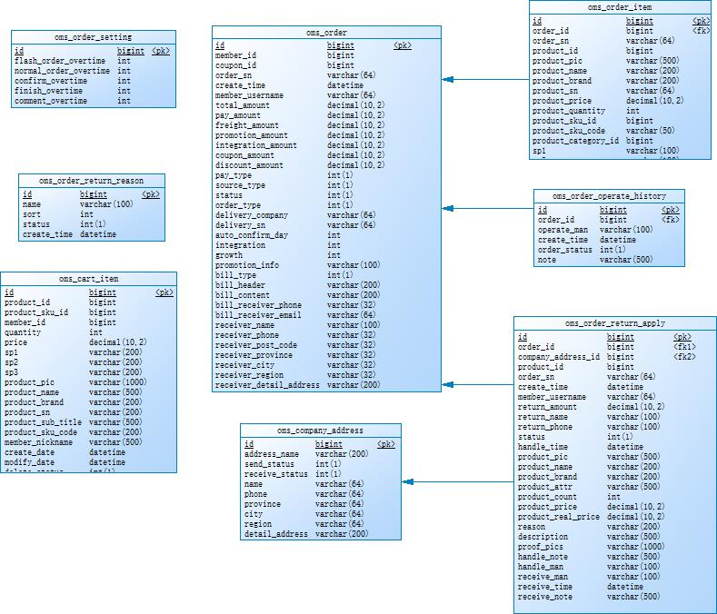
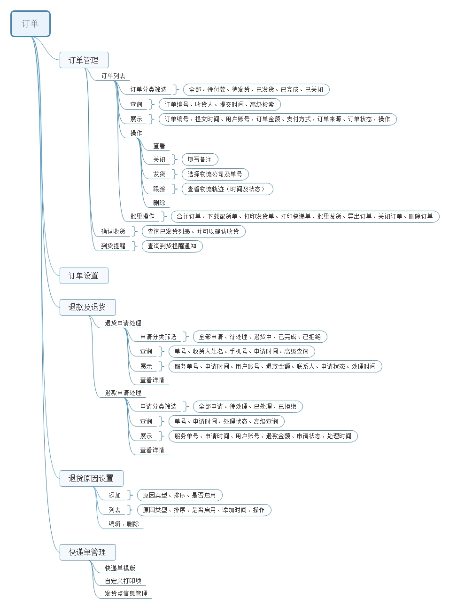
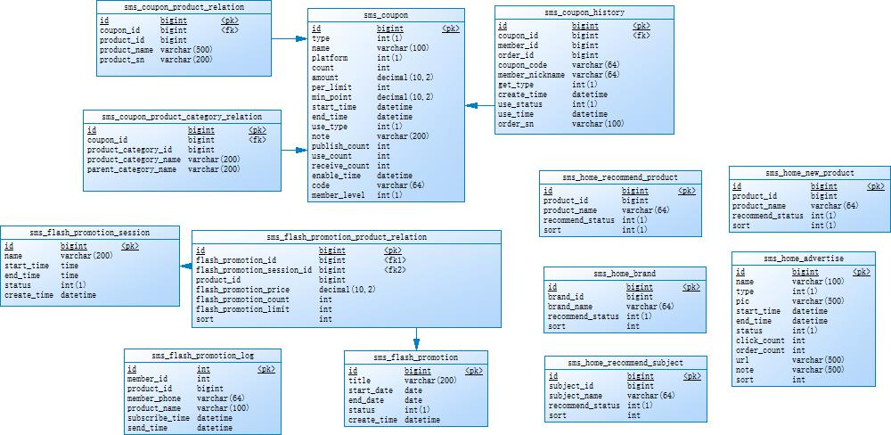
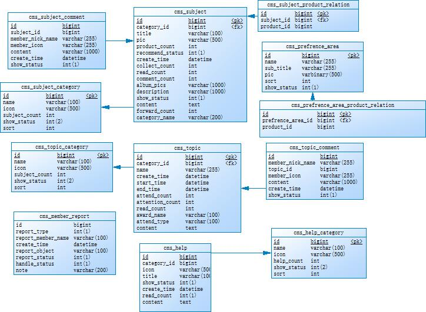
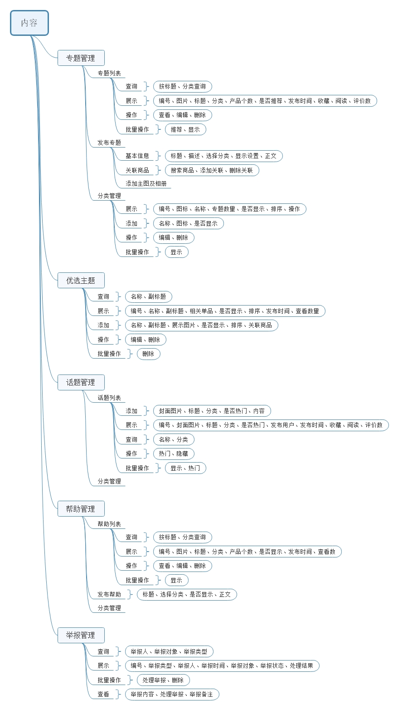
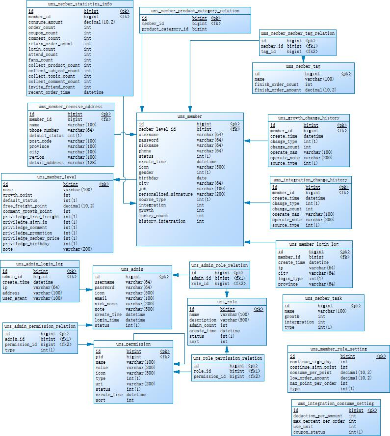
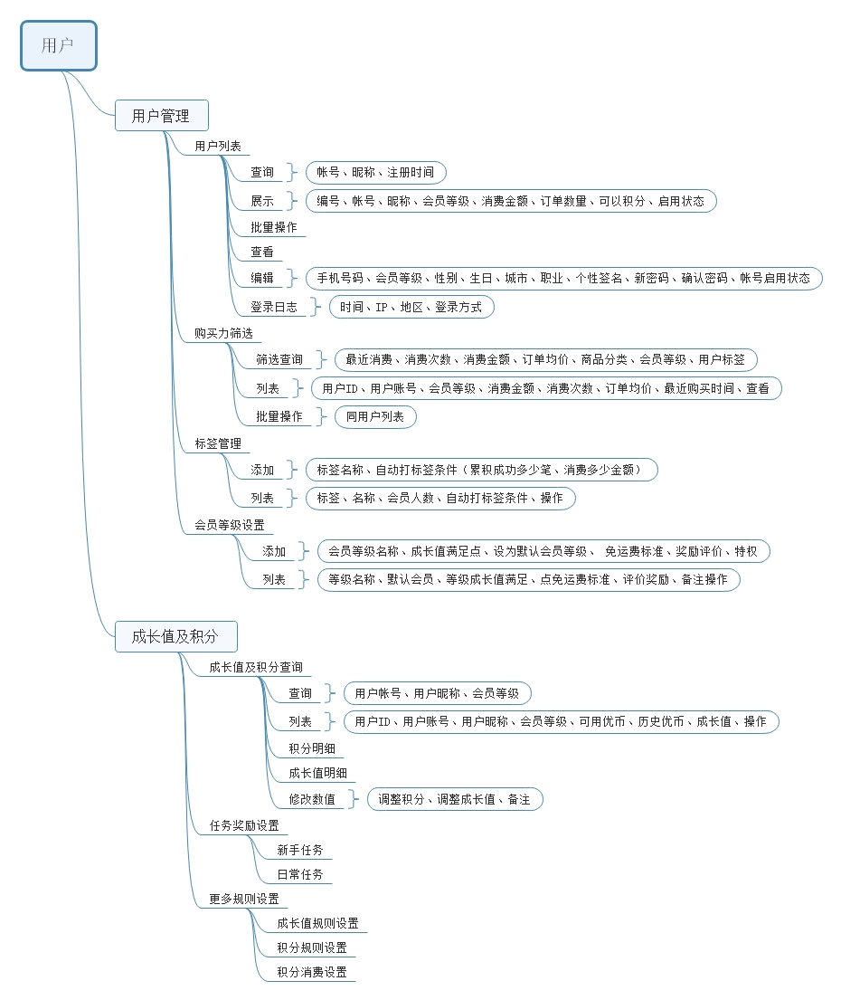

mall项目全套学习教程连载中，[关注公众号](#公众号)第一时间获取。

# mall数据库表结构概览

> mall是一套电商系统，后台系统主要包括商品管理、订单管理、营销管理（运营管理+促销管理）、内容管理、用户管理等模块，本文主要对这些模块的数据库表结构及功能做大概的介绍。

## 商品管理

### 数据库表结构

### 功能结构

## 订单管理

### 数据库表结构

### 功能结构

## 营销管理

### 数据库表结构

### 功能结构

## 内容管理

### 数据库表结构

### 功能结构

## 用户管理

### 数据库表结构

### 功能结构

`注意`：部分功能暂未实现，只是对表结构进行了设计，商品管理、订单管理、营销管理大部分功能均已实现。

## 相关资料

### PowerDesigner数据库设计文件

- 商品管理：https://github.com/macrozheng/mall-learning/blob/master/document/pdm/mall_pms.pdm
- 订单管理：https://github.com/macrozheng/mall-learning/blob/master/document/pdm/mall_oms.pdm
- 营销管理：https://github.com/macrozheng/mall-learning/blob/master/document/pdm/mall_sms.pdm
- 内容管理：https://github.com/macrozheng/mall-learning/blob/master/document/pdm/mall_cms.pdm
- 用户管理：https://github.com/macrozheng/mall-learning/blob/master/document/pdm/mall_ums.pdm

### MindMaster功能思维导图

- 商品管理：https://github.com/macrozheng/mall-learning/blob/master/document/mind/pms.emmx
- 订单管理：https://github.com/macrozheng/mall-learning/blob/master/document/mind/oms.emmx
- 营销管理：https://github.com/macrozheng/mall-learning/blob/master/document/mind/sms.emmx
- 内容管理：https://github.com/macrozheng/mall-learning/blob/master/document/mind/cms.emmx
- 用户管理：https://github.com/macrozheng/mall-learning/blob/master/document/mind/ums.emmx

## 使用到的工具

- PowerDesigner:[http://powerdesigner.de/](http://powerdesigner.de/)
- MindMaster:[http://www.edrawsoft.cn/mindmaster](http://www.edrawsoft.cn/mindmaster)

## 公众号

