mall项目全套学习教程连载中，[关注公众号](#公众号)第一时间获取。

# 订单模块数据库表解析（一）

> 本文主要对订单及订单设置功能的表进行解析，采用数据库表与功能对照的形式。

## 订单

### 相关表结构

#### 订单表

> 订单表，需要注意的是订单状态：0->待付款；1->待发货；2->已发货；3->已完成；4->已关闭；5->无效订单。

```sql
create table oms_order
(
   id                   bigint not null auto_increment comment '订单id',
   member_id            bigint not null comment '会员id',
   coupon_id            bigint comment '优惠券id',
   order_sn             varchar(64) comment '订单编号',
   create_time          datetime comment '提交时间',
   member_username      varchar(64) comment '用户帐号',
   total_amount         decimal(10,2) comment '订单总金额',
   pay_amount           decimal(10,2) comment '应付金额（实际支付金额）',
   freight_amount       decimal(10,2) comment '运费金额',
   promotion_amount     decimal(10,2) comment '促销优化金额（促销价、满减、阶梯价）',
   integration_amount   decimal(10,2) comment '积分抵扣金额',
   coupon_amount        decimal(10,2) comment '优惠券抵扣金额',
   discount_amount      decimal(10,2) comment '管理员后台调整订单使用的折扣金额',
   pay_type             int(1) comment '支付方式：0->未支付；1->支付宝；2->微信',
   source_type          int(1) comment '订单来源：0->PC订单；1->app订单',
   status               int(1) comment '订单状态：0->待付款；1->待发货；2->已发货；3->已完成；4->已关闭；5->无效订单',
   order_type           int(1) comment '订单类型：0->正常订单；1->秒杀订单',
   delivery_company     varchar(64) comment '物流公司(配送方式)',
   delivery_sn          varchar(64) comment '物流单号',
   auto_confirm_day     int comment '自动确认时间（天）',
   integration          int comment '可以获得的积分',
   growth               int comment '可以活动的成长值',
   promotion_info       varchar(100) comment '活动信息',
   bill_type            int(1) comment '发票类型：0->不开发票；1->电子发票；2->纸质发票',
   bill_header          varchar(200) comment '发票抬头',
   bill_content         varchar(200) comment '发票内容',
   bill_receiver_phone  varchar(32) comment '收票人电话',
   bill_receiver_email  varchar(64) comment '收票人邮箱',
   receiver_name        varchar(100) not null comment '收货人姓名',
   receiver_phone       varchar(32) not null comment '收货人电话',
   receiver_post_code   varchar(32) comment '收货人邮编',
   receiver_province    varchar(32) comment '省份/直辖市',
   receiver_city        varchar(32) comment '城市',
   receiver_region      varchar(32) comment '区',
   receiver_detail_address varchar(200) comment '详细地址',
   note                 varchar(500) comment '订单备注',
   confirm_status       int(1) comment '确认收货状态：0->未确认；1->已确认',
   delete_status        int(1) not null default 0 comment '删除状态：0->未删除；1->已删除',
   use_integration      int comment '下单时使用的积分',
   payment_time         datetime comment '支付时间',
   delivery_time        datetime comment '发货时间',
   receive_time         datetime comment '确认收货时间',
   comment_time         datetime comment '评价时间',
   modify_time          datetime comment '修改时间',
   primary key (id)
);
```

#### 订单商品信息表

> 订单中包含的商品信息，一个订单中会有多个订单商品信息。

```sql
create table oms_order_item
(
   id                   bigint not null auto_increment,
   order_id             bigint comment '订单id',
   order_sn             varchar(64) comment '订单编号',
   product_id           bigint comment '商品id',
   product_pic          varchar(500) comment '商品图片',
   product_name         varchar(200) comment '商品名称',
   product_brand        varchar(200) comment '商品品牌',
   product_sn           varchar(64) comment '商品条码',
   product_price        decimal(10,2) comment '销售价格',
   product_quantity     int comment '购买数量',
   product_sku_id       bigint comment '商品sku编号',
   product_sku_code     varchar(50) comment '商品sku条码',
   product_category_id  bigint comment '商品分类id',
   sp1                  varchar(100) comment '商品的销售属性1',
   sp2                  varchar(100) comment '商品的销售属性2',
   sp3                  varchar(100) comment '商品的销售属性3',
   promotion_name       varchar(200) comment '商品促销名称',
   promotion_amount     decimal(10,2) comment '商品促销分解金额',
   coupon_amount        decimal(10,2) comment '优惠券优惠分解金额',
   integration_amount   decimal(10,2) comment '积分优惠分解金额',
   real_amount          decimal(10,2) comment '该商品经过优惠后的分解金额',
   gift_integration     int not null default 0 comment '商品赠送积分',
   gift_growth          int not null default 0 comment '商品赠送成长值',
   product_attr         varchar(500) comment '商品销售属性:[{"key":"颜色","value":"颜色"},{"key":"容量","value":"4G"}]',
   primary key (id)
);
```

#### 订单操作记录表

> 当订单状态发生改变时，用于记录订单的操作信息。

```sql
create table oms_order_operate_history
(
   id                   bigint not null auto_increment,
   order_id             bigint comment '订单id',
   operate_man          varchar(100) comment '操作人：用户；系统；后台管理员',
   create_time          datetime comment '操作时间',
   order_status         int(1) comment '订单状态：0->待付款；1->待发货；2->已发货；3->已完成；4->已关闭；5->无效订单',
   note                 varchar(500) comment '备注',
   primary key (id)
);
```

### 管理端展现

#### 订单列表
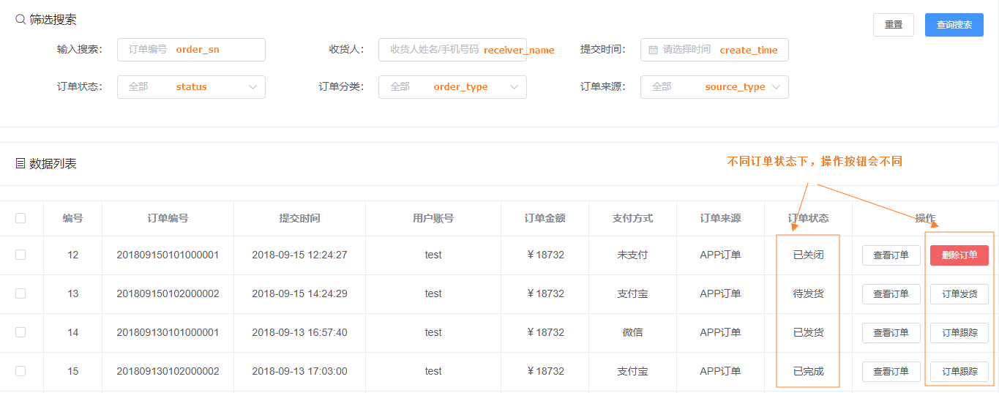

#### 查看订单
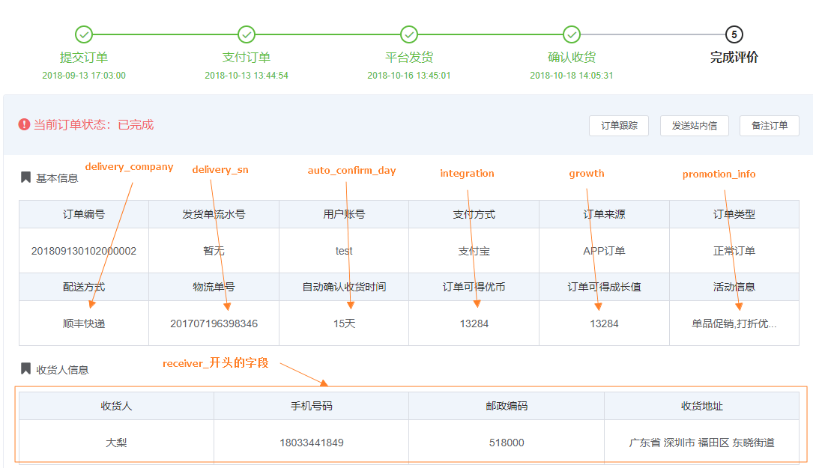
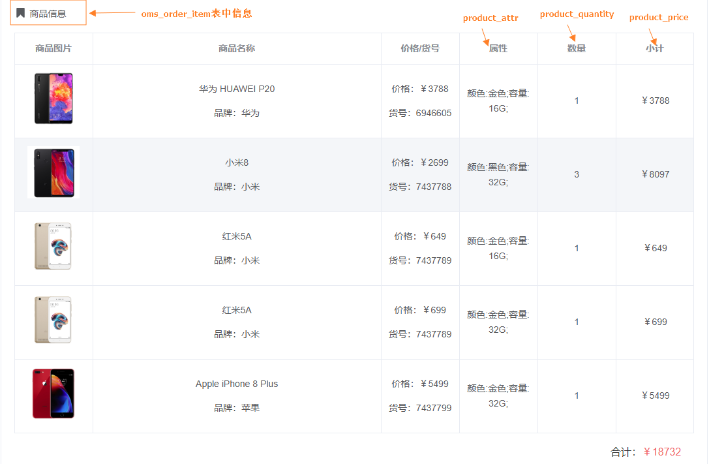
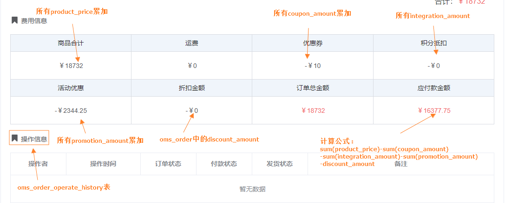

#### 订单发货
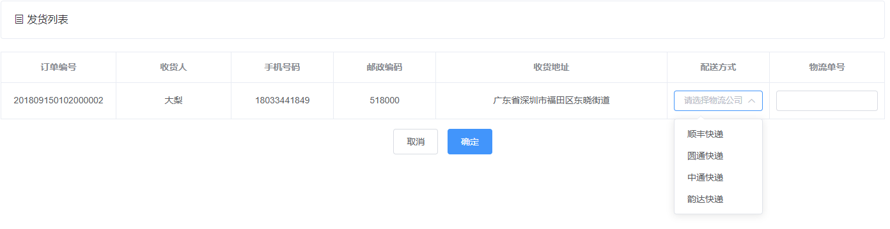

### 移动端展现

#### 不同状态下的订单
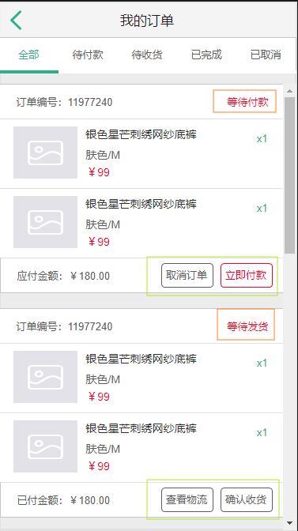
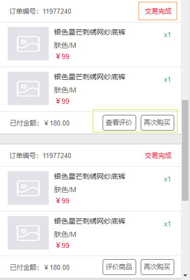
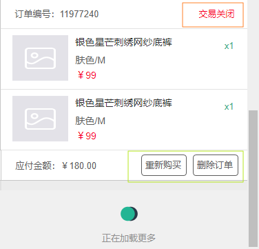

#### 订单详情
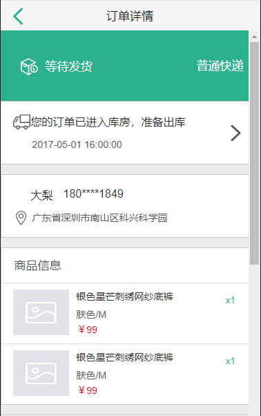
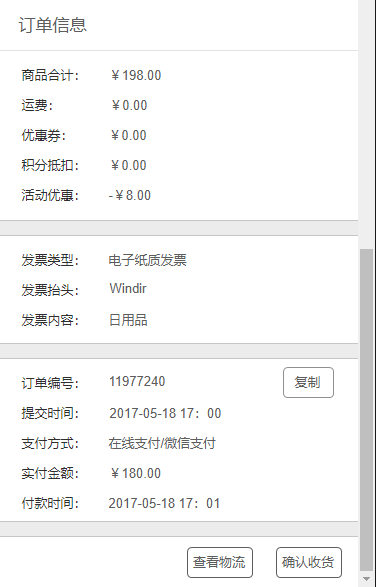


## 订单设置

### 相关表结构

#### 订单设置表

> 用于对订单的一些超时操作进行设置。

```sql
create table oms_order_setting
(
   id                   bigint not null auto_increment,
   flash_order_overtime int comment '秒杀订单超时关闭时间(分)',
   normal_order_overtime int comment '正常订单超时时间(分)',
   confirm_overtime     int comment '发货后自动确认收货时间（天）',
   finish_overtime      int comment '自动完成交易时间，不能申请售后（天）',
   comment_overtime     int comment '订单完成后自动好评时间（天）',
   primary key (id)
);
```

### 管理端展现

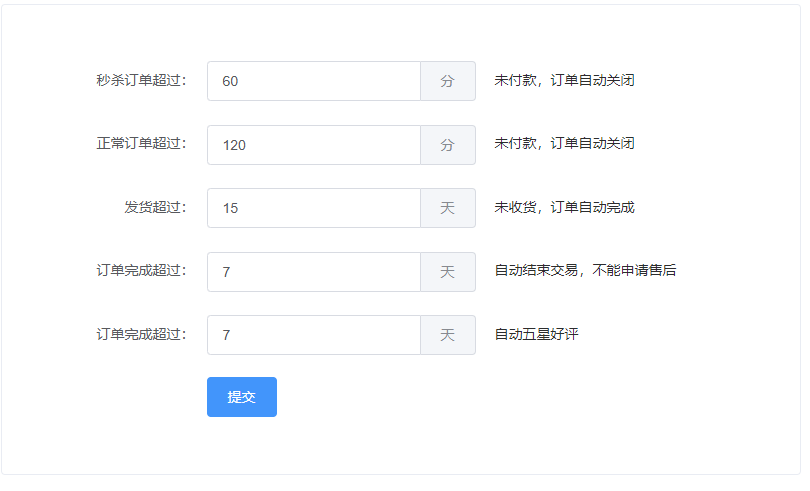

## 公众号

