mall项目全套学习教程连载中，[关注公众号](#公众号)第一时间获取。

# 订单模块数据库表解析（三）

> 本文主要对订单退货及订单退货原因设置功能相关表进行解析，采用数据库表与功能对照的形式。

## 订单退货

### 相关表结构

#### 订单退货申请表

> 主要用于存储会员退货申请信息，需要注意的是订单退货申请表的四种状态：0->待处理；1->退货中；2->已完成；3->已拒绝。

```sql
create table oms_order_return_apply
(
   id                   bigint not null auto_increment,
   order_id             bigint comment '订单id',
   company_address_id   bigint comment '收货地址表id',
   product_id           bigint comment '退货商品id',
   order_sn             varchar(64) comment '订单编号',
   create_time          datetime comment '申请时间',
   member_username      varchar(64) comment '会员用户名',
   return_amount        decimal(10,2) comment '退款金额',
   return_name          varchar(100) comment '退货人姓名',
   return_phone         varchar(100) comment '退货人电话',
   status               int(1) comment '申请状态：0->待处理；1->退货中；2->已完成；3->已拒绝',
   handle_time          datetime comment '处理时间',
   product_pic          varchar(500) comment '商品图片',
   product_name         varchar(200) comment '商品名称',
   product_brand        varchar(200) comment '商品品牌',
   product_attr         varchar(500) comment '商品销售属性：颜色：红色；尺码：xl;',
   product_count        int comment '退货数量',
   product_price        decimal(10,2) comment '商品单价',
   product_real_price   decimal(10,2) comment '商品实际支付单价',
   reason               varchar(200) comment '原因',
   description          varchar(500) comment '描述',
   proof_pics           varchar(1000) comment '凭证图片，以逗号隔开',
   handle_note          varchar(500) comment '处理备注',
   handle_man           varchar(100) comment '处理人员',
   receive_man          varchar(100) comment '收货人',
   receive_time         datetime comment '收货时间',
   receive_note         varchar(500) comment '收货备注',
   primary key (id)
);
```

#### 公司收货地址表

> 用于处理退货申请时选择收货地址。

```sql
create table oms_company_address
(
   id                   bigint not null auto_increment,
   address_name         varchar(200) comment '地址名称',
   send_status          int(1) comment '默认发货地址：0->否；1->是',
   receive_status       int(1) comment '是否默认收货地址：0->否；1->是',
   name                 varchar(64) comment '收发货人姓名',
   phone                varchar(64) comment '收货人电话',
   province             varchar(64) comment '省/直辖市',
   city                 varchar(64) comment '市',
   region               varchar(64) comment '区',
   detail_address       varchar(200) comment '详细地址',
   primary key (id)
);
```

### 管理端展现

- 退货申请列表
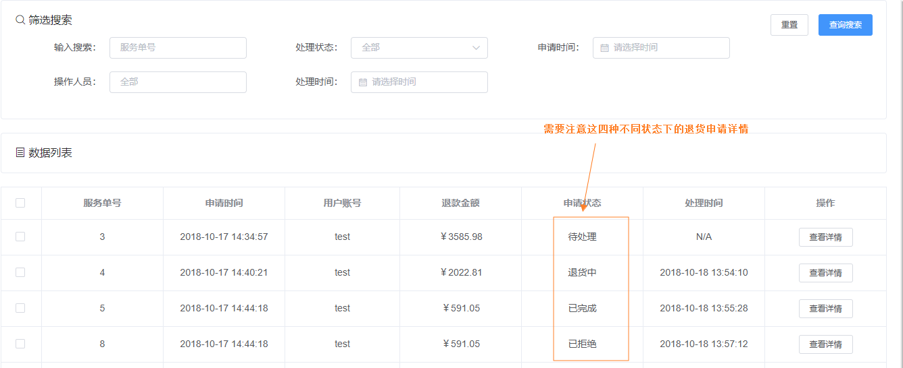
- 待处理状态的详情
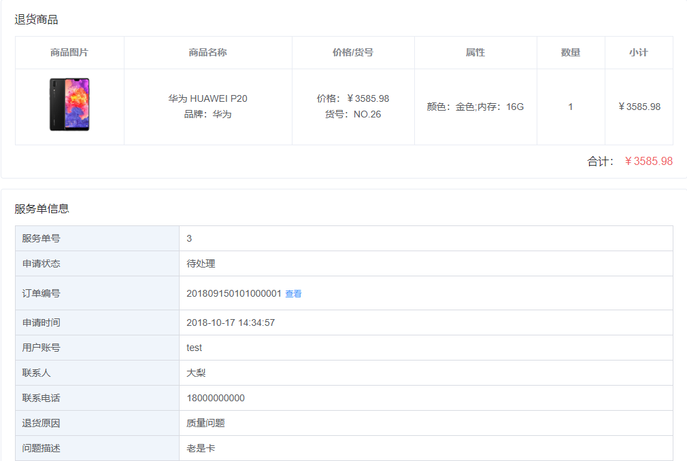
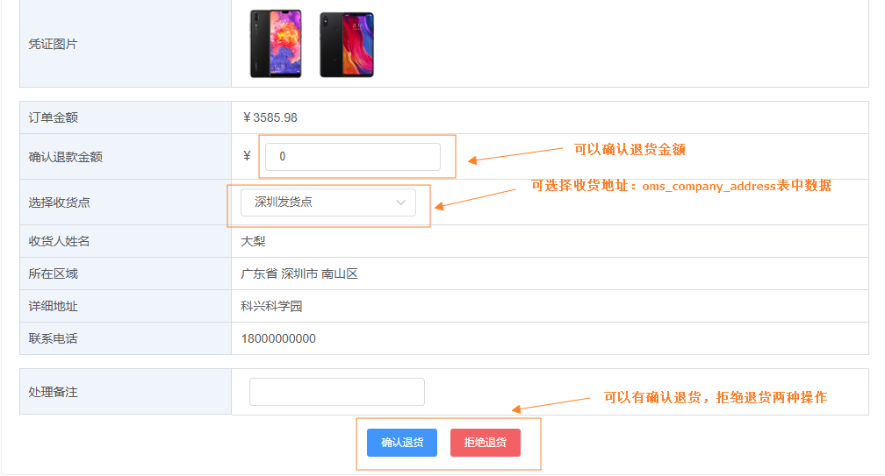
- 退货中状态的详情
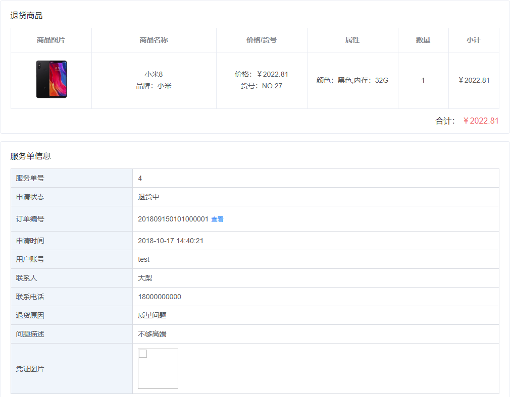
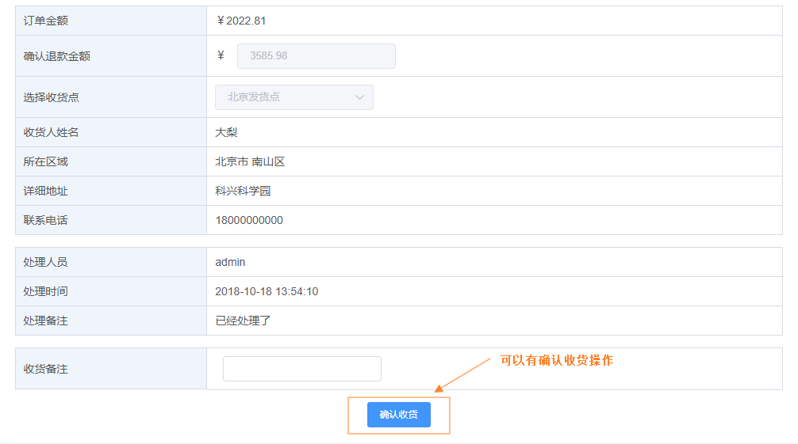
- 已完成状态的详情

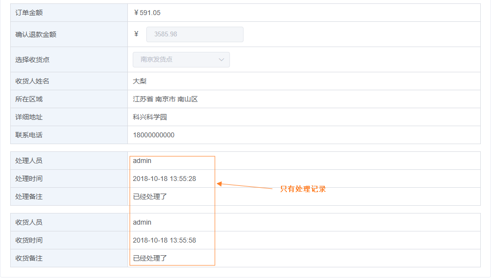
- 已拒绝状态的详情
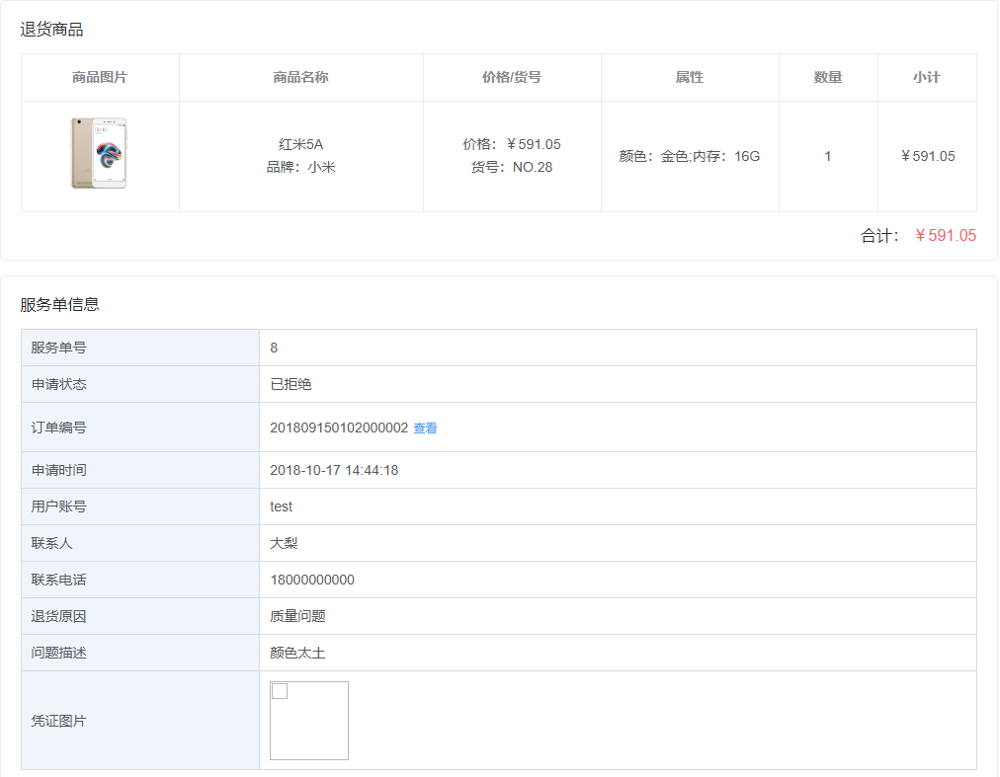
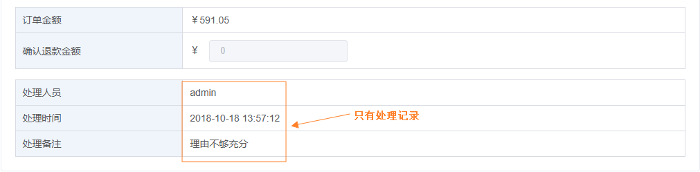

### 移动端展现
- 在我的中打开售后服务  
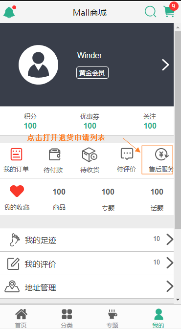
- 点击申请退货进行退货申请  
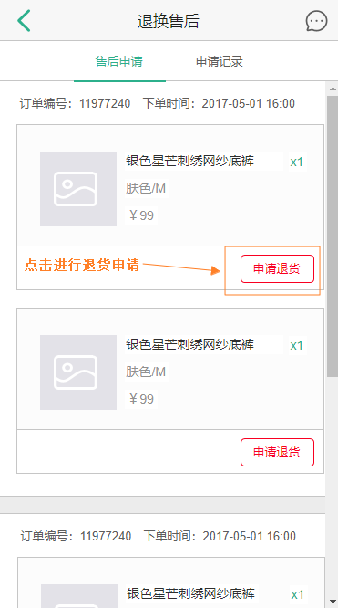
- 提交退货申请  
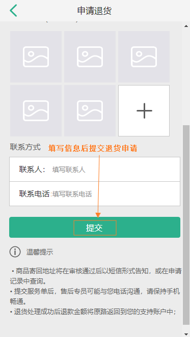
- 在申请记录中查看退货申请记录  
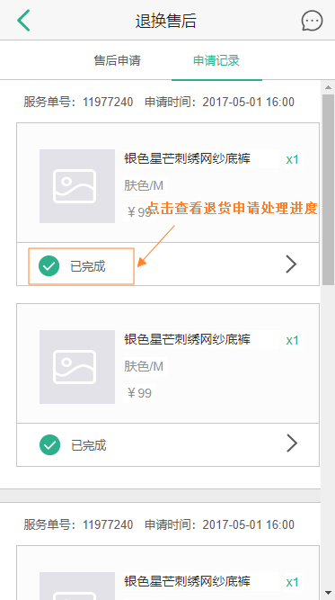
- 查看退货申请进度详情  
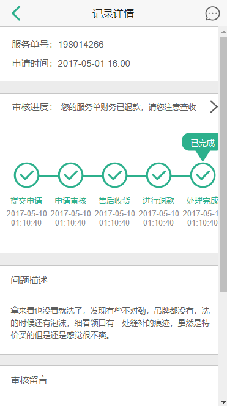

## 订单退货原因设置

### 订单退货原因表

> 用于会员退货时选择退货原因。

```sql
create table oms_order_return_reason
(
   id                   bigint not null auto_increment,
   name                 varchar(100) comment '退货类型',
   sort                 int,
   status               int(1) comment '状态：0->不启用；1->启用',
   create_time          datetime comment '添加时间',
   primary key (id)
);
```

### 管理端展现

- 退货原因列表  
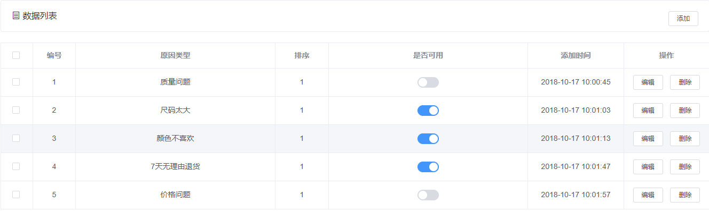
- 添加退货原因  
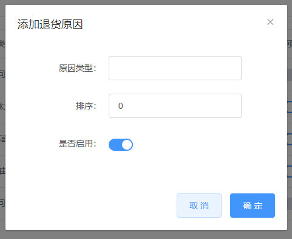

### 移动端展现

- 退货申请时选择退货原因  
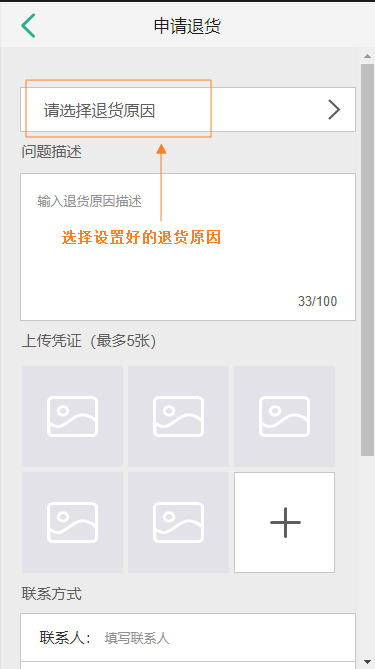

## 公众号


