mall项目全套学习教程连载中，[关注公众号](#公众号)第一时间获取。

# 营销模块数据库表解析（一）

> 本文主要对限时购（秒杀）功能相关表进行解析，采用数据库表与功能对照的形式。

## 相关表结构

### 限时购表

> 用于存储限时购活动的信息，包括开始时间、结束时间以及上下线状态。

```sql
create table sms_flash_promotion
(
   id                   bigint not null auto_increment,
   title                varchar(200) comment '标题',
   start_date           date comment '开始日期',
   end_date             date comment '结束日期',
   status               int(1) comment '上下线状态',
   create_time          datetime comment '创建时间',
   primary key (id)
);
```

### 限时购场次表

> 用于存储限时购场次的信息，在一天中，一个限时购活动会有多个不同的活动时间段。

```sql
create table sms_flash_promotion_session
(
   id                   bigint not null auto_increment comment '编号',
   name                 varchar(200) comment '场次名称',
   start_time           time comment '每日开始时间',
   end_time             time comment '每日结束时间',
   status               int(1) comment '启用状态：0->不启用；1->启用',
   create_time          datetime comment '创建时间',
   primary key (id)
);
```

### 限时购与商品关系表

> 用于存储与限时购相关的商品信息，一个限时购中有多个场次，每个场次都可以设置不同活动商品。

```sql
create table sms_flash_promotion_product_relation
(
   id                   bigint not null auto_increment,
   flash_promotion_id   bigint comment '限时购id',
   flash_promotion_session_id bigint comment '编号',
   product_id           bigint comment '商品价格',
   flash_promotion_price decimal(10,2) comment '限时购价格',
   flash_promotion_count int comment '限时购数量',
   flash_promotion_limit int comment '每人限购数量',
   sort                 int comment '排序',
   primary key (id)
);
```

### 限时购通知记录表

> 用于存储会员的限时购预约记录，当有的限时购场次还未开始时，会员可以进行预约操作，当场次开始时，系统会进行提醒。

```sql
create table sms_flash_promotion_log
(
   id                   int not null auto_increment,
   member_id            int comment '会员id',
   product_id           bigint comment '商品id',
   member_phone         varchar(64) comment '会员电话',
   product_name         varchar(100) comment '商品名称',
   subscribe_time       datetime comment '会员订阅时间',
   send_time            datetime comment '发送时间',
   primary key (id)
);
```

## 管理端展现

### 限时购数据列表
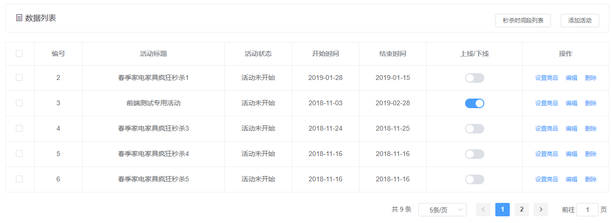

### 编辑限时购活动
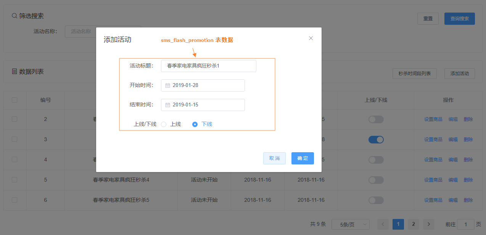

### 限时购场次列表
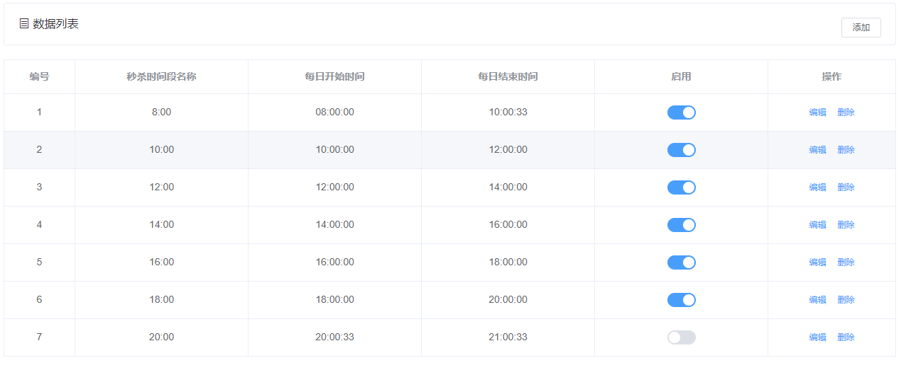

### 编辑限时购场次
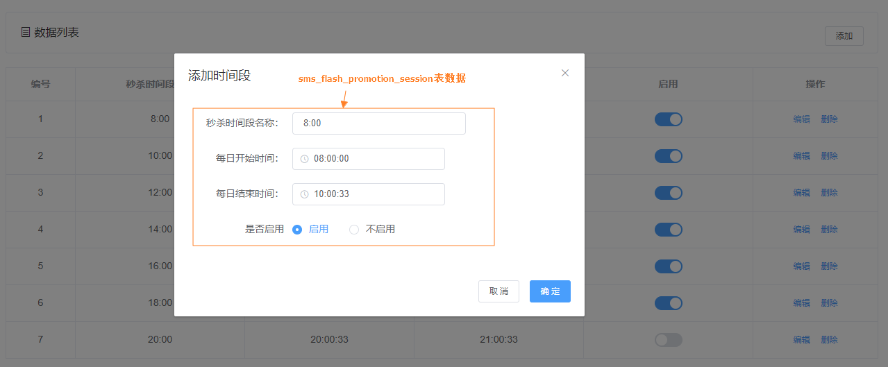

### 添加商品到限时购场次

#### 点击设置商品
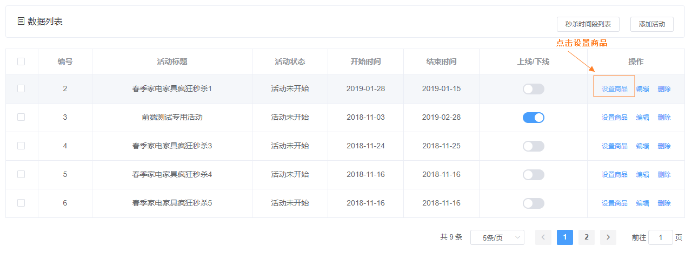

#### 点击商品列表
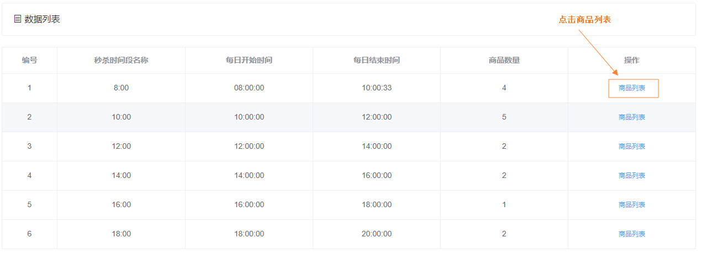

#### 选择商品进行添加
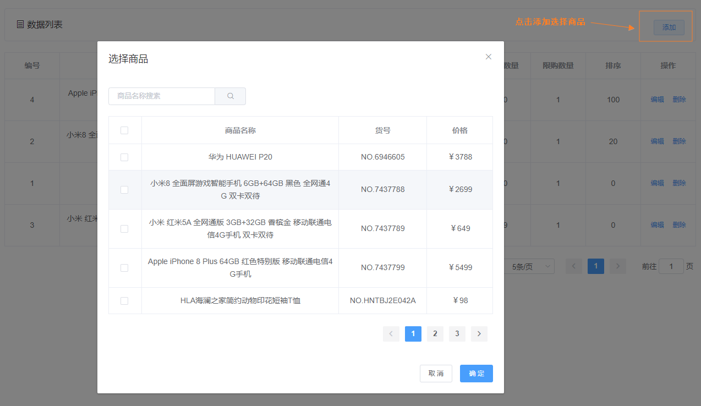

**注意：添加到限时购的商品需要修改`pms_product`表的`promotion_type`为5，优惠计算规则也应该改成使用限时购的优惠。**

### 编辑限时购商品信息
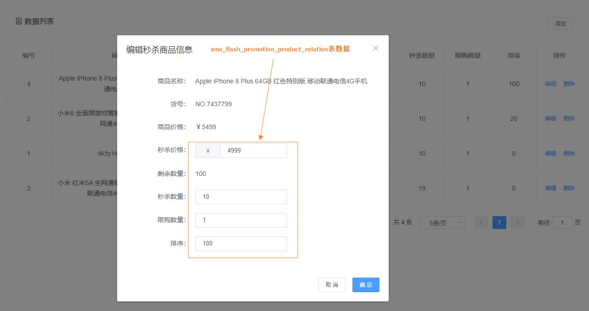

## 移动端展现

### 已开抢的限时购
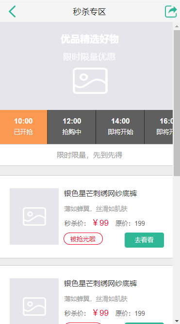

### 抢购中的限时购
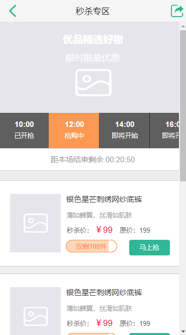

### 即将开始的限时购
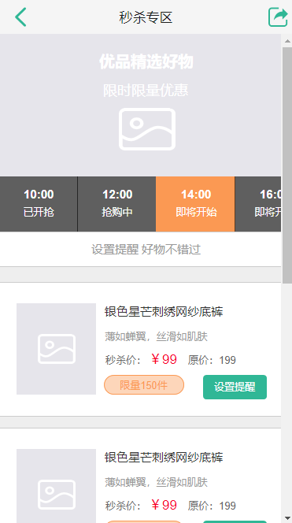

### 即将开始的限时购可以设置预约提醒
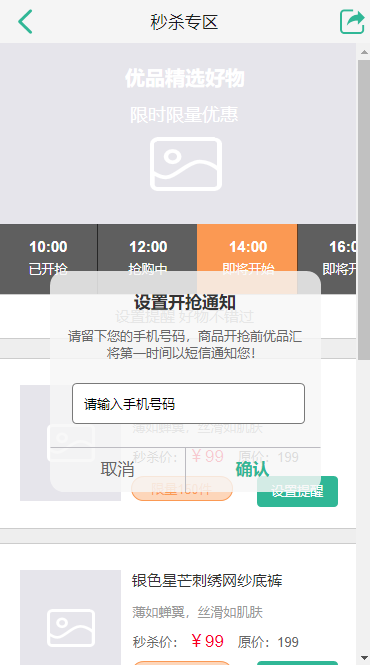

## 公众号


