mall项目全套学习教程连载中，[关注公众号](#公众号)第一时间获取。

# 营销模块数据库表解析（三）

> 本文主要对首页内容推荐功能相关表进行解析，采用数据库表与功能对照的形式。

## 相关表结构

### 首页品牌推荐表

> 用于管理首页显示的品牌制造商直供信息。

```sql
create table sms_home_brand
(
   id                   bigint not null auto_increment,
   brand_id             bigint comment '商品品牌id',
   brand_name           varchar(64) comment '商品品牌名称',
   recommend_status     int(1) comment '推荐状态：0->不推荐;1->推荐',
   sort                 int comment '排序',
   primary key (id)
);
```

### 新品推荐商品表

> 用于管理首页显示的新鲜好物信息。

```sql
create table sms_home_new_product
(
   id                   bigint not null auto_increment,
   product_id           bigint comment '商品id',
   product_name         varchar(64) comment '商品名称',
   recommend_status     int(1) comment '推荐状态：0->不推荐;1->推荐',
   sort                 int(1) comment '排序',
   primary key (id)
);
```

### 人气推荐商品表

> 用于管理首页显示的人气推荐信息。

```sql
create table sms_home_recommend_product
(
   id                   bigint not null auto_increment,
   product_id           bigint,
   product_name         varchar(64),
   recommend_status     int(1),
   sort                 int(1),
   primary key (id)
);
```

### 首页专题推荐表

> 用于管理首页显示的专题精选信息。

```sql
create table sms_home_recommend_subject
(
   id                   bigint not null auto_increment,
   subject_id           bigint comment '专题id',
   subject_name         varchar(64) comment '专题名称',
   recommend_status     int(1) comment '推荐状态：0->不推荐;1->推荐',
   sort                 int comment '排序',
   primary key (id)
);
```

### 首页轮播广告表

> 用于管理首页显示的轮播广告信息。

```sql
create table sms_home_advertise
(
   id                   bigint not null auto_increment,
   name                 varchar(100) comment '名称',
   type                 int(1) comment '轮播位置：0->PC首页轮播；1->app首页轮播',
   pic                  varchar(500) comment '图片地址',
   start_time           datetime comment '开始时间',
   end_time             datetime comment '结束时间',
   status               int(1) comment '上下线状态：0->下线；1->上线',
   click_count          int comment '点击数',
   order_count          int comment '下单数',
   url                  varchar(500) comment '链接地址',
   note                 varchar(500) comment '备注',
   sort                 int default 0 comment '排序',
   primary key (id)
);
```


## 管理端展现

### 品牌推荐列表


### 选择品牌
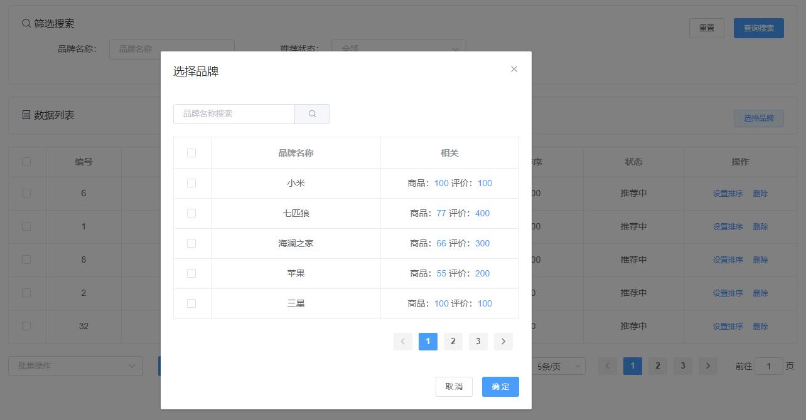

### 新品推荐列表
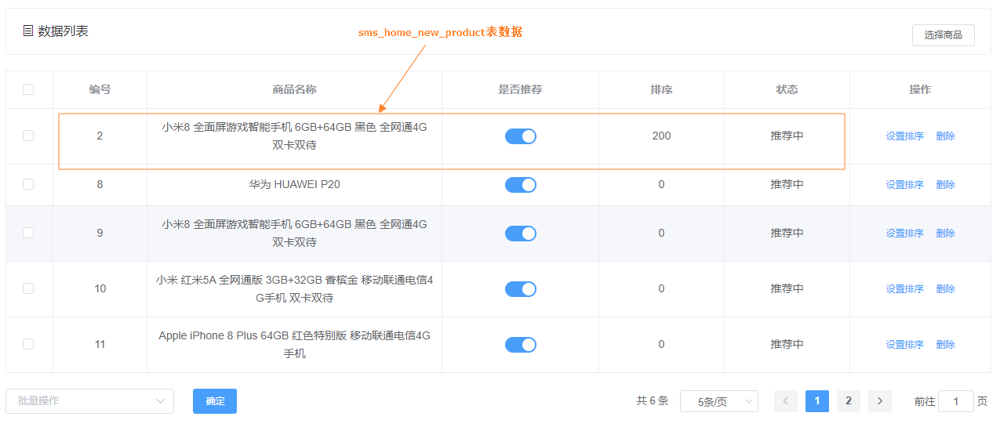

### 选择商品
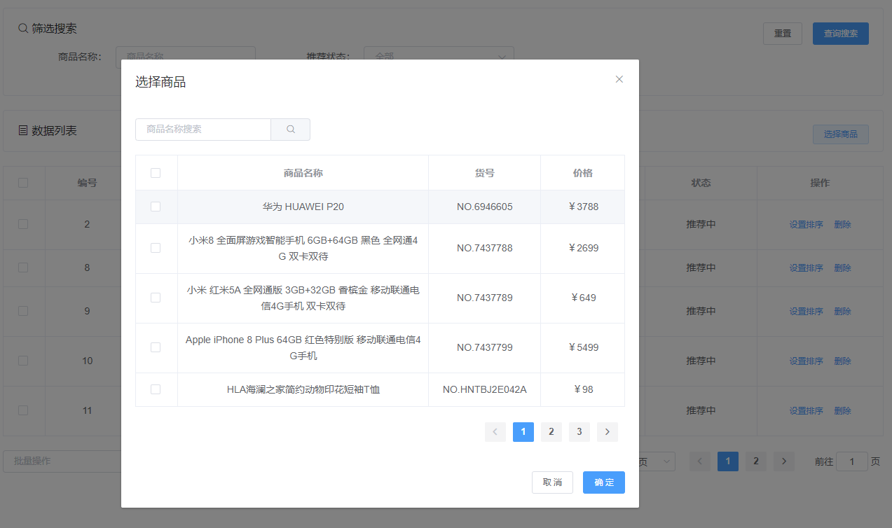

### 人气推荐列表
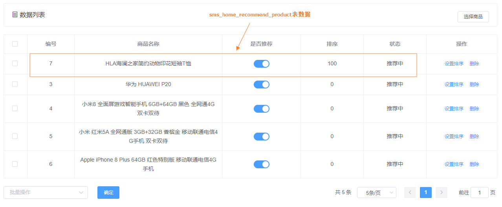

### 选择商品
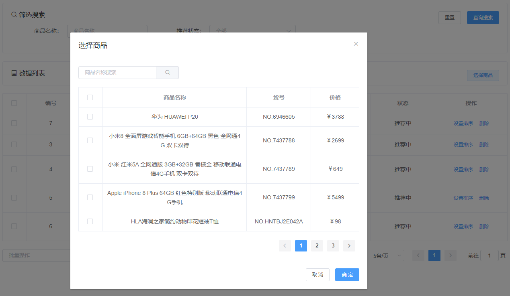

### 专题推荐列表
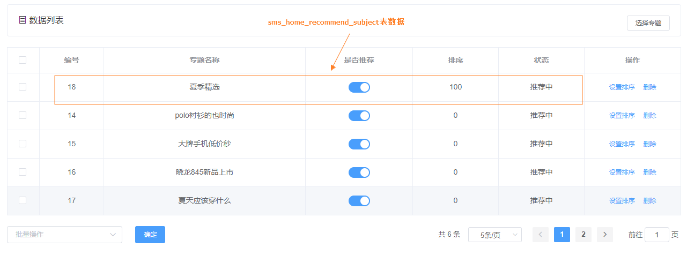

### 选择专题


### 广告列表
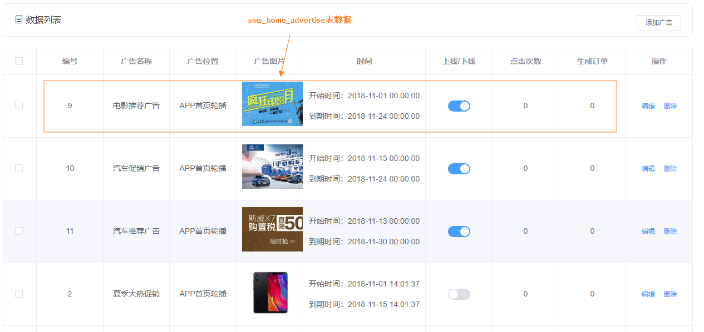

### 编辑广告
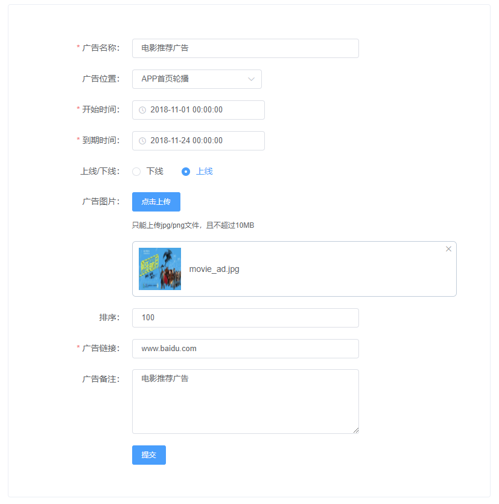

## 移动端展现

### 首页轮播广告
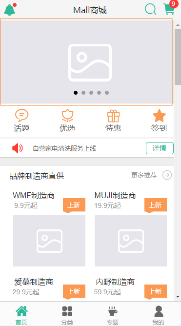
### 品牌制造商直供
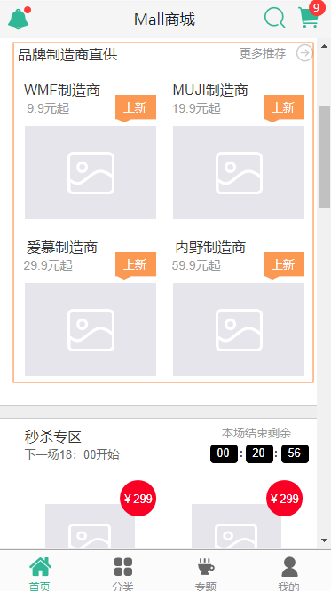
### 新鲜好物
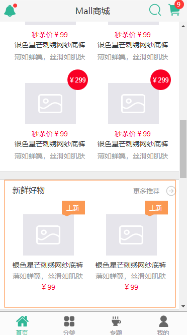
### 人气推荐
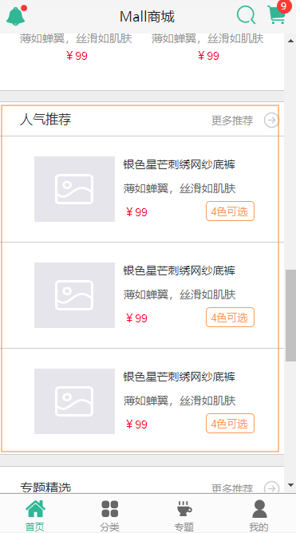
### 专题精选
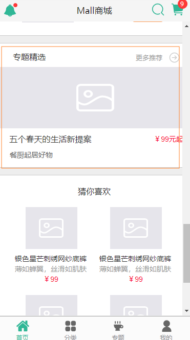

## 公众号


