mall项目全套学习教程连载中，[关注公众号](#公众号)第一时间获取。

# mall在Linux环境下的部署（基于Docker容器）
> 本文主要以图文的形式讲解mall在Linux环境下的部署，涉及在Docker容器中安装Mysql、Redis、Nginx、RabbitMQ、Elasticsearch、Mongodb，以及SpringBoot应用部署，基于CenterOS7.6。

## Docker环境安装
- 安装yum-utils：
```shell
yum install -y yum-utils device-mapper-persistent-data lvm2
```
- 为yum源添加docker仓库位置：
```shell
yum-config-manager --add-repo https://download.docker.com/linux/centos/docker-ce.repo
```
- 安装docker：
```shell
yum install docker-ce
```
- 启动docker：
```shell
systemctl start docker
```

## Mysql安装
- 下载mysql5.7的docker镜像：
```shell
docker pull mysql:5.7
```
- 使用docker命令启动：
```shell
  docker run -p 3306:3306 --name mysql \
  -v /mydata/mysql/log:/var/log/mysql \
  -v /mydata/mysql/data:/var/lib/mysql \
  -v /mydata/mysql/conf:/etc/mysql \
  -e MYSQL_ROOT_PASSWORD=root  \
  -d mysql:5.7
```
- 参数说明
  - -p 3306:3306：将容器的3306端口映射到主机的3306端口
  - -v /mydata/mysql/conf:/etc/mysql：将配置文件夹挂在到主机
  - -v /mydata/mysql/log:/var/log/mysql：将日志文件夹挂载到主机
  - -v /mydata/mysql/data:/var/lib/mysql/：将数据文件夹挂载到主机
  - -e MYSQL_ROOT_PASSWORD=root：初始化root用户的密码
- 进入运行mysql的docker容器：
```shell
docker exec -it mysql /bin/bash
```
- 使用mysql命令打开客户端：
```shell
mysql -uroot -proot --default-character-set=utf8
```
- 创建mall数据库：
```sql
create database mall character set utf8
```
- 安装上传下载插件，并将docment/sql/mall.sql上传到Linux服务器上：
```shell
yum -y install lrzsz
```
- 将mall.sql文件拷贝到mysql容器的/目录下：
```shell
docker cp /mydata/mall.sql mysql:/
```
- 将sql文件导入到数据库：
```shell
use mall;
source /mall.sql;
```
- 创建一个reader帐号并修改权限，使得任何ip都能访问：
```sql
grant all privileges on *.* to 'reader' @'%' identified by '123456';
```

## Redis安装
- 下载redis3.2的docker镜像：
```shell
docker pull redis:3.2
```
- 使用docker命令启动：
```shell
  docker run -p 6379:6379 --name redis \
  -v /mydata/redis/data:/data \
  -d redis:3.2 redis-server --appendonly yes
```
- 进入redis容器使用redis-cli命令进行连接：
```shell
docker exec -it redis redis-cli
```


## Nginx安装

### 下载nginx1.10的docker镜像：
```shell
docker pull nginx:1.10
```

### 从容器中拷贝nginx配置
- 先运行一次容器（为了拷贝配置文件）：
```shell
  docker run -p 80:80 --name nginx \
  -v /mydata/nginx/html:/usr/share/nginx/html \
  -v /mydata/nginx/logs:/var/log/nginx  \
  -d nginx:1.10
```
- 将容器内的配置文件拷贝到指定目录：
```shell
docker container cp nginx:/etc/nginx /mydata/nginx/
```
- 修改文件名称：
```shell
mv nginx conf
```
- 终止并删除容器：
```shell
docker stop nginx
docker rm nginx
```

### 使用docker命令启动：
```shell
docker run -p 80:80 --name nginx \
-v /mydata/nginx/html:/usr/share/nginx/html \
-v /mydata/nginx/logs:/var/log/nginx  \
-v /mydata/nginx/conf:/etc/nginx \
-d nginx:1.10
```

## RabbitMQ安装
- 下载rabbitmq3.7.15的docker镜像：
```shell
docker pull rabbitmq:3.7.15
```
- 使用docker命令启动：
```shell
  docker run -d --name rabbitmq \
  --publish 5671:5671 --publish 5672:5672 --publish 4369:4369 \
  --publish 25672:25672 --publish 15671:15671 --publish 15672:15672 \
  rabbitmq:3.7.15
```
- 进入容器并开启管理功能：
```shell
docker exec -it rabbitmq /bin/bash
rabbitmq-plugins enable rabbitmq_management
```

- 开启防火墙：
```shell
firewall-cmd --zone=public --add-port=15672/tcp --permanent
firewall-cmd --reload
```
- 访问地址查看是否安装成功：[http://192.168.3.101:15672/](http://192.168.3.101:15672/)
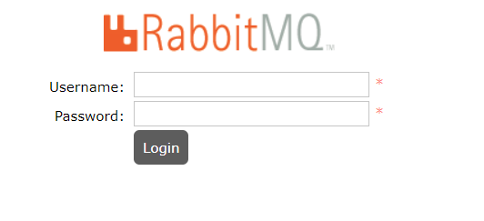
- 输入账号密码并登录：guest guest
- 创建帐号并设置其角色为管理员：mall mall
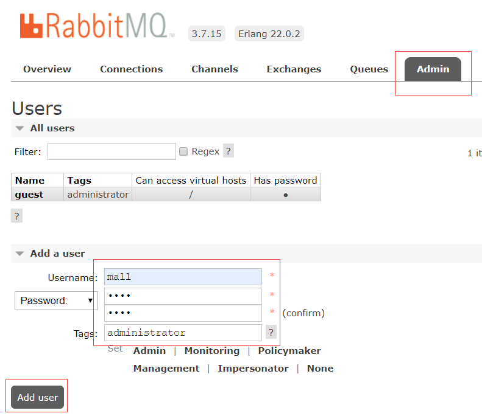
- 创建一个新的虚拟host为：/mall
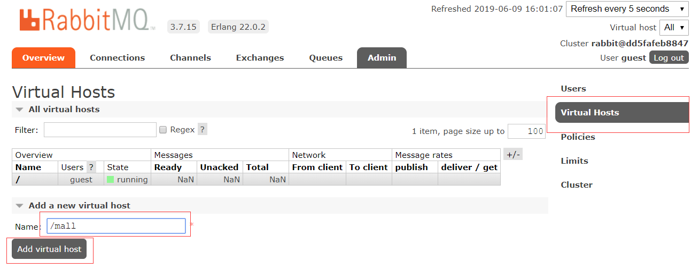
- 点击mall用户进入用户配置页面
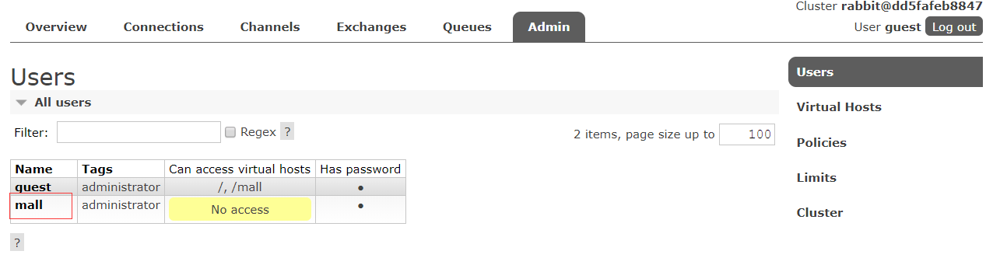
- 给mall用户配置该虚拟host的权限
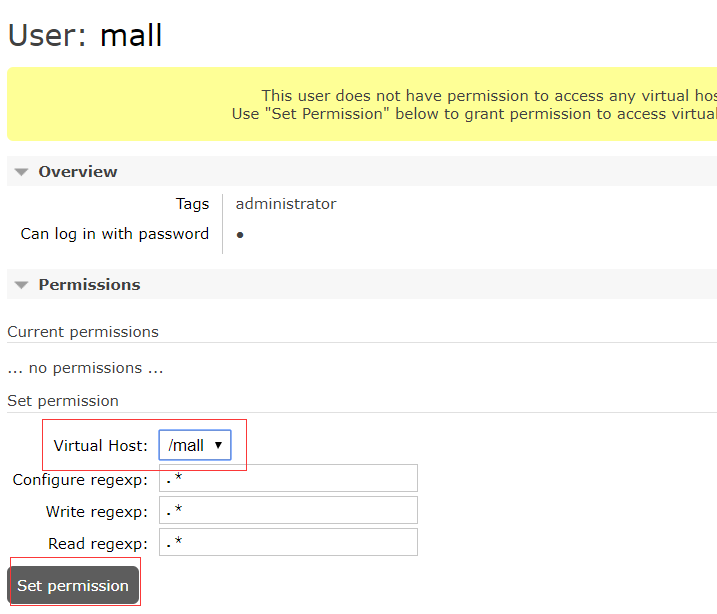

## Elasticsearch安装
- 下载elasticsearch6.4.0的docker镜像：
```shell
docker pull elasticsearch:6.4.0
```
- 修改虚拟内存区域大小，否则会因为过小而无法启动:
```shell
sysctl -w vm.max_map_count=262144
```
- 使用docker命令启动：
```shell
  docker run -p 9200:9200 -p 9300:9300 --name elasticsearch \
  -e "discovery.type=single-node" \
  -e "cluster.name=elasticsearch" \
  -v /mydata/elasticsearch/plugins:/usr/share/elasticsearch/plugins \
  -v /mydata/elasticsearch/data:/usr/share/elasticsearch/data \
  -d elasticsearch:6.4.0
```
- 启动时会发现/usr/share/elasticsearch/data目录没有访问权限，只需要修改/mydata/elasticsearch/data目录的权限，再重新启动。
```shell
chmod 777 /mydata/elasticsearch/data/
```
- 安装中文分词器IKAnalyzer，并重新启动：
```shell
docker exec -it elasticsearch /bin/bash
#此命令需要在容器中运行
elasticsearch-plugin install https://github.com/medcl/elasticsearch-analysis-ik/releases/download/v6.4.0/elasticsearch-analysis-ik-6.4.0.zip
docker restart elasticsearch
```
- 开启防火墙：
```shell
firewall-cmd --zone=public --add-port=9200/tcp --permanent
firewall-cmd --reload
```
- 访问会返回版本信息：[http://192.168.3.101:9200/](http://192.168.3.101:9200/)


## kibana安装
- 下载kibana6.4.0的docker镜像：
```shell
docker pull kibana:6.4.0
```
- 使用docker命令启动：
```shell
  docker run --name kibana -p 5601:5601 \
  --link elasticsearch:es \
  -e "elasticsearch.hosts=http://es:9200" \
  -d kibana:6.4.0
```
- 开启防火墙：
```shell
firewall-cmd --zone=public --add-port=5601/tcp --permanent
firewall-cmd --reload
```
- 访问地址进行测试：[http://192.168.3.101:5601](http://192.168.3.101:5601)
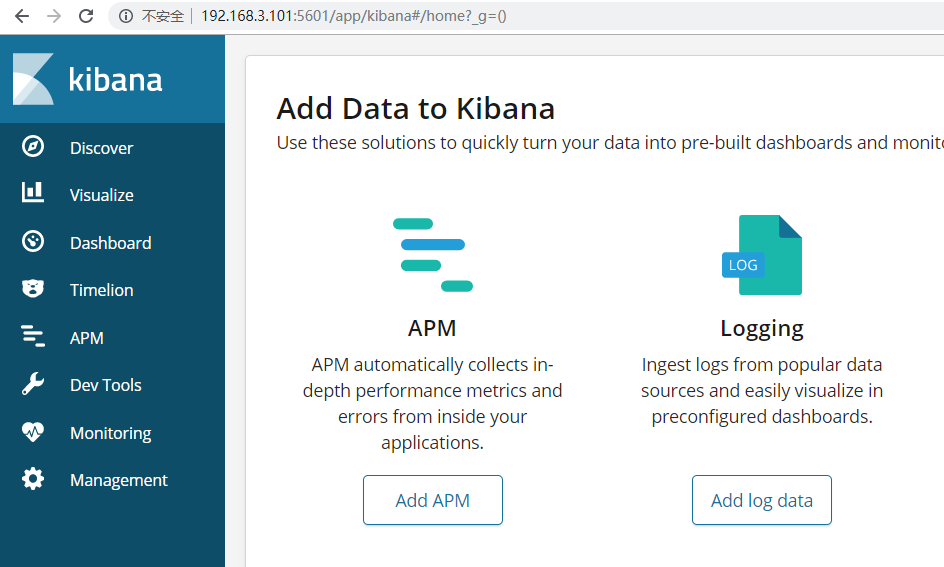

## Mongodb安装
- 下载mongo3.2的docker镜像：
```shell
docker pull mongo:3.2
```
- 使用docker命令启动：
```shell
  docker run -p 27017:27017 --name mongo \
  -v /mydata/mongo/db:/data/db \
  -d mongo:3.2
```

## Docker全部环境安装完成
- 所有下载镜像文件：
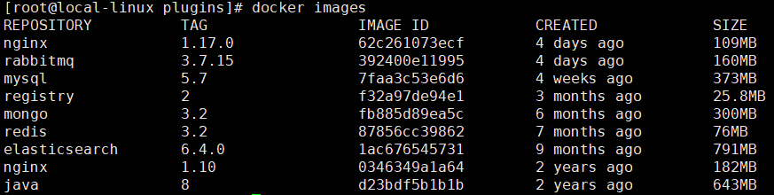
- 所有运行在容器里面的应用：
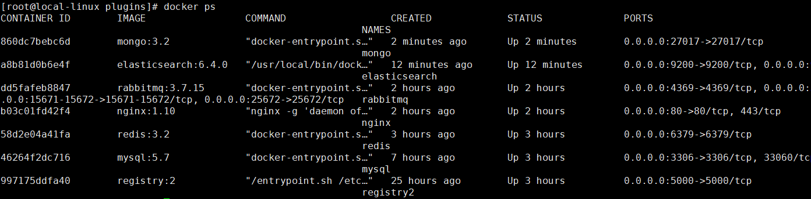

## SpringBoot应用部署

### 构建所有Docker镜像并上传
- 打开pom.xml中使用docker插件的注释：
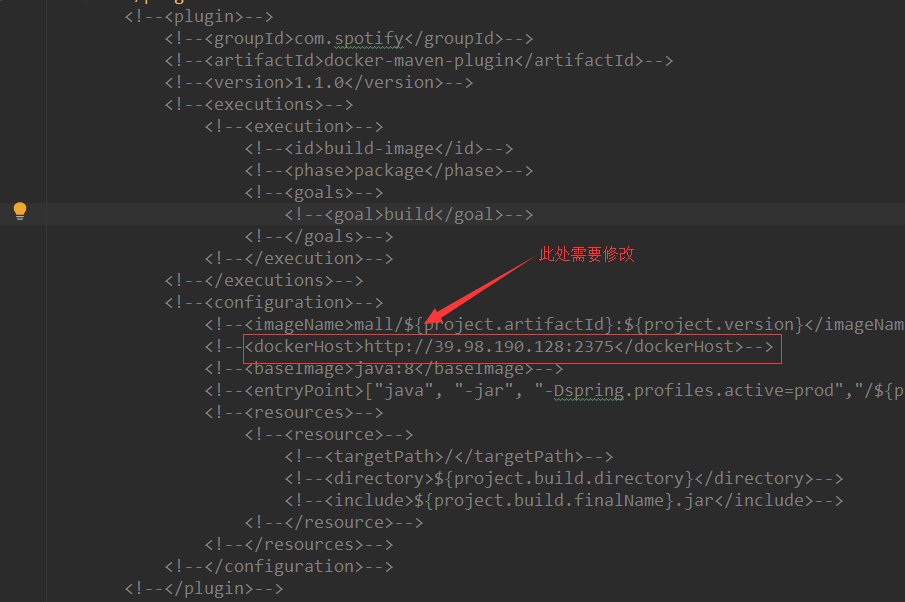
- 修改dockerHost为你自己的docker服务器地址：
- 构建镜像并上传：  
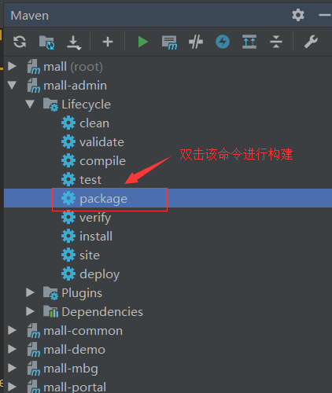
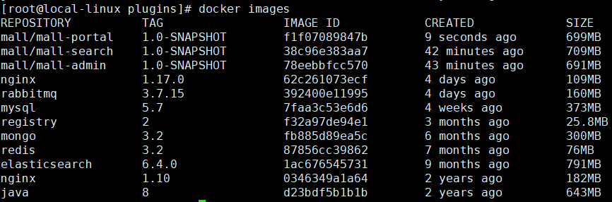

### 部署mall-admin
```shell
docker run -p 8080:8080 --name mall-admin \
--link mysql:db \
-v /etc/localtime:/etc/localtime \
-v /mydata/app/admin/logs:/var/logs \
-d mall/mall-admin:1.0-SNAPSHOT
```
`注意`：CenterOS7.2版本需要加入此行，否则容器时区和宿主机无法同步
```shell
-v /etc/timezone:/etc/timezone \
```
### 部署mall-search
```shell
docker run -p 8081:8081 --name mall-search \
--link elasticsearch:es \
--link mysql:db \
-v /etc/localtime:/etc/localtime \
-v /mydata/app/search/logs:/var/logs \
-d mall/mall-search:1.0-SNAPSHOT
```
### 部署mall-port
```shell
docker run -p 8085:8085 --name mall-portal \
--link mysql:db \
--link redis:redis \
--link mongo:mongo \
--link rabbitmq:rabbit \
-v /etc/localtime:/etc/localtime \
-v /mydata/app/portal/logs:/var/logs \
-d mall/mall-portal:1.0-SNAPSHOT
```

### 开启防火墙
```shell
firewall-cmd --zone=public --add-port=8080/tcp --permanent
firewall-cmd --zone=public --add-port=8081/tcp --permanent
firewall-cmd --zone=public --add-port=8085/tcp --permanent
firewall-cmd --reload
```
### 访问接口进行测试

- mall-admin的api接口文档地址：http://192.168.3.101:8080/swagger-ui.html
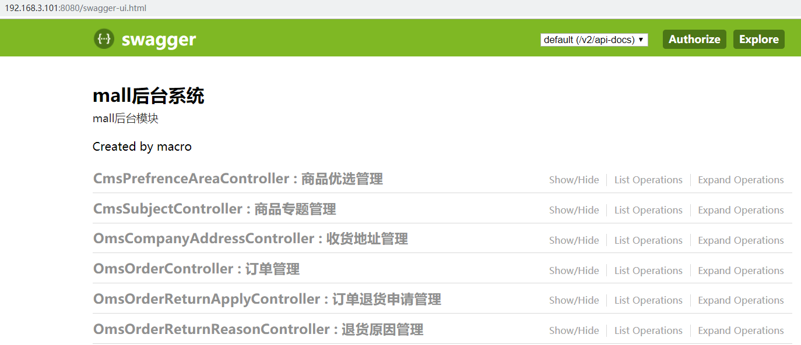
- mall-search的api接口文档地址：http://192.168.3.101:8081/swagger-ui.html
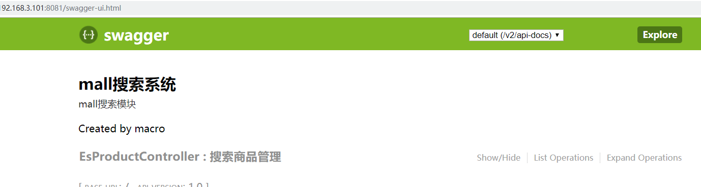
- mall-portal的api接口文档地址：http://192.168.3.101:8085/swagger-ui.html
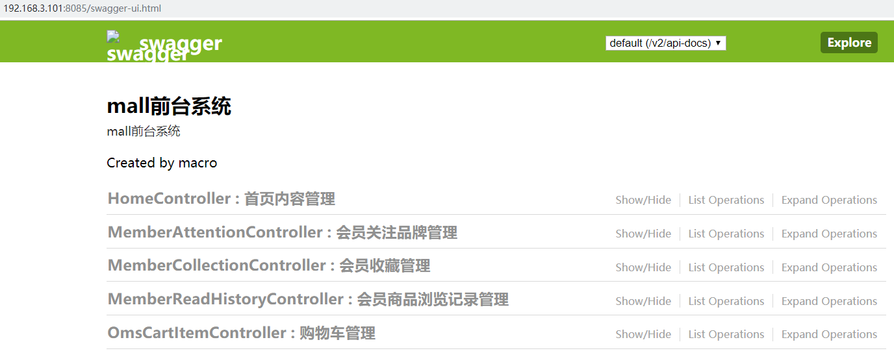

## 公众号


