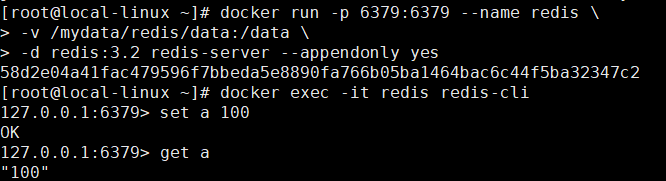
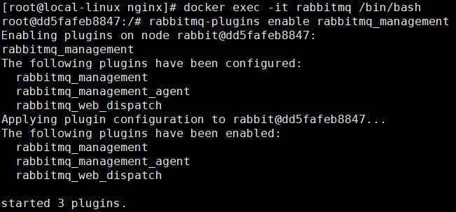
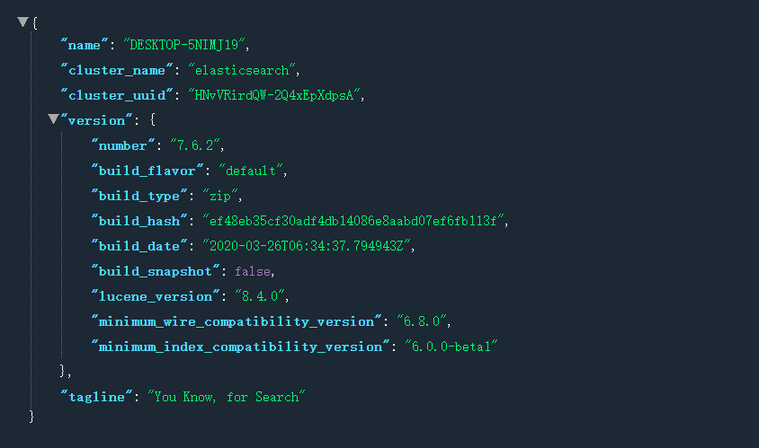
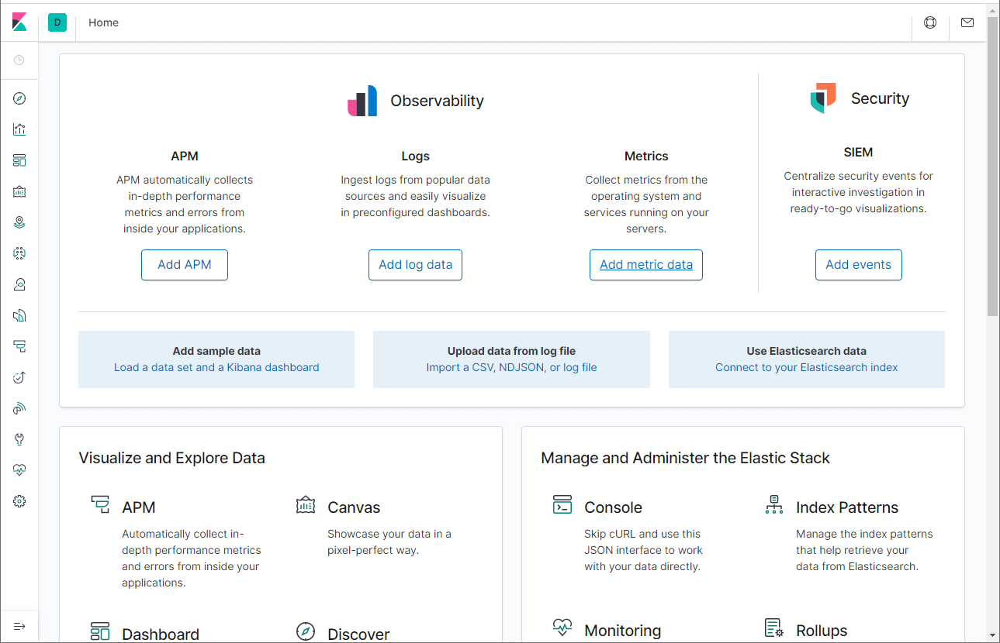
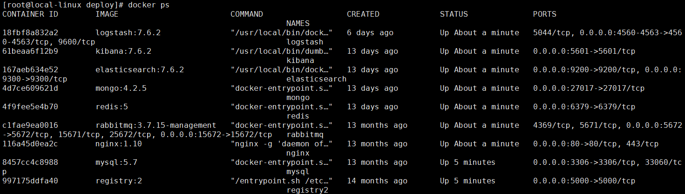
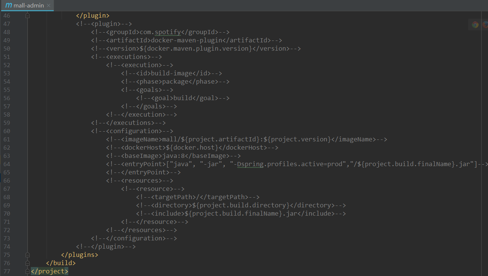
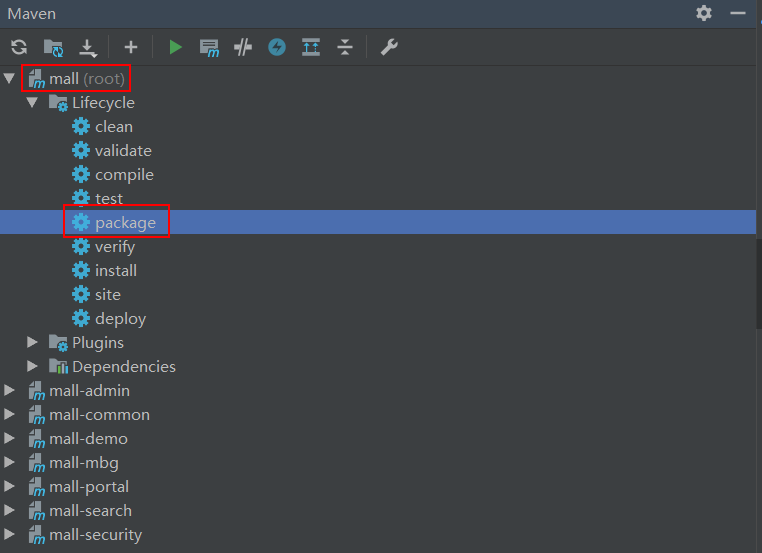
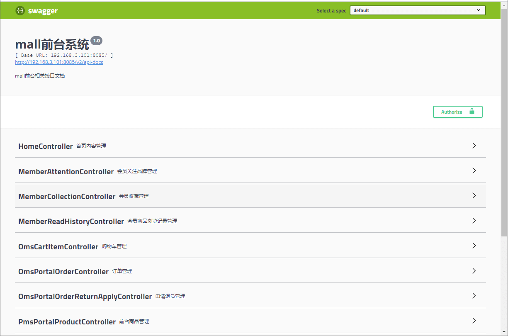

学习不走弯路，[关注公众号](#公众号) 回复「学习路线」，获取mall项目专属学习路线！

# mall在Linux环境下的部署（基于Docker容器）

> 本文主要以图文的形式讲解mall在Linux环境下的部署，涉及在Docker容器中安装MySQL、Redis、Nginx、RabbitMQ、MongoDB、Elasticsearch、Logstash、Kibana，以及SpringBoot应用部署，基于`CenterOS7.6`。

## Docker环境安装

- 安装`yum-utils`：

```bash
yum install -y yum-utils device-mapper-persistent-data lvm2
```

- 为yum源添加docker仓库位置：

```bash
yum-config-manager --add-repo https://download.docker.com/linux/centos/docker-ce.repo
```

- 安装docker：

```bash
yum install docker-ce
```

- 启动docker：

```bash
systemctl start docker
```

## MySQL安装

- 下载MySQL`5.7`的docker镜像：

```bash
docker pull mysql:5.7
```

- 使用如下命令启动MySQL服务：

```bash
docker run -p 3306:3306 --name mysql \
-v /mydata/mysql/log:/var/log/mysql \
-v /mydata/mysql/data:/var/lib/mysql \
-v /mydata/mysql/conf:/etc/mysql \
-e MYSQL_ROOT_PASSWORD=root  \
-d mysql:5.7
```

- 参数说明
  - -p 3306:3306：将容器的3306端口映射到主机的3306端口
  - -v /mydata/mysql/conf:/etc/mysql：将配置文件夹挂在到主机
  - -v /mydata/mysql/log:/var/log/mysql：将日志文件夹挂载到主机
  - -v /mydata/mysql/data:/var/lib/mysql/：将数据文件夹挂载到主机
  - -e MYSQL_ROOT_PASSWORD=root：初始化root用户的密码
  
- 进入运行MySQL的docker容器：

```bash
docker exec -it mysql /bin/bash
```

- 使用MySQL命令打开客户端：

```bash
mysql -uroot -proot --default-character-set=utf8
```

- 创建mall数据库：

```sql
create database mall character set utf8
```

- 安装上传下载插件，并将`document/sql/mall.sql`上传到Linux服务器上：

```bash
yum -y install lrzsz
```

- 将`mall.sql`文件拷贝到mysql容器的`/`目录下：

```bash
docker cp /mydata/mall.sql mysql:/
```

- 将sql文件导入到数据库：

```bash
use mall;
source /mall.sql;
```

- 创建一个`reader:123456`帐号并修改权限，使得任何ip都能访问：

```sql
grant all privileges on *.* to 'reader' @'%' identified by '123456';
```

## Redis安装

- 下载Redis`5.0`的docker镜像：

```bash
docker pull redis:5
```

- 使用如下命令启动Redis服务：

```bash
docker run -p 6379:6379 --name redis \
-v /mydata/redis/data:/data \
-d redis:5 redis-server --appendonly yes
```

- 进入Redis容器使用`redis-cli`命令进行连接：

```bash
docker exec -it redis redis-cli
```



## Nginx安装

- 下载Nginx`1.10`的docker镜像：

```bash
docker pull nginx:1.10
```

- 先运行一次容器（为了拷贝配置文件）：

```bash
docker run -p 80:80 --name nginx \
-v /mydata/nginx/html:/usr/share/nginx/html \
-v /mydata/nginx/logs:/var/log/nginx  \
-d nginx:1.10
```

- 将容器内的配置文件拷贝到指定目录：

```bash
docker container cp nginx:/etc/nginx /mydata/nginx/
```

- 修改文件名称：

```bash
mv nginx conf
```

- 终止并删除容器：

```bash
docker stop nginx
docker rm nginx
```

- 使用如下命令启动Nginx服务：

```bash
docker run -p 80:80 --name nginx \
-v /mydata/nginx/html:/usr/share/nginx/html \
-v /mydata/nginx/logs:/var/log/nginx  \
-v /mydata/nginx/conf:/etc/nginx \
-d nginx:1.10
```

## RabbitMQ安装

- 下载rabbitmq`3.7.15`的docker镜像：

```bash
docker pull rabbitmq:3.7.15
```

- 使用如下命令启动RabbitMQ服务：

```bash
docker run -p 5672:5672 -p 15672:15672 --name rabbitmq \
-d rabbitmq:3.7.15
```

- 进入容器并开启管理功能：

```bash
docker exec -it rabbitmq /bin/bash
rabbitmq-plugins enable rabbitmq_management
```



- 开启防火墙：

```bash
firewall-cmd --zone=public --add-port=15672/tcp --permanent
firewall-cmd --reload
```
- 访问地址查看是否安装成功：http://192.168.3.101:15672


- 输入账号密码并登录：guest guest

- 创建帐号并设置其角色为管理员：mall mall


- 创建一个新的虚拟host为：/mall


- 点击mall用户进入用户配置页面


- 给mall用户配置该虚拟host的权限


## Elasticsearch安装

- 下载Elasticsearch`7.6.2`的docker镜像：

```bash
docker pull elasticsearch:7.6.2
```

- 修改虚拟内存区域大小，否则会因为过小而无法启动:

```bash
sysctl -w vm.max_map_count=262144
```

- 使用如下命令启动Elasticsearch服务：

```bash
docker run -p 9200:9200 -p 9300:9300 --name elasticsearch \
-e "discovery.type=single-node" \
-e "cluster.name=elasticsearch" \
-v /mydata/elasticsearch/plugins:/usr/share/elasticsearch/plugins \
-v /mydata/elasticsearch/data:/usr/share/elasticsearch/data \
-d elasticsearch:7.6.2
```

- 启动时会发现`/usr/share/elasticsearch/data`目录没有访问权限，只需要修改`/mydata/elasticsearch/data`目录的权限，再重新启动即可；

```bash
chmod 777 /mydata/elasticsearch/data/
```

- 安装中文分词器IKAnalyzer，并重新启动：

```bash
docker exec -it elasticsearch /bin/bash
#此命令需要在容器中运行
elasticsearch-plugin install https://github.com/medcl/elasticsearch-analysis-ik/releases/download/v7.6.2/elasticsearch-analysis-ik-7.6.2.zip
docker restart elasticsearch
```

- 开启防火墙：

```bash
firewall-cmd --zone=public --add-port=9200/tcp --permanent
firewall-cmd --reload
```

- 访问会返回版本信息：http://192.168.3.101:9200



## Logstash安装

- 下载Logstash`7.6.2`的docker镜像：

```bash
docker pull logstash:7.6.2
```

- 修改Logstash的配置文件`logstash.conf`中`output`节点下的Elasticsearch连接地址为`es:9200`，配置文件地址：https://github.com/macrozheng/mall/blob/master/document/elk/logstash.conf

```
output {
  elasticsearch {
    hosts => "es:9200"
    index => "mall-%{type}-%{+YYYY.MM.dd}"
  }
}
```

- 创建`/mydata/logstash`目录，并将Logstash的配置文件`logstash.conf`拷贝到该目录；

```bash
mkdir /mydata/logstash
```

- 使用如下命令启动Logstash服务；

```bash
docker run --name logstash -p 4560:4560 -p 4561:4561 -p 4562:4562 -p 4563:4563 \
--link elasticsearch:es \
-v /mydata/logstash/logstash.conf:/usr/share/logstash/pipeline/logstash.conf \
-d logstash:7.6.2
```

- 进入容器内部，安装`json_lines`插件。

```bash
logstash-plugin install logstash-codec-json_lines
```

## Kibana安装

- 下载Kibana`7.6.2`的docker镜像：

```bash
docker pull kibana:7.6.2
```

- 使用如下命令启动Kibana服务：

```bash
docker run --name kibana -p 5601:5601 \
--link elasticsearch:es \
-e "elasticsearch.hosts=http://es:9200" \
-d kibana:7.6.2
```

- 开启防火墙：

```bash
firewall-cmd --zone=public --add-port=5601/tcp --permanent
firewall-cmd --reload
```
- 访问地址进行测试：http://192.168.3.101:5601



## MongoDB安装

- 下载MongoDB`4.2.5`的docker镜像：

```bash
docker pull mongo:4.2.5
```

- 使用docker命令启动：

```bash
docker run -p 27017:27017 --name mongo \
-v /mydata/mongo/db:/data/db \
-d mongo:4.2.5
```

## Docker全部环境安装完成

- 所有下载镜像文件：

```bash
REPOSITORY            TAG                 IMAGE ID            CREATED             SIZE
redis                 5                   071538dbbd71        2 weeks ago         98.3MB
mongo                 4.2.5               fddee5bccba3        3 months ago        388MB
logstash              7.6.2               fa5b3b1e9757        4 months ago        813MB
kibana                7.6.2               f70986bc5191        4 months ago        1.01GB
elasticsearch         7.6.2               f29a1ee41030        4 months ago        791MB
rabbitmq              3.7.15-management   6ffc11daa8d0        13 months ago       186MB
mysql                 5.7                 7faa3c53e6d6        15 months ago       373MB
registry              2                   f32a97de94e1        17 months ago       25.8MB
nginx                 1.10                0346349a1a64        3 years ago         182MB
java                  8                   d23bdf5b1b1b        3 years ago         643MB
```

- 所有运行在容器里面的应用：



## SpringBoot应用部署

### 构建所有Docker镜像并上传

- 修改项目根目录下的`pom.xml`中的`docker.host`属性：

```xml
<properties>
    <docker.host>http://192.168.3.101:2375</docker.host>
</properties>
```

- 如果项目根目录的`pom.mxl`中`docker-maven-plugin`的`<executions>`节点被注释掉了就打开注释，使项目在打包时直接构建Docker镜像；



- 直接双击根项目`mall`的`package`命令可以一次性打包所有应用的Docker镜像；



```bash
REPOSITORY            TAG                 IMAGE ID            CREATED              SIZE
mall/mall-portal      1.0-SNAPSHOT        70e0f76416a0        21 seconds ago       705MB
mall/mall-search      1.0-SNAPSHOT        f3290bd1d0c7        41 seconds ago       725MB
mall/mall-admin       1.0-SNAPSHOT        26557b93a106        About a minute ago   705MB
```

### 部署mall-admin

```bash
docker run -p 8080:8080 --name mall-admin \
--link mysql:db \
--link redis:redis \
-v /etc/localtime:/etc/localtime \
-v /mydata/app/admin/logs:/var/logs \
-d mall/mall-admin:1.0-SNAPSHOT
```

`注意`：如果想使用Logstash收集日志的话，需要将应用容器连接到Logstsh，添加如下配置即可；

```bash
--link logstash:logstash \
```

### 部署mall-search

```bash
docker run -p 8081:8081 --name mall-search \
--link elasticsearch:es \
--link mysql:db \
-v /etc/localtime:/etc/localtime \
-v /mydata/app/search/logs:/var/logs \
-d mall/mall-search:1.0-SNAPSHOT
```

### 部署mall-port

```bash
docker run -p 8085:8085 --name mall-portal \
--link mysql:db \
--link redis:redis \
--link mongo:mongo \
--link rabbitmq:rabbit \
-v /etc/localtime:/etc/localtime \
-v /mydata/app/portal/logs:/var/logs \
-d mall/mall-portal:1.0-SNAPSHOT
```

### 开启防火墙

```bash
firewall-cmd --zone=public --add-port=8080/tcp --permanent
firewall-cmd --zone=public --add-port=8081/tcp --permanent
firewall-cmd --zone=public --add-port=8085/tcp --permanent
firewall-cmd --reload
```

### 访问接口进行测试

- mall-admin的api接口文档地址：http://192.168.3.101:8080/swagger-ui.html


- mall-search的api接口文档地址：http://192.168.3.101:8081/swagger-ui.html


- mall-portal的api接口文档地址：http://192.168.3.101:8085/swagger-ui.html



## 公众号


