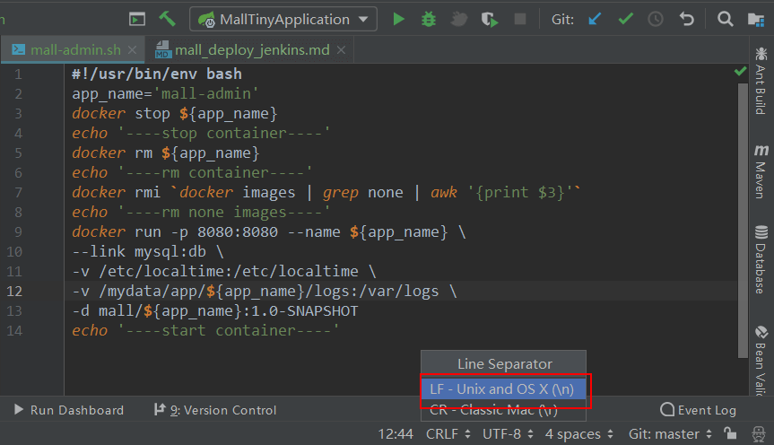
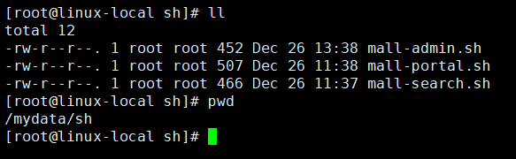
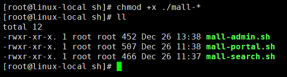
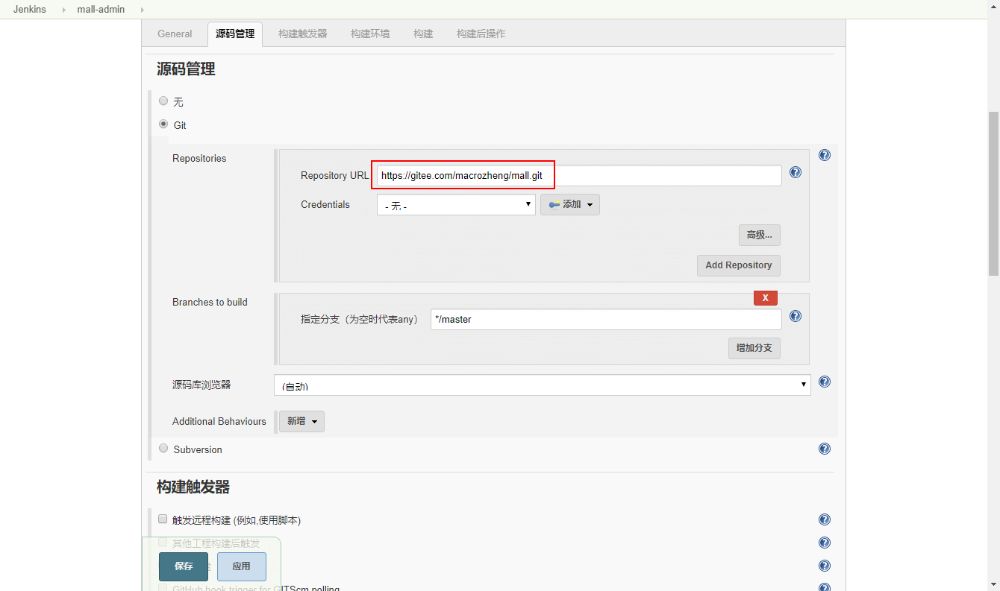
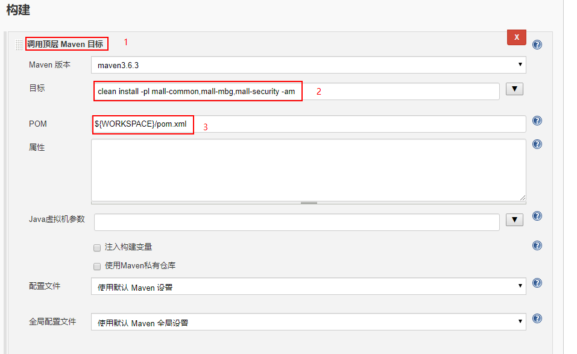
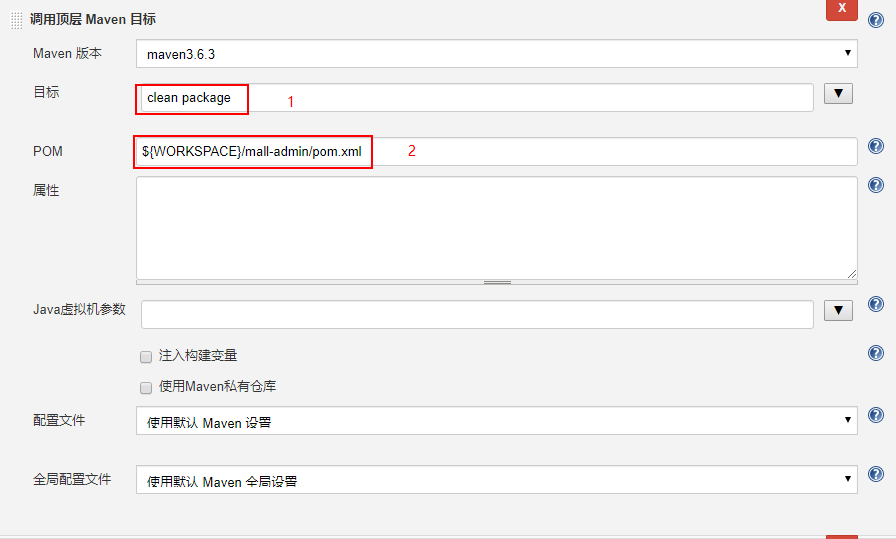
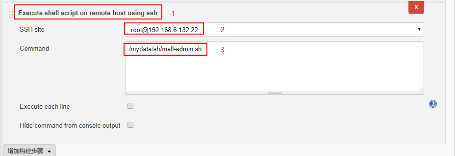
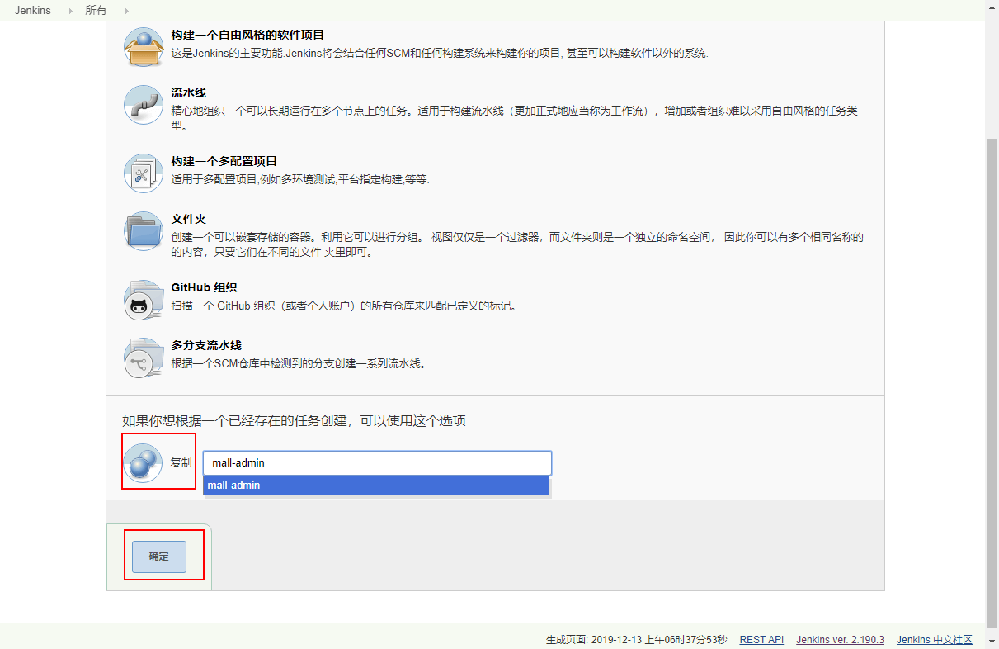
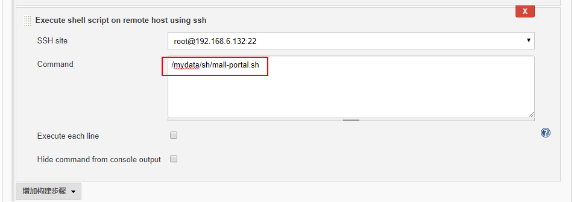
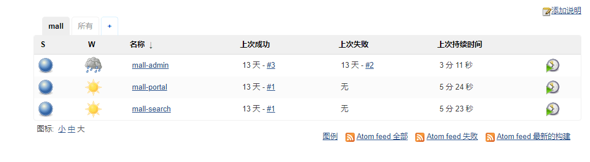

mall项目全套学习教程连载中，[关注公众号](#公众号)第一时间获取。

# mall在Linux环境下的自动化部署（基于Jenkins）

> 本文是`mall`项目的专属Jenkins自动化部署方法。

## Jenkins的基本使用

关于Jenkins的基本使用可以参考：[使用Jenkins一键打包部署SpringBoot应用，就是这么6！](https://mp.weixin.qq.com/s/tQqvgSc9cHBtnqRQSbI4aw)

## 执行脚本准备

> 首先我们先把需要远程执行的脚本准备好。

- 脚本文件都存放在了`mall`项目的`/document/sh`目录下：

- 上传脚本前在IDEA中修改所有脚本文件的换行符格式为`LF`，否则脚本会无法执行；



- 将所有脚本文件上传到指定目录，这里我们上传到`/mydata/sh`目录下；



- 将所有脚本文件都修改为可执行文件:

```bash
chmod +x ./mall-*
```



## Jenkins中创建任务

> 接下来我们将通过在Jenkins中创建任务来实现自动化部署。由于我们的`mall`是个多模块的项目，部署上面和曾经的单模块项目还是有所区别的。

### mall-admin

> 由于各个模块的执行任务的创建都大同小异，下面将详细讲解mall-admin模块任务的创建，其他模块将简略讲解。

- 首先我们选择`构建一个自由风格的软件项目`mall-admin，然后配置其Git仓库地址，这里我直接使用了Gitee上面的地址：



- 之后我们创建一个构建，构建`mall`项目中的依赖模块，否则当构建可运行的服务模块时会因为无法找到这些模块而构建失败；

```bash
# 只install mall-common,mall-mbg,mall-security三个模块
clean install -pl mall-common,mall-mbg,mall-security -am
```

- 依赖项目构建示意图：



- 再创建一个构建，单独构建并打包mall-admin模块：



- 添加一个远程SSH执行任务，去执行mall-admin的运行脚本：



- 点击保存，完成mall-admin的执行任务创建。

### mall-portal

> mall-portal和其他模块与mall-admin创建任务方式基本一致，只需修改构建模块时的pom.xml文件位置和执行脚本位置即可。

- 我们可以直接从mall-admin模块的任务复制一个过来创建：



- 修改第二个构建中的pom.xml文件位置，改为：${WORKSPACE}/mall-portal/pom.xml


- 修改第三个构建中的SSH执行脚本文件位置，改为：/mydata/sh/mall-portal.sh



- 点击保存，完成mall-portal的执行任务创建。

### mall-search

参考mall-admin和mall-portal的创建即可。

### 任务创建完成



## 项目地址

[https://github.com/macrozheng/mall](https://github.com/macrozheng/mall)

## 公众号


