mall项目全套学习教程连载中，[关注公众号](#公众号)第一时间获取。

# mall前端项目的安装与部署

> 本文主要讲解mall前端项目mall-admin-web的在Windows和Linux环境下的安装及部署。

## Windows下的安装及部署

### 下载nodejs并安装
下载地址：https://nodejs.org/dist/v8.9.4/node-v8.9.4-x64.msi

### 下载mall-admin-web的代码
下载地址（github）：https://github.com/macrozheng/mall-admin-web
下载地址（码云）：https://gitee.com/macrozheng/mall-admin-web

### 从IDEA中打开mall-admin-web项目
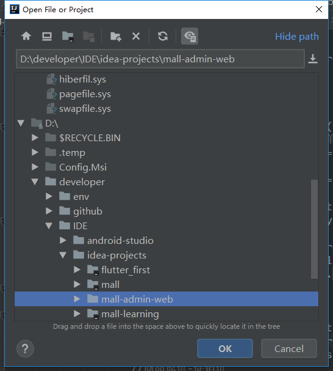
### 打开控制台输入命令安装相关依赖
```shell
npm install
```
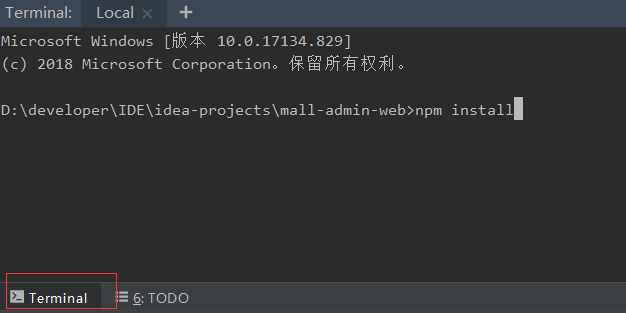

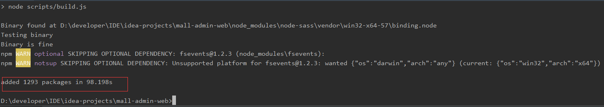

### 已经搭建了mall后台环境的启动

#### 运行本地mall-admin服务
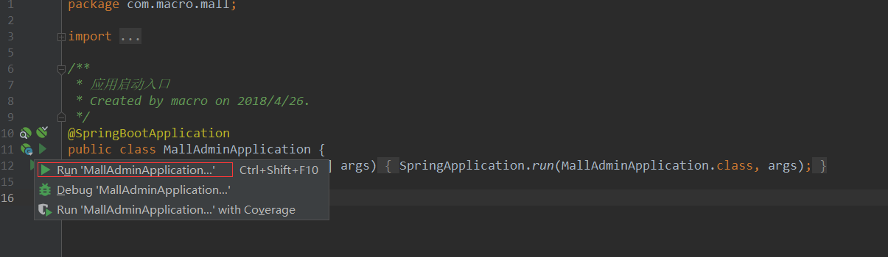

#### 使用命令启动mall-admin-web
- 在IDEA控制台中输入如下命令：
```shell
npm run dev
```
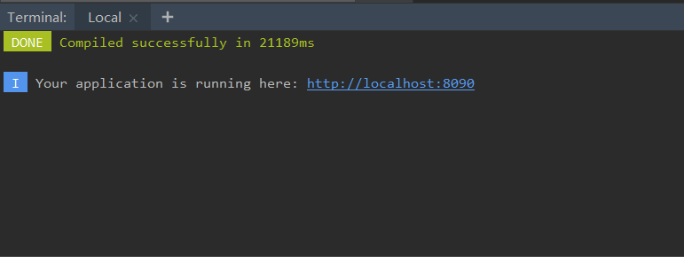
- 访问地址http://localhost:8090 查看效果：
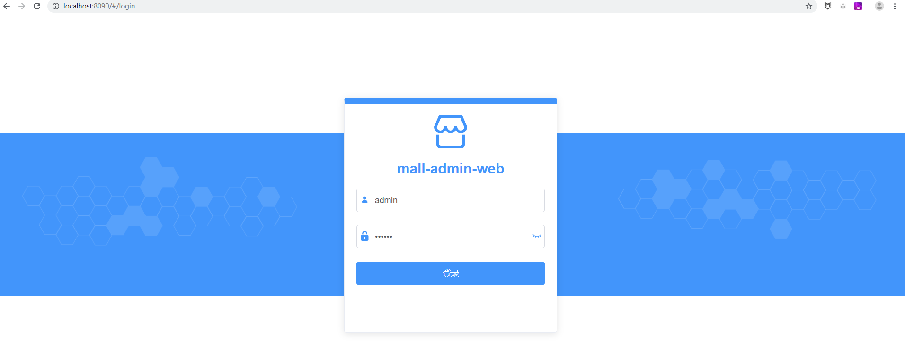
- 进行登录操作，发现调用的是本地接口：
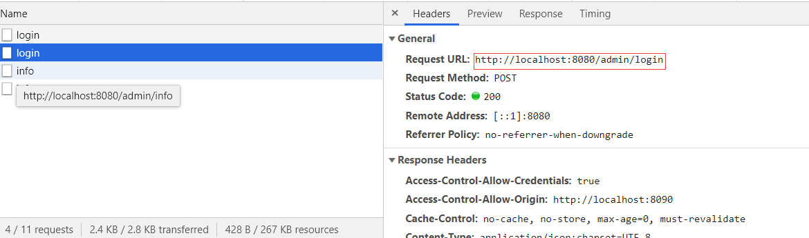

### 未搭建mall后台环境的启动

> 未搭建mall后台的需要使用线上api进行访问，线上API地址：http://120.27.63.9:8080 。

#### 修改dev.env.js文件中的BASE_API为线上地址

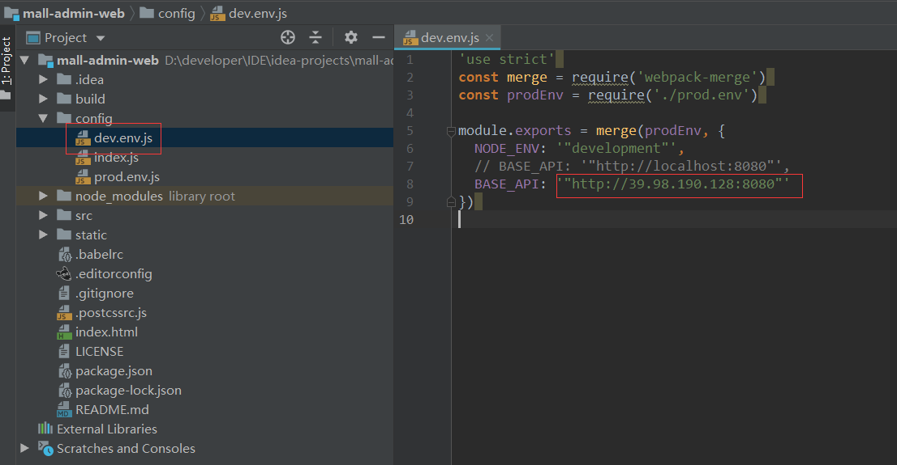

#### 使用命令启动mall-admin-web

- 在IDEA控制台中输入如下命令：
```shell
npm run dev
```

- 访问地址http://localhost:8090 查看效果：

- 进行登录操作，发现调用的是线上接口：


## Linux下的部署

- 修改prod.env.js文件的配置
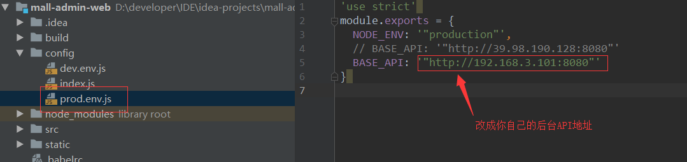
- 使用命令进行打包
```shell
npm run build
```
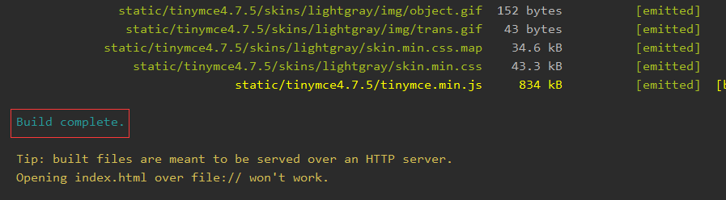
- 打包后的代码位置
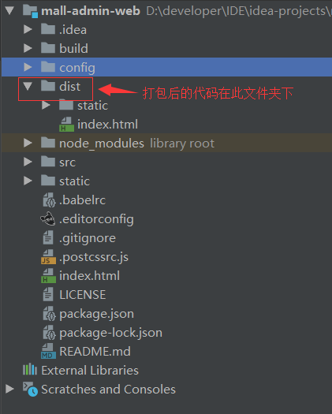

- 将dist目录打包为dist.tar.gz文件
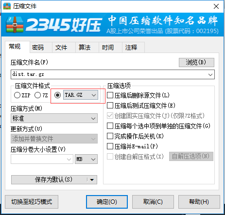
- Linux上nginx的安装可以参考[mall在Linux环境下的部署（基于Docker容器）](https://mp.weixin.qq.com/s/0fVMK107i5bBq8kGQqg8KA)中的nginx部分
- 将dist.tar.gz上传到linux服务器（nginx相关目录）
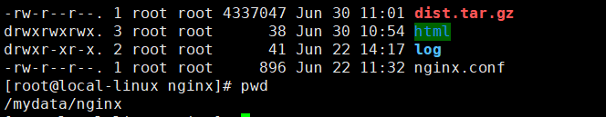
- 使用该命令进行解压操作
```shell
tar -zxvf dist.tar.gz
```
- 删除nginx的html文件夹
```shell
rm -rf html
```
- 移动dist文件夹到html文件夹
```shell
mv dist html
```
- 运行mall-admin服务
```shell
docker start mall-admin
```
- 重启nginx
```shell
docker restart nginx
```
- 访问首页并登录：http://192.168.3.101

- 发现调用的是Linux服务器地址
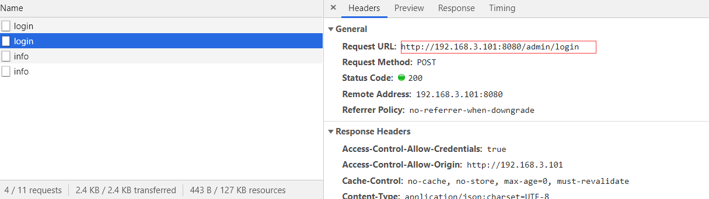

## 项目源码地址

[https://github.com/macrozheng/mall-admin-web](https://github.com/macrozheng/https://github.com/macrozheng/mall-admin-web)

## 公众号


