mall项目全套学习教程连载中，[关注公众号](#公众号)第一时间获取。

# mall在Windows环境下的部署

> 本文主要以图文的形式讲解mall项目所需环境在windows下的安装，主要包括IDEA、Mysql、Redis、Elasticsearch、Mongodb、RabbitMQ、OSS。

## IDEA

1.关于IDEA的安装与使用具体参考[https://github.com/judasn/IntelliJ-IDEA-Tutorial](https://github.com/judasn/IntelliJ-IDEA-Tutorial)

2.搜索插件仓库，安装插件lombok

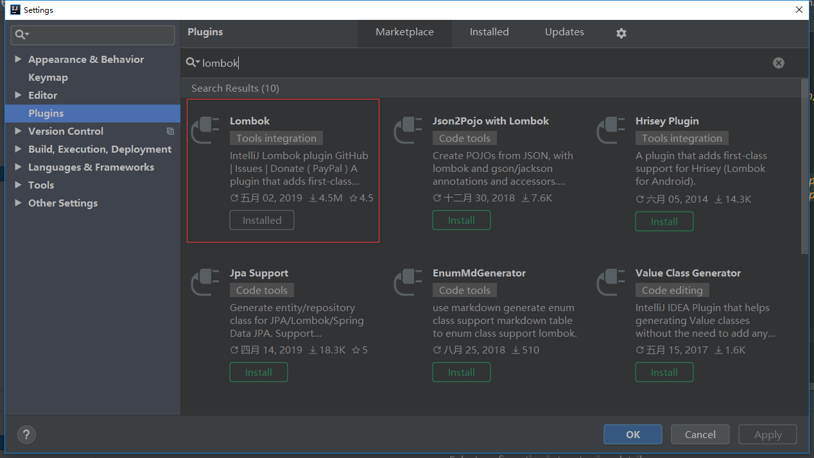
3.将项目下载到本地，然后直接打开

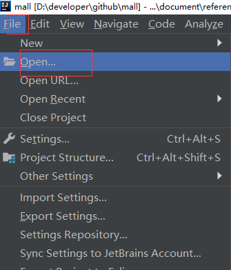

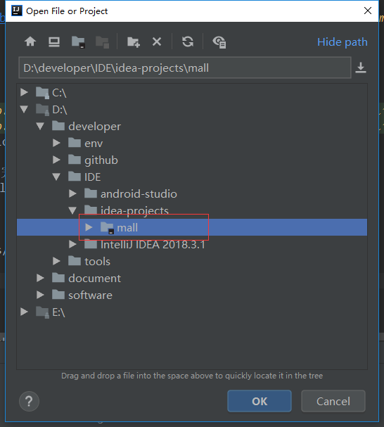

## Mysql

1. 下载并安装mysql5.7版本，下载地址：https://dev.mysql.com/downloads/installer/
2. 设置数据库帐号密码：root root
3. 下载并安装客户端连接工具Navicat,下载地址：http://www.formysql.com/xiazai.html
4. 创建数据库mall
5. 导入document/sql下的mall.sql文件

## Redis

1.下载Redis,下载地址：https://github.com/MicrosoftArchive/redis/releases

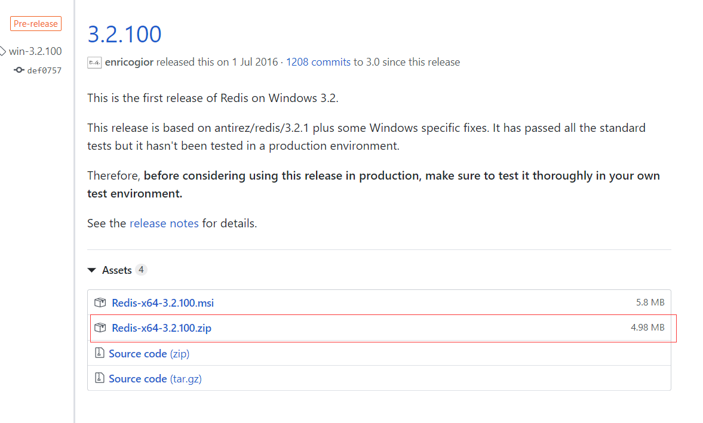

2.下载完后解压到指定目录

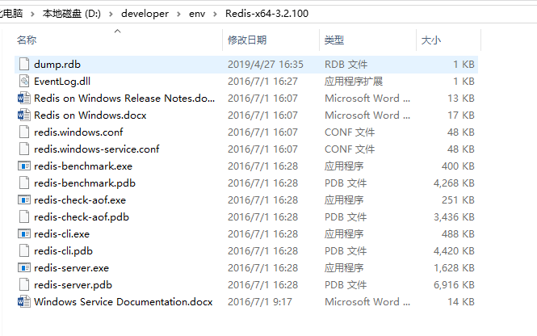

3.在当前地址栏输入cmd后，执行redis的启动命令：redis-server.exe redis.windows.conf

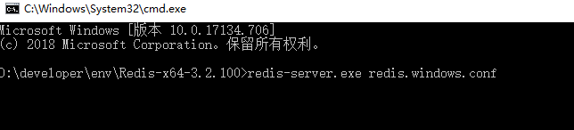

## Elasticsearch

1.下载Elasticsearch6.2.2的zip包，并解压到指定目录，下载地址：[https://www.elastic.co/cn/downloads/past-releases/elasticsearch-6-2-2](https://www.elastic.co/cn/downloads/past-releases/elasticsearch-6-2-2)


2.安装中文分词插件，在elasticsearch-6.2.2\bin目录下执行以下命令：elasticsearch-plugin install https://github.com/medcl/elasticsearch-analysis-ik/releases/download/v6.2.2/elasticsearch-analysis-ik-6.2.2.zip

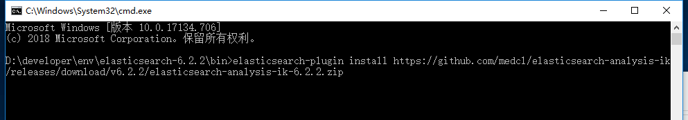

3.运行bin目录下的elasticsearch.bat启动Elasticsearch

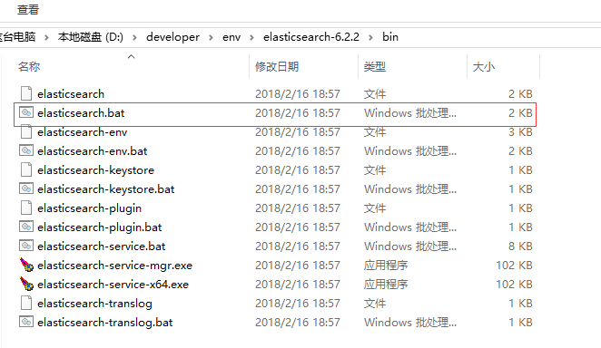

4.下载Kibana,作为访问Elasticsearch的客户端，请下载6.2.2版本的zip包，并解压到指定目录，下载地址：[https://artifacts.elastic.co/downloads/kibana/kibana-6.2.2-windows-x86_64.zip](https://artifacts.elastic.co/downloads/kibana/kibana-6.2.2-windows-x86_64.zip)


5.运行bin目录下的kibana.bat，启动Kibana的用户界面


6.访问[http://localhost:5601](http://localhost:5601) 即可打开Kibana的用户界面


## Mongodb

1.下载Mongodb安装包，下载地址：[https://fastdl.mongodb.org/win32/mongodb-win32-x86_64-2008plus-ssl-3.2.21-signed.msi](https://fastdl.mongodb.org/win32/mongodb-win32-x86_64-2008plus-ssl-3.2.21-signed.msi)

2.选择安装路径进行安装

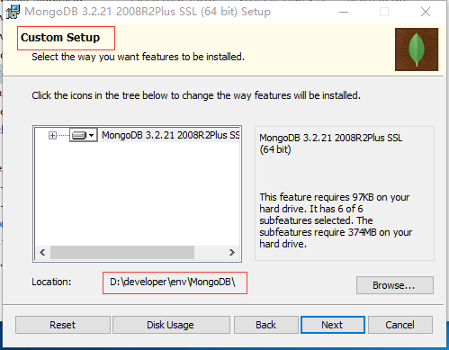

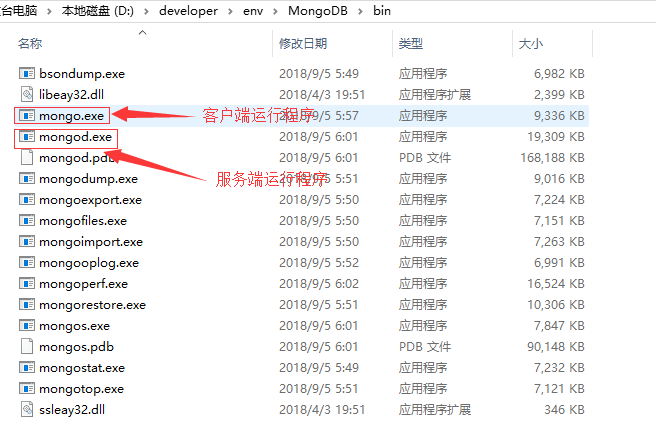

3.在安装路径下创建data\\db和data\\log两个文件夹

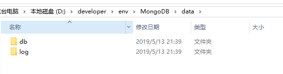

4.在安装路径下创建mongod.cfg配置文件
```
systemLog:
    destination: file
    path: D:\developer\env\MongoDB\data\log\mongod.log
storage:
    dbPath: D:\developer\env\MongoDB\data\db
```

5.安装为服务（运行命令需要用管理员权限）
```
D:\developer\env\MongoDB\bin\mongod.exe --config "D:\developer\env\MongoDB\mongod.cfg" --install
```
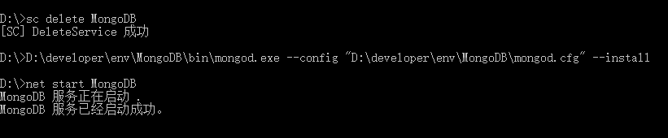

6.服务相关命令
```
启动服务：net start MongoDB
关闭服务：net stop MongoDB
移除服务：D:\developer\env\MongoDB\bin\mongod.exe --remove
```

7.下载客户端程序：[https://download.robomongo.org/1.2.1/windows/robo3t-1.2.1-windows-x86_64-3e50a65.zip](https://download.robomongo.org/1.2.1/windows/robo3t-1.2.1-windows-x86_64-3e50a65.zip)

8.解压到指定目录，打开robo3t.exe并连接到localhost:27017

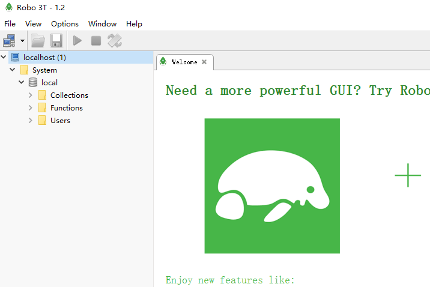

## RabbitMQ

1.安装Erlang，下载地址：[http://erlang.org/download/otp_win64_21.3.exe](http://erlang.org/download/otp_win64_21.3.exe)

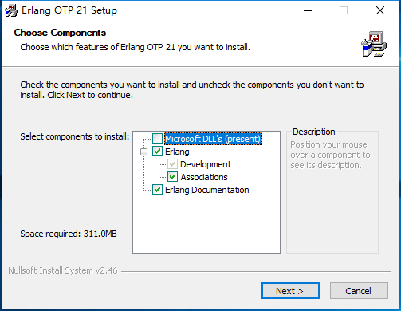

2.安装RabbitMQ，下载地址：[https://dl.bintray.com/rabbitmq/all/rabbitmq-server/3.7.14/rabbitmq-server-3.7.14.exe](https://dl.bintray.com/rabbitmq/all/rabbitmq-server/3.7.14/rabbitmq-server-3.7.14.exe)

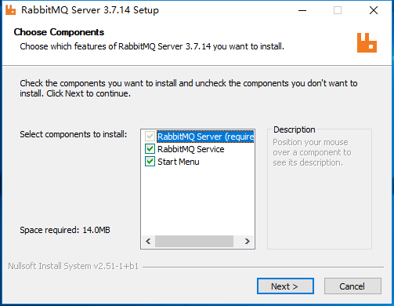

3.安装完成后，进入RabbitMQ安装目录下的sbin目录

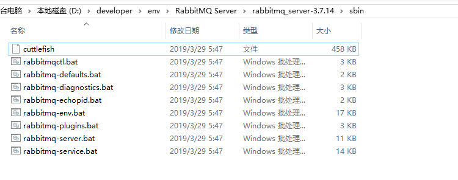

4.在地址栏输入cmd并回车启动命令行，然后输入以下命令启动管理功能：
```
rabbitmq-plugins enable rabbitmq_management
```
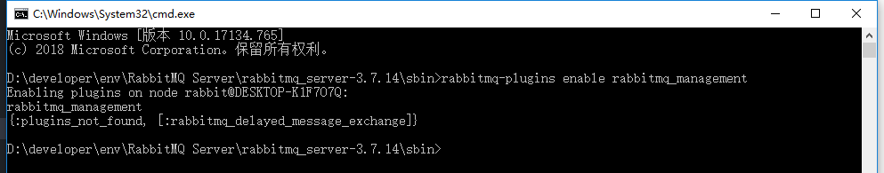

5.访问地址查看是否安装成功：[http://localhost:15672/](http://localhost:15672/)

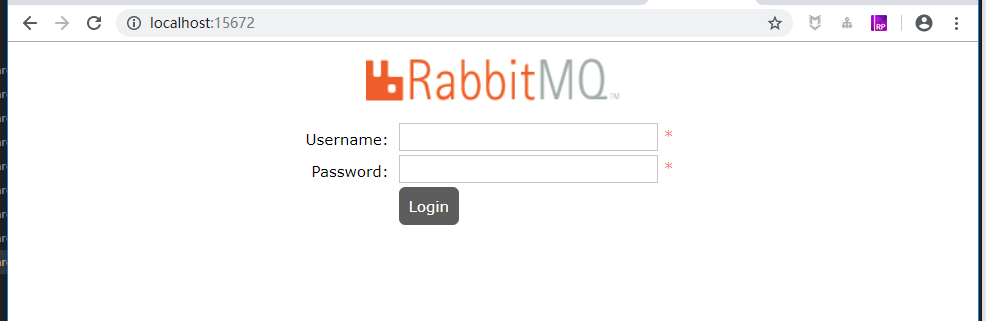

6.输入账号密码并登录：guest guest

7.创建帐号并设置其角色为管理员：mall mall


8.创建一个新的虚拟host为：/mall


9.点击mall用户进入用户配置页面

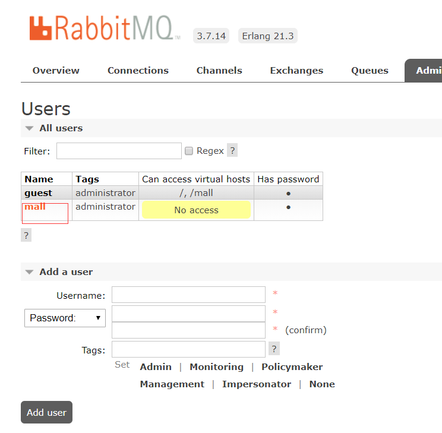

10.给mall用户配置该虚拟host的权限


11.至此，RabbitMQ的安装和配置完成。

## OSS

### 开通OSS服务

- 登录阿里云官网；
- 将鼠标移至产品标签页，单击对象存储 OSS，打开OSS 产品详情页面；
- 在OSS产品详情页，单击立即开通。

### 创建存储空间

- 点击网页右上角控制台按钮进入控制台


- 选择我的云产品中的对象存储OSS


- 点击左侧存储空间的加号新建存储空间


- 新建存储空间并设置读写权限为公共读


### 跨域资源共享（CORS）的设置

- 选择一个存储空间，打开其基础设置

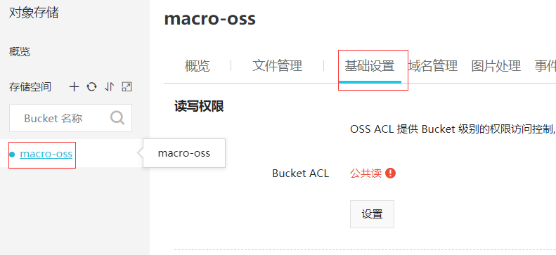

- 点击跨越设置的设置按钮


- 点击创建规则


- 进行跨域规则设置

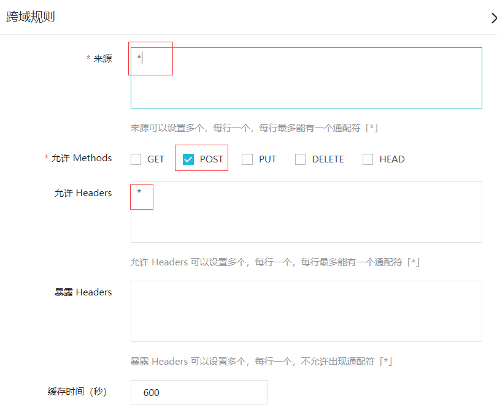

## mall-admin

- 启动项目：直接运行com.macro.mall.MallAdminApplication的main方法即可
- 接口文档地址：[http://localhost:8080/swagger-ui.html](http://localhost:8080/swagger-ui.html)

## mall-search

- 启动项目：直接运行com.macro.mall.search.MallSearchApplication的main方法即可
- 接口文档地址：[http://localhost:8081/swagger-ui.html](http://localhost:8081/swagger-ui.html)
- 使用前需要先调用接口导入数据；[http://localhost:8081/esProduct/importAll](http://localhost:8081/esProduct/importAll)
- 如出现无法启动的问题，可以先删除Elasticsearch里面的数据再启动

## mall-portal

- 启动mall-portal项目：直接运行com.macro.mall.portal.MallPortalApplication的main方法即可
- 接口文档地址：[http://localhost:8085/swagger-ui.html](http://localhost:8085/swagger-ui.html)

## 公众号


