学习不走弯路，[关注公众号](#公众号) 回复「学习路线」，获取mall项目专属学习路线！

# mall在Windows环境下的部署

> 本文主要以图文的形式讲解mall项目所需环境在windows下的安装，主要包括IDEA、Mysql、Redis、Mongodb、RabbitMQ、Elasticsearch、Logstash、Kibana、OSS。

## IDEA

- 关于IDEA的安装与使用请参考：https://github.com/judasn/IntelliJ-IDEA-Tutorial

- 搜索插件仓库，安装插件`Lombok`；

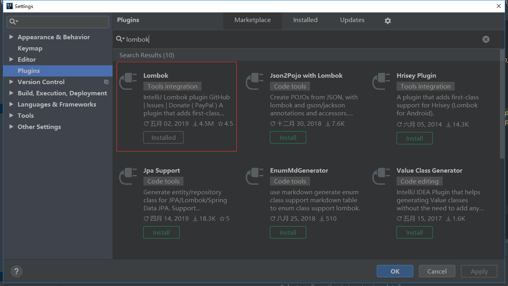

- 将项目下载到本地，然后直接打开。


## Mysql

- 下载并安装mysql`5.7`版本，下载地址：https://dev.mysql.com/downloads/installer/
- 设置数据库帐号密码：root root
- 下载并安装客户端连接工具Navicat,下载地址：http://www.formysql.com/xiazai.html
- 创建数据库`mall`
- 导入document/sql下的`mall.sql`文件

## Redis

- 下载Redis,下载地址：https://github.com/MicrosoftArchive/redis/releases


- 下载完后解压到指定目录；


- 在当前地址栏输入cmd后，执行redis的启动命令：`redis-server.exe redis.windows.conf`


## Elasticsearch

- 下载Elasticsearch`7.6.2`的zip包，并解压到指定目录，下载地址：https://www.elastic.co/cn/downloads/past-releases/elasticsearch-7-6-2

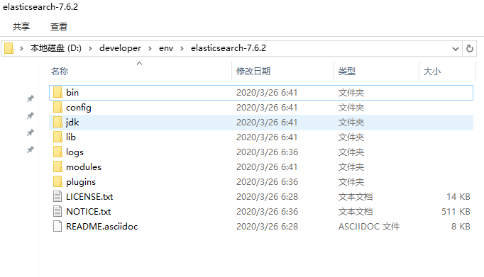

- 安装中文分词插件，在`elasticsearch-7.6.2\bin`目录下执行以下命令：

```bash
elasticsearch-plugin install https://github.com/medcl/elasticsearch-analysis-ik/releases/download/v7.6.2/elasticsearch-analysis-ik-7.6.2.zip
```

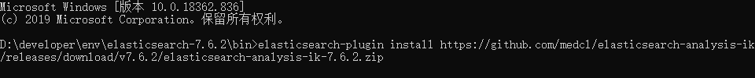

- 运行bin目录下的`elasticsearch.bat`启动Elasticsearch服务。

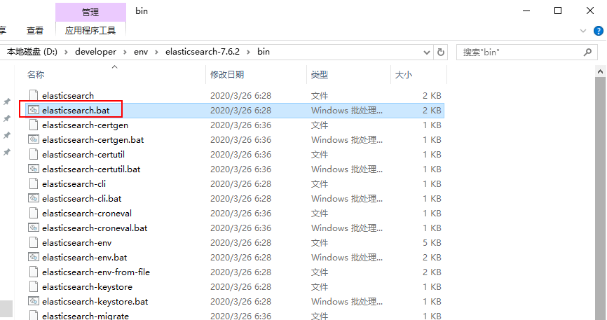

## Kibana

- 下载Kibana，作为访问Elasticsearch的客户端，请下载`7.6.2`版本的zip包，并解压到指定目录，下载地址：https://www.elastic.co/cn/downloads/past-releases/kibana-7-6-2

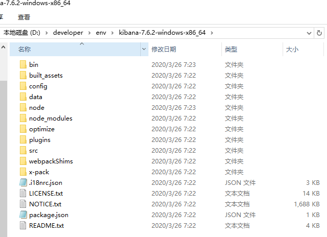

- 运行bin目录下的`kibana.bat`，启动Kibana服务；

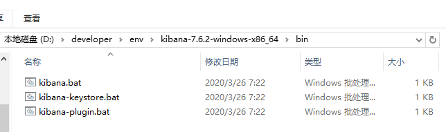

- 打开Kibana的用户界面，访问地址：http://localhost:5601


## Logstash

- 下载Logstash，用于收集日志，请下载`7.6.2`版本的zip包，并解压到指定目录，下载地址：https://www.elastic.co/cn/downloads/past-releases/logstash-7-6-2

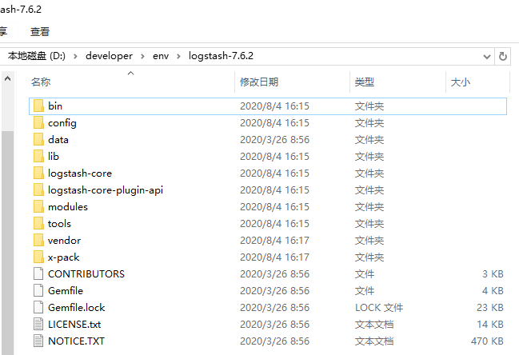

- 将Logstash的配置文件`logstash.conf`拷贝到安装目录的`bin`目录下，配置文件地址：https://github.com/macrozheng/mall/blob/master/document/elk/logstash.conf

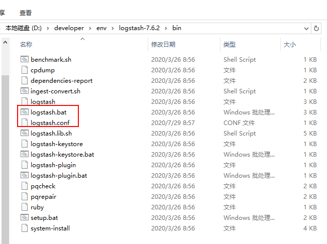

- Logstash需要安装json_lines插件。

```bash
logstash-plugin install logstash-codec-json_lines
```

- 运行bin目录下的`logstash.bat`，启动Logstash服务，启动命令如下：

```bash
logstash -f logstash.conf
```

## Mongodb

- 下载MongoDB安装包，选择`Windows x64`版本安装，下载地址：https://www.mongodb.com/download-center/community

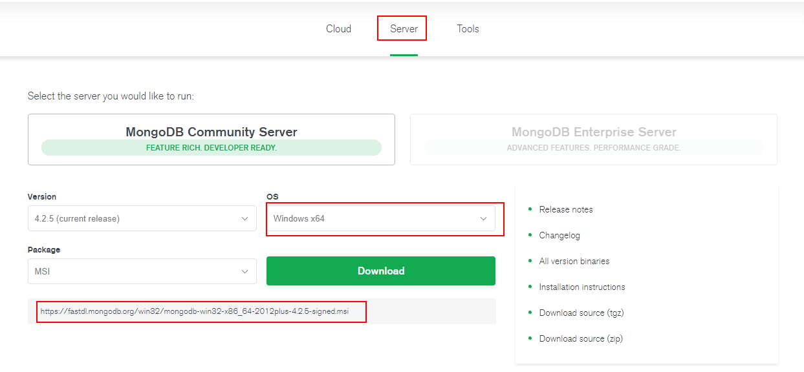

- 运行MongoDB安装包并选择自定义安装，设置好安装路径；

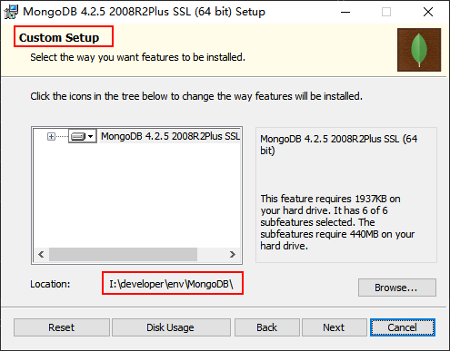

- 配置MongoDB，让MongoDB作为服务运行，并配置好数据目录和日志目录；

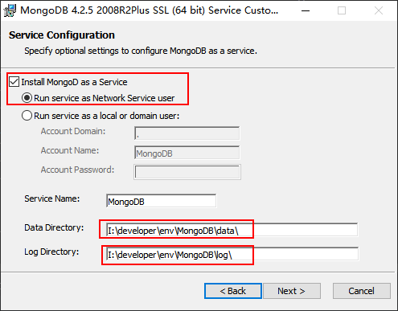

- 取消MongoDB Compass的安装选项（不取消安装极慢），需要可自行安装；

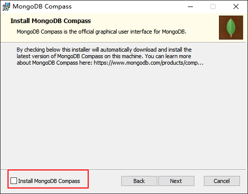

- 双击`mongo.exe`可以运行MongoDB自带客户端，操作MongoDB；

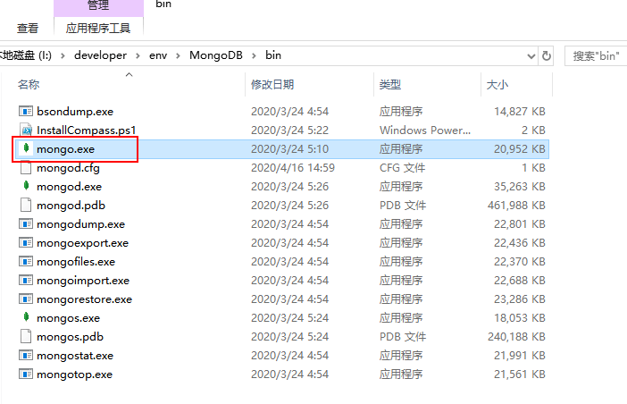

- 连接成功后会显示如下信息；

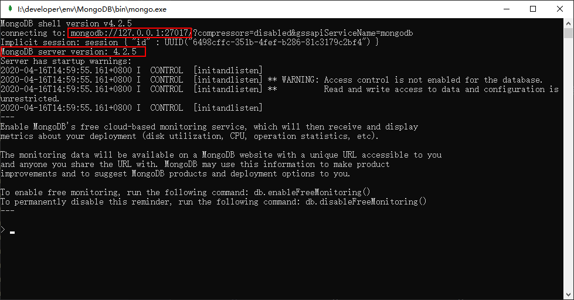

- 如果需要移除MongoDB服务，只需使用管理员权限运行`cmd`工具，并输入如下命令。

```bash
sc.exe delete MongoDB
```

- 下载客户端工具`Robo 3T`，下载地址：https://robomongo.org/download

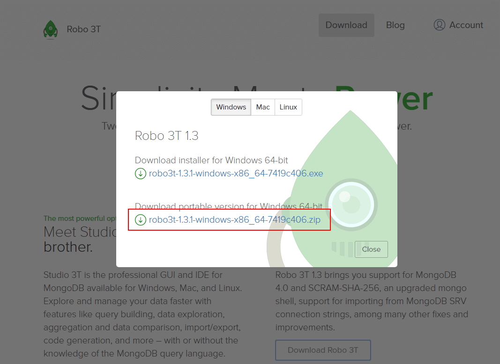

- 下载完成后解压，双击`robo3t.exe`即可使用；

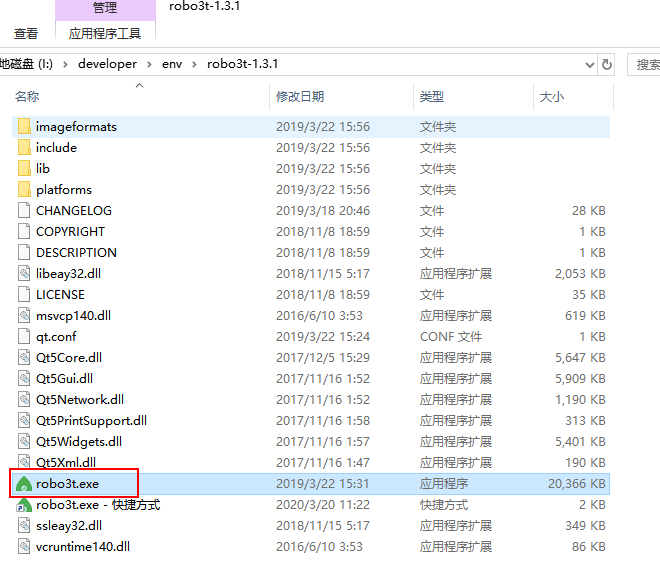

- 之后创建一个到MongoDB的连接；

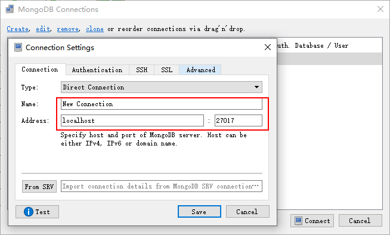

- 创建连接成功以后，就可以操作MongoDB了。

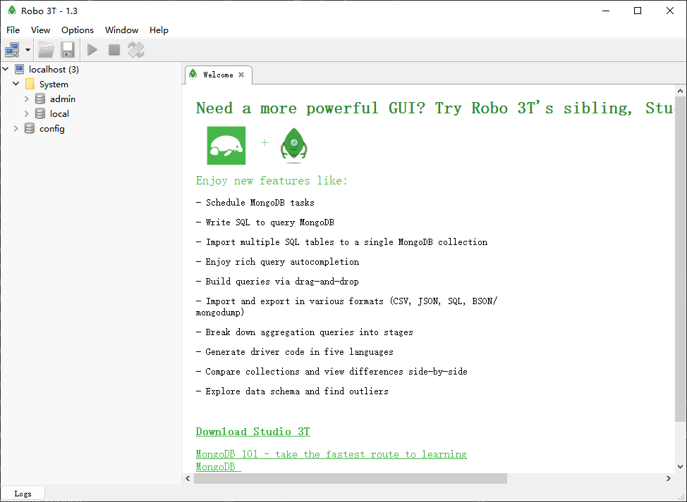

## RabbitMQ

- 安装Erlang，下载地址：http://erlang.org/download/otp_win64_21.3.exe


- 安装RabbitMQ，下载地址：https://dl.bintray.com/rabbitmq/all/rabbitmq-server/3.7.14/rabbitmq-server-3.7.14.exe


- 安装完成后，进入RabbitMQ安装目录下的sbin目录


- 在地址栏输入cmd并回车启动命令行，然后输入以下命令启动管理功能：

```
rabbitmq-plugins enable rabbitmq_management
```


- 访问地址查看是否安装成功：http://localhost:15672/


- 输入账号密码并登录：guest guest

- 创建帐号并设置其角色为管理员：mall mall

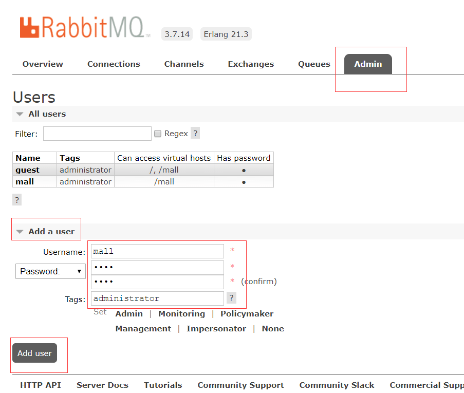

- 创建一个新的虚拟host为：/mall

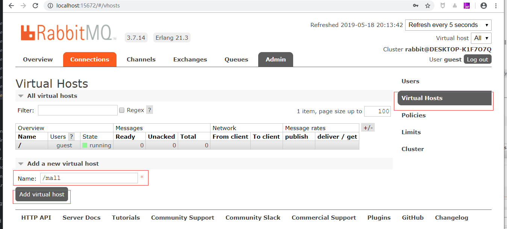

- 点击mall用户进入用户配置页面


- 给mall用户配置该虚拟host的权限

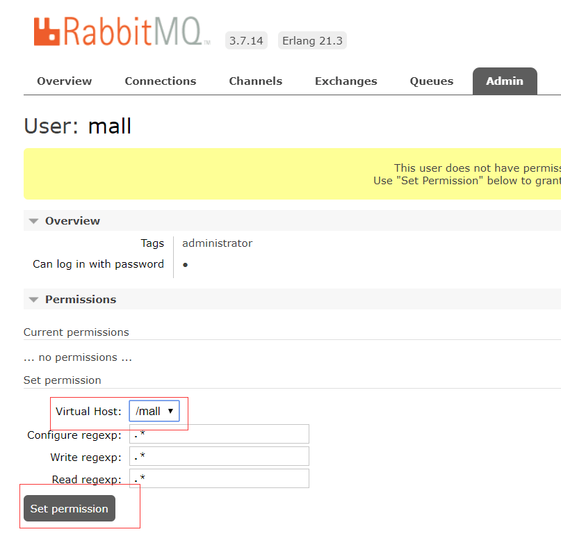

- 至此，RabbitMQ的安装和配置完成。

## OSS

### 开通OSS服务

- 登录阿里云官网；
- 将鼠标移至产品标签页，单击对象存储 OSS，打开OSS 产品详情页面；
- 在OSS产品详情页，单击立即开通。

### 创建存储空间

- 点击网页右上角控制台按钮进入控制台；


- 选择我的云产品中的对象存储OSS；


- 点击左侧存储空间的加号新建存储空间；

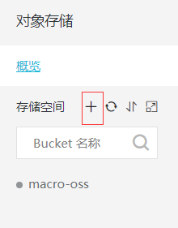

- 新建存储空间并设置读写权限为公共读。


### 跨域资源共享（CORS）的设置

- 选择一个存储空间，打开其基础设置；

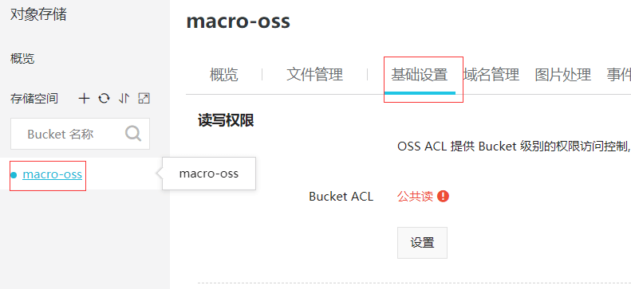

- 点击跨越设置的设置按钮；


- 点击创建规则；


- 进行跨域规则设置；


## mall-admin

- 启动项目：直接运行com.macro.mall.MallAdminApplication的main方法即可；
- 接口文档地址：http://localhost:8080/swagger-ui.html

## mall-search

- 启动项目：直接运行com.macro.mall.search.MallSearchApplication的main方法即可；
- 接口文档地址：http://localhost:8081/swagger-ui.html
- 使用前需要先调用接口导入数据；http://localhost:8081/esProduct/importAll
- 如出现无法启动的问题，可以先删除Elasticsearch里面的数据再启动

## mall-portal

- 启动mall-portal项目：直接运行com.macro.mall.portal.MallPortalApplication的main方法即可；
- 接口文档地址：http://localhost:8085/swagger-ui.html

## 公众号


