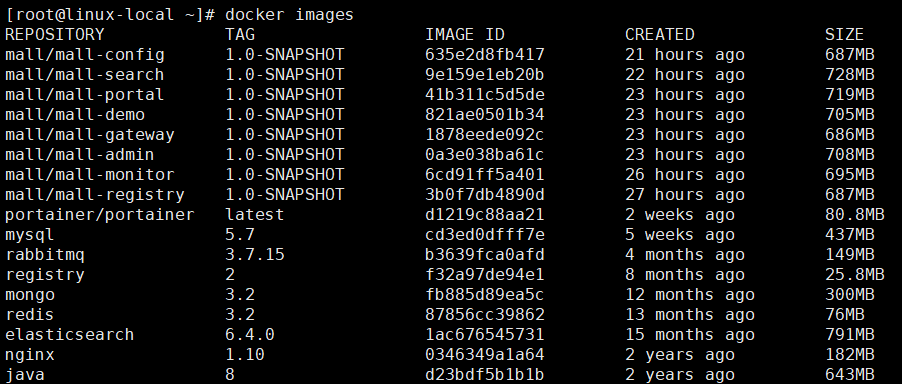
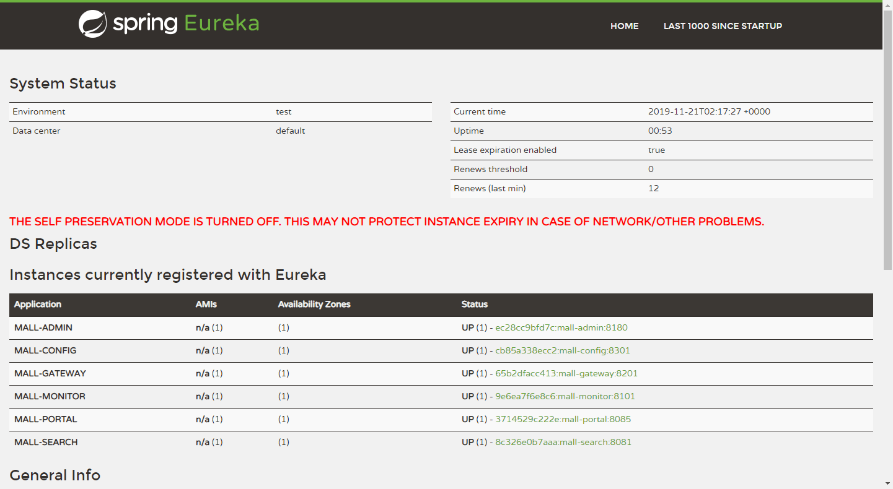
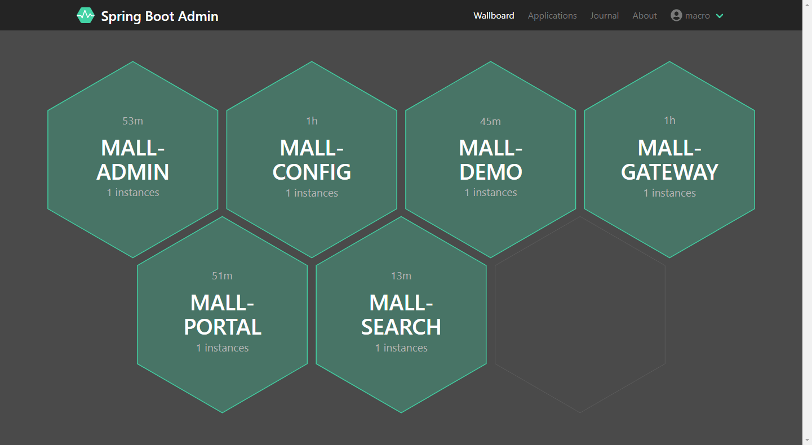
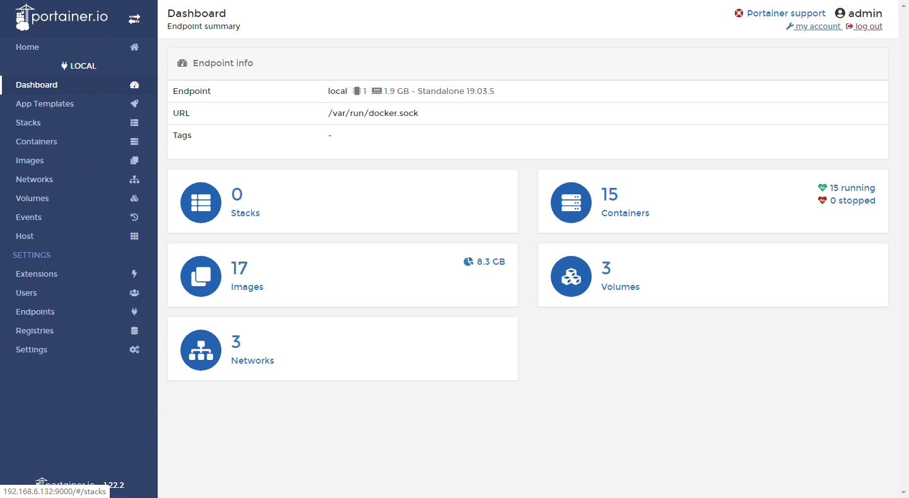
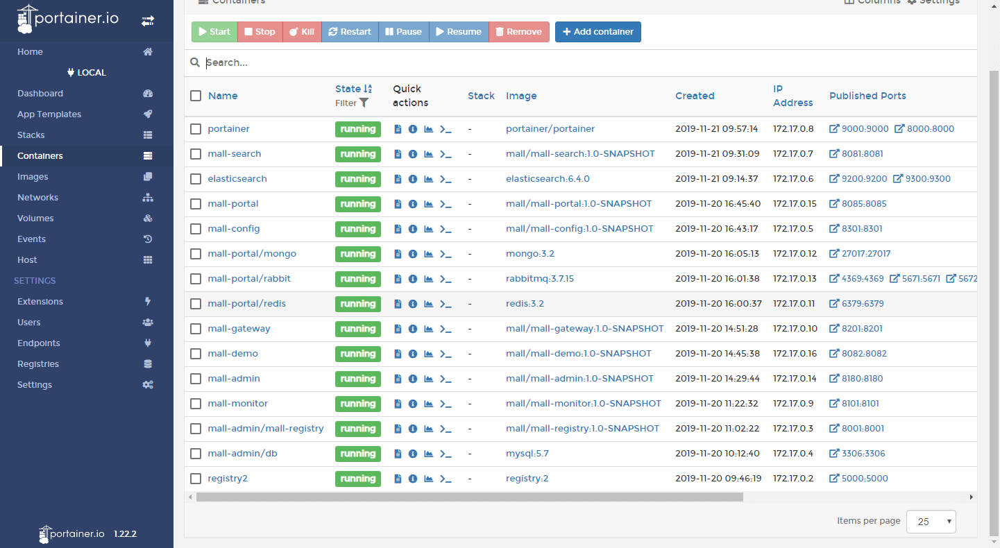
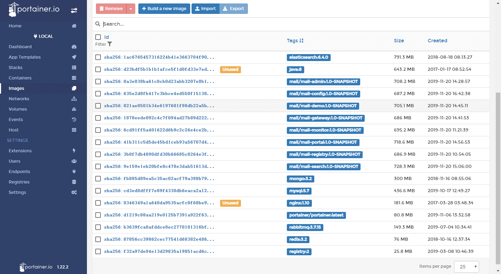
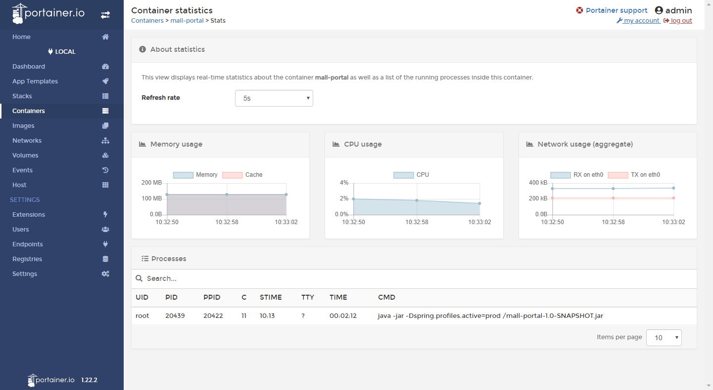
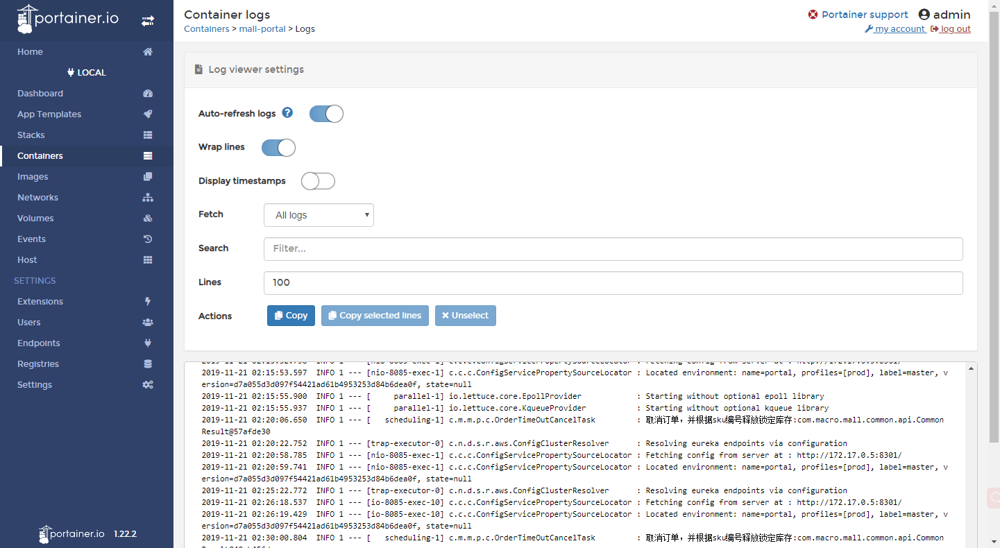
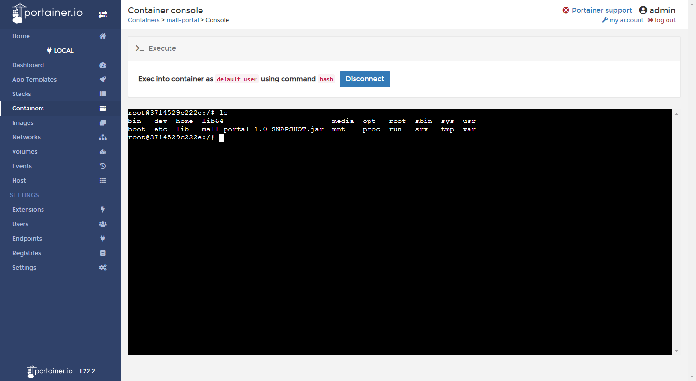

mall项目全套学习教程连载中，[关注公众号](#公众号)第一时间获取。

# mall-swarm在Linux环境下的部署（基于Docker容器）

> 本文以`mall-swarm`项目为例，主要介绍一个微服务架构的电商项目如何在Docker容器下部署，涉及到大量系统组件的部署及多个Spring Cloud 微服务应用的部署，基于CentOS7.6。

## 环境搭建

### 基础环境部署

> `mall-swarm`运行需要的系统组件如下，Docker容器中安装这些组件的方法直接参考该文章即可：[mall在Linux环境下的部署（基于Docker容器）](/deploy/mall_deploy_docker.md) 。

| 组件          | 版本号 |
| ------------- | ------ |
| JDK           | 1.8    |
| Mysql         | 5.7    |
| Redis         | 3.2    |
| Elasticsearch | 6.4.0  |
| MongoDb       | 3.2    |
| RabbitMq      | 3.7.15 |
| Nginx         | 1.10   |

### 镜像打包上传

> 一共8个应用服务需要打包成Docker镜像，具体如何打包可以参考[使用Maven插件构建Docker镜像](/reference/docker_maven.md) 。
需要注意的是如果打包过程中遇到找不到`mall-common`、`mall-mbg`或`mall-security`的情况，需要先按顺序将这些模块install到本地maven仓库再进行打包。

| 应用          | 版本号 |
| ------------- | ------ |
| mall-registry | 1.8    |
| mall-config   | 5.7    |
| mall-monitor  | 3.2    |
| mall-gateway  | 6.4.0  |
| mall-admin    | 3.2    |
| mall-portal   | 3.7.15 |
| mall-search   | 1.10   |
| mall-demo     | 1.10   |

镜像打包上传完成后，完整docker仓库镜像示意图：



## 应用部署

### 部署mall-registry

- 通过以下命令运行注册中心`mall-registry`：

```bash
docker run -p 8001:8001 --name mall-registry \
-v /etc/localtime:/etc/localtime \
-v /mydata/app/mall-registry/logs:/var/logs \
-d mall/mall-registry:1.0-SNAPSHOT
```

- 运行成功后，通过访问该地址可以查看注册中心控制台：http://192.168.6.132:8001/

### 部署mall-config

- 通过以下命令运行配置中心`mall-config`：

```bash 
docker run -p 8301:8301 --name mall-config \
--link mall-registry:mall-registry \
-v /etc/localtime:/etc/localtime \
-v /mydata/app/mall-config/logs:/var/logs \
-d mall/mall-config:1.0-SNAPSHOT
```

- 运行成功后，通过访问该地址可以查看`mall-admin`在prod环境下的配置信息：http://192.168.6.132:8301/master/admin-prod.yml

- 需要`注意`的是prod环境下从配置中心获取的是存储在git仓库中的配置，如需更改需要将mall-config模块的配置文件application.yml中的git仓库配置改为你自己的。

```yaml
spring:
  cloud:
    config:
      server:
        git: #Git仓库存储
          uri: https://gitee.com/macrozheng/mall-config.git #改为你自己的配置
          username: macro
          password: 123456
          clone-on-start: true
          search-paths: '{application}'
```

### 部署mall-monitor

- 通过以下命令运行监控中心`mall-monitor`：

```bash 
docker run -p 8101:8101 --name mall-monitor \
--link mall-registry:mall-registry \
-v /etc/localtime:/etc/localtime \
-v /mydata/app/mall-monitor/logs:/var/logs \
-d mall/mall-monitor:1.0-SNAPSHOT
```

- 运行完成后可以通过该地址查看监控中心信息，账号密码为`macro:123456`：http://192.168.6.132:8101

### 部署mall-gateway

- 通过以下命令运行网关服务`mall-gateway`：

```bash 
docker run -p 8201:8201 --name mall-gateway \
--link mall-registry:mall-registry \
-v /etc/localtime:/etc/localtime \
-v /mydata/app/mall-gateway/logs:/var/logs \
-d mall/mall-gateway:1.0-SNAPSHOT
```

- 运行完成后可以通过该地址查看动态路由规则：http://192.168.6.132:8201/actuator/gateway/routes

### 部署mall-admin

- 通过以下命令运行后台服务`mall-admin`：

```bash 
docker run -p 8180:8180 --name mall-admin \
--link mysql:db \
--link mall-registry:mall-registry \
-v /etc/localtime:/etc/localtime \
-v /mydata/app/mall-admin/logs:/var/logs \
-d mall/mall-admin:1.0-SNAPSHOT
```

- 通过`mall-gateway`网关服务访问接口文档：http://192.168.6.132:8201/mall-admin/swagger-ui.html

### 部署mall-portal

- 通过以下命令运行前台服务`mall-portal`：

```bash 
docker run -p 8085:8085 --name mall-portal \
--link mysql:db \
--link redis:redis \
--link mongo:mongo \
--link rabbitmq:rabbit \
--link mall-registry:mall-registry \
-v /etc/localtime:/etc/localtime \
-v /mydata/app/mall-portal/logs:/var/logs \
-d mall/mall-portal:1.0-SNAPSHOT
```

- 通过`mall-gateway`网关服务访问接口文档：http://192.168.6.132:8201/mall-portal/swagger-ui.html

### 部署mall-search

- 通过以下命令运行搜索服务`mall-search`：

```bash 
docker run -p 8081:8081 --name mall-search \
--link mysql:db \
--link elasticsearch:es \
--link mall-registry:mall-registry \
-v /etc/localtime:/etc/localtime \
-v /mydata/app/mall-search/logs:/var/logs \
-d mall/mall-search:1.0-SNAPSHOT
```

- 通过`mall-gateway`网关服务访问接口文档：http://192.168.6.132:8201/mall-search/swagger-ui.html

### 部署mall-demo

- 通过以下命令运行测试服务`mall-demo`：

```bash 
docker run -p 8082:8082 --name mall-demo \
--link mysql:db \
--link mall-registry:mall-registry \
-v /etc/localtime:/etc/localtime \
-v /mydata/app/mall-demo/logs:/var/logs \
-d mall/mall-demo:1.0-SNAPSHOT
```

- 通过`mall-gateway`网关服务访问接口文档：http://192.168.6.132:8201/mall-demo/swagger-ui.html

## 运行完成效果展示

- 注册中心控制台信息：



- 监控中心应用信息：




## 可视化管理工具

> Portainer 是一款轻量级的应用，它提供了图形化界面，用于方便的管理Docker环境，包括单机环境和集群环境，下面我们将用Portainer来管理Docker容器中的应用。

- 官网地址：https://github.com/portainer/portainer

- 获取Docker镜像文件：

```bash
docker pull portainer/portainer
```

- 使用docker容器运行Portainer：

```bash
docker run -p 9000:9000 -p 8000:8000 --name portainer \
--restart=always \
-v /var/run/docker.sock:/var/run/docker.sock \
-v /mydata/portainer/data:/data \
-d portainer/portainer
```

- 查看Portainer的DashBoard信息：



- 查看所有运行中的容器信息：



- 查看所有已经下载的Docker镜像：



- 查看`mall-portal`应用的统计信息：



- 查看`mall-portal`应用的运行过程中打印的日志信息：



- 进入`mall-portal`应用的容器内部来操作容器内部系统：



## 公众号


