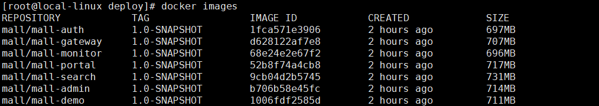
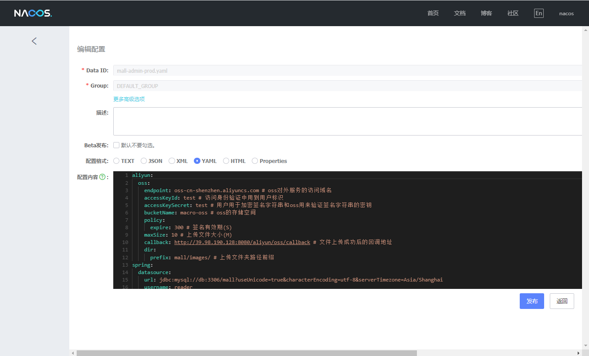
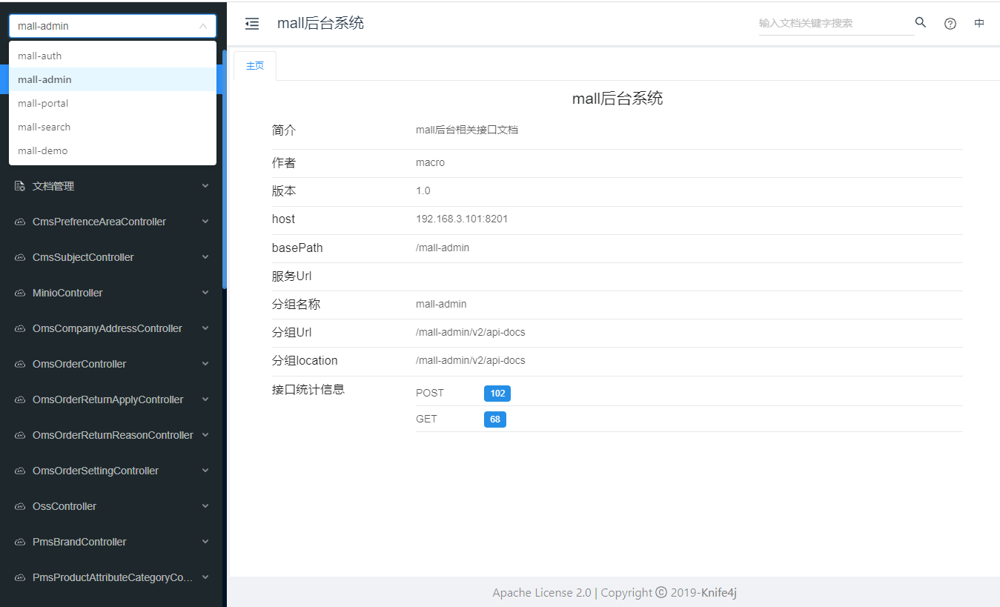
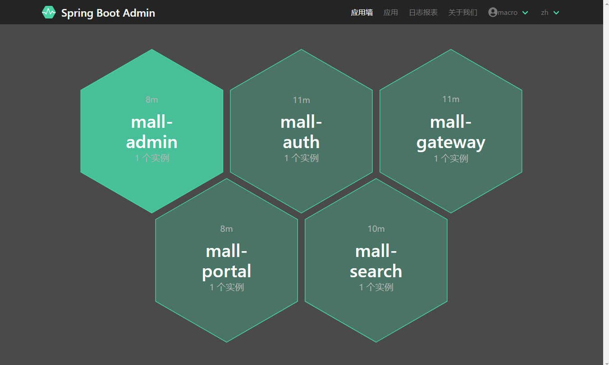
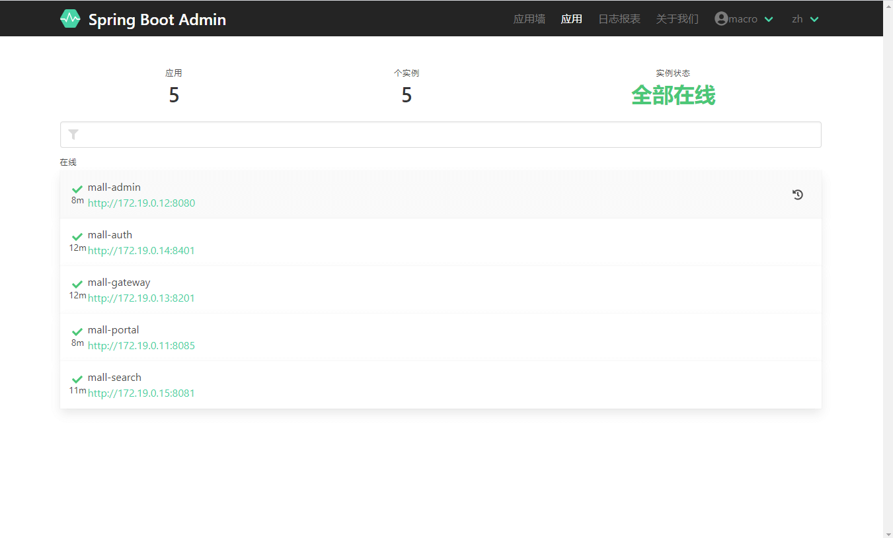
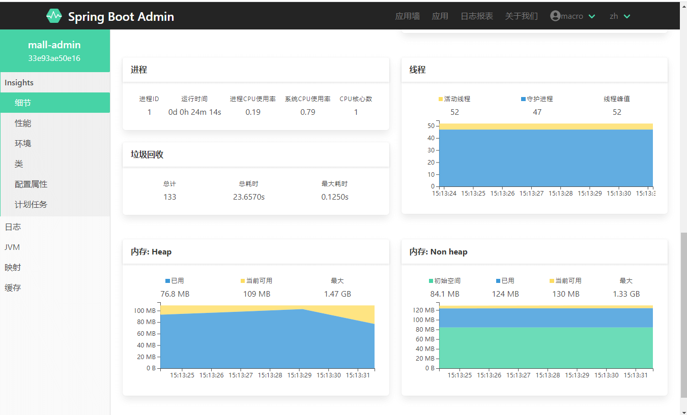
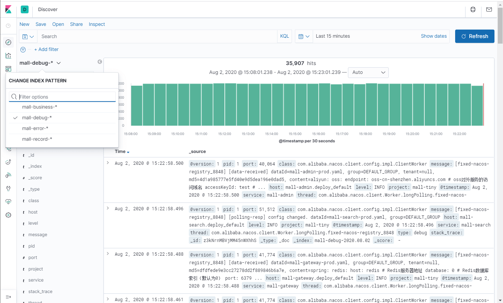

学习不走弯路，[关注公众号](#公众号) 回复「学习路线」，获取mall项目专属学习路线！

# mall-swarm在Linux环境下的部署（基于Docker容器）

> 本文以`mall-swarm`项目为例，主要介绍一个微服务架构的电商项目如何在Docker容器下部署，涉及到大量系统组件的部署及多个Spring Cloud微服务应用的部署，基于CentOS7.6。

## 环境搭建

### 基础环境部署

> `mall-swarm`运行需要的系统组件如下，使用Docker Compose 批量安装更方便，Docker Compose使用请参考：[使用Docker Compose部署SpringBoot应用](http://www.macrozheng.com/#/reference/docker_compose) 。

| 组件          | 版本号 |
| ------------- | ------ |
| Mysql         | 5.7    |
| Redis         | 5.0    |
| MongoDb       | 4.3.5  |
| RabbitMq      | 3.7.15 |
| Nginx         | 1.10   |
| Elasticsearch | 7.6.2  |
| Logstash      | 7.6.2  |
| Kibana        | 7.6.2  |
| Nacos         | 1.3.0  |

- 本项目已经提供好了Docker Compose脚本，直接执行即可，脚本地址：https://github.com/macrozheng/mall-swarm/blob/master/document/docker/docker-compose-env.yml

```bash
docker-compose -f docker-compose-env.yml up -d
```

- 某些系统组件无法启动问题，具体参考：[mall在Linux环境下的部署（基于Docker Compose）](http://www.macrozheng.com/#/deploy/mall_deploy_docker_compose)

- 由于新增了`Logstash`组件，需要预先创建好Logstash的配置文件，再安装Logstash的JSON插件，配置文件地址：https://github.com/macrozheng/mall-swarm/tree/master/document/elk/logstash.conf

```bash
# 创建好配置文件目录
mkdir /mydata/logstash
# 进入容器使用如下命令安装插件
logstash-plugin install logstash-codec-json_lines
```

### 镜像打包上传

> 一共6个应用服务需要打包成Docker镜像，具体如何打包可以参考[使用Maven插件为SpringBoot应用构建Docker镜像](http://www.macrozheng.com/#/reference/docker_maven) 。需要注意的是如果打包过程中遇到找不到`mall-common`或`mall-mbg`模块，需要先按顺序将这些模块install到本地maven仓库再进行打包。

| 应用         | 说明         |
| ------------ | ------------ |
| mall-monitor | 监控中心     |
| mall-gateway | 微服务网关   |
| mall-auth    | 认证中心     |
| mall-admin   | 商城后台服务 |
| mall-portal  | 商城前台服务 |
| mall-search  | 商城搜索服务 |

镜像打包上传完成后，完整docker仓库镜像示意图：



## 应用部署

### 在Nacos中添加配置文件

- 由于我们使用Nacos作为配置中心，统一管理配置，所以我们需要将项目`config`目录下的所有配置都添加到Nacos中，Nacos访问地址：http://192.168.3.101:8848/nacos/



- 注意，配置文件的文件名称需要和Nacos中的`Data Id`一一对应；


### 使用Docker Compose批量部署所有应用

- 直接使用提供好的Docker Compose脚本，启动所有应用即可，脚本地址：https://github.com/macrozheng/mall-swarm/blob/master/document/docker/docker-compose-app.yml

```bash
docker-compose -f docker-compose-app.yml up -d
```

- 启动成功后，可以查看API文档信息，访问地址：http://192.168.3.101:8201/doc.html



## 运行完成效果展示

- 查看注册中心注册服务信息，访问地址：http://192.168.3.101:8848/nacos/


- 监控中心应用信息，访问地址：http://192.168.3.101:8101







- 日志收集系统信息，访问地址：http://192.168.3.101:5601



## 可视化管理工具

> Portainer 是一款轻量级的应用，它提供了图形化界面，用于方便的管理Docker环境，包括单机环境和集群环境，下面我们将用Portainer来管理Docker容器中的应用。

- 官网地址：https://github.com/portainer/portainer

- 获取Docker镜像文件：

```bash
docker pull portainer/portainer
```

- 使用docker容器运行Portainer：

```bash
docker run -p 9000:9000 -p 8000:8000 --name portainer \
--restart=always \
-v /var/run/docker.sock:/var/run/docker.sock \
-v /mydata/portainer/data:/data \
-d portainer/portainer
```

- 查看Portainer的DashBoard信息，访问地址：http://192.168.3.101:9000


- 查看所有运行中的容器信息：


- 查看所有已经下载的Docker镜像：


- 查看`mall-portal`应用的统计信息：


- 查看`mall-portal`应用的运行过程中打印的日志信息：


- 进入`mall-portal`应用的容器内部来操作容器内部系统：


## 公众号


