mall项目全套学习教程连载中，[关注公众号](#公众号)第一时间获取。

# 微服务架构下的自动化部署，使用Jenkins来实现！

> 在微服务架构中，随着服务越来越多，服务的打包部署就会成为一个相当麻烦的事情。比如说我的`mall-swarm`项目目前就有8个服务需要部署，有没有什么办法让我们部署一次之后，只要点击执行就可以自动部署呢？当然有！下面我们使用Jenkins来完成一个微服务架构中的自动化部署工作。

## Jenkins的基本使用

关于Jenkins的基本使用可以参考：[使用Jenkins一键打包部署SpringBoot应用，就是这么6！](https://mp.weixin.qq.com/s/tQqvgSc9cHBtnqRQSbI4aw)

## 执行脚本准备

> 首先我们先把需要远程执行的脚本准备好。

- 脚本文件都存放在了`mall-swarm`项目的`/document/sh`目录下：

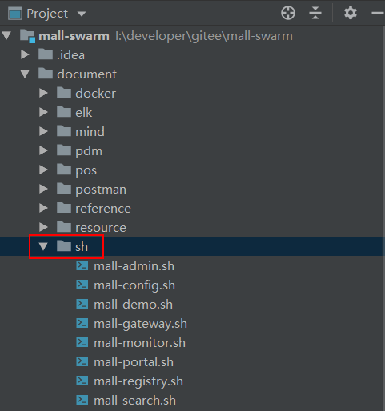

- 上传脚本前在IDEA中修改所有脚本文件的换行符格式为`LF`，否则脚本会无法执行；

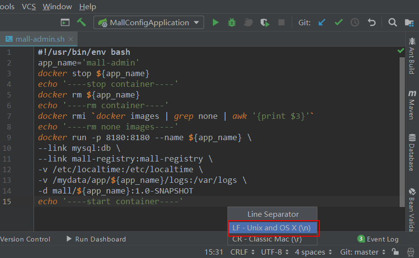

- 将所有脚本文件上传到指定目录，这里我们上传到`/mydata/sh`目录下；

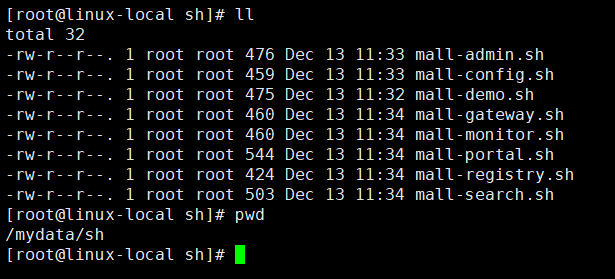

- 将所有脚本文件都修改为可执行文件:

```bash
chmod +x ./mall-*
```

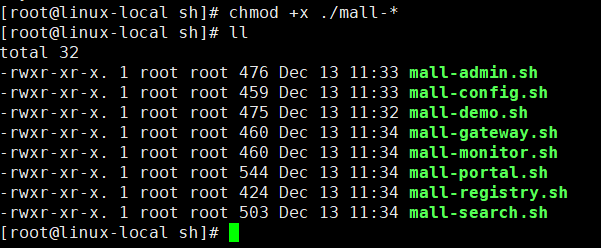

## Jenkins中创建任务

> 接下来我们将通过在Jenkins中创建任务来实现自动化部署。由于我们的`mall-swarm`是个多模块的项目，部署上面和曾经的单模块项目还是有所区别的。

### mall-admin

> 由于各个模块的执行任务的创建都大同小异，下面将详细讲解mall-admin模块任务的创建，其他模块将简略讲解。

- 首先我们选择`构建一个自由风格的软件项目`，然后输入任务名称为mall-admin，配置其Git仓库地址，这里我直接使用了Gitee上面的地址：

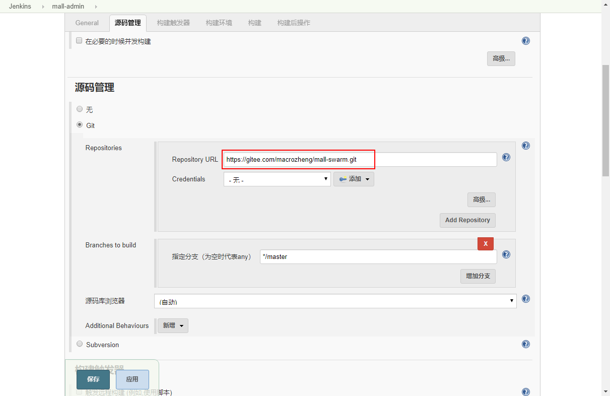

- 之后我们创建一个构建，构建`mall-swarm`项目中的依赖模块，否则当构建可运行的服务模块时会因为无法找到这些模块而构建失败；

```bash
# 只install mall-common,mall-mbg,mall-security三个模块
clean install -pl mall-common,mall-mbg,mall-security -am
```

- 依赖项目构建示意图：

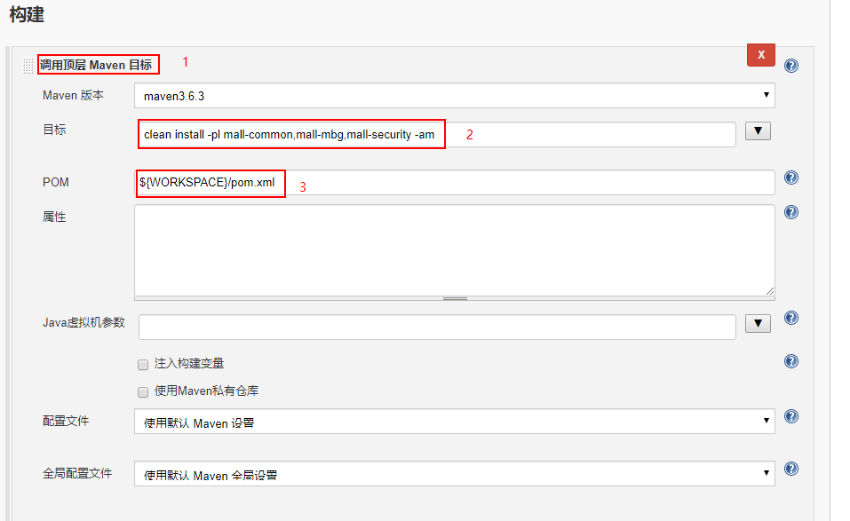

- 再创建一个构建，单独构建并打包mall-admin模块：

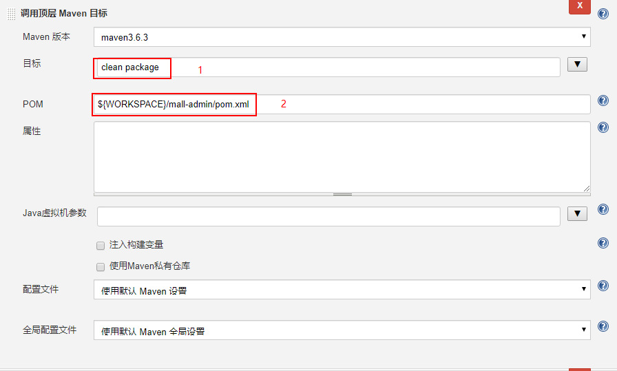

- 添加一个构建来通过SSH去执行远程任务，用于执行mall-admin的运行脚本：

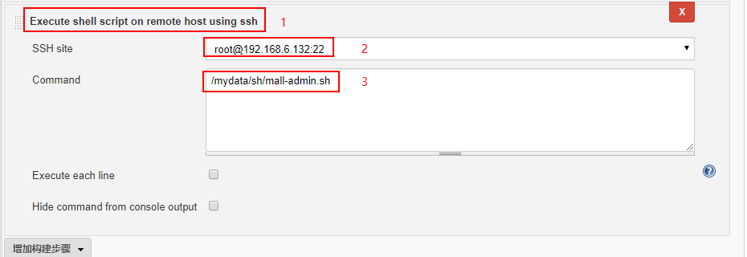

- 点击保存，完成mall-admin的执行任务创建。

### mall-registry

> mall-registry和其他模块与mall-admin创建任务方式基本一致，只需修改构建模块时的`pom.xml`文件位置和`执行脚本`位置即可。

- 我们可以直接从mall-admin模块的任务复制一个过来创建：

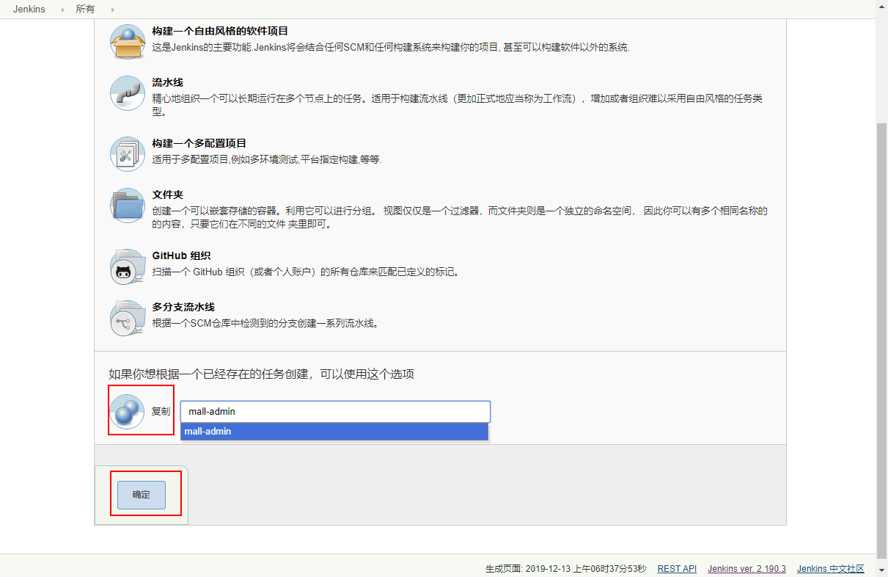

- 修改第二个构建中的pom.xml文件位置，改为：`${WORKSPACE}/mall-registry/pom.xml`

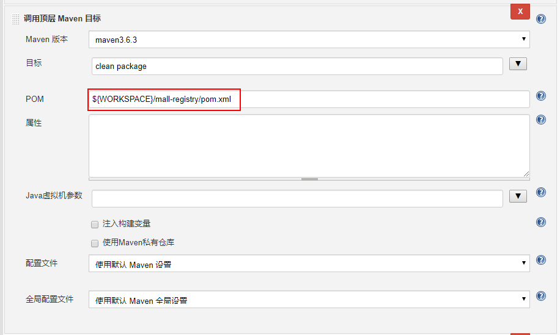

- 修改第三个构建中的SSH执行脚本文件位置，改为：`/mydata/sh/mall-registry.sh`

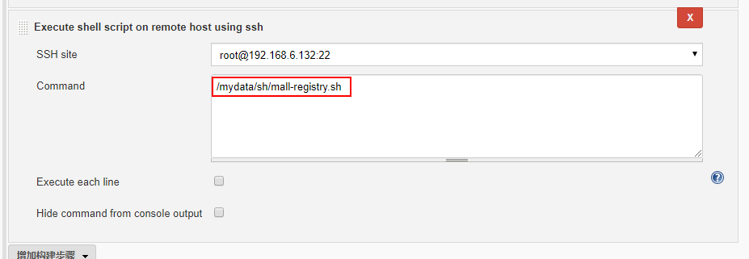

- 点击保存，完成mall-registry的执行任务创建。

### 其他模块

其他模块的执行任务创建，参考mall-admin和mall-registry的创建即可。

### 任务创建完成

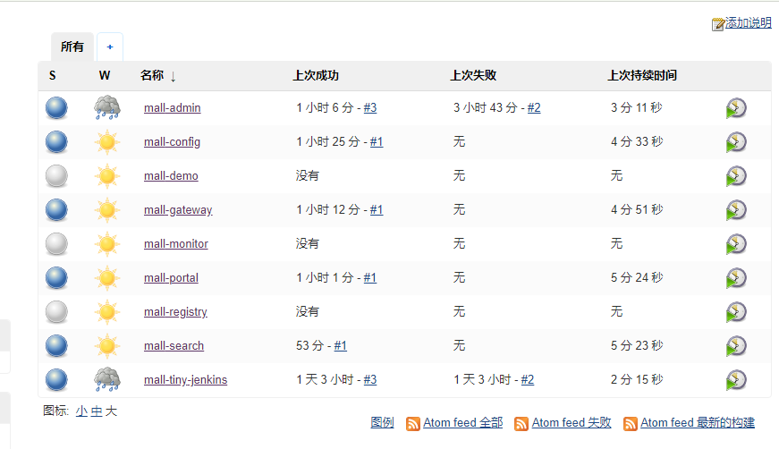

## 模块启动顺序问题

> 关于各个模块的启动顺序问题，`mall-registry`模块必须第一个启动，`mall-config`模块必须第二个启动，其他模块没有启动顺序限制。

推荐启动顺序：
- mall-registry
- mall-config
- mall-monitor
- mall-gateway
- mall-admin
- mall-portal
- mall-search
- mall-demo

## 总结

我们通过在Jenkins中创建任务，完成了微服务架构中服务的打包部署工作，这样当我们每次修改完代码后，只需点击启动任务，就可以实现一键打包部署，省去了频繁打包部署的麻烦。

## 项目地址

[https://github.com/macrozheng/mall-swarm](https://github.com/macrozheng/mall-swarm)

## 公众号


