学习不走弯路，[关注公众号](#公众号) 回复「学习路线」，获取mall项目专属学习路线！

# mall-swarm微服务项目在K8S下的实践！

> 由于K8S目前实在是太火了，之前一直说要给mall项目出个K8S部署方案，这次它来啦！在更新完K8S系列教程后，是时候来波实践了，拿`mall-swarm`项目来实践真的是刚刚好。如果你有在Docker下部署该项目的经历，而且已经学习了我的K8S系列教程的话，相信你能够轻松上手！

## 服务器规划

> 我们先来说下服务器规划吧，之前一直使用的是单机部署所有服务，这次我们使用两台服务器来部署。

- 基础服务器（192.168.3.101）：用于部署`mall-swarm`的依赖服务，包括MySql、Redis、Elasticsearch等与应用无关的服务，采用Docker方式来部署。

- 应用服务器（192.168.3.102）：用于部署`mall-swarm`的应用服务，包括mall-admin、mall-portal、mall-search等应用服务，采用K8S方式来部署。

## 镜像打包及推送

> 为了方便部署，我们把`mall-swarm`的所有应用镜像都上传到Docker Hub上去。

- 首先修改项目根目录下的`pom.xml`文件；

```xml
<properties>
    <!--改为你自己的Docker服务远程访问地址-->
    <docker.host>http://192.168.3.101:2375</docker.host>
</properties>
```

- 使用Maven插件将所有镜像打包到Linux服务器上，直接使用根项目下的`package`命令即可；

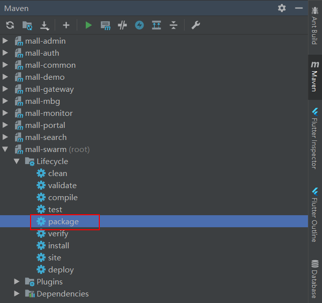

- 修改所有镜像标签名称，修改本地镜像标签名称为远程镜像标签名称；

```bash
docker tag mall/mall-gateway:1.0-SNAPSHOT macrodocker/mall-gateway:1.0-SNAPSHOT
docker tag mall/mall-auth:1.0-SNAPSHOT macrodocker/mall-auth:1.0-SNAPSHOT
docker tag mall/mall-monitor:1.0-SNAPSHOT macrodocker/mall-monitor:1.0-SNAPSHOT
docker tag mall/mall-admin:1.0-SNAPSHOT macrodocker/mall-admin:1.0-SNAPSHOT
docker tag mall/mall-portal:1.0-SNAPSHOT macrodocker/mall-portal:1.0-SNAPSHOT
docker tag mall/mall-search:1.0-SNAPSHOT macrodocker/mall-search:1.0-SNAPSHOT
```

- 修改完成后查询`macrodocker`相关镜像显示如下，`macrodocker`为我们在Docker Hub上的仓库地址；

```bash
[root@local-linux ~]# docker images |grep macrodocker
macrodocker/mall-auth      1.0-SNAPSHOT        72df5f91f2d7        9 minutes ago       699MB
macrodocker/mall-gateway   1.0-SNAPSHOT        4055dfc1e601        9 minutes ago       708MB
macrodocker/mall-monitor   1.0-SNAPSHOT        492d9bb4375c        9 minutes ago       696MB
macrodocker/mall-portal    1.0-SNAPSHOT        8dd79675f40c        10 minutes ago      719MB
macrodocker/mall-search    1.0-SNAPSHOT        f0d0d80c590f        10 minutes ago      734MB
macrodocker/mall-admin     1.0-SNAPSHOT        15737ce903a9        11 minutes ago      715MB
```

- 之后推送镜像到Docker Hub，如果你不想自己推送镜像，可以使用我已经上传好到镜像。

```bash
# 登录Docker Hub
docker login
# 推送到远程仓库
docker push macrodocker/mall-gateway:1.0-SNAPSHOT
docker push macrodocker/mall-auth:1.0-SNAPSHOT
docker push macrodocker/mall-monitor:1.0-SNAPSHOT
docker push macrodocker/mall-admin:1.0-SNAPSHOT
docker push macrodocker/mall-portal:1.0-SNAPSHOT
docker push macrodocker/mall-search:1.0-SNAPSHOT
```

## 基础服务器部署

> 我们依然使用Docker来部署依赖服务，`mall-swarm`运行需要的依赖服务如下，使用Docker Compose脚本安装更方便，Docker Compose使用请参考：[《使用Docker Compose部署SpringBoot应用》](https://mp.weixin.qq.com/s/iMl9bJ4SxUsNHBbiS5VUcw) 。

| 组件          | 版本号 |
| ------------- | ------ |
| Mysql         | 5.7    |
| Redis         | 5.0    |
| MongoDb       | 4.3.5  |
| RabbitMq      | 3.7.15 |
| Nginx         | 1.10   |
| Elasticsearch | 7.6.2  |
| Logstash      | 7.6.2  |
| Kibana        | 7.6.2  |
| Nacos         | 1.3.0  |

- 本项目已经提供好了Docker Compose脚本，直接执行如下命令即可，脚本地址：https://github.com/macrozheng/mall-swarm/blob/master/document/docker/docker-compose-env.yml

```bash
docker-compose -f docker-compose-env.yml up -d
```

- 某些系统组件无法启动问题，具体参考：[《mall在Linux环境下的部署（基于Docker Compose）》](https://mp.weixin.qq.com/s/JYkvdub9DP5P9ULX4mehUw)

- 部署完成后，查看Docker中运行的服务显示如下。

```bash
[root@local-linux ~]# docker ps
CONTAINER ID        IMAGE                        COMMAND                  CREATED             STATUS              PORTS                                                                                        NAMES
fef5695319d1        nacos/nacos-server:1.3.0     "bin/docker-startup.…"   3 months ago        Up 6 hours          0.0.0.0:8848->8848/tcp                                                                       nacos-registry
e7ec37fcafda        elasticsearch:7.6.2          "/usr/local/bin/dock…"   3 months ago        Up 6 hours          0.0.0.0:9200->9200/tcp, 0.0.0.0:9300->9300/tcp                                               elasticsearch
427f0176c426        mongo:4.2.5                  "docker-entrypoint.s…"   3 months ago        Up 6 hours          0.0.0.0:27017->27017/tcp                                                                     mongo
5618ed50942a        redis:5                      "docker-entrypoint.s…"   3 months ago        Up 6 hours          0.0.0.0:6379->6379/tcp                                                                       redis
1744f412c6f4        rabbitmq:3.7.15-management   "docker-entrypoint.s…"   3 months ago        Up 6 hours          4369/tcp, 5671/tcp, 0.0.0.0:5672->5672/tcp, 15671/tcp, 25672/tcp, 0.0.0.0:15672->15672/tcp   rabbitmq
6b26f63dfad6        mysql:5.7                    "docker-entrypoint.s…"   3 months ago        Up 6 hours          0.0.0.0:3306->3306/tcp, 33060/tcp                                                            mysql
```

## 应用服务器部署

> 我们将把`mall-swarm`中所有应用服务都部署到K8S上，使用Rancher来进行可视化管理。

### 安装Rancher

- 首先需要安装Rancher，先下载Rancher的Docker镜像；

```bash
docker pull rancher/rancher:v2.5-head
```

- 下载完成后在Docker容器中运行Rancher服务；

```bash
docker run -p 80:80 -p 443:443 --name rancher \
--privileged \
--restart=unless-stopped \
-d rancher/rancher:v2.5-head
```

- Rancher启动成功后，通过如下地址就可以访问它的主页了：http://192.168.3.102

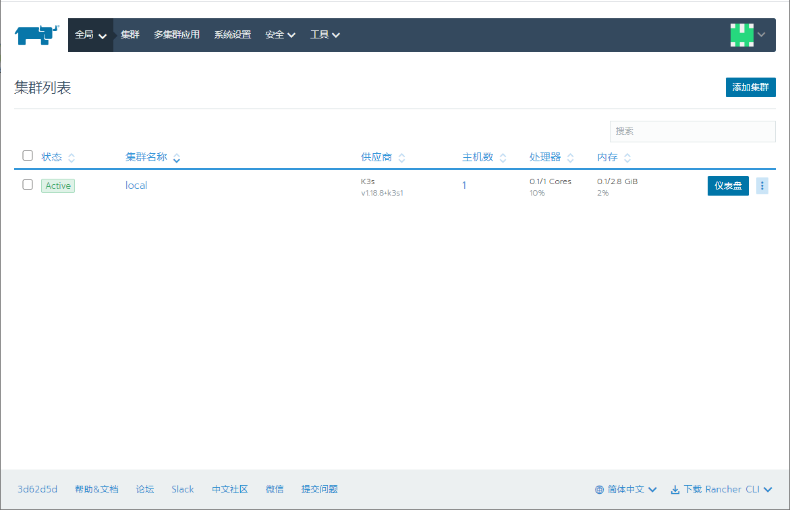

### 修改Nacos配置

> 将项目`config`目录下的所有配置都添加到Nacos中，由于应用服务都部署到了K8S中，所以需要修改相关配置。

- 将配置信息添加到Nacos中后显示信息如下，Nacos访问地址：http://192.168.3.101:8848/nacos/index.html

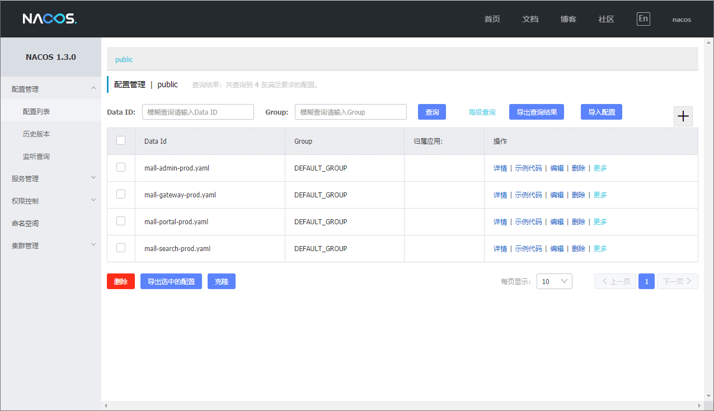

- 修改`mall-admin-prod.yaml`配置，修改MySql和Redis连接地址即可，之前是通过`--link`的形式访问的，这次需要改为IP进行访问；

```yaml
spring:
  datasource:
    url: jdbc:mysql://192.168.3.101:3306/mall?useUnicode=true&characterEncoding=utf-8&serverTimezone=Asia/Shanghai
    username: root
    password: root
  redis:
    host: 192.168.3.101 # Redis服务器地址
    database: 0 # Redis数据库索引（默认为0）
    port: 6379 # Redis服务器连接端口
    password: #不设置密码
```

- 修改`mall-gateway-prod.yaml`配置，修改Redis连接地址及JWT的publicKey访问地址即可（当在K8S中创建服务后，可以通过服务名进行访问）；

```yaml
spring:
  redis:
    host: 192.168.3.101 # Redis服务器地址
    database: 0 # Redis数据库索引（默认为0）
    port: 6379 # Redis服务器连接端口
    password: #不设置密码
  security:
    oauth2:
      resourceserver:
        jwt:
          jwk-set-uri: 'http://mall-gateway-service:8201/mall-auth/rsa/publicKey'
```

- 修改`mall-portal-prod.yaml`配置，修改MySql、MongoDb、Redis、RabbitMq连接地址即可；

```yaml
spring:
  datasource:
    url: jdbc:mysql://192.168.3.101:3306/mall?useUnicode=true&characterEncoding=utf-8&serverTimezone=Asia/Shanghai
    username: root
    password: root
  data:
    mongodb:
      host: 192.168.3.101
      port: 27017
      database: mall-port
  redis:
    host: 192.168.3.101 # Redis服务器地址
    database: 0 # Redis数据库索引（默认为0）
    port: 6379 # Redis服务器连接端口
    password: #不设置密码
  rabbitmq:
    host: 192.168.3.101
    port: 5672
    virtual-host: /mall
    username: mall
    password: mall
    publisher-confirms: true #如果对异步消息需要回调必须设置为true
```

- 修改`mall-search-prod.yaml`配置，修改MySql、Elasticsearch连接地址即可。

```yaml
spring:
  datasource:
    url: jdbc:mysql://192.168.3.101:3306/mall?useUnicode=true&characterEncoding=utf-8&serverTimezone=Asia/Shanghai
    username: root
    password: root
  elasticsearch:
    rest:
      uris: http://192.168.3.101:9200
```

### 使用Rancher部署应用

> 当使用Rancher创建Deployment时，如果镜像下载过慢会出现超时，可以进入到Rancher容器中手动进行下载。

- 首先进入Rancher容器内部；

```bash
docker exex -it rancher /bin/bash
```

- 通过`crictl`命令下载应用镜像，下载过程有点慢而且没有进度条，需要耐心等待；

```bash
k3s crictl pull macrodocker/mall-gateway:1.0-SNAPSHOT
k3s crictl pull macrodocker/mall-auth:1.0-SNAPSHOT
k3s crictl pull macrodocker/mall-monitor:1.0-SNAPSHOT
k3s crictl pull macrodocker/mall-admin:1.0-SNAPSHOT
k3s crictl pull macrodocker/mall-portal:1.0-SNAPSHOT
k3s crictl pull macrodocker/mall-search:1.0-SNAPSHOT
```
- 下载完成后查看镜像显示内容如下；

```bash
root@ae85f823208f:/var/lib/rancher# k3s crictl images |grep macrodocker
docker.io/macrodocker/mall-admin     1.0-SNAPSHOT        15737ce903a94       308MB
docker.io/macrodocker/mall-auth      1.0-SNAPSHOT        72df5f91f2d74       293MB
docker.io/macrodocker/mall-gateway   1.0-SNAPSHOT        4055dfc1e6016       301MB
docker.io/macrodocker/mall-monitor   1.0-SNAPSHOT        492d9bb4375c6       291MB
docker.io/macrodocker/mall-portal    1.0-SNAPSHOT        8dd79675f40c1       312MB
docker.io/macrodocker/mall-search    1.0-SNAPSHOT        f0d0d80c590f1       325MB
```

- 镜像都下载完成后，我们就可以使用Rancher来可视化创建Deployment了，这里以`YAML`的方式来创建；

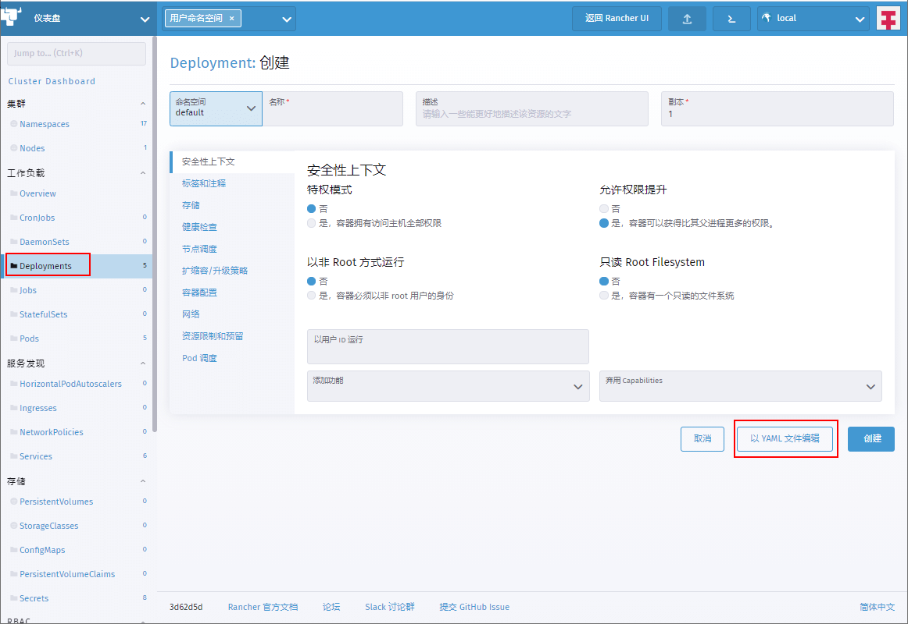

- 直接将项目`k8s`文件夹中的`mall-admin-deployment.yaml`文件内容复制下即可；

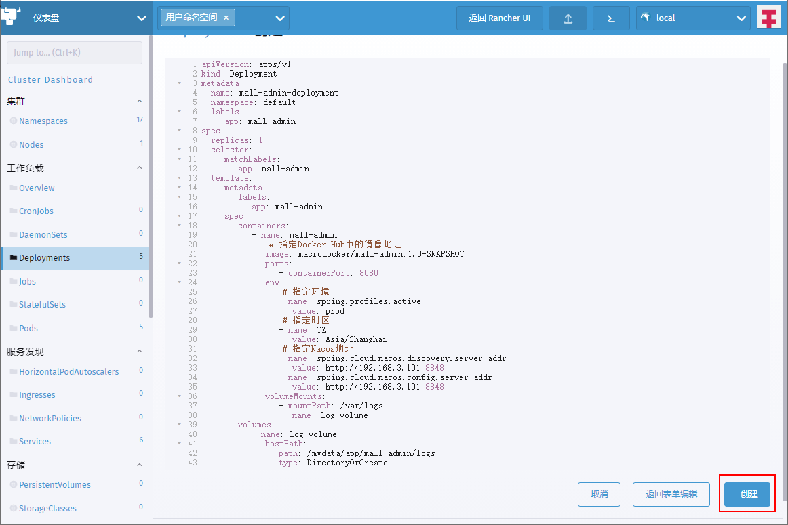

- 之后再使用`mall-admin-service.yaml`文件创建Service；

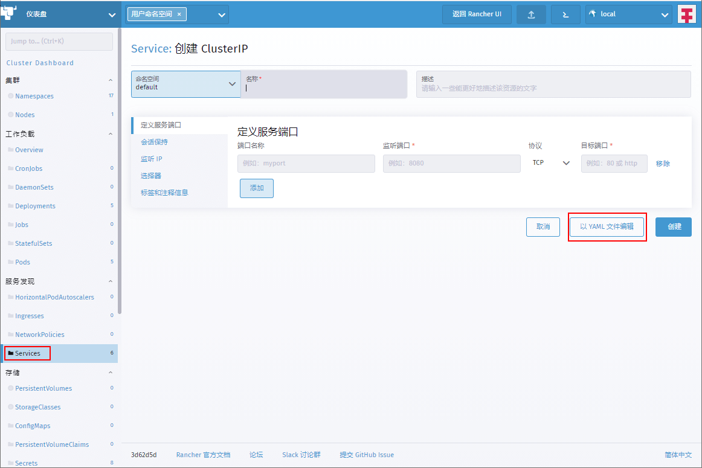

- 这里仅以`mall-admin`应用为例创建Deployment和Service，其他应用创建过程基本相同，脚本均在项目的k8s文件夹中。

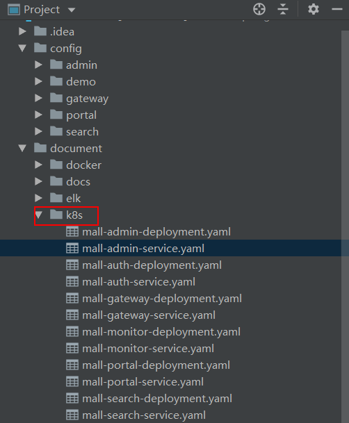

## 效果展示

> 使用Rancher部署完所有应用服务之后，让我们来看看效果。

- 首先查看所有创建的Deployment；

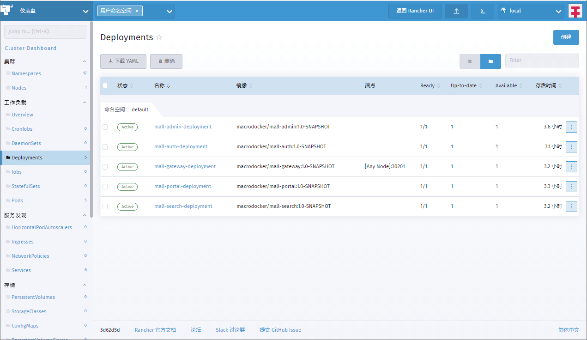

- 查看所有创建的Service；

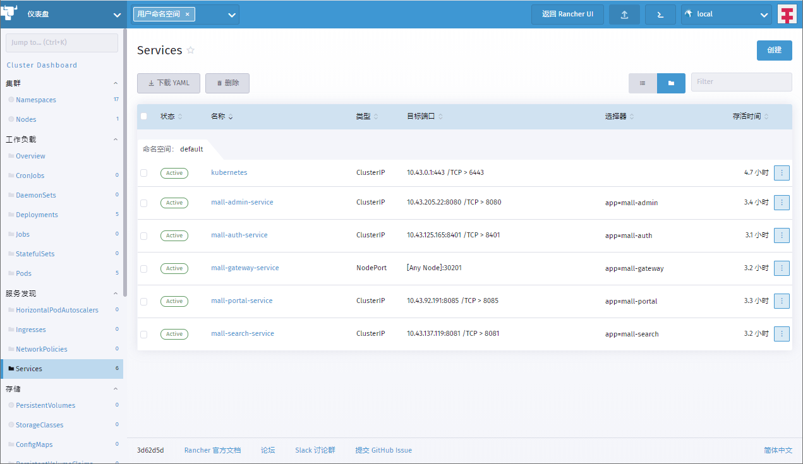

- 如果你想查看应用的启动日志，在Pod列表查看即可；

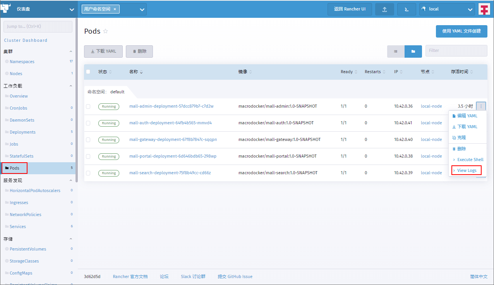

- 由于应用服务被部署在Rancher容器内部，无法直接访问，我们可以使用Nginx反向代理来访问，Nginx服务运行在`2080`端口上；

```bash
docker run -p 2080:2080 --name nginx \
-v /mydata/nginx/html:/usr/share/nginx/html \
-v /mydata/nginx/logs:/var/log/nginx  \
-v /mydata/nginx/conf:/etc/nginx \
-d nginx:1.10
```

- 接下来需要获得Rancher容器运行的IP地址，使用如下命令即可；

```bash
[root@linux-local ~]# docker inspect rancher |grep IPAddress
            "SecondaryIPAddresses": null,
            "IPAddress": "172.17.0.2",
                    "IPAddress": "172.17.0.2",
```

- 创建完Nginx容器后，添加配置文件`api.conf`，将`api.macrozheng.com`域名的访问反向代理到K8S中的`mall-gateway-service`服务上去；

```
server {
    listen       2080;
    server_name  api.macrozheng.com; #修改域名

    location / {
        proxy_set_header Host $host:$server_port;
        proxy_pass   http://172.17.0.2:30201; #修改为代理服务地址
        index  index.html index.htm;
    }

    error_page   500 502 503 504  /50x.html;
    location = /50x.html {
        root   /usr/share/nginx/html;
    }

}
```

- 再修改访问Linux服务器的本机host文件，添加如下记录；

```
192.168.3.102 api.macrozheng.com
```

- 其实也可以不用Nginx来进行反向代理，创建容器的时候将`mall-gateway-service`的端口映射出来即可；

```bash
docker run -p 80:80 -p 443:443 -p 8201:30201 --name rancher \
--privileged \
--restart=unless-stopped \
-d rancher/rancher:v2.5-head
```

- 通过Nginx即可访问`mall-swarm`的接口文档，访问地址：http://api.macrozheng.com:2080/doc.html

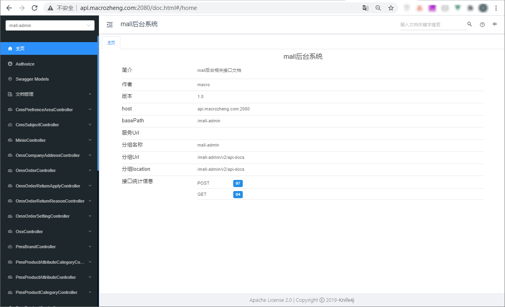

## 总结

通过把`mall-swarm`项目部署到K8S上，我们可以发现K8S也没有想象中到那么难，K8S中的很多东西都是和Docker相通的！当我们听到消息称某个新技术要取代旧技术了，往往会困惑我们学的那些旧技术是不是过时了，没用了？其实我们大可不必担心，往往新技术都是在旧技术的基础上产生的，而且那些会旧技术的人会更容易掌握新技术！

## K8S系列教程

> 再次推荐一波我的K8S系列教程，K8S实战看这些就对了！

- [K8S太火了！花10分钟玩转它不香么？](https://mp.weixin.qq.com/s/N-9xVPYO_VVL5JZu5UPbtQ)
- [自从上了K8S，项目更新都不带停机的！](https://mp.weixin.qq.com/s/dwrxKr4ONfzCLn01QbkpQg)
- [我把SpringBoot应用部署到了K8S上，怎么感觉用起来像Docker！](https://mp.weixin.qq.com/s/RXAQtsNXUS2kiSCMFDxKqA)
- [再见命令行！K8S傻瓜式安装，图形化管理真香！](https://mp.weixin.qq.com/s/NOkaYGz9ZT3bsG1J7yXVRA)
- [看看人家那开源项目文档写的，那叫一个友好！](https://mp.weixin.qq.com/s/a7w2qvDg8c2BEQU7A1NqaA)
- [据说只有高端机器才配运行K8S，网友：1G内存的渣渣跑起来了！](https://mp.weixin.qq.com/s/iDG7Wzq9DQHLFPtnqokOxQ)
- [再见 Docker ！5分钟转型 containerd !](https://mp.weixin.qq.com/s/jBP7E7DL5vJ0zp5UnSFNBg)

## 项目源码地址

https://github.com/macrozheng/mall-swarm

## 公众号


