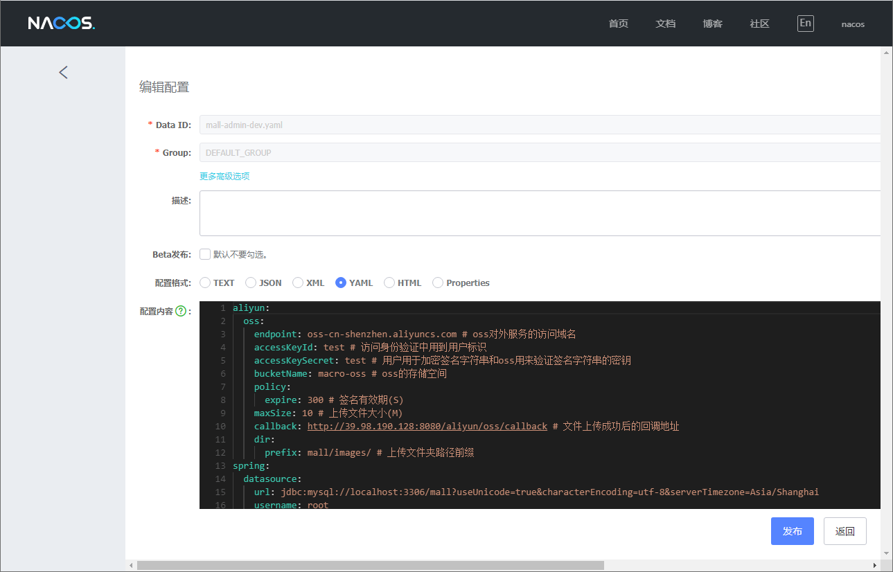
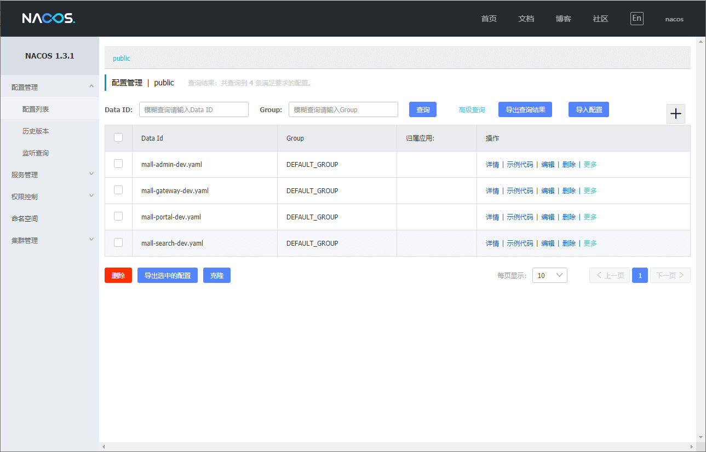
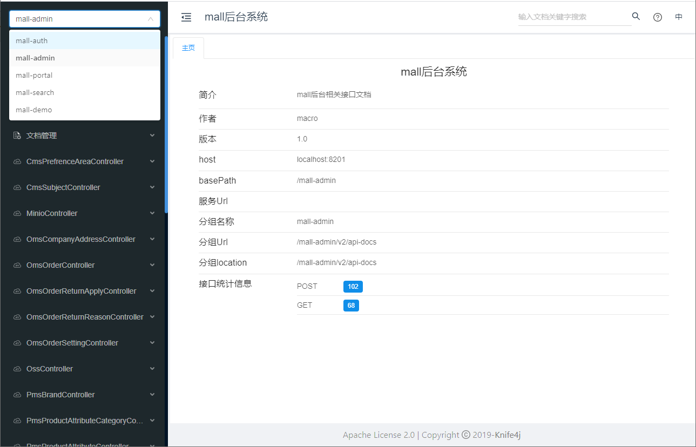
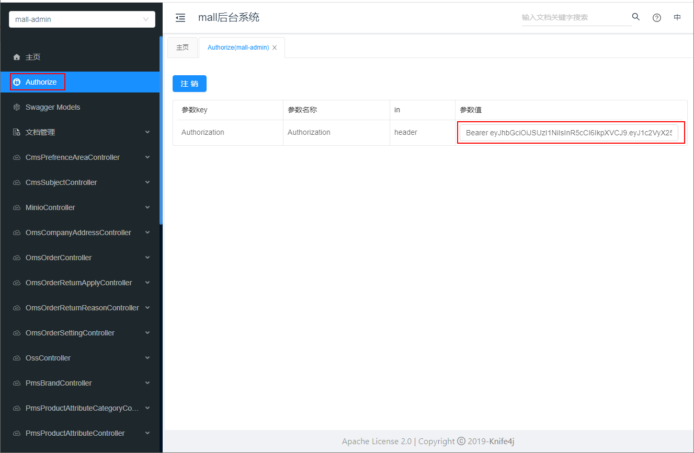
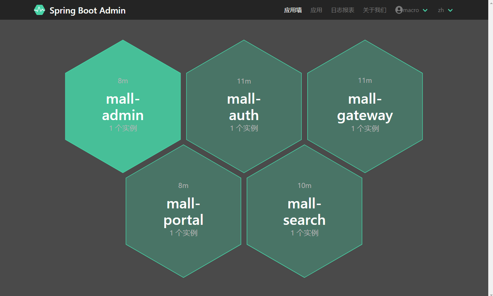
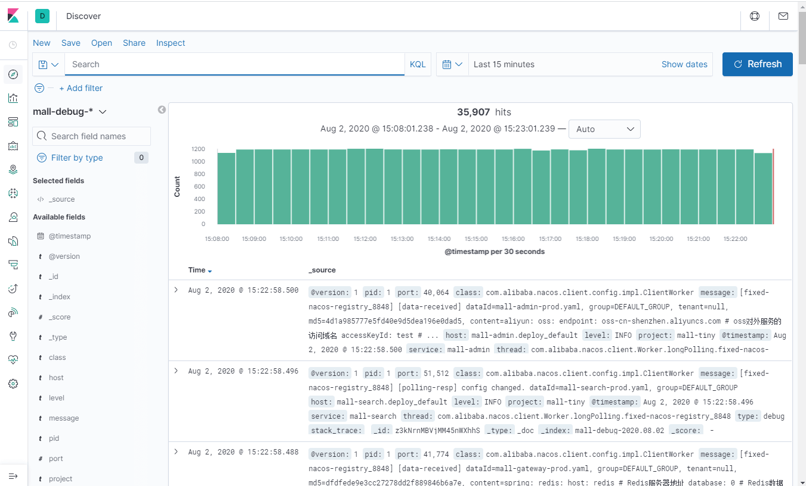

mall项目全套学习教程连载中，[关注公众号](#公众号)第一时间获取。

# mall-swarm在Windows环境下的部署

## 开发环境搭建

> `mall-swarm`中使用到的环境和`mall`项目中大致相同，具体可以查看[mall在Windows环境下的部署](http://www.macrozheng.com/#/deploy/mall_deploy_windows)。

### 简易环境搭建流程

- 安装IDEA并导入项目源码；

- 安装MySQL，创建一个`mall`数据库，并导入`/document/sql/mall.sql`文件；

- 安装Redis、Elasticsearch、MongoDB、RabbitMQ等环境。

### Nacos注册中心搭建

- 由于使用了Nacos注册中心，我们需要先搭建Nacos注册中心，下载地址：https://github.com/alibaba/nacos/releases/download/1.3.1/nacos-server-1.3.1.zip

- 下载完成后解压到指定文件夹，使用bin目录下的`startup.cmd`启动Nacos服务，访问地址：http://localhost:8848/nacos/

- 将项目`config`目录下的配置文件添加到`Nacos`中，只要添加包含`dev`的配置即可，配置文件的文件名称需要和Nacos中的`Data Id`一一对应；

## 项目部署

> `mall-swarm`项目启动有先后顺序，大家可以按照以下顺序启动。

- 启动网关服务`mall-gateway`，直接运行`MallGatewayApplication`的main函数即可；

- 启动认证中心`mall-auth`，直接运行`MallAuthApplication`的main函数即可；

- 启动后台管理服务`mall-admin`，直接运行`MallAdminApplication`的main函数即可；

- 启动前台服务`mall-portal`，直接运行`MallPortalApplication`的main函数即可；

- 启动搜索服务`mall-search`，直接运行`MallSearchApplication`的main函数即可；

- 启动监控中心`mall-monitor`，直接运行`MallMonitorApplication`的main函数即可；

- 运行完成后可以通过监控中心查看监控信息，账号密码为`macro:123456`：http://localhost:8101

- 运行完成后可以直接通过如下地址访问API文档：http://localhost:8201/doc.html

- 如何访问需要登录的接口，先调用认证中心接口获取token，后台管理`client_id`和`client_secret`为`admin-app:123456`，前台系统为`portal-app:123456`；

- 然后将token添加到请求头中，即可访问需要权限的接口了。

## 效果展示

- 注册中心服务信息，访问地址：http://localhost:8848/nacos/

- 监控中心服务概览信息，访问地址：http://localhost:8101

- 日志收集系统信息，访问地址：http://localhost:5601

## 公众号

