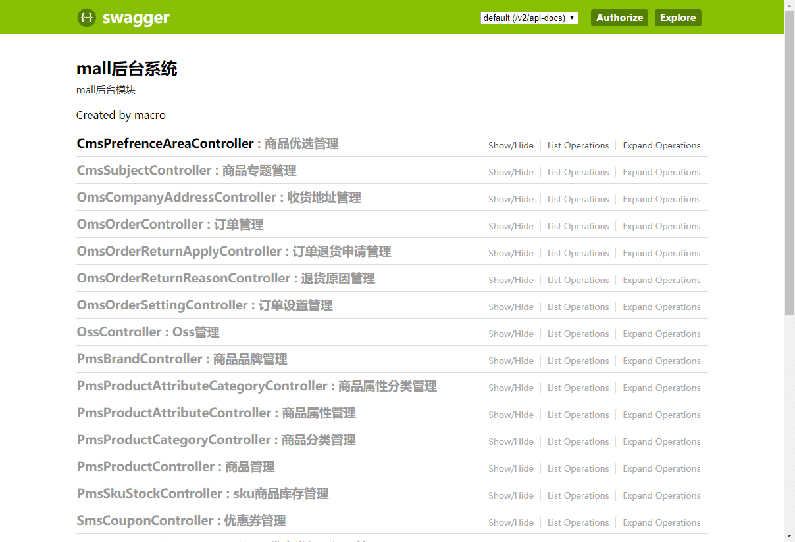
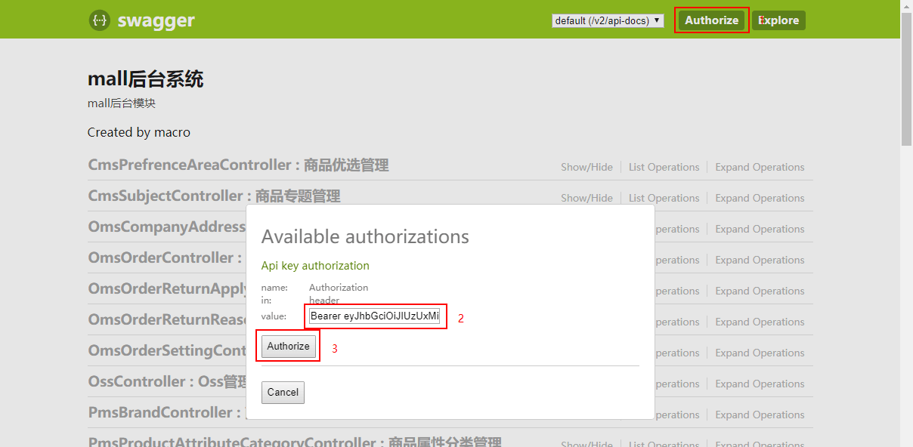
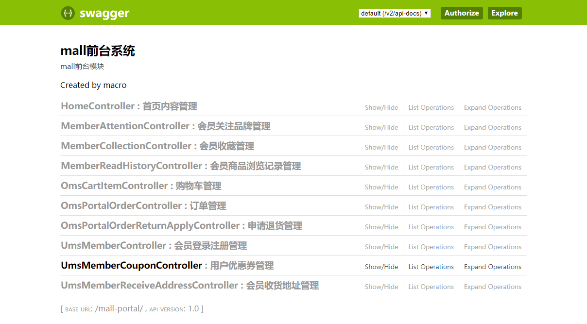
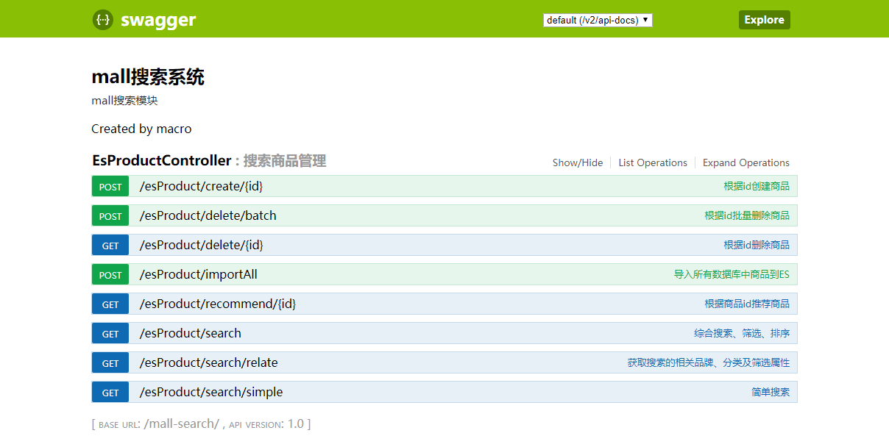
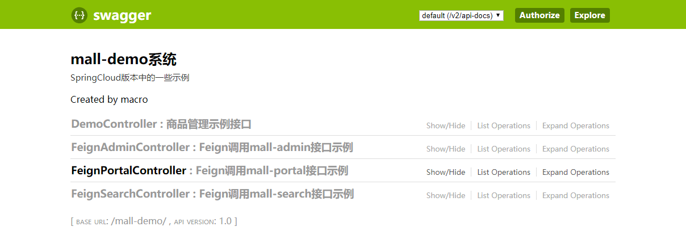
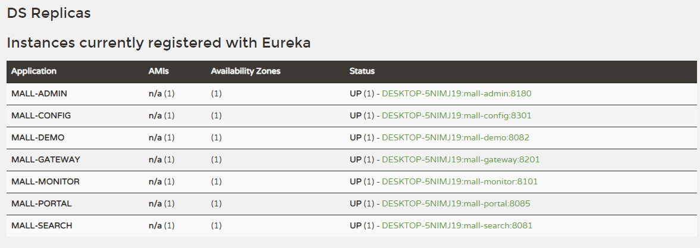
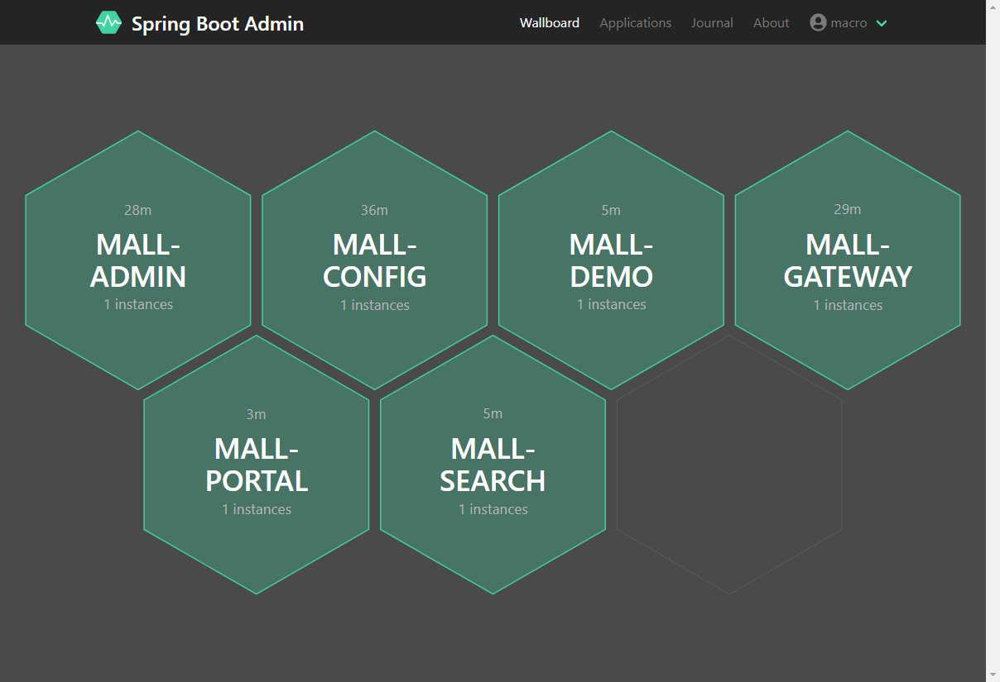
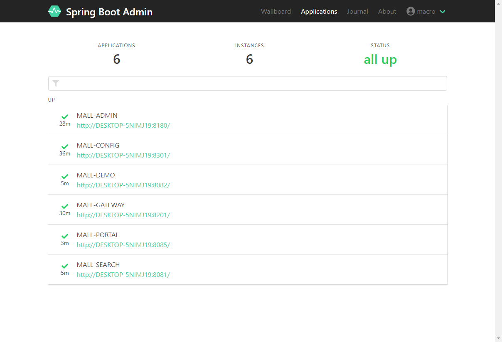
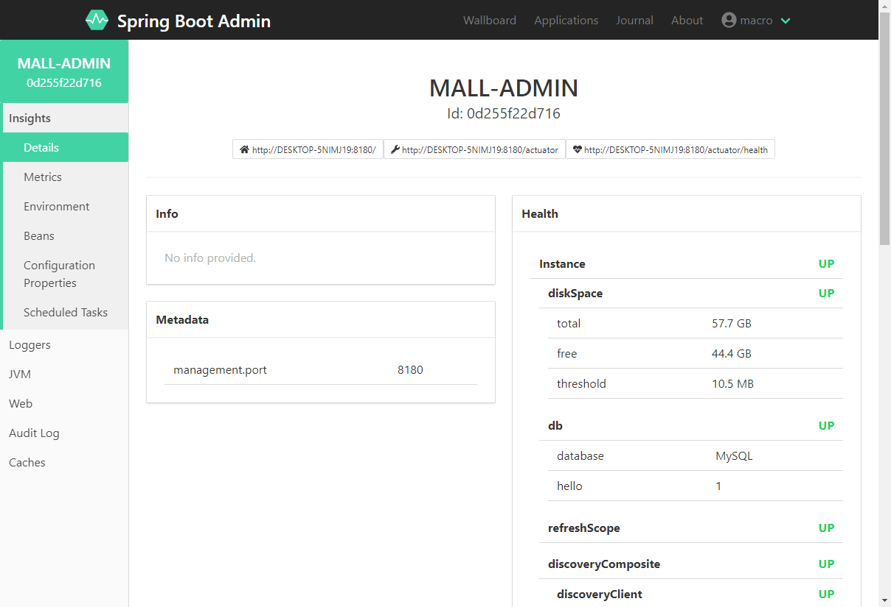
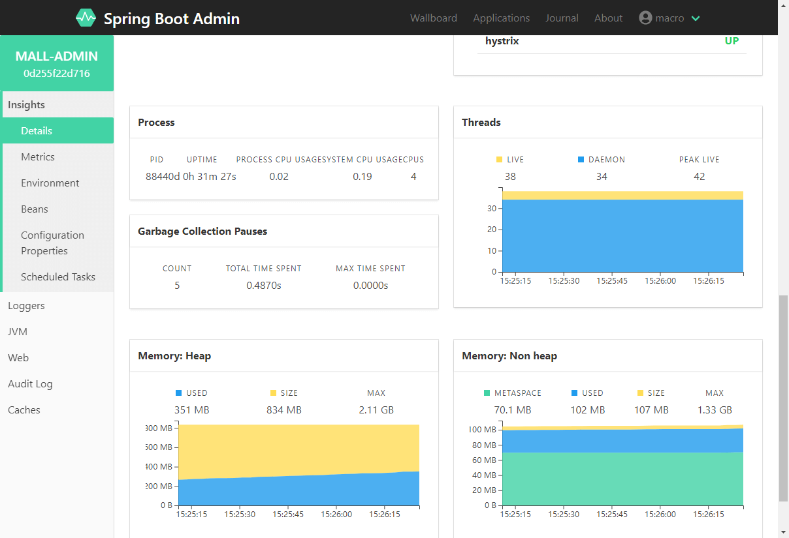

mall项目全套学习教程连载中，[关注公众号](#公众号)第一时间获取。

# mall-swarm在Windows环境下的部署

## 开发环境搭建

> `mall-swarm`中使用到的环境和`mall`项目中大致相同，具体可以查看[mall在Windows环境下的部署](/deploy/mall_deploy_windows.md)。

简易环境搭建流程：

- 安装IDEA并导入项目源码；
- 安装MySql，创建一个`mall`数据库，并导入`/document/sql/mall.sql`文件；
- 安装Redis、Elasticsearch、MongoDB、RabbitMQ等环境。

## 项目部署

> `mall-swarm`项目启动有先后顺序，大家要按照以下顺序启动。

### 启动注册中心`mall-registory`

- 直接运行com.macro.mall.MallRegistryApplication的main函数即可；
- 运行完成后可以通过注册中心控制台查看：http://localhost:8001

### 启动配置中心`mall-config`

- 直接运行com.macro.mall.MallConfigApplication的main函数即可；
- 访问以下接口获取mall-admin在dev环境下的配置信息：http://localhost:8301/master/admin-dev.yml

### 启动监控中心`mall-monitor`

- 直接运行com.macro.mall.MallMonitorApplication的main函数即可；
- 运行完成后可以通过监控中心控制台查看：http://localhost:8101
- 输入账号密码`macro:123456`可以登录查看。

### 启动网关服务`mall-gateway`

- 直接运行com.macro.mall.MallGatewayApplication的main函数即可；
- 访问以下接口获取动态路由规则：http://localhost:8201/actuator/gateway/routes

### 启动后台管理服务`mall-admin`

- 直接运行com.macro.mall.MallAdminApplication的main函数即可；
- 通过`mall-gateway`网关服务访问接口文档：http://localhost:8201/mall-admin/swagger-ui.html

- 登录接口地址：http://localhost:8201/mall-admin/admin/login
- 访问登录接口获取到token后放入认证的头信息即可正常访问其他需要登录的接口：

### 启动前台服务`mall-portal`

- 直接运行com.macro.mall.portal.MallPortalApplication的main函数即可；
- 通过`mall-gateway`网关服务访问接口文档：http://localhost:8201/mall-portal/swagger-ui.html

- 登录接口地址：http://localhost:8201/mall-portal/sso/login
- 调用需要登录的接口方式同`mall-admin`。

### 启动搜索服务`mall-search`

- 直接运行com.macro.mall.search.MallSearchApplication的main函数即可；
- 通过`mall-gateway`网关服务访问接口文档：http://localhost:8201/mall-search/swagger-ui.html

### 启动测试服务`mall-demo`

- 直接运行com.macro.mall.MallAdminApplication的main函数即可；
- 通过`mall-gateway`网关服务访问接口文档：http://localhost:8201/mall-demo/swagger-ui.html

- 可以通过调用FeignAdminController、FeignPortalController、FeignSearchController来测试使用Feign的远程调用功能。

## 效果展示

- 注册中心服务信息：

- 监控中心服务概览信息：

- 监控中心单应用详情信息：

## 公众号

