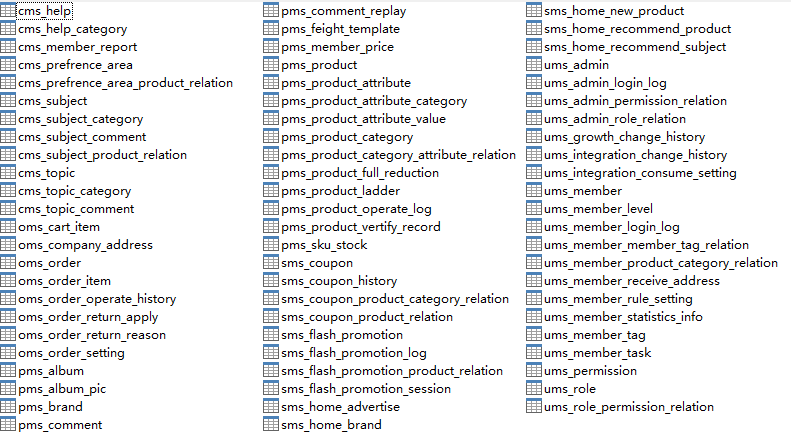

mall项目全套学习教程连载中，[关注公众号](#公众号)第一时间获取。

# mall架构及功能概览

> mall架构、功能及数据库结构概览

## mall项目简介

mall项目是一套电商系统，包括前台商城系统及后台管理系统，基于SpringBoot+MyBatis实现。 前台商城系统包含首页门户、商品推荐、商品搜索、商品展示、购物车、订单流程、会员中心、客户服务、帮助中心等模块。 后台管理系统包含商品管理、订单管理、会员管理、促销管理、运营管理、内容管理、统计报表、财务管理、权限管理、设置等模块。

## 项目演示

- 后台项目演示：[http://www.macrozheng.com/admin/index.html](http://www.macrozheng.com/admin/index.html)
- 移动端项目演示：[http://www.macrozheng.com/app/index.html](http://www.macrozheng.com/app/index.html)

## mall中使用的技术

> mall采用现阶主流技术实现，涵盖了一般项目中几乎所有使用的技术。

技术 | 版本 | 说明
----|----|----
Spring Boot | 2.1.3 | 容器+MVC框架
Spring Security | 5.1.4 | 认证和授权框架
MyBatis | 3.4.6 | ORM框架  
MyBatisGenerator | 1.3.3 | 数据层代码生成
PageHelper | 5.1.8 | MyBatis物理分页插件
Swagger-UI | 2.7.0 | 文档生产工具
Elasticsearch | 6.2.2 | 搜索引擎
RabbitMq |3.7.14 | 消息队列
Redis | 3.2 | 分布式缓存
MongoDb | 3.2 | NoSql数据库
Docker | 18.09.0 | 应用容器引擎
Druid | 1.1.10 | 数据库连接池
OSS | 2.5.0 | 对象存储
JWT | 0.9.0 | JWT登录支持
Lombok | 1.18.6 | 简化对象封装工具

## mall实现的功能概览

> 具体可以看下演示地址，亲自体验下：[http://www.macrozheng.com/admin/index.html](http://www.macrozheng.com/admin/index.html)

- 商品模块
  - 商品管理
  - 商品分类管理
  - 商品类型管理
  - 品牌管理
- 订单模块
  - 订单管理
  - 订单设置
  - 退货申请处理
  - 退货原因设置
- 营销模块
  - 秒杀活动管理
  - 优惠价管理
  - 品牌推荐管理
  - 新品推荐管理
  - 人气推荐管理
  - 专题推荐管理
  - 首页广告管理

## mall数据库表概览
> mall项目目前有71张数据表，业务逻辑有一定复杂度，平时做项目参考也够了。

### 数据库表前缀说明

- cms_*：内容管理模块相关表
- oms_*：订单管理模块相关表
- pms_*：商品模块相关表
- sms_*：营销模块相关表
- ums_*：会员模块相关表

## 公众号

