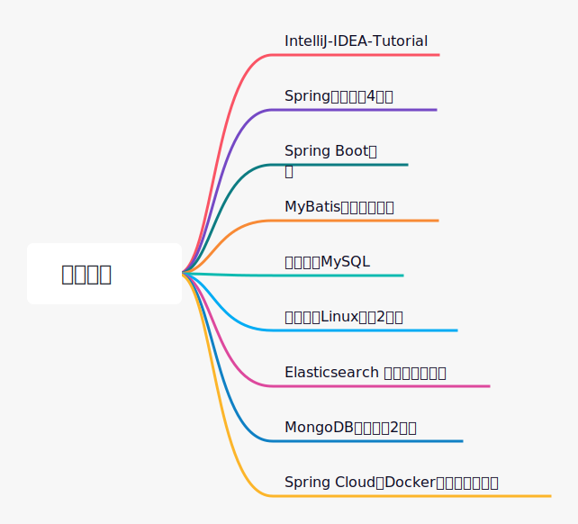
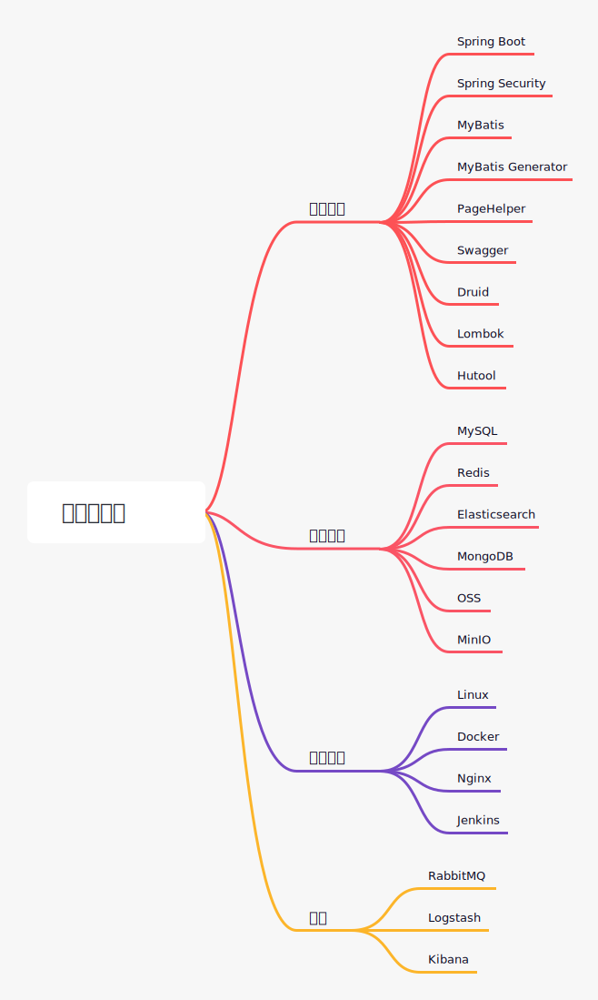
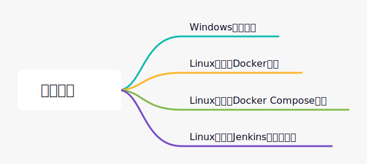
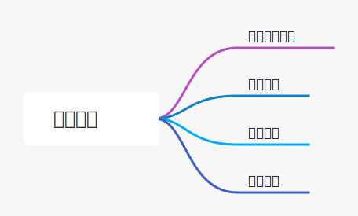
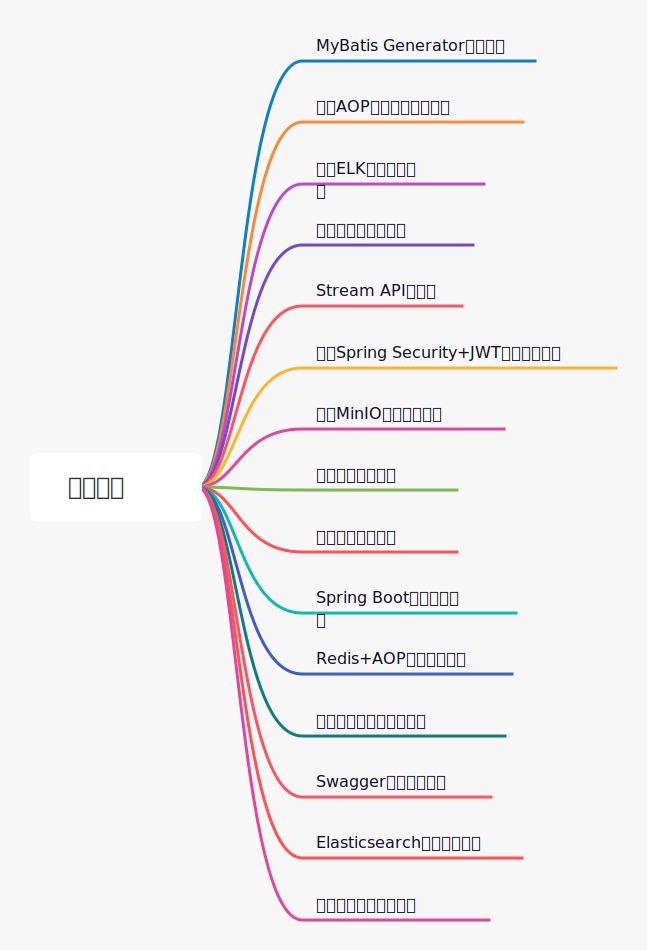
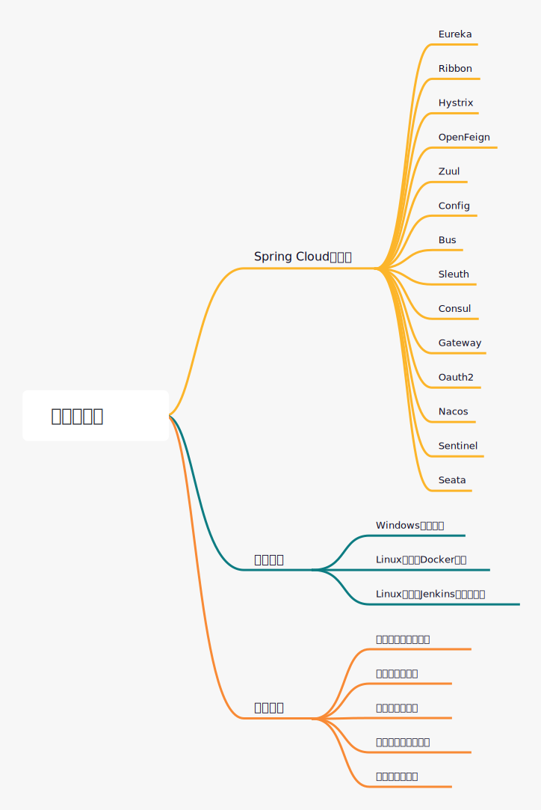
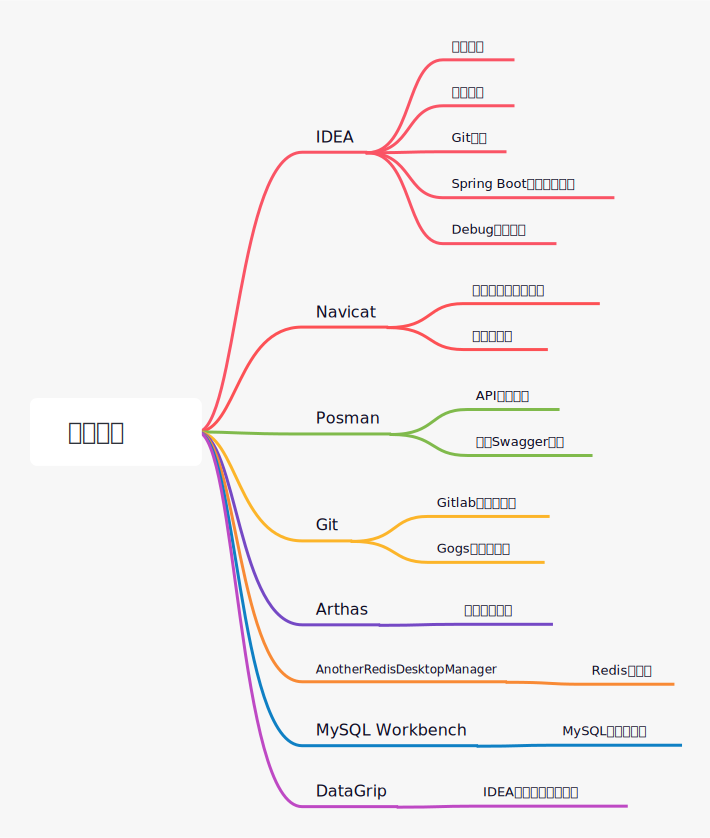

# Mall电商实战项目专属学习路线，主流技术一网打尽！

> 之前经常有朋友问我，mall项目该如何学习，按照什么顺序学习？我一般都会把《mall学习教程》的目录发给他，希望他按照教程顺序学习。我一直认为基于项目实战的学习，可以更好的掌握技术。mall项目是个综合项目，学习它既可以掌握主流技术又可以获得项目经验。为了让大家学习mall项目时，少走弯路，最近又整理了个更好的学习路线，希望对大家有所帮助！

## 推荐资料

由于mall项目涵盖了现阶段主流技术，如果你是个Java初学者的话，最好先看下面的资料打个基础，资料具体介绍可以参考[mall学习所需知识点](../foreword/mall_foreword_01.md)。

## 学习后端技术栈

如果你对Java有一定的经验，基础还可以的话，直接学习mall项目中所运用的技术即可。学习开源项目的第一步，一般都是要把开源项目中运用的技术学习一遍，这样可以为你搭建项目和阅读项目源码打下扎实的基础。其实在我们学习开源项目的时候，最主要的还是学习项目中所用到的技术，业务反而是次要的。因为我们做不同项目的时候，业务都会有所不同，反而使用到的技术却相差不多。

我们先来看下，mall项目中用到了哪些主流技术：

在《mall学习教程》参考篇当中，很多主流技术都有讲解了，其实学习这些知识点，看这些文章基本就够了。学习mall项目遇到没学过的技术不愁，看《mall学习教程》参考篇就对了！

项目框架搭建方面的技术可以参考如下文章：

- [Spring Boot入门教程](../reference/springboot_start.md)
- [Spring Boot整合MyBatis，并使用MyBatis Generator生成代码](../reference/mybatis_generator_start.md)
- [Spring Boot整合Swagger使用教程](../reference/swagger_starter.md)
- [Lombok使用教程](../reference/lombok_start.md)
- [Hutool使用教程](../reference/hutool_start.md)

项目数据存储方面的技术可以参考如下文章：

- [常用MySQL命令整理](../reference/mysql.md)
- [Spring Boot整合Redis使用教程](../reference/spring_data_redis.md)
- [Elasticsearch入门教程](../reference/elasticsearch_start.md)
- [MongoDB入门教程](../reference/mongodb_start.md)
- [MinIO入门教程](../reference/minio.md)

项目运维部署方面的技术可以参考如下文章：

- [在虚拟机中安装使用Linux的教程](../reference/linux_install.md)
- [常用Linux命令整理](../reference/linux_command.md)
- [常用Docker命令整理](../reference/docker_command.md)
- [使用Maven插件为Spring Boot应用构建Docker镜像](../reference/docker_maven.md)
- [使用Docker Compose部署SpringBoot应用](../reference/docker_compose.md)
- [Nginx使用教程](../reference/nginx.md)
- [Nginx支持HTTPS](../reference/nginx_https_start.md)
- [使用Jenkins自动化部署Spring Boot应用](../reference/jenkins.md)
- [使用Jenkins自动化部署Vue前端应用](../reference/jenkins_vue.md)

其他项目中运用到的技术可以参考：

- [RabbitMQ使用教程](../reference/rabbitmq_start.md)
- [ELK日志收集系统搭建教程](../reference/mall_elk_advance.md)
- [Kibana设置密码保护教程](../reference/elk_security.md)

## 搭建项目骨架

在我们平时开发项目的时候，一般会先搭建一个项目骨架，当我们能自己搭建项目骨架，并使用它开发一些功能的时候，基本就能熟练运用骨架中的技术了。学会搭建项目骨架，离成为独当一面的程序员就不远了。《mall学习教程》中的架构篇就是一套教你搭建项目骨架的教程，照着下面的教程一步步搭建，就可以搭建出一个mall项目正在使用的项目骨架。

先看下都有哪些步骤：

项目骨架搭建可以参考如下文章：

- [mall整合SpringBoot+MyBatis搭建基本骨架](../architect/mall_arch_01.md)
- [mall整合Swagger-UI实现在线API文档](../architect/mall_arch_02.md)
- [mall整合Redis实现缓存功能](../architect/mall_arch_03.md)
- [mall整合SpringSecurity和JWT实现认证和授权（一）](../architect/mall_arch_04.md)
- [mall整合SpringSecurity和JWT实现认证和授权（二）](../architect/mall_arch_05.md)
- [mall整合SpringTask实现定时任务](../architect/mall_arch_06.md)
- [mall整合Elasticsearch实现商品搜索](../architect/mall_arch_07.md)
- [mall整合Mongodb实现文档操作](../architect/mall_arch_08.md)
- [mall整合RabbitMQ实现延迟消息](../architect/mall_arch_09.md)
- [mall整合OSS实现文件上传](../architect/mall_arch_10.md)

## 项目部署

学习完《mall学习教程》架构篇之后，使用《mall学习教程》参考篇中提到的运维部署技术，就可以将mall项目跑起来了，这里提供了多种部署方式，总有一种适合你的。

看下mall项目都提供了哪些部署方式：

mall后端项目部署可以参考如下文章：

- [mall在Windows环境下的部署](../deploy/mall_deploy_windows.md)
- [mall在Linux环境下的部署（基于Docker容器）](../deploy/mall_deploy_docker.md)
- [mall在Linux环境下的部署（基于Docker Compose）](../deploy/mall_deploy_docker_compose.md)
- [mall在Linux环境下的自动化部署（基于Jenkins）](../deploy/mall_deploy_jenkins.md)

mall前端项目部署可以参考如下文章：

- [mall前端项目的安装与部署](../deploy/mall_deploy_web.md)

## 学习电商业务

项目跑起来以后，熟悉一下项目有哪些功能是很有必要的。一边熟悉功能，一边熟悉表结构，如果你能把表和相关功能都对应上，那么学习mall项目的业务基本就没什么问题了。

下面是mall中已经实现了的业务模块，mall项目中的功能结构可以直接参考：[mall数据库表结构概览](../database/mall_database_overview.md)

如果你想知道更细致的数据库表和功能的对应关系，可以参考《mall学习教程》业务篇中的文章：

- [商品模块数据库表解析（一）](../database/mall_pms_01.md)
- [商品模块数据库表解析（二）](../database/mall_pms_02.md)
- [订单模块数据库表解析（一）](../database/mall_oms_01.md)
- [订单模块数据库表解析（二）](../database/mall_oms_02.md)
- [订单模块数据库表解析（三）](../database/mall_oms_03.md)
- [营销模块数据库表解析（一）](../database/mall_sms_01.md)
- [营销模块数据库表解析（二）](../database/mall_sms_02.md)
- [营销模块数据库表解析（三）](../database/mall_sms_03.md)
- [权限管理功能设计与优化](../database/mall_permission.md)
- [商品SKU功能设计与优化](../technology/product_sku.md)

## 解析技术要点

熟悉了项目的业务之后，接下来就是阅读项目的源码了，通过阅读源码可以更清晰地知道每个功能的具体实现。我们可以按模块来学习项目源码，比如按照`权限管理->商品模块->订单模块->营销模块`这样的顺序。通过使用功能，捕获功能中调用的接口路径，然后查看接口的代码来阅读源码。

来看下都有哪些技术要点值得解析的：

如果你在项目中遇到了一些问题，可以参考《mall学习教程》技术要点篇中的文章，这些文章都是业务与技术结合比较多的技术解析：

- [MyBatis Generator使用过程中踩过的一个坑](../technology/mybatis_mapper.md)
- [SpringBoot应用中使用AOP记录接口访问日志](../technology/aop_log.md)
- [SpringBoot应用整合ELK实现日志收集](../technology/mall_tiny_elk.md)
- [前后端分离项目，如何解决跨域问题](../technology/springboot_cors.md)
- [Java 8都出那么久了，Stream API了解下？](../technology/java_stream.md)
- [仅需四步，整合SpringSecurity+JWT实现登录认证 ！](../technology/springsecurity_use.md)
- [前后端分离项目，如何优雅实现文件存储！](../technology/minio_use.md)
- [手把手教你搞定权限管理，结合Spring Security实现接口的动态权限控制！](../technology/permission_back.md)
- [手把手教你搞定权限管理，结合Vue实现菜单的动态权限控制！](../technology/permission_front.md)
- [SpringBoot中处理校验逻辑的两种方式，真的很机智！](../technology/springboot_validator.md)
- [使用Redis+AOP优化权限管理功能，这波操作贼爽！](../technology/redis_permission.md)
- [Elasticsearch项目实战，商品搜索功能设计与实现！](../technology/product_search.md)
- [给Swagger升级了新版本，没想到居然有这么多坑！](../technology/swagger_upgrade.md)
- [Elasticsearch 升级 7.x 版本后，我感觉掉坑里了！](../technology/elasticsearch_upgrade.md)
- [搞定Mall项目中的权限管理功能，弄懂这些问题就妥了！](../technology/mall_permission_question.md)

## 学习前端技术栈

如何你想做个全栈开发的话，可以学习下mall的前端项目`mall-admin-web`。`mall-admin-web`采用Vue+Element-UI实现，《mall学习教程》中并没有专门的前端教程，学习前端的话这里有个学习方法，具体参考[如何在5天内学会Vue？聊聊我的学习方法！](../mine/vue_learning.md)。当你掌握了下面这些前端技术之后，可以看下`mall-admin-web`的源码，还是推荐按模块学习，可以先看下权限管理模块的源码，看懂这个模块，基本就可以看懂所有前端源码了。

## 进阶微服务

最近微服务技术很火，Java程序员哪有不会点微服务技术的？Spring Cloud是Java体系中主流的微服务技术，mall-swarm是mall项目的微服务版本，基于Spring Cloud技术栈。如果你想进阶学习微服务的话，学习mall-swarm项目准没错。下面是我们学习微服务需要掌握的一些内容，一份涵盖Spring Cloud&Alibaba核心组件的学习教程。

首先我们得学习下Spring Cloud&Alibaba中的核心组件，对Spring Cloud技术栈有个深入的了解，可以参考下面的文章：

- [Spring Cloud 整体架构概览](../cloud/springcloud.md)
- [Spring Cloud Eureka：服务注册与发现](../cloud/eureka.md)
- [Spring Cloud Ribbon：负载均衡的服务调用](../cloud/ribbon.md)
- [Spring Cloud Hystrix：服务容错保护](../cloud/hystrix.md)
- [Hystrix Dashboard：断路器执行监控](../cloud/hystrix_dashboard.md)
- [Spring Cloud OpenFeign：基于 Ribbon 和 Hystrix 的声明式服务调用](../cloud/feign.md)
- [Spring Cloud Zuul：API网关服务](../cloud/zuul.md)
- [Spring Cloud Config：外部集中化配置管理](../cloud/config.md)
- [Spring Cloud Bus：消息总线](../cloud/bus.md)
- [Spring Cloud Sleuth：分布式请求链路跟踪](../cloud/sleuth.md)
- [Spring Cloud Consul：服务治理与配置中心](../cloud/consul.md)
- [Spring Cloud Gateway：新一代API网关服务](../cloud/gateway.md)
- [Spring Cloud Security：Oauth2使用入门](../cloud/oauth2.md)
- [Spring Cloud Security：Oauth2结合JWT使用](../cloud/oauth2_jwt.md)
- [Spring Cloud Security：Oauth2实现单点登录](../cloud/oauth2_sso.md)
- [Spring Cloud Alibaba：Nacos 作为注册中心和配置中心使用](../cloud/nacos.md)
- [Spring Cloud Alibaba：Sentinel实现熔断与限流](../cloud/sentinel.md)
- [使用Seata彻底解决Spring Cloud中的分布式事务问题](../cloud/seata.md)

接下来就是把mall-swarm项目跑起来了，mall-swarm项目部署可以参考下面的文章：

- [mall-swarm在Windows环境下的部署](../deploy/mall_swarm_deploy_windows.md)
- [mall-swarm在Linux环境下的部署（基于Docker容器）](../deploy/mall_swarm_deploy_docker.md)
- [mall-swarm在Linux环境下的自动化部署（基于Jenkins）](../deploy/mall_deploy_jenkins.md)

想要更加深入学习mall-swarm项目，就要阅读项目源码了，遇到不懂的知识点可以参考下面的文章：

- [微服务网关Gateway跨域问题解决](../technology/gateway_cors.md)
- [使用SpringBoot Admin监控微服务应用](../cloud/admin.md)
- [使用APM工具监控微服务应用性能](../reference/elastic_apm_start.md)
- [基于Gateway+Oauth2的微服务权限解决方案](../cloud/gateway_oauth2.md)
- [Gateway+Oauth2自定义处理结果](../cloud/gateway_oauth2.md)
- [使用Knife4j聚合微服务接口文档](../cloud/knife4j_cloud.md)

## 开发工具使用

熟练掌握一些开发工具，对提高开发效率很有帮助。在开发mall项目的过程中，我把一些工具的使用技巧都整理成了文章，希望对大家有所帮助。

IDEA使用技巧可以参考：

- [IDEA常用设置](../reference/idea.md)
- [IDEA推荐插件](../reference/idea_plugins.md)
- [IDEA中的Git操作](../reference/idea_git.md)
- [IDEA中创建和启动SpringBoot应用的技巧](../reference/idea_springboot.md)
- [IDEA调试技巧](../reference/my_debug_skill.md)

Navicat使用技巧可以参考：

- [Navicat实现数据备份和结构同步](../reference/navicat.md)
- [Navicat设计数据库](../reference/navicat_designer.md)

Postman使用技巧可以参考：

- [Postman API接口调试](../reference/postman.md)
- [Postman 增强Swagger功能](../reference/swagger_postman.md)

Git仓库的两种搭建方式和使用可以参考：

- [Gitlab搭建与使用](../reference/gitlab.md)
- [Gogs搭建与使用](../reference/gogs_start.md)

其他工具使用技巧可以参考：

- [Arthas线上调试工具的使用](../reference/arthas_start.md)
- [界面漂亮的Redis客户端使用](../reference/redis_desktop_start.md)
- [MySQL官方客户端的使用](../reference/mysql_workbench.md)
- [IDEA同款数据库管理工具DataGrip的使用](../reference/datagrip_start.md)

另外推荐一些我常用的开发工具和在线工具网站：

- 开发工具：[我常用的开发工具](../reference/my_tools.md)
- 在线工具：[我常用的在线工具网站](../reference/my_web_tools.md)

## 扩展学习

除了mall项目中涉及到的一些技术，还有一些其他实用的技术，或者是项目中某些技术的替代技术，我也写成了文章，大家有兴趣的话也可以看下。具体涵盖内容如下：

MySQL实用技术，主从复制、读写分离与数据同步：

- [MySql主从复制搭建](../reference/mysql_master_slave.md)
- [小米开源的读写分离数据库中间件Gaea的使用](../reference/gaea.md)
- [MySQL数据同步工具Canal的使用](../reference/canal_start.md)

另外两种MyBatis增强工具使用方法：

- [MyBatis-Plus 使用教程](../reference/mybatis_plus_start.md)
- [MyBatis新特性动态SQL的使用](../reference/mybatis_dynamic_sql.md)

另外两种日志收集工具：

- [轻量级日志收集工具Fluentd的使用](../reference/efk_fluent.md)
- [轻量级日志收集工具Filebeat的使用](../reference/filebeat_start.md)

另外两种API文档生成工具：

- [API文档生成工具Knife4j的使用](../reference/knife4j_start.md)
- [API文档生成工具YApi的使用](../reference/yapi_start.md)

Docker相关实用技术：

- [如何安全访问Docker服务](../reference/docker_protect_socket.md)
- [fabric8io出品的Docker Maven插件的使用](../reference/maven_docker_fabric8.md)
- [SpringBoot官方Docker插件的使用](../reference/springboot_docker_plugin.md)
- [使用Dockerfile为SpringBoot应用构建Docker镜像](../reference/docker_file.md)
- [企业级镜像仓库Harbor的使用](../reference/harbor_start.md)

另外两种定时任务框架的使用：

- [SpringBoot官方支持任务调度框架Quartz的使用](../reference/quartz_start.md)
- [可视化任务调度框架PowerJob的使用](../reference/power_job_start.md)

其他实用技术：

- [Redis集群的搭建和使用](../reference/redis_cluster.md)
- [一个很受欢迎的JWT库的使用](../reference/jose_jwt_start.md)
- [RabbitMQ实现即时通讯](../reference/rabbitmq_mqtt_start.md)
- [使用SQL查询Elasticsearch中的数据](../reference/elasticsearch_sql_start.md)
- [Jenkins自动化部署技巧](../technology/springboot_auto_deploy.md)

## 总结

《mall学习教程》已更新130+篇原创文章。《mall学习教程》其实已经不仅仅是一个项目的学习教程了，可以认为是项目实战驱动的Java学习教程。教程中所涉及到的技术，可以运用到其他很多项目中去。按《mall学习教程》学习，你既可以掌握主流技术，又可以获取项目实战经验，学完之后自己写个开源项目，此时你已成为独当一面的程序员了！

## 项目地址

- mall:https://github.com/macrozheng/mall
- mall-admin-web:https://github.com/macrozheng/mall-admin-web
- mall-learning:https://github.com/macrozheng/mall-learning
- mall-swarm:https://github.com/macrozheng/mall-swarm

## 完整思维导图

