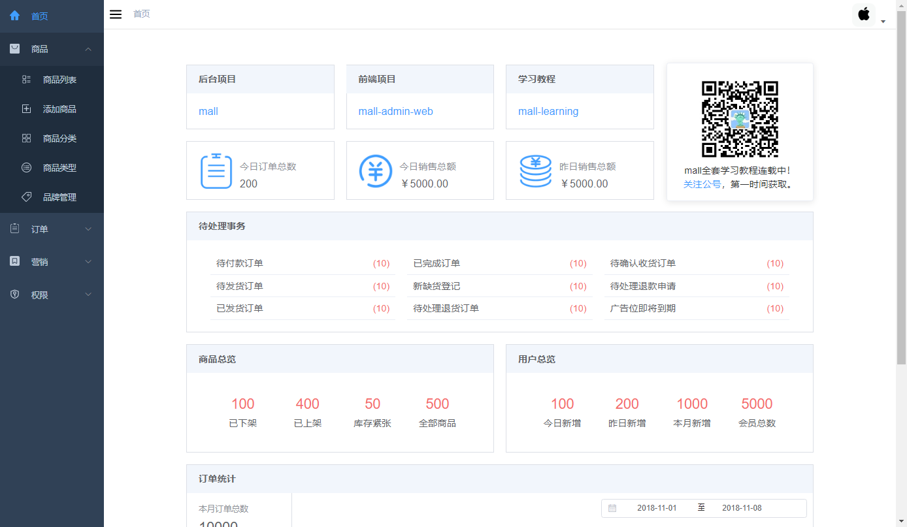
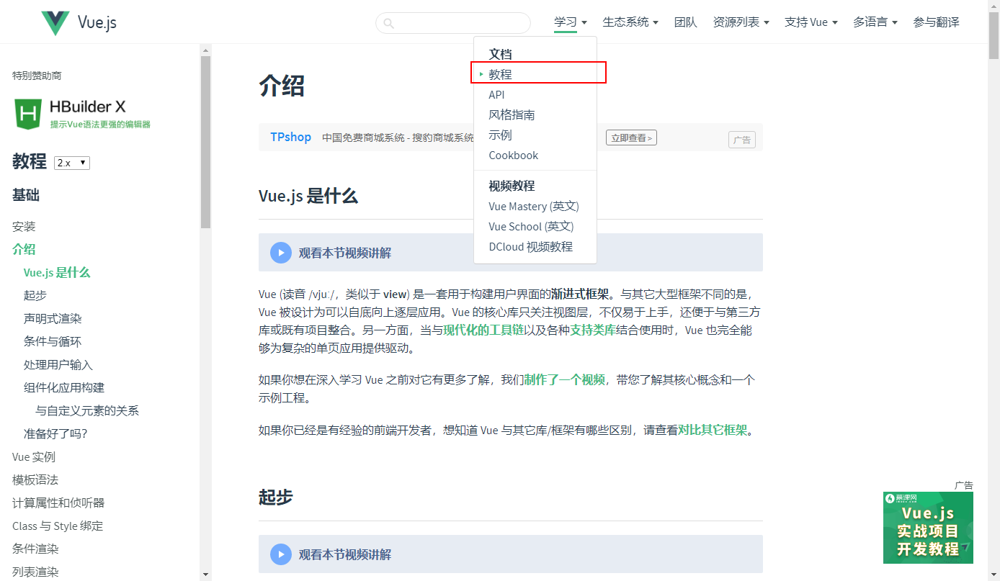
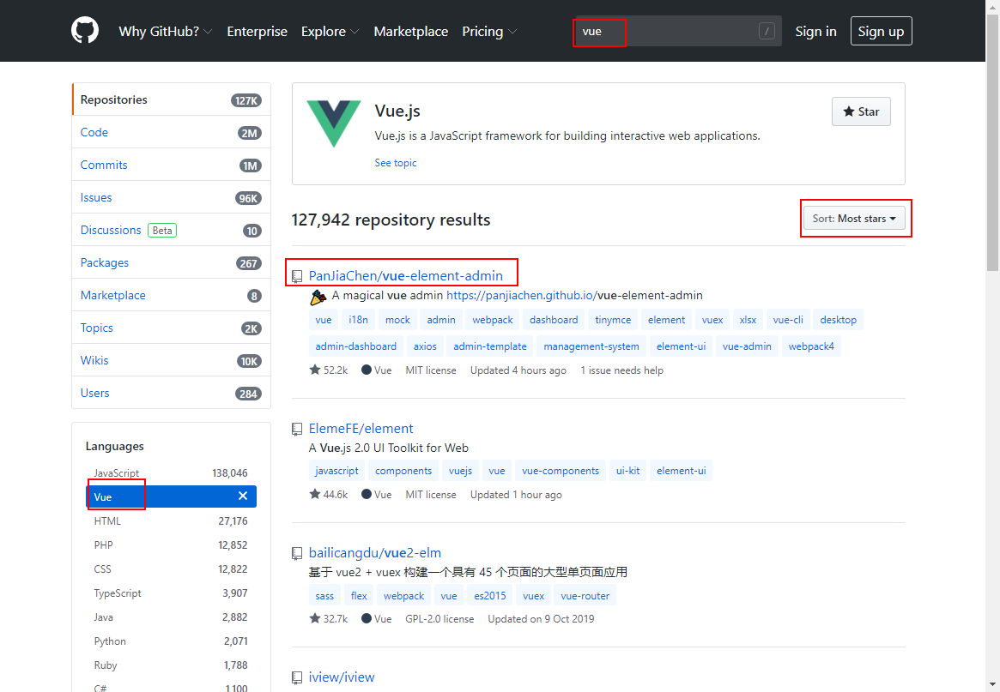
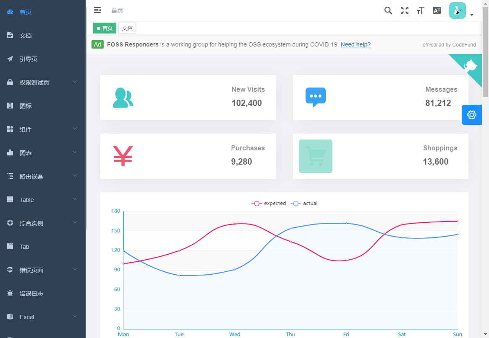
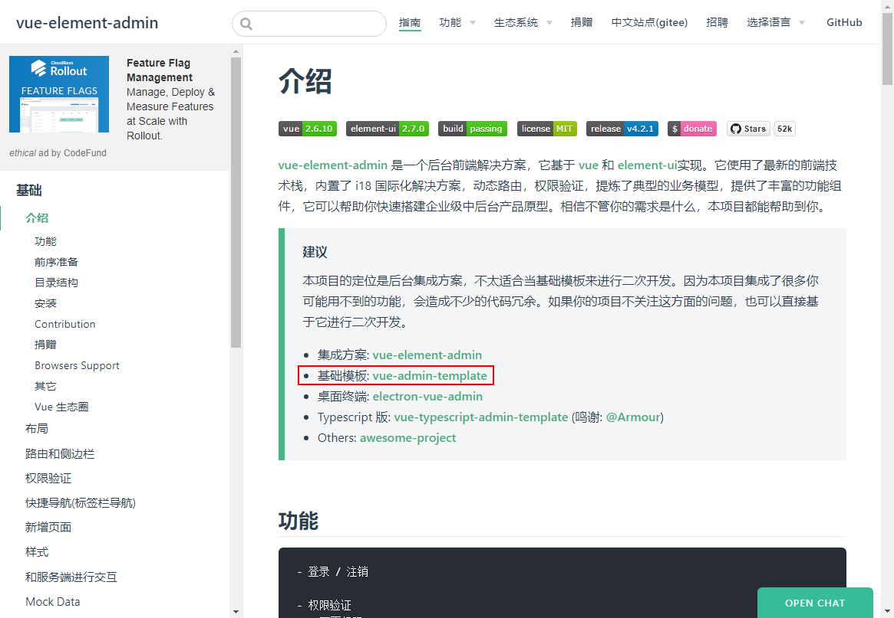
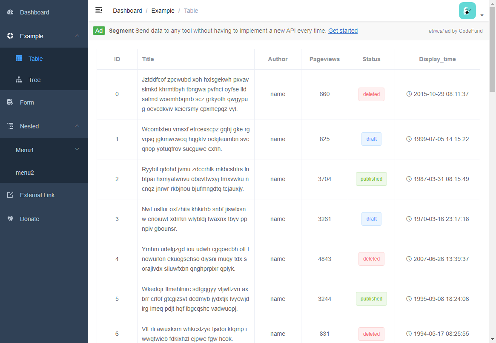
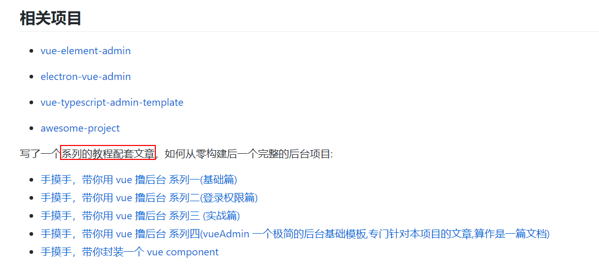
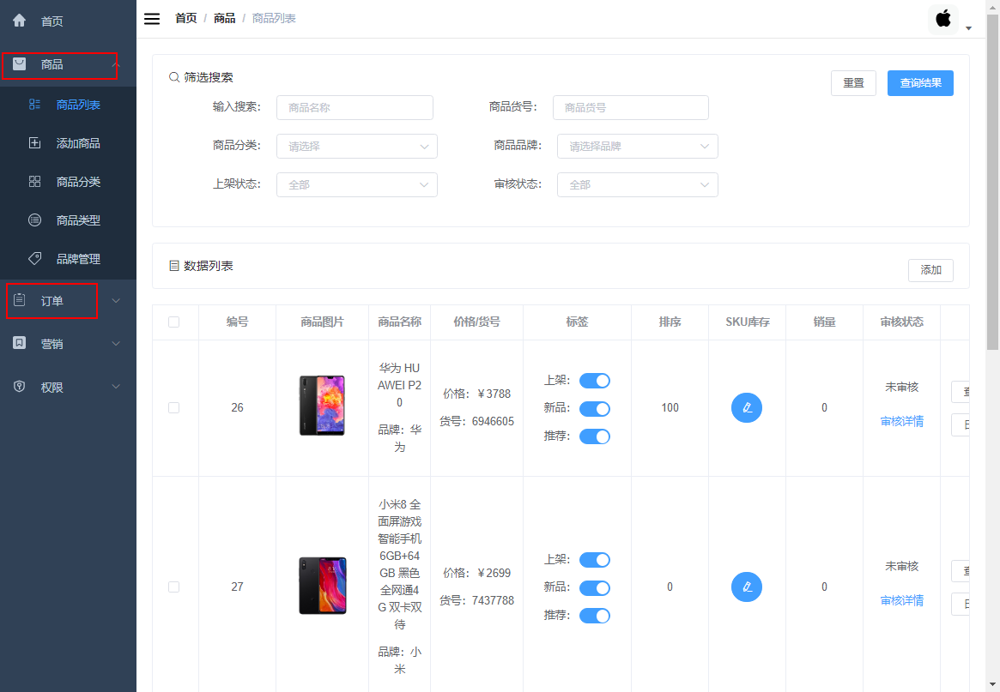

学习不走弯路，[关注公众号](#公众号) 回复「学习路线」，获取mall项目专属学习路线！

# 如何在5天内学会Vue？聊聊我的学习方法！

> 先说下为什么用学习Vue这个例子来谈我的学习方法？其实关注我的朋友很多都是从我的Github上面来的，大多数都是Java后端开发者，Vue作为一种前端技术，掌握的人并不多。所以使用Vue从零开始的学习过程为例子，对于大家学习新技术有很好的借鉴价值，接下来我们来聊聊我的学习方法吧！

## 明确目标

我们在学习某项新技术的时候，一定是有`目标`的，有`目标`的学习才不是瞎忙。比如说我学习Vue的目标是啥，其实就是`做个后台管理系统的前端界面`，就是长下面这样的！



做前端有很多技术，最流行的无外乎这三个：Vue、React、Angular，但是我为什么选择了Vue呢？起初的时候这三种都研究了下，首先研究的是React，但是看了一下语法，感觉和自己以前的习惯不太符合（以前学过一点JavaScript）就没选它，Angular倒是研究了一整子，用了一段时间TypeScript还是不太习惯，最终还是选择了Vue。

选择Vue的原因主要有这三个：

- 首先Vue在Github上面`Star最多`，既然它能排第一，总有它的优点；
- 其次是它所提倡的`渐进式学习`，从JavaScript过度到Vue是很平滑的，没有陡峭的学习曲线；
- 还有就是它的`中文文档非常完善`，有利于我们的学习。

## 基础学习

选定了我们需要学习的技术以后，接下来就是学习Vue的基础了。`强烈建议`看一遍官方教程，我学习新技术的时候，一般官方文档有中文的我都会看一遍。

官方文档地址：https://cn.vuejs.org/v2/guide/

刚开始学习的时候只看`教程`这块即可：



说说我看文档时的一些思考吧，核心是以`理解`为主，难以理解的内容可以暂时跳过。不需要去死磕一些难以理解的部分，有可能你当时死磕的东西以后根本用不上。快速把文档看一遍，扩充你对这门新技术的认知才是最重要的。你对新技术认知越足，你就越能更好地去运用它。

## 项目导向

当你对Vue有一定的了解之后，你就可以去找一个和你的目标最接近的开源项目，借鉴开源项目中所使用的技术栈，快速完成你的目标。

怎么找到这个项目呢？直接去Github上面找就可以了，直接搜索关键字`Vue`，按`Star数最多`排行！



于是我们就找到了`vue-element-admin`这个开源项目：https://github.com/PanJiaChen/vue-element-admin

一般这种前端项目都会有在线预览的地址，我们先看下：https://panjiachen.github.io/vue-element-admin



这个项目和我们的目标很符合，不过看着太复杂了，我们刚刚学完Vue的基础，学它就和劝退差不多了。算了我们还是先去它的官方文档上面看看：https://panjiachen.gitee.io/vue-element-admin-site/zh/guide/



我们可以发现原来还有一个叫`vue-admin-template`的基础模板项目：https://github.com/PanJiaChen/vue-admin-template

看了一下它的预览页面，发现这个比上面的简单多了，就决定是它了。



## 扩充知识面

找到目标项目以后，我们就要开始学习它了。学习开源项目，我们暂时不用去看它的源码，先去学习它的技术栈。对它所用技术都有所了解以后，学它就轻松了！

一般情况下，开源项目用到的技术都会在README中说明，但这个项目刚好没有。对于Vue项目只要看下它的`package.json`文件我们就能大概了解它的技术栈了。

```json
 {
  "dependencies": {
    "axios": "0.18.1",
    "element-ui": "2.13.0",
    "js-cookie": "2.2.0",
    "normalize.css": "7.0.0",
    "nprogress": "0.2.0",
    "path-to-regexp": "2.4.0",
    "vue": "2.6.10",
    "vue-router": "3.0.6",
    "vuex": "3.1.0"
  }
}
```

接下来我们要做的就是学习技术栈里面所有的技术，还是`理解`为主，扩充自己的知识面。

### axios

一款基于JavaScript的http请求客户端，用于在浏览器中发起请求，这个只要看下项目的README就大概知道怎么用了。

https://github.com/axios/axios

### element-ui

一套为开发者、设计师和产品经理准备的基于 Vue 2.0 的桌面端组件库。说白了就是个UI组件库，看下官方文档即可。

https://element.eleme.cn/

### js-cookie

一款操作Cookie的JavaScript组件库，这个只要看下项目的README就大概知道怎么用了。

https://github.com/js-cookie/js-cookie

### normalize.css

一款css库，在默认的HTML元素样式上提供了跨浏览器的高度一致性，说白了就是浏览器样式兼容用的，不看也可以。

https://github.com/necolas/normalize.css

### nprogress

一款基于JavaScript的进度条UI组件，这个只要看下项目的README就大概知道怎么用了。

https://github.com/rstacruz/nprogress

### path-to-regexp

将路径字符串(如/user/:name)转换为正则表达式的工具库，这个只要看下项目的README就大概知道怎么用了。

https://github.com/pillarjs/path-to-regexp

### vue

我们之前就学过Vue的基础了，看下官方教程即可。

https://cn.vuejs.org/v2/guide/

### vue-router

Vue Router 是 Vue.js 官方的路由管理器。它和 Vue.js 的核心深度集成，让构建单页面应用变得易如反掌。看下官方教程即可。

https://router.vuejs.org/zh/

### vuex

Vuex 是一个专为 Vue.js 应用程序开发的状态管理模式。其实就是个全局状态管理器，比如用户登录信息，你很多页面都会用到，就存到这个里面。看下官方文档即可。

https://vuex.vuejs.org/zh/

### vue-admin-template

学完了上面这些框架，接下来我们就可以开始学习我们的目标项目了，在中文的README里面有配套的教程文章，看一遍即可。

https://github.com/PanJiaChen/vue-admin-template/blob/master/README-zh.md



学习了目标项目的整套技术栈，同时看过了它的配套教程文章，看懂源码应该不是难事了，接下来就是看一遍该项目源码了。

## 实践

我们可以这样分配时间，1天看Vue的官方文档，2天把`vue-admin-template`所使用的技术栈都学习一遍，再花2天学习`vue-admin-template`的源码，这样5天就能学会Vue了。

基本学会了Vue以后，要能牢牢掌握就要进行实践，否则过几天这些所学的东西就会离你而去了。

如何进行实践呢？回到我们学习目标：`做个后台管理系统的前端界面`，这是一个很好的实践。我当时就是通过做我的`mall-admin-web`项目来实践的。

我的`mall`项目有着完善的后台管理API，大家只要对照我的前端项目自行实现一些功能就是一次很好的实践，就能掌握Vue了。

这里我推荐大家自行实现下我的商品和订单模块，这两个模块最复杂，只要能实现这两个模块，其他的就都能实现了，使用Vue开发一整套后台管理系统也不在话下了。



## 总结

最后总结一下我的学习方法，首先要明确自己的学习目标，然后针对目标去学习相关技术的基础，然后可以找个相关的开源项目学习下，学习其中的技术栈，之后进行实践，这样就能很好地掌握这门技术了。

## 项目地址

[https://github.com/macrozheng/mall-admin-web](https://github.com/macrozheng/mall-admin-web)

## 公众号

