学习不走弯路，[关注公众号](#公众号) 回复「学习路线」，获取mall项目专属学习路线！

# 线上项目出BUG没法调试？推荐这款阿里开源的诊断神器！

> 线上项目遇到问题无法调试，线下又无法重现，难道只能加日志再重新发布么？有了这款神器，既可以线上调试，又可以实现热修复，推荐给大家！

## Arthas 简介

Arthas是Alibaba开源的Java诊断工具，深受开发者喜爱。它采用命令行交互模式，同时提供丰富的 Tab 自动补全功能，进一步方便进行问题的定位和诊断。

## 安装

> 为了还原一个真实的线上环境，我们将通过Arthas来对Docker容器中的Java程序进行诊断。

- 使用`arthas-boot`，下载对应jar包，下载地址：https://alibaba.github.io/arthas/arthas-boot.jar

- 将我们的Spring Boot应用`mall-tiny-arthas`使用Docker容器的方式启动起来，打包和运行脚本在项目的`src\main\docker`目录下；

- 将`arthas-boot.jar`拷贝到我们应用容器的`\`目录下；

```bash
docker container cp arthas-boot.jar mall-tiny-arthas:/
```

- 进入容器并启动`arthas-boot`，直接当做jar包启动即可；

```bash
docker exec -it mall-tiny-arthas /bin/bash
java -jar arthas-boot.jar
```

- 启动成功后，选择当前需要诊断的Java程序的序列号，这里是`1`，就可以开始诊断了；

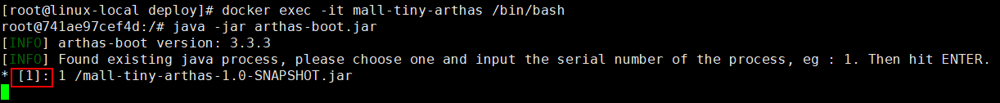

- 期间会下载一些所需的文件，完成后控制台打印信息如下，至此Arthas就安装启动完成了。

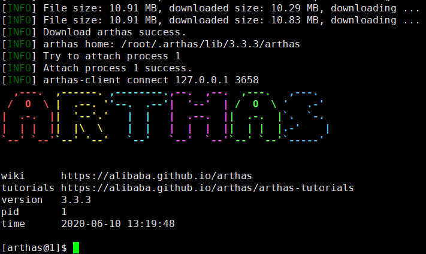

## 常用命令

> 我们先来介绍一些Arthas的常用命令，会结合实际应用来讲解，带大家了解下Arthas的使用。

### dashboard

使用`dashboard`命令可以显示当前系统的实时数据面板，包括线程信息、JVM内存信息及JVM运行时参数。

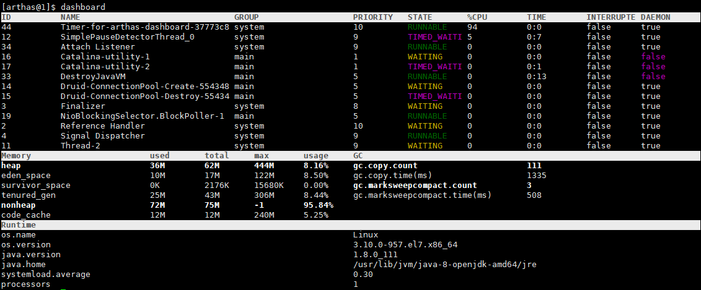

### thread

查看当前线程信息，查看线程的堆栈，可以找出当前最占CPU的线程。

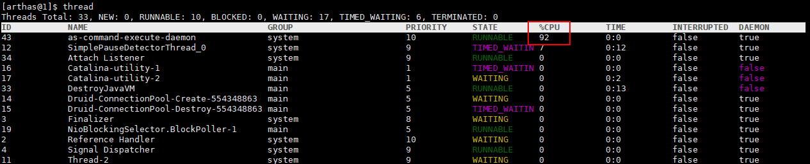

常用命令：

```bash
# 打印当前最忙的3个线程的堆栈信息
thread -n 3
# 查看ID为1都线程的堆栈信息
thread 1
# 找出当前阻塞其他线程的线程
thread -b
# 查看指定状态的线程
thread -state WAITING
```

### sysprop

查看当前JVM的系统属性，比如当容器时区与宿主机不一致时，可以使用如下命令查看时区信息。

```bash
sysprop |grep timezone
```

```
user.timezone                  Asia/Shanghai
```

### sysenv

查看JVM的环境属性，比如查看下我们当前启用的是什么环境的Spring Boot配置。

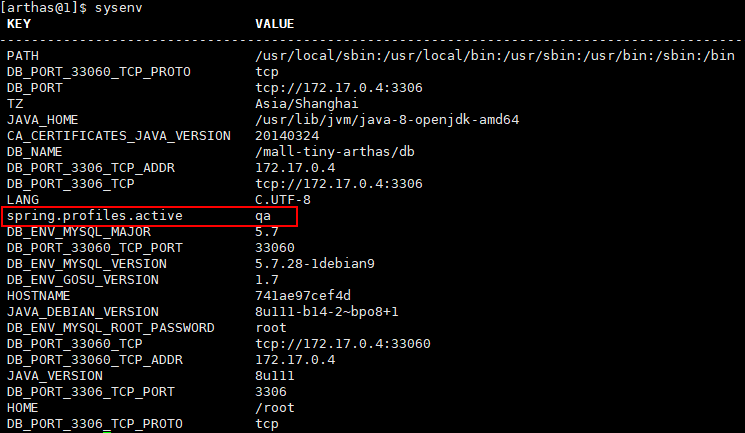

### logger

使用`logger`命令可以查看日志信息，并改变日志级别，这个命令非常有用。

比如我们在生产环境上一般是不会打印`DEBUG`级别的日志的，当我们在线上排查问题时可以临时开启`DEBUG`级别的日志，帮助我们排查问题，下面介绍下如何操作。

- 我们的应用默认使用的是`INFO`级别的日志，使用`logger`命令可以查看；

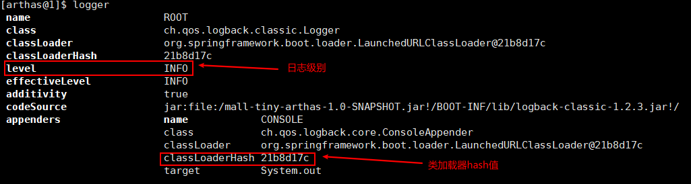

- 使用如下命令改变日志级别为`DEBUG`，需要使用`-c`参数指定类加载器的HASH值；

```bash
logger -c 21b8d17c --name ROOT --level debug
```

- 再使用`logger`命令查看，发现`ROOT`级别日志已经更改；

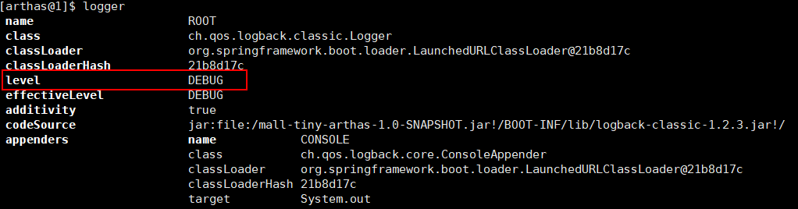

- 使用`docker logs -f mall-tiny-arthas`命令查看容器日志，发现已经打印了DEBUG级别的日志；

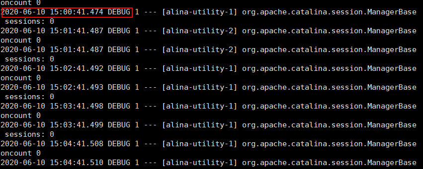

- 查看完日志以后记得要把日志级别再调回`INFO`级别。

```bash
logger -c 21b8d17c --name ROOT --level info
```

### sc

查看JVM已加载的类信息，`Search-Class`的简写，搜索出所有已经加载到 JVM 中的类信息。

- 搜索`com.macro.mall`包下所有的类；

```bash
sc com.macro.mall.*
```

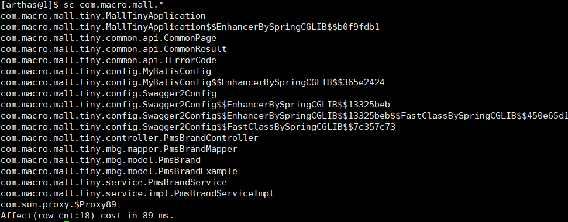

- 打印类的详细信息，加入`-d`参数并指定全限定类名；

```bash
sc -d com.macro.mall.tiny.common.api.CommonResult
```

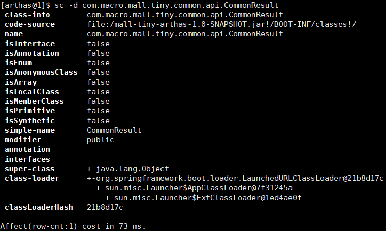

- 打印出类的Field信息，使用`-f`参数。

```bash
sc -d -f com.macro.mall.tiny.common.api.CommonResult
```

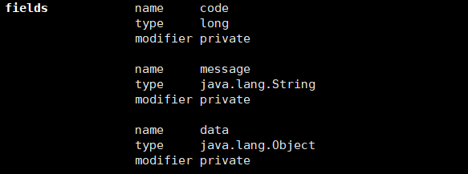

### sm

查看已加载类的方法信息，`Search-Method`的简写，搜索出所有已经加载的类的方法信息。

- 查看类中的所有方法；

```bash
sm com.macro.mall.tiny.common.api.CommonResult
```

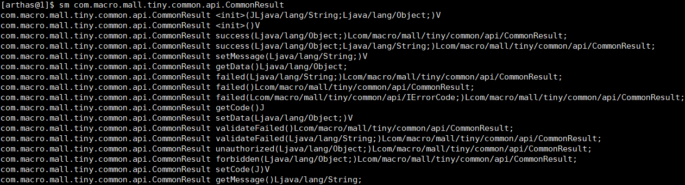

- 查看指定方法信息，使用`-d`参数并指定方法名称；

```bash
sm -d com.macro.mall.tiny.common.api.CommonResult getCode
```

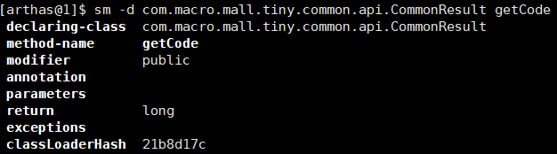

### jad

反编译已加载类的源码，觉得线上代码和预期不一致，可以反编译看看。

- 查看启动类的相关信息，默认会带有`ClassLoader`信息；

```bash
jad com.macro.mall.tiny.MallTinyApplication
```

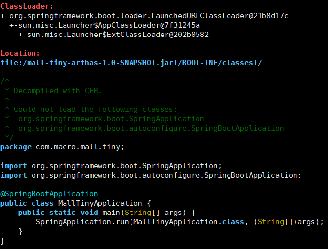

- 使用`--source-only`参数可以只打印类信息。

```bash
jad --source-only com.macro.mall.tiny.MallTinyApplication
```

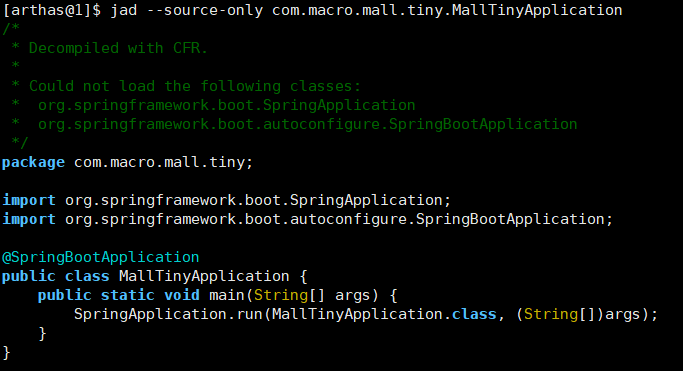

### mc

内存编译器，`Memory Compiler`的缩写，编译`.java`文件生成`.class`。

### redefine

加载外部的`.class`文件，覆盖掉 JVM中已经加载的类。

### monitor

实时监控方法执行信息，可以查看方法执行成功此时、失败次数、平均耗时等信息。

```bash
monitor -c 5 com.macro.mall.tiny.controller.PmsBrandController listBrand
```

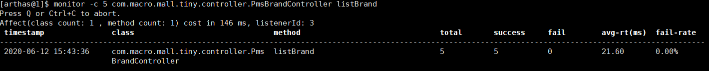

### watch

方法执行数据观测，可以观察方法执行过程中的参数和返回值。

使用如下命令观察方法执行参数和返回值，`-x`表示结果属性遍历深度。

```bash
watch com.macro.mall.tiny.service.impl.PmsBrandServiceImpl listBrand "{params,returnObj}" -x 2
```

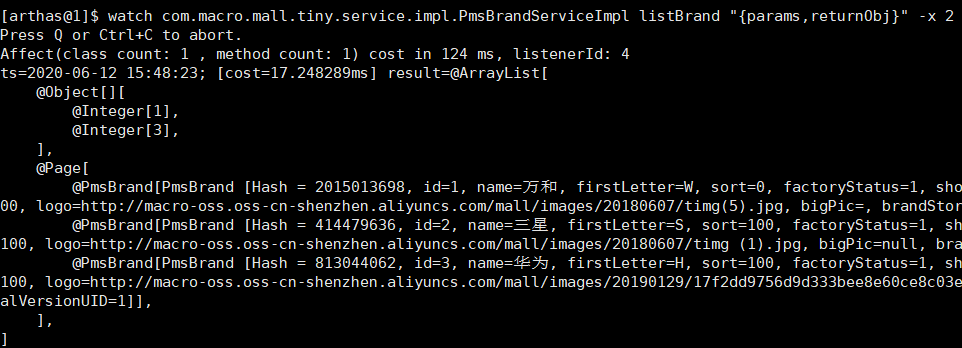

## 热更新

> 尽管在线上环境热更代码并不是一个很好的行为，但有的时候我们真的很需要热更代码。下面介绍下如何使用`jad/mc/redefine`来热更新代码。

- 首先我们有一个商品详情的接口，当我们传入`id<=0`时，会抛出`IllegalArgumentException`；

```java
/**
 * 品牌管理Controller
 * Created by macro on 2019/4/19.
 */
@Api(tags = "PmsBrandController", description = "商品品牌管理")
@Controller
@RequestMapping("/brand")
public class PmsBrandController {
    @Autowired
    private PmsBrandService brandService;

    private static final Logger LOGGER = LoggerFactory.getLogger(PmsBrandController.class);

    @ApiOperation("获取指定id的品牌详情")
    @RequestMapping(value = "/{id}", method = RequestMethod.GET)
    @ResponseBody
    public CommonResult<PmsBrand> brand(@PathVariable("id") Long id) {
        if(id<=0){
            throw new IllegalArgumentException("id not excepted id:"+id);
        }
        return CommonResult.success(brandService.getBrand(id));
    }
}
```

- 调用接口会返回如下信息，调用地址：http://192.168.5.94:8088/brand/0

```json
{
  "timestamp": "2020-06-12T06:20:20.951+0000",
  "status": 500,
  "error": "Internal Server Error",
  "message": "id not excepted id:0",
  "path": "/brand/0"
}
```

- 我们想对该问题进行修复，如果传入`id<=0`时，直接返回空数据的`CommonResult`，代码修改内容如下；

```java
/**
 * 品牌管理Controller
 * Created by macro on 2019/4/19.
 */
@Api(tags = "PmsBrandController", description = "商品品牌管理")
@Controller
@RequestMapping("/brand")
public class PmsBrandController {
    @Autowired
    private PmsBrandService brandService;

    private static final Logger LOGGER = LoggerFactory.getLogger(PmsBrandController.class);
    
    @ApiOperation("获取指定id的品牌详情")
    @RequestMapping(value = "/{id}", method = RequestMethod.GET)
    @ResponseBody
    public CommonResult<PmsBrand> brand(@PathVariable("id") Long id) {
        if(id<=0){
//            throw new IllegalArgumentException("id not excepted id:"+id);
            return CommonResult.success(null);
        }
        return CommonResult.success(brandService.getBrand(id));
    }
}
```

- 首先我们需要对`PmsBrandController`类代码进行修改，接着上传到服务器，然后使用如下命令将`java`文件拷贝到容器的`/tmp`目录下；

```bash
docker container cp /tmp/PmsBrandController.java mall-tiny-arthas:/tmp/
```

- 之后我们需要查看该类的类加载器的Hash值；

```bash
sc -d *PmsBrandController | grep classLoaderHash
```


- 之后使用内存编译器把改`.java`文件编译成`.class`文件，注意需要使用`-c`指定类加载器；

```bash
mc -c 21b8d17c /tmp/PmsBrandController.java -d /tmp
```

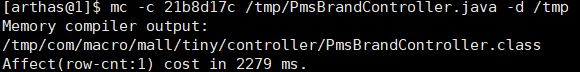

- 最后使用`redefine`命令加载`.class`文件，将原来加载的类覆盖掉；

```bash
redefine -c 21b8d17c /tmp/com/macro/mall/tiny/controller/PmsBrandController.class
```

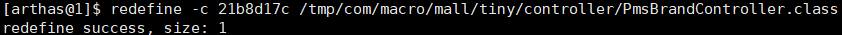

- 我们再次调用接口进行测试，发现已经返回了预期的结果，调用地址：http://192.168.3.101:8088/brand/0

```json
{
  "code": 200,
  "message": "操作成功",
  "data": null
}
```

## 参考资料

官方文档：https://alibaba.github.io/arthas/

## 项目源码地址

https://github.com/macrozheng/mall-learning/tree/master/mall-tiny-arthas

## 公众号


