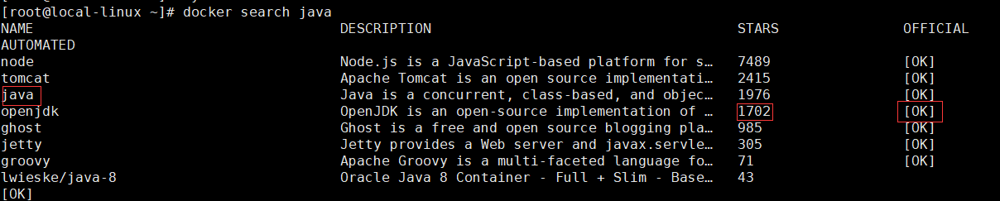

mall项目全套学习教程连载中，[关注公众号](#公众号)第一时间获取。

# 开发者必备Docker命令

> 本文主要讲解Docker环境的安装以及Docker常用命令的使用，掌握这些对Docker环境下应用的部署具有很大帮助。

## Docker 简介

 Docker 是一个开源的应用容器引擎，让开发者可以打包他们的应用以及依赖包到一个可移植的镜像中，然后发布到任何流行的 Linux或Windows机器上。使用Docker可以更方便低打包、测试以及部署应用程序。

## Docker 环境安装
- 安装yum-utils：
```bash
yum install -y yum-utils device-mapper-persistent-data lvm2
```
- 为yum源添加docker仓库位置：
```bash
yum-config-manager --add-repo https://download.docker.com/linux/centos/docker-ce.repo
```
- 安装docker:
```bash
yum install docker-ce
```
- 启动docker:
```bash
systemctl start docker
```

## Docker 镜像常用命令

### 搜索镜像
```bash
docker search java
```

### 下载镜像
```bash
docker pull java:8
```
### 如何查找镜像支持的版本
> 由于docker search命令只能查找出是否有该镜像，不能找到该镜像支持的版本，所以我们需要通过docker hub来搜索支持的版本。

- 进入docker hub的官网，地址：[https://hub.docker.com](https://hub.docker.com)
- 然后搜索需要的镜像：

- 查看镜像支持的版本：


- 进行镜像的下载操作：
```bash
docker pull nginx:1.17.0
```

### 列出镜像
```bash
docker images
```

### 删除镜像
- 指定名称删除镜像
```bash
docker rmi java:8
```
- 指定名称删除镜像（强制）
```bash
docker rmi -f java:8
```
- 删除所有没有引用的镜像
```bash
docker rmi `docker images | grep none | awk '{print $3}'`
```
- 强制删除所有镜像
```bash
docker rmi -f $(docker images)
```

## Docker 容器常用命令
### 新建并启动容器
```bash
docker run -p 80:80 --name nginx -d nginx:1.17.0
```
- -d选项：表示后台运行
- --name选项：指定运行后容器的名字为nginx,之后可以通过名字来操作容器
- -p选项：指定端口映射，格式为：hostPort:containerPort

### 列出容器
- 列出运行中的容器：
```bash
docker ps
```

- 列出所有容器
```bash
docker ps -a
```

### 停止容器
```bash
# $ContainerName及$ContainerId可以用docker ps命令查询出来
docker stop $ContainerName(或者$ContainerId)
```
比如：
```bash
docker stop nginx
#或者
docker stop c5f5d5125587
```
### 强制停止容器
```bash
docker kill $ContainerName(或者$ContainerId)
```
### 启动已停止的容器
```bash
docker start $ContainerName(或者$ContainerId)
```
### 进入容器
- 先查询出容器的pid：
```bash
docker inspect --format "{{.State.Pid}}" $ContainerName(或者$ContainerId)
```
- 根据容器的pid进入容器：
```bash
nsenter --target "$pid" --mount --uts --ipc --net --pid
```

### 删除容器
- 删除指定容器：
```bash
docker rm $ContainerName(或者$ContainerId)
```
- 按名称删除容器
```bash
docker rm `docker ps -a | grep mall-* | awk '{print $1}'`
```
- 强制删除所有容器；
```bash
docker rm -f $(docker ps -a -q)
```
### 查看容器的日志
- 查看当前全部日志
```bash
docker logs $ContainerName(或者$ContainerId)
```
- 动态查看日志
```bash
docker logs $ContainerName(或者$ContainerId) -f
```

### 查看容器的IP地址
```bash
docker inspect --format '{{ .NetworkSettings.IPAddress }}' $ContainerName(或者$ContainerId)
```

### 修改容器的启动方式
```bash
docker container update --restart=always $ContainerName
```
### 同步宿主机时间到容器
```bash
docker cp /etc/localtime $ContainerName(或者$ContainerId):/etc/
```
### 在宿主机查看docker使用cpu、内存、网络、io情况
- 查看指定容器情况：
```bash
docker stats $ContainerName(或者$ContainerId)
```

- 查看所有容器情况：
```bash
docker stats -a
```

### 查看Docker磁盘使用情况
```bash
docker system df
```

### 进入Docker容器内部的bash
```bash
docker exec -it $ContainerName /bin/bash
```


## 修改Docker镜像的存放位置
- 查看Docker镜像的存放位置：
```bash
docker info | grep "Docker Root Dir"
```

- 关闭Docker服务：
```bash
systemctl stop docker
```
- 移动目录到目标路径：
```bash
mv /var/lib/docker /mydata/docker
```
- 建立软连接：
```bash
ln -s /mydata/docker /var/lib/docker
```


## 公众号


