学习不走弯路，[关注公众号](#公众号) 回复「学习路线」，获取mall项目专属学习路线！

# 微服务应用性能如何？APM监控工具来告诉你！

> 当微服务系统越来越庞大，各个服务间的调用关系也变得越来越复杂，需要一个工具来帮忙理清请求调用的服务链路。之前在[《Spring Cloud Sleuth：分布式请求链路跟踪》](https://mp.weixin.qq.com/s/FEBeiU7PHrkXa8RrosXqlw)一文中使用的是Sleuth+Zipkin的解决方案，最近发现应用性能监控（Application Performance Monitoring，APM）也可以很好地解决该问题。对比SkyWalking和Elastic APM之后，发现Elastic APM更胜一筹，今天我们来一波Elastic APM的使用实践！

## Elastic APM 简介

Elastic APM是基于Elastic Stack构建的应用性能监控（APM）系统。它主要有如下用途：

- 用来实时监控应用性能信息，包括HTTP请求调用时长、数据库查询信息、缓存调用信息和外部的HTTP请求调用信息。有助于我们快速找出并解决性能问题。
- 自动收集应用中未处理的错误和异常，显示异常的堆栈信息，有助于快速定位异常和了解出现频率。
- 度量指标是调试生产系统时的另一个重要信息来源。Elastic APM Agent 会自动收集主机级别的度量指标（比如Java JVM和Go Runtime的指标）。
- 支持分布式请求链路追踪，使你能够在一个视图中分析整个服务架构的性能问题。

## 相关组件

Elastic APM 包括四大组件: APM Agent, APM Server, Elasticsearch, Kibana。

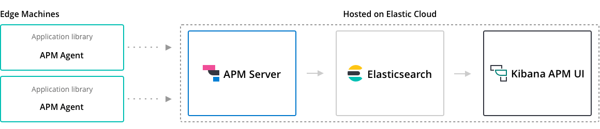

- APM Agent：以应用程序库的形式提供，负责收集应用运行时的性能监控数据和错误数据，短时间缓存后发送APM Server。
- APM Server：一个独立的组件，负责接收APM Agent中发送的性能监控数据。验证并处理完数据后，会转存储到Elasticsearch中，之后就可以在Kibana APM 应用中查看性能监控数据了。
- Elasticsearch：用于存储应用性能监控数据并提供聚合功能。
- Kibana APM app：可视化查看APM性能监控数据，有助于找到性能瓶颈。

## 数据模型

Elastic APM Agent 从其检测的应用程序中捕获不同类型的信息。这些操作被称为事件，可以是Span, Transaction, Error, or Metric。

- Span（跨度）：Span包含一次操作过程中代码执行路径的信息。它从操作的开始到结束进行度量，并且可以与其他Span具有父/子关系。
- Transaction（事务）：Transaction是一种特殊的Span，具有与之关联的其他属性。它描述了Elastic APM Agent捕获的最高级别事件，比如一次请求、一次批处理任务等。
- Error（错误）：Error事件至少包含错误发生的原始异常或创建的日志的信息。
- Metric（度量）：APM Agent 自动获取基本的主机级别指标，包括系统和进程级别的CPU和内存指标。也可以获取特定于代理的指标，例如Java Agent中的JVM指标和Go Agent中的Go运行时指标。

## 使用实践

> 学习了上面的基本概念之后，是时候来波实践了，接下来我们将使用Elastic APM来监控SpringBoot应用的性能信息。

### 安装Elasticsearch和Kibana

安装Elastic APM之前，我们需要先安装好Elasticsearch和Kibana，具体参考[《你居然还去服务器上捞日志，搭个日志收集系统难道不香么！》](https://mp.weixin.qq.com/s/8nUunL02Y5AfXTCscYg54w)，注意使用7.6.2版本。

### 安装APM Server

- 下载APM Server的安装包，下载地址：https://www.elastic.co/cn/downloads/past-releases/apm-server-7-6-2

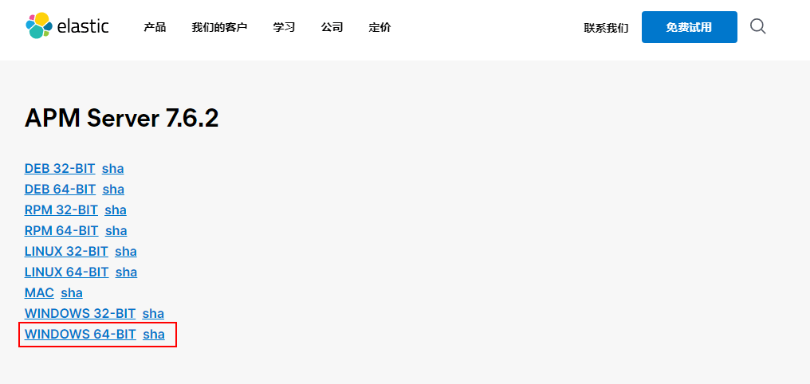

- 下载完成后解压到指定目录；

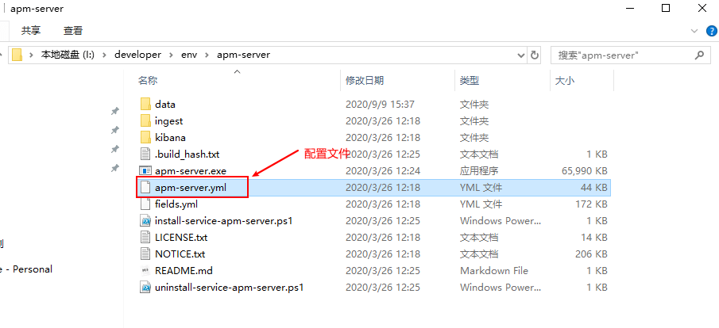

- 修改配置文件`apm-server.yml`，修改下Elasticsearch的连接地址即可；

```yaml
output.elasticsearch:
  hosts: ["localhost:9200"]
```

- 使用如下命令启动APM Server即可，启动成功APM Server将在`8200`端口运行；

```bash
apm-sever -e
```

- 在Kibana中检测APM Server是否启动成功，访问地址：http://localhost:5601/app/kibana#/home/tutorial/apm

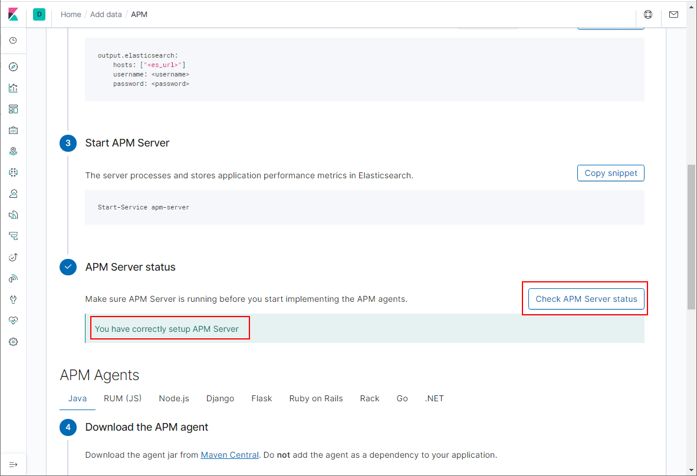

### SpringBoot集成APM Agent

> Java应用集成APM Agent的方式有三种，我们使用最简单的方式，直接在应用中集成。

- 在`pom.xml`中添加相关依赖；

```xml
<!--Elastic Agent相关依赖-->
<dependency>
    <groupId>co.elastic.apm</groupId>
    <artifactId>apm-agent-attach</artifactId>
    <version>1.17.0</version>
</dependency>
```

- 在应用启动类的`main`方法中添加Elastic APM的Attach API；

```java
@SpringBootApplication
public class MallTinyApplication {

    public static void main(String[] args) {
        ElasticApmAttacher.attach();
        SpringApplication.run(MallTinyApplication.class, args);
    }

}
```

- 在`resource`目录下添加Elastic APM的配置文件`elasticapm.properties`；

```properties
# 配置服务名称
service_name=mall-tiny-apm
# 配置应用所在基础包
application_packages=com.macro.mall.tiny
# 配置APM Server的访问地址
server_urls=http://localhost:8200
```

- 在Kibana中检测APM Agent是否启动成功，访问地址：http://localhost:5601/app/kibana#/home/tutorial/apm

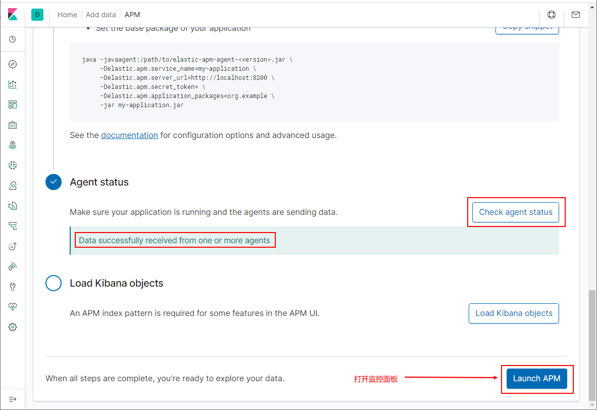

### 查看性能监控信息

- 打开监控面板以后，可以发现我们的`mall-tiny-apm`服务已经存在了；

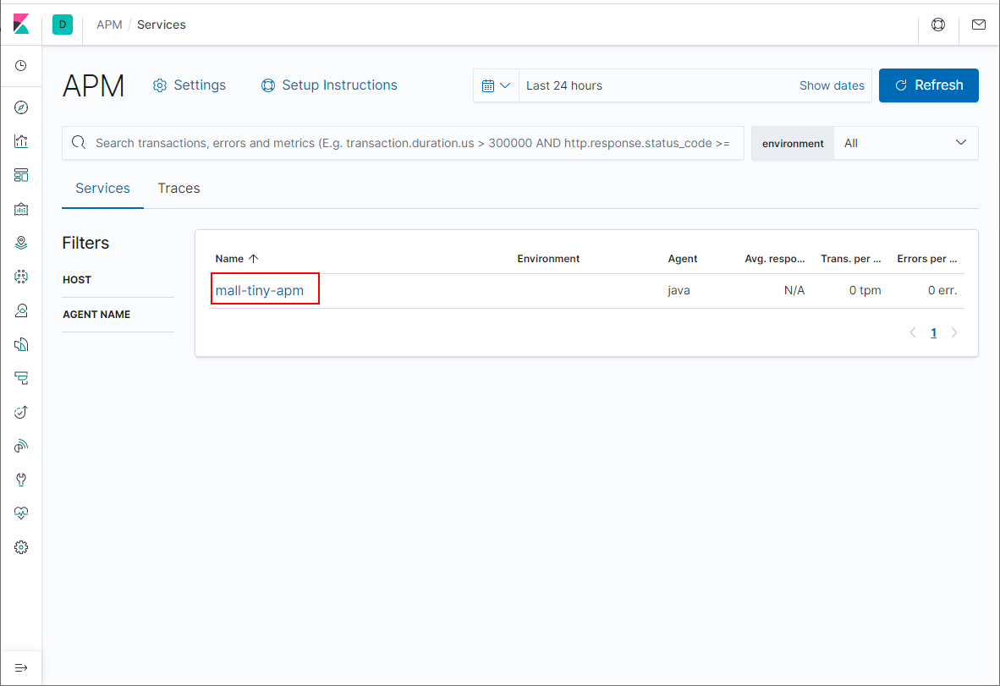

- 多次调用应用接口，即可查看到应用性能信息；

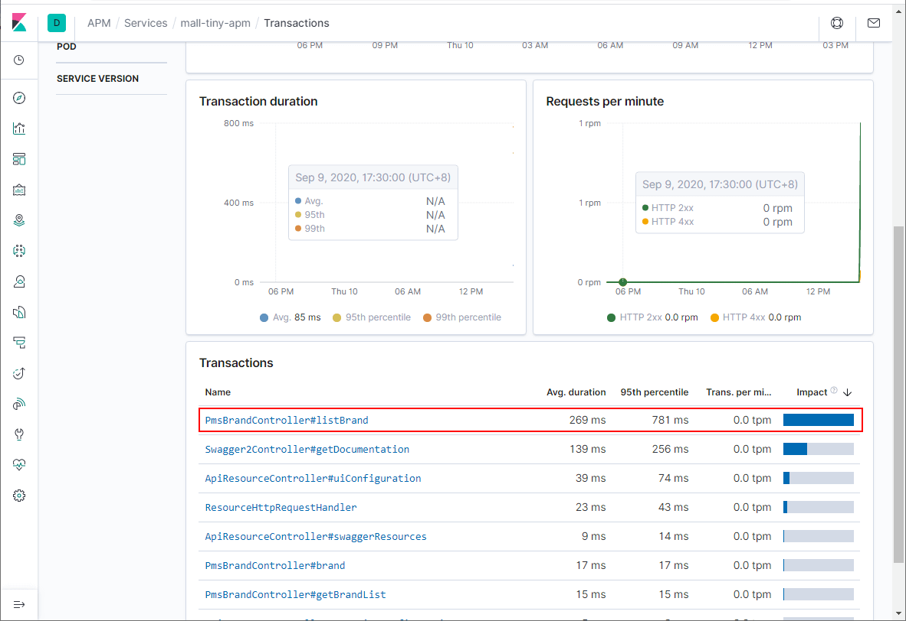

- 打开某个`Transaction`查看详情，我们可以看到连SQL执行耗时信息都给我们统计好了；

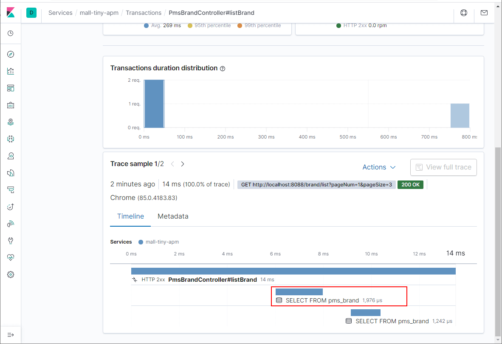

- 不仅如此，打开执行查询的`Span`查看详情，连SQL语句都给我们收集好了；

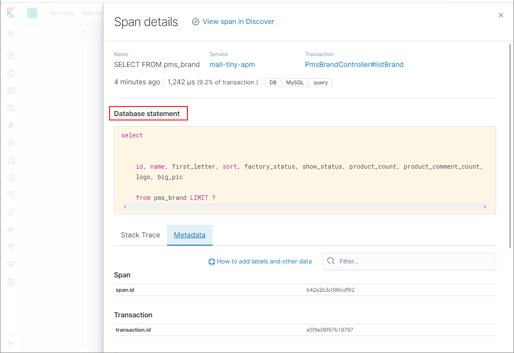

- 在项目中添加一个有远程调用接口，看看能不能收集到请求调用链路；

```java
/**
 * 品牌管理Controller
 * Created by macro on 2019/4/19.
 */
@Api(tags = "PmsBrandController", description = "商品品牌管理")
@Controller
@RequestMapping("/brand")
public class PmsBrandController {
    
    @ApiOperation("远程调用获取所有品牌信息")
    @RequestMapping(value = "/remoteListAll", method = RequestMethod.GET)
    @ResponseBody
    public CommonResult<List<PmsBrand>> remoteListAll() {
        //模拟耗时操作
        ThreadUtil.sleep(1, TimeUnit.SECONDS);
        //远程调用获取数据
        String response = HttpUtil.get("http://localhost:8088/brand/listAll");
        JSONObject jsonObject = new JSONObject(response);
        JSONArray data = jsonObject.getJSONArray("data");
        List<PmsBrand> brandList = data.toList(PmsBrand.class);
        return CommonResult.success(brandList);
    }
}
```

- 发现完全可以，Elastic APM完全可以取代Sleuth+Zipkin来做微服务的请求链路跟踪了；

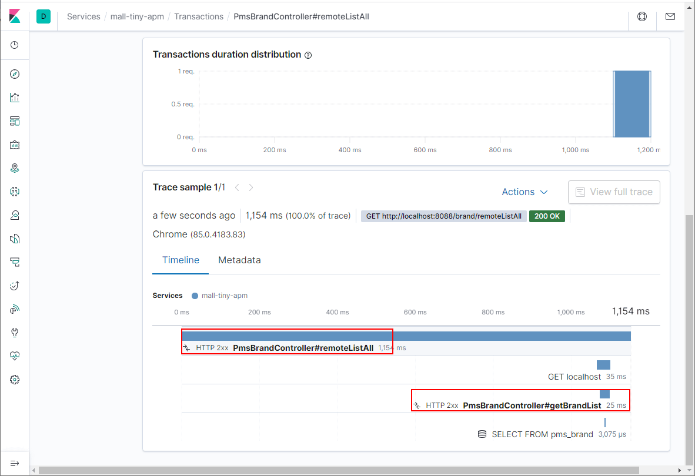

- 使用我们之前`springcloud-learning`中的微服务调用案例，也是可以进行请求链路跟踪的；

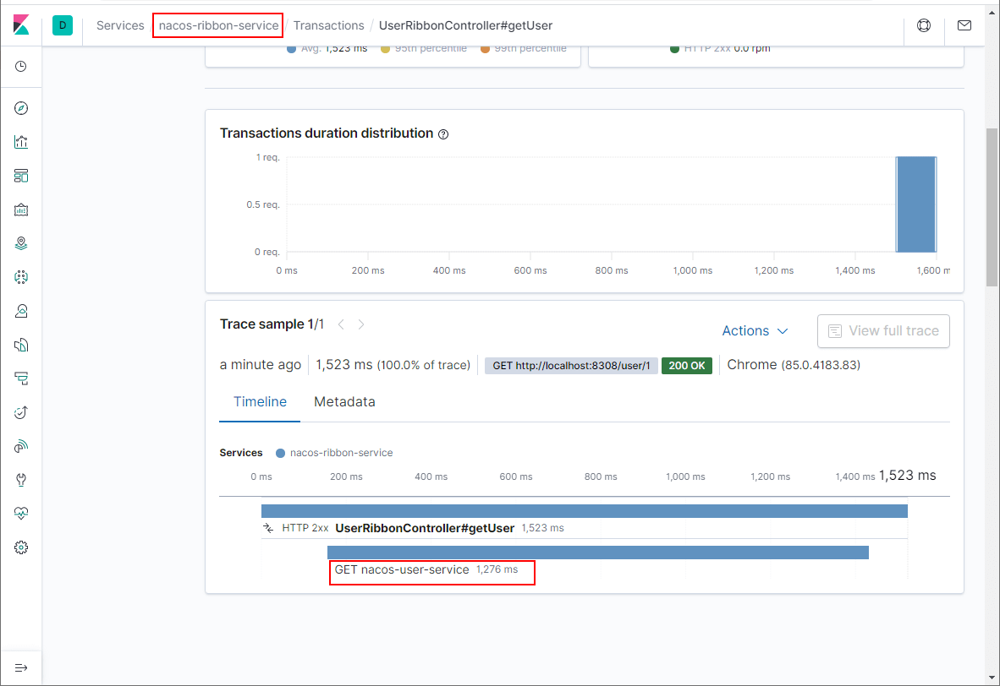

- 接下来我们人为制造一个异常，在方法中添加`int i=1/0;`即可，查看下收集到的异常信息；

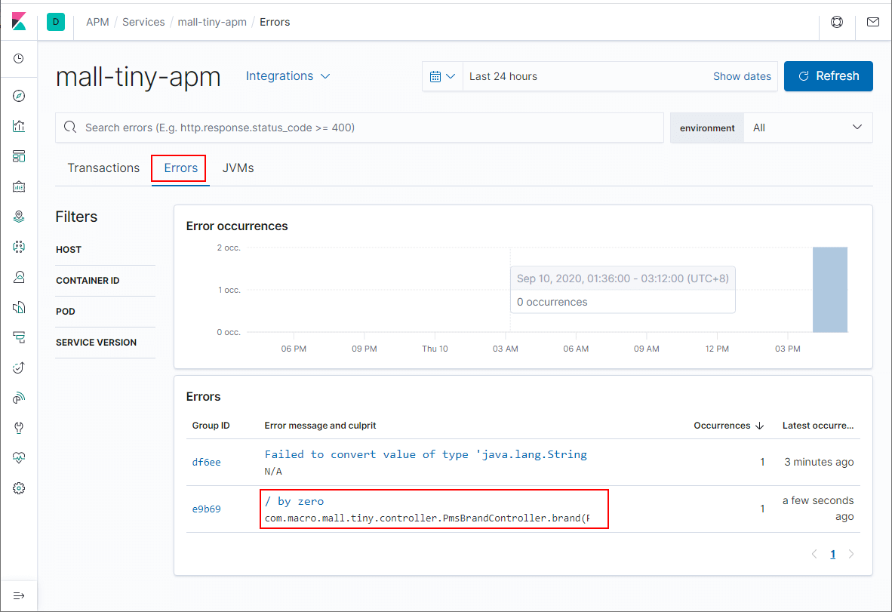

- 再来看下应用主机的度量信息，非常全面，CPU、内存、JVM信息都有了，以后性能调优的时候可以看看！

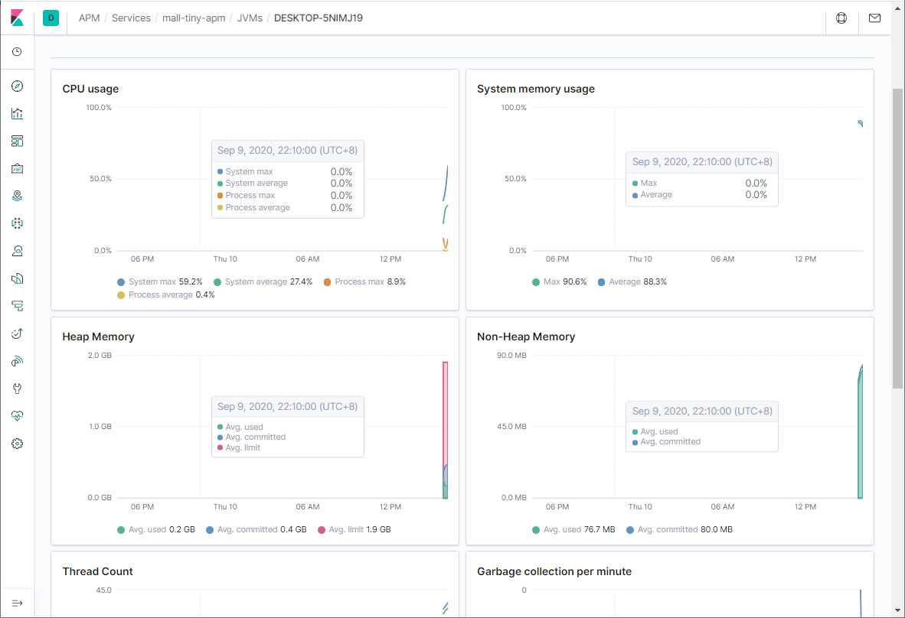

## 总结

Elastic APM 完全可以取代Sleuth+Zipkin来做分布式请求链路追踪，并且提供了数据库及缓存调用时长的统计，很好很强大！不止于此，它还可以用来实时监控应用性能信息及度量指标，连错误日志也收集好了，是一款很好的应用性能监控工具！

## 项目源码地址

https://github.com/macrozheng/mall-learning/tree/master/mall-tiny-apm

## 参考资料

官方文档：https://www.elastic.co/guide/en/apm/index.html

## 公众号

