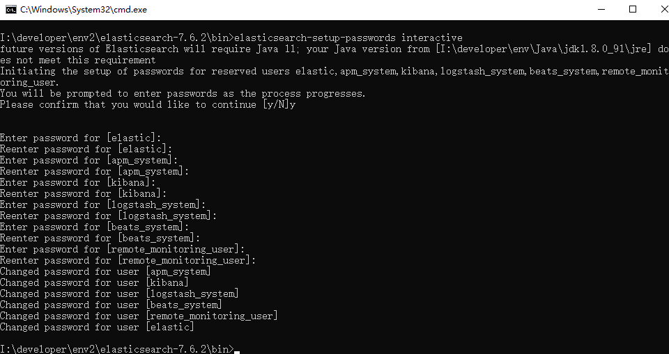
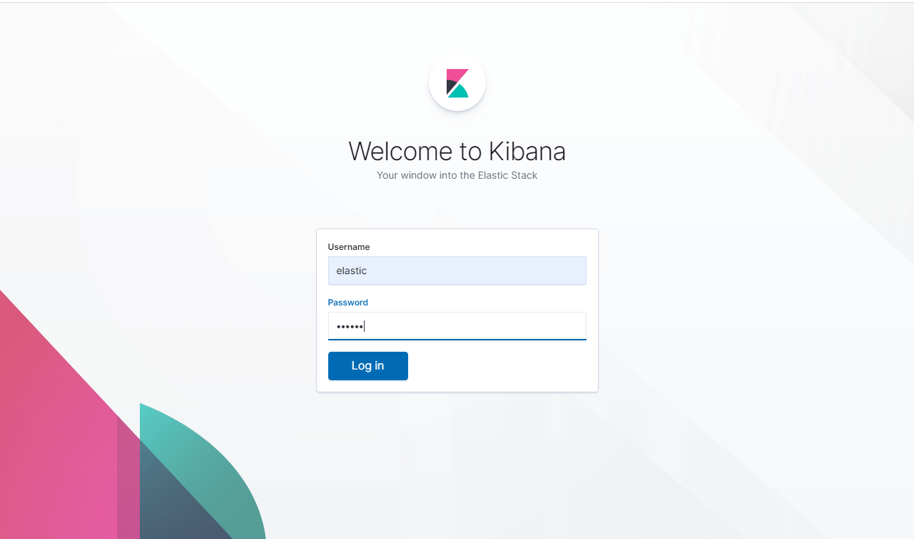
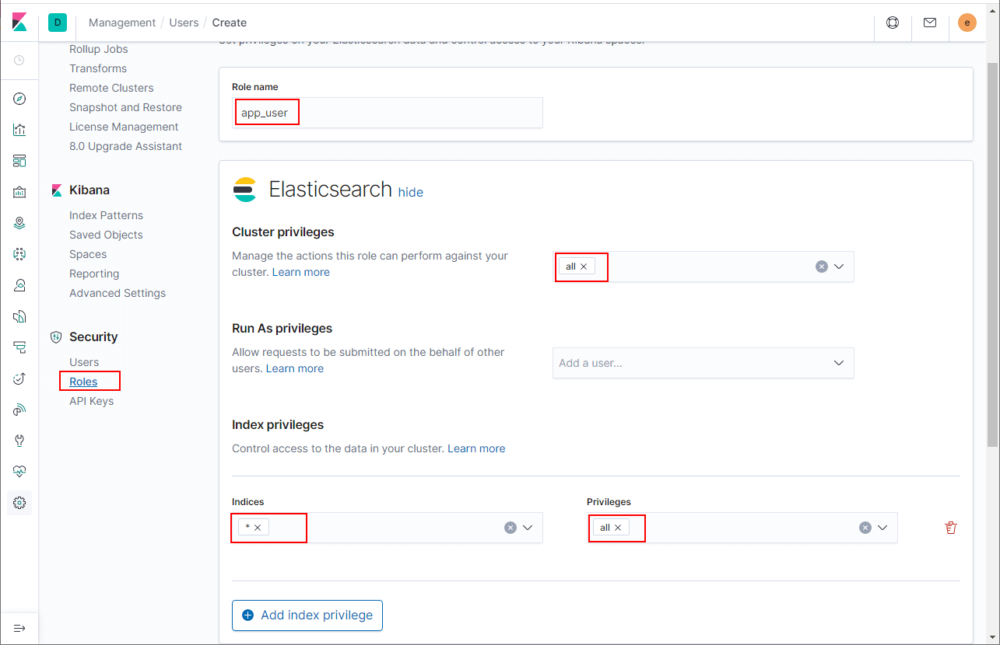
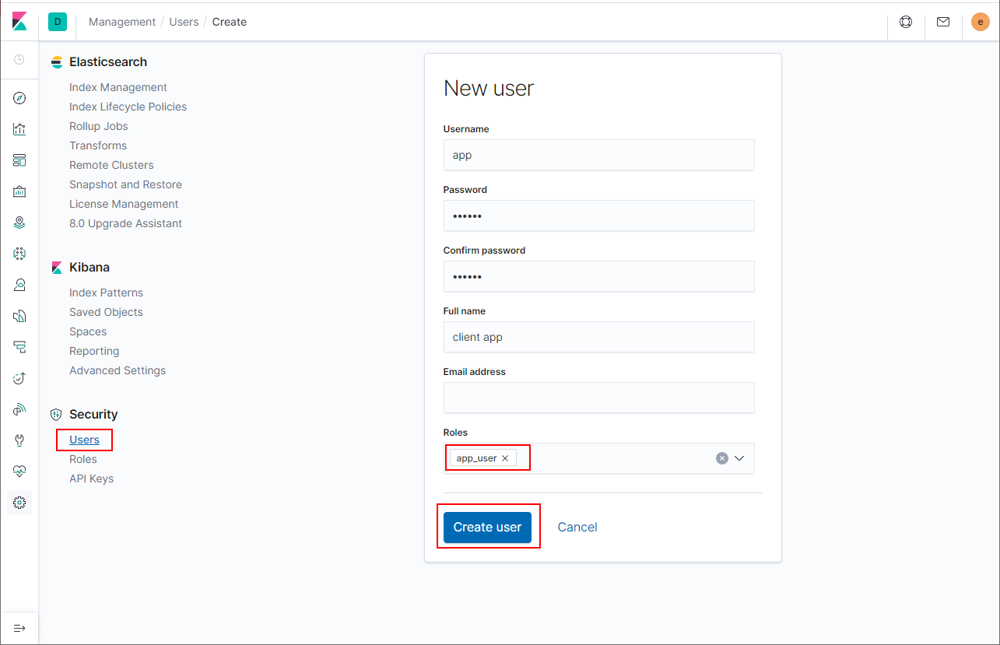

学习不走弯路，[关注公众号](#公众号) 回复「学习路线」，获取mall项目专属学习路线！

# 居然有人想白嫖我的日志，赶紧开启安全保护压压惊！

> 在[《你居然还去服务器上捞日志，搭个日志收集系统难道不香么！》](https://mp.weixin.qq.com/s/8nUunL02Y5AfXTCscYg54w)一文中我们介绍过ELK日志收集系统的搭建，由于我们的Kibana没有任何安全保护机制，如果部署到公网上去的话，任何人都可以查看你的日志了。日志暴露在网络上可不是件好事情，今天教大家如何给Kibana设置登录认证来保护它。

## 实现原理

由于Kibana的日志信息都存储在Elasticsearch中，所以只要给Elasticsearch开启`X-PACK`中的安全功能，并给预置的账号设置好密码即可。Elasticsearch设置好之后，就可以在Kibana中对用户、角色、权限进行管理了，本文使用的ELK组件版本均为`7.6.2`。

## Elasticsearch设置密码

- 修改Elasticsearch的配置文件并开启`X-PACK`中的安全功能，该配置文件在安装目录的`config`文件夹下面，例如`elasticsearch-7.6.2\config\elasticsearch.yml`；

```yaml
http.cors.enabled: true
http.cors.allow-origin: "*"
http.cors.allow-headers: Authorization
xpack.security.enabled: true
xpack.security.transport.ssl.enabled: true
```

- 启动Elasticsearch服务，启动命令在`bin`目录下，例如`elasticsearch-7.6.2\bin\elasticsearch.bat`；

- 在`bin`目录下使用如下命令`elasticsearch-setup-passwords interactive`修改预置账号的密码，期间需要设置多个账号密码，我都设置成了`123456`；



- 期间设置了好几个账号，我们先来了解下这些账号都有啥作用吧；

```
elastic：超级管理员账号
kibana：Kibana访问专用账号
logstash_system：Logstash访问专用账号
beats_system：FileBeat访问专用账号
apm_system：APM系统专用账号
remote_monitoring_user：远程监控账号
```

- 接下来我们需要在Kibana的配置文件中添加可以访问Elasticsearch的账号，该配置文件在安装目录的`config`文件夹下面，例如`kibana-7.6.2\config\kibana.yml`；

```yaml
elasticsearch.username: "kibana"
elasticsearch.password: "123456"
```

- 启动Kibana服务，启动命令在`bin`目录下，例如`kibana-7.6.2\bin\kibana.bat`；

- 当Kibana启动完成后，我们访问的时就需要登录认证了，使用超级管理员账号`elastic:123456`可以进行登录，访问地址：http://localhost:5601



- 登录成功后，在我们的`Management`选项中可以找到安全相关的配置，在此我们可以对用户、角色、权限进行设置。


## SpringBoot安全访问

> 由于Elasticsearch开启`X-PACK`中的安全功能，当我们的SpringBoot应用访问Elasticsearch时，也需要设置用户名和密码了！

- 我们可以直接在SpringBoot中设置超级管理员账号，但这不是个好办法，我们还是自己建个角色和账号吧！

- 首先在Kibana中创建一个应用访问专用的角色`app_user`；



- 创建一个用户并配置好该角色，账号密码为`app:123456`；



- 修改SpringBoot应用的配置文件`application.yml`，配置好账号密码即可正常访问了！

```yaml
spring:
  elasticsearch:
    rest:
      uris: http://localhost:9200
      username: app
      password: 123456
```

## Logstash安全访问

> 由于Elasticsearch开启`X-PACK`中的安全功能，向Elasticsearch输出日志的Logstash也需要设置用户名和密码了！

- 首先修改我们原来的Logstash配置文件`logstash.conf`，在`output`节点下设置访问Elasticsearch的用户名和密码，直接使用我们创建的`app:123456`账号即可；

```
input {
  tcp {
    mode => "server"
    host => "0.0.0.0"
    port => 4560
    codec => json_lines
    type => "debug"
  }
  tcp {
    mode => "server"
    host => "0.0.0.0"
    port => 4561
    codec => json_lines
    type => "error"
  }
  tcp {
    mode => "server"
    host => "0.0.0.0"
    port => 4562
    codec => json_lines
    type => "business"
  }
  tcp {
    mode => "server"
    host => "0.0.0.0"
    port => 4563
    codec => json_lines
    type => "record"
  }
}
filter{
  if [type] == "record" {
    mutate {
      remove_field => "port"
      remove_field => "host"
      remove_field => "@version"
    }
    json {
      source => "message"
      remove_field => ["message"]
    }
  }
}
output {
  elasticsearch {
    hosts => ["localhost:9200"]
    action => "index"
    codec => json
    index => "mall-tiny-%{type}-%{+YYYY.MM.dd}"
    template_name => "mall-tiny"
    user => app
    password => "123456"
  }
}
```

- 使用指定配置文件启动Logstash服务，启动命令在`bin`目录下，例如`logstash-7.6.2\bin\logstash.bat`；

```bash
logstash -f logstash.conf
```

- 接下来在Kibana中就可以查看到应用输出的日志了！


## 项目源码地址

https://github.com/macrozheng/mall-learning/tree/master/mall-tiny-log

## 公众号


