学习不走弯路，[关注公众号](#公众号) 回复「学习路线」，获取mall项目专属学习路线！

# 面对成百上千台服务器产生的日志，试试这款轻量级日志搬运神器！

> 之前我们搭建的ELK日志收集系统，主要是用来收集SpringBoot应用的日志。其原理是应用通过Logstash插件，使用TCP向Logstash传输日志，从而存储到Elasticsearch中去。但是有很多中间件的日志都是直接存储在文件中的，比如`Nginx`、`Elasticsearch`和`MySQL`，此时我们就需要一个搬运工来把日志搬到Elasticsearch中去，Filebeat正是这样一个日志搬运工，本文将详细介绍它的使用方法，希望对大家有所帮助。

## Filebeat简介

Filebeat是一款轻量级日志采集器，可用于转发和汇总日志与文件。Filebeat内置有多种模块（Nginx、MySQL、Redis、Elasticsearch、Logstash等），可针对常见格式的日志大大简化收集、解析和可视化过程，只需一条命令即可。

## Filebeat安装及配置

> 安装Filebeat之前，我们需要先安装好Elasticsearch和Kibana，具体参考[《你居然还去服务器上捞日志，搭个日志收集系统难道不香么！》](https://mp.weixin.qq.com/s/8nUunL02Y5AfXTCscYg54w)，注意使用7.6.2版本。

- 我们先下载Filebeat的安装包，下载地址：https://www.elastic.co/cn/downloads/past-releases/filebeat-7-6-2


- 下载完成后解压到指定目录，注意图中所示的三个地方；

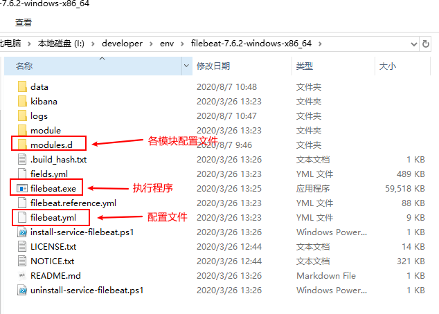

- Kibana中早就提供好了Filebeat收集各种日志的教程，我们先进入首页，访问地址：http://localhost:5601/app/kibana#/home

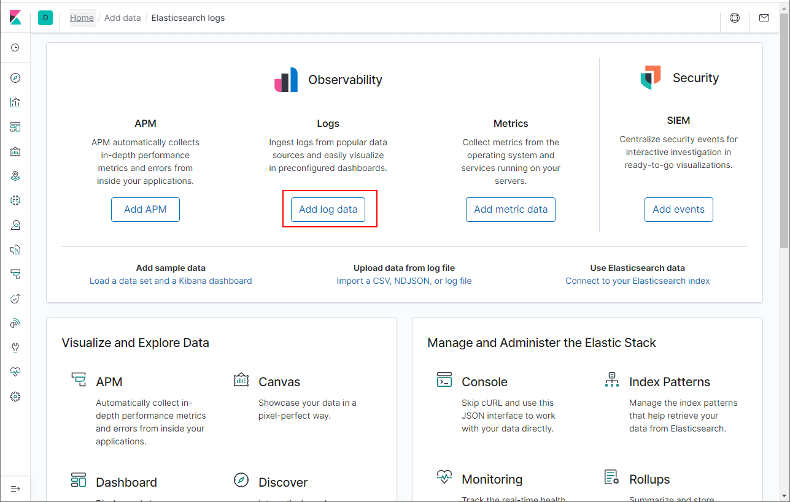

- 点击`Add log data`按钮，可以发现支持的中间件还是很丰富的，涵盖了常用的；

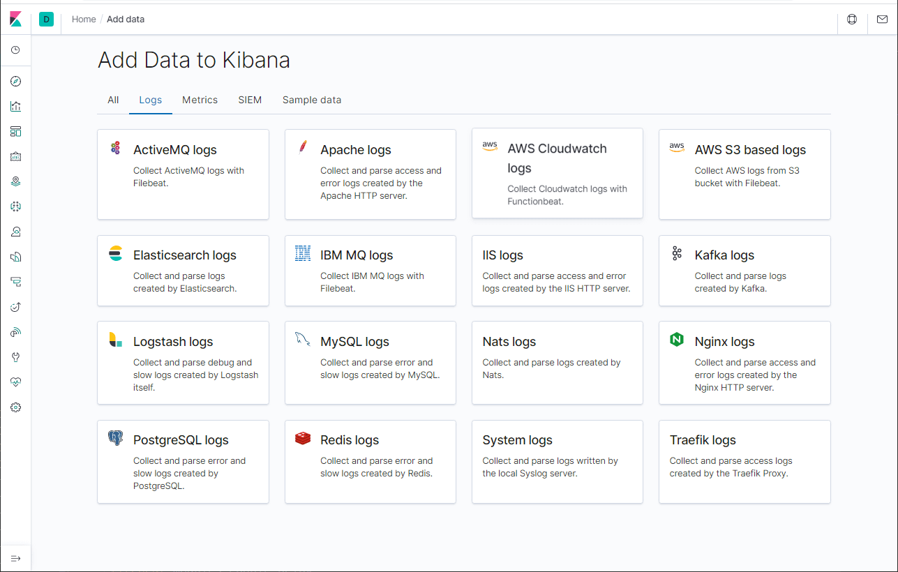

- 点开Nginx的日志收集教程看下，是不是很详细；

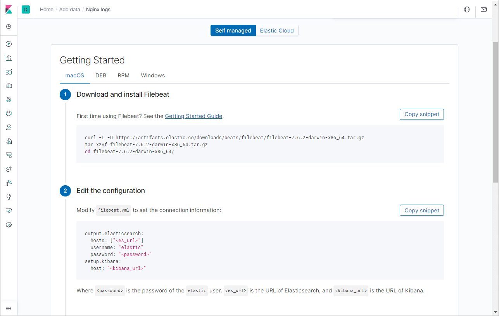

- 接下来我们就要开始配置Filebeat了，配置好Elasticsearch和Kibana的连接地址，修改Filebeat的安装目录下的配置文件`filebeat.yml`即可，修改内容如下。

```yaml
output.elasticsearch:
  hosts: ["localhost:9200"]
setup.kibana:
  host: "localhost:5601"
```

## 收集Nginx日志

> 我们先拿Nginx来练练手，体验下Filebeat的日志收集功能吧。

- 使用如下命令开启Filebeat的Nginx日志收集模块；

```bash
filebeat modules enable nginx
```

- 开启完成后，进入`modules.d`目录下，你会发现`nginx.yml`的`disable`后缀没有了，说明已经被开启；

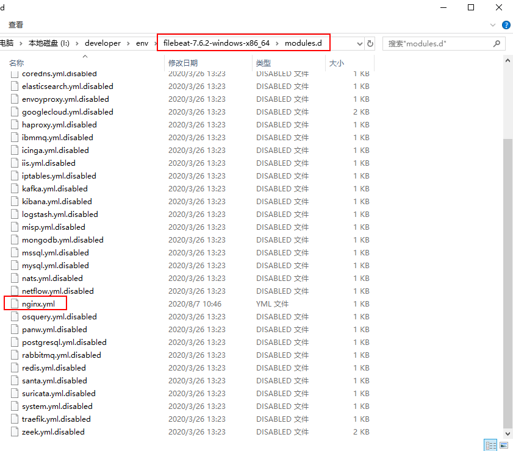

- 接下来修改`nginx.yml`文件，配置好Nginx的`access`和`error`日志路径；

```yaml
# Module: nginx
# Docs: https://www.elastic.co/guide/en/beats/filebeat/7.6/filebeat-module-nginx.html

- module: nginx
  access:
    enabled: true
    var.paths: ["I:/developer/env/nginx-1.8.1/logs/access.log"]

  error:
    enabled: true
    var.paths: ["I:/developer/env/nginx-1.8.1/logs/error.log"]
```

- 由于启用了Nginx日志收集模块，我们需要通过如下命令对Filebeat进行设置；

```bash
filebeat setup
```

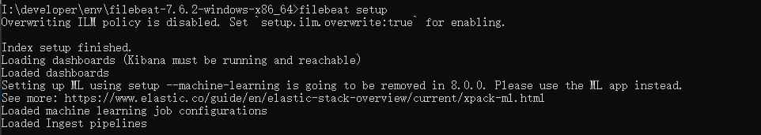

- 通过如下命令启动Filebeat服务；

```bash
filebeat -e
```

- 我们可以通过之前使用的Kibana中的Nginx教程页面，检查下数据是否成功被收集了；

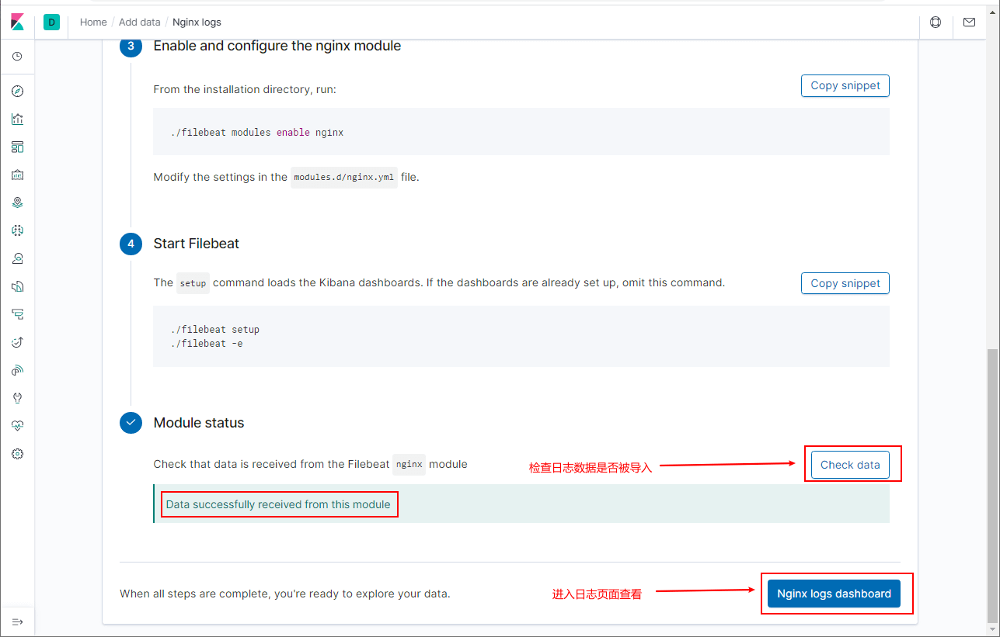

- 点击`Nginx logs dashboard`按钮可以查看收集到的Nginx日志，先看看概览日志；


- 再看看详细日志，从此不用再去服务器上捞Nginx日志了！

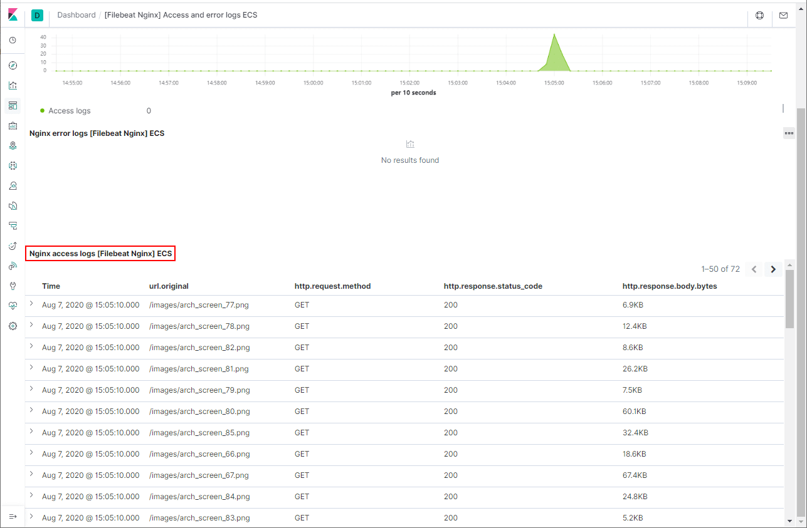

## 收集Elasticsearch日志

> 接下来我们再试试收集Elasticsearch的日志。

- 使用如下命令开启Filebeat的Elasticsearch日志收集模块；

```bash
filebeat modules enable elasticsearch
```

- 接下来修改`elasticsearch.yml`配置，配置好Elasticsearch的日志路径；

```yaml
# Module: elasticsearch
# Docs: https://www.elastic.co/guide/en/beats/filebeat/7.6/filebeat-module-elasticsearch.html

- module: elasticsearch
  server:
    enabled: true
    var.paths: ["I:/developer/env/elasticsearch-7.6.2/logs/elasticsearch.log"]

  slowlog:
    enabled: true
    var.paths: ["I:/developer/env/elasticsearch-7.6.2/logs/elasticsearch_index_indexing_slowlog.log","I:/developer/env/elasticsearch-7.6.2/logs/elasticsearch_index_search_slowlog.log"]

  deprecation:
    enabled: true
    var.paths: ["I:/developer/env/elasticsearch-7.6.2/logs/elasticsearch_deprecation.log"]
```

- 设置并启动Filebeat服务；

```bash
filebeat setup
filebeat -e
```

- 在`Discover`页面中查看Elasticsearch日志。

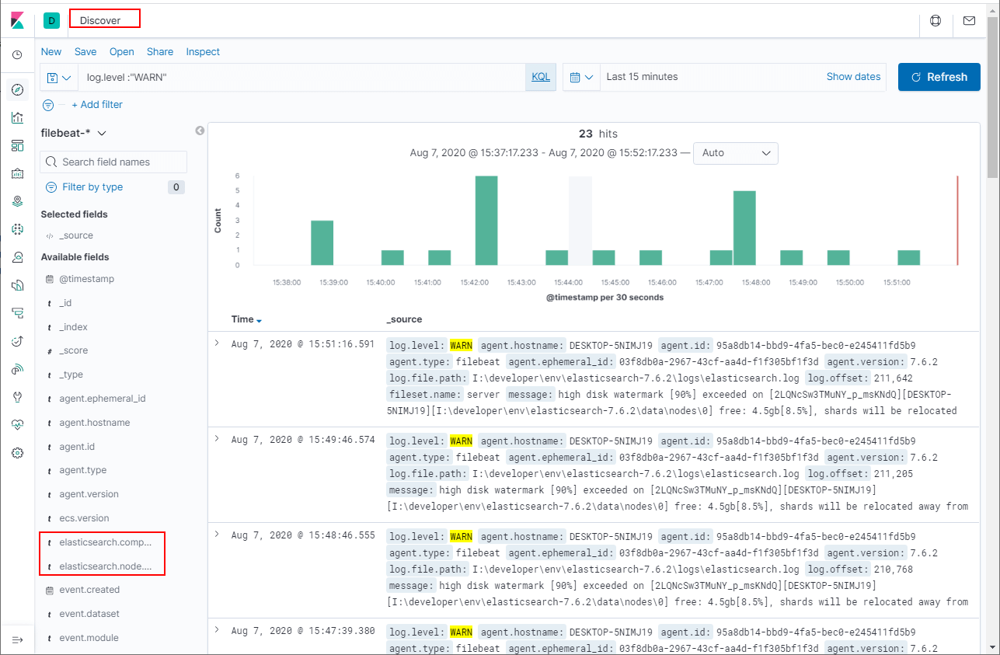

## 收集MySQL日志

> 再来试试收集MySQL的日志。

- 使用如下命令开启Filebeat的MySQL日志收集模块；

```bash
filebeat modules enable mysql
```

- 接下来修改`mysql.yml`配置，配置好MySQL的日志路径，主要是错误日志和慢查询日志；

```yaml
# Module: mysql
# Docs: https://www.elastic.co/guide/en/beats/filebeat/7.6/filebeat-module-mysql.html

- module: mysql
  error:
    enabled: true
    var.paths: ["C:/ProgramData/MySQL/MySQL Server 5.7/Data/DESKTOP-5NIMJ19.err"]

  slowlog:
    enabled: true
    var.paths: ["C:/ProgramData/MySQL/MySQL Server 5.7/Data/DESKTOP-5NIMJ19-slow.log"]
```

- 设置并启动Filebeat服务；

```bash
filebeat setup
filebeat -e
```

- 点击`MySQL logs dashboard`按钮可以查看收集到的MySQL日志；

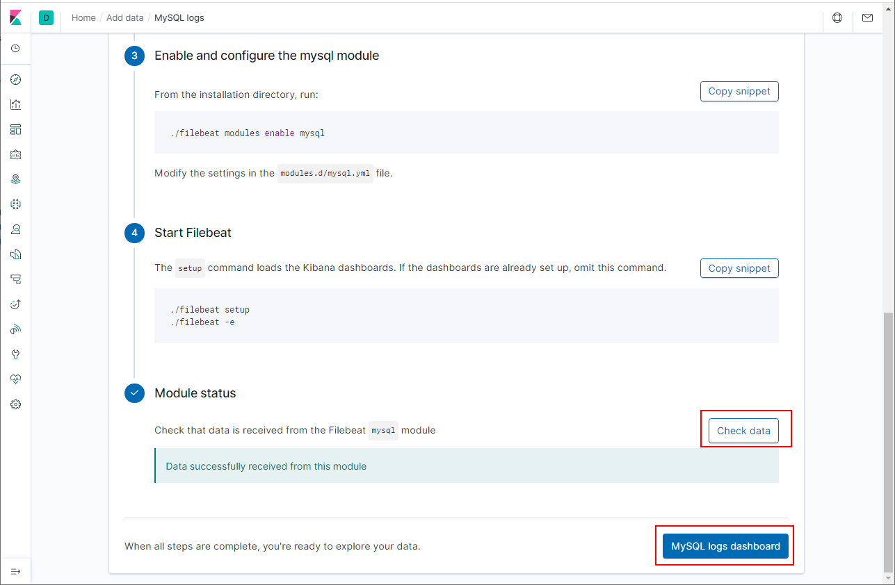

- 查看MySQL收集到的日志详情。

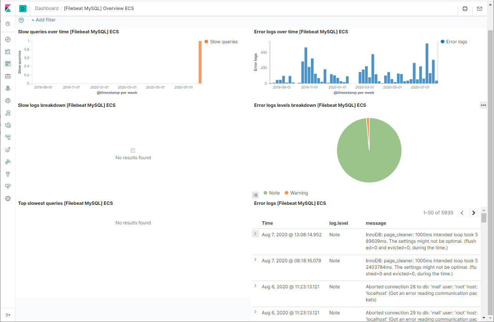

## 总结

本文主要介绍了使用Filebeat去收集Nginx、Elasticsearch和MySQL的文件日志，其他中间件的日志收集用法也基本相同，用Filebeat收集中间件日志是不是方便！

## 公众号


