学习不走弯路，[关注公众号](#公众号) 回复「学习路线」，获取mall项目专属学习路线！

# Github标星34K+Star，这款开源项目助你秒建Git服务！

> 以前使用Gitlab搭建过Git服务，如果服务器配置低的话启动和访问都会特别慢。最近发现了Gogs这个开源项目，安装方便，特别轻量级，推荐给大家！

## 推荐语

一款极易搭建的自助Git服务，特别轻量级，推荐给大家！

## Gogs简介

Gogs是一款极易搭建的自助Git服务，使用Go语言开发，只要Go语言支持的平台它都支持，包括Linux、Mac OS X、Windows以及ARM平台。Gogs对系统硬件要求极低，你甚至可以在树莓派上搭建它。

项目地址：https://github.com/gogs/gogs

## 安装

> Gogs在Docker环境下的安装非常简单，只需要两个命令即可，推荐使用该方式来进行安装。

- 首先我们需要先下载Gogs的Docker镜像；

```bash
docker pull gogs/gogs
```

- 下载完成后使用`docker run`命令即可运行服务；

```bash
docker run -p 10022:22 -p 10080:3000 --name=gogs \
-v /mydata/gogs:/data  \
-d gogs/gogs
```

- 这里我们说下命令中值得注意的地方，`10022`对应的是Gogs的SSH服务端口，`10080`对应的使用Gogs的HTTP服务端口，我们还将容器的数据目录挂载到了宿主机的`/mydata/gogs`目录下，这样就算我们重新创建容器数据也不会丢失。

## 配置

- 安装完成后，我们第一次访问Gogs服务会显示一个设置页面，访问地址：http://192.168.5.19:10080/

- 数据库设置，这里我们直接使用内置的`SQLite3`数据库即可，使用其他的需要自行搭建数据库；

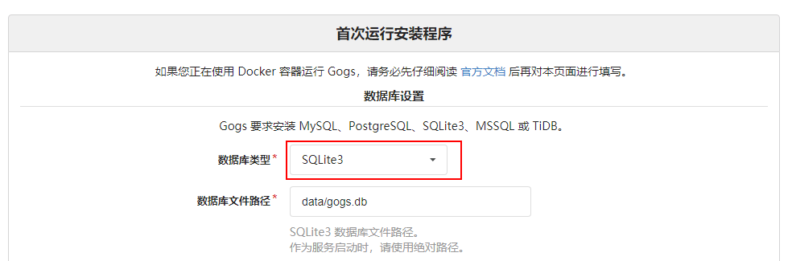

- 应用基本设置，主要修改域名、SSH端口号和应用URL即可。

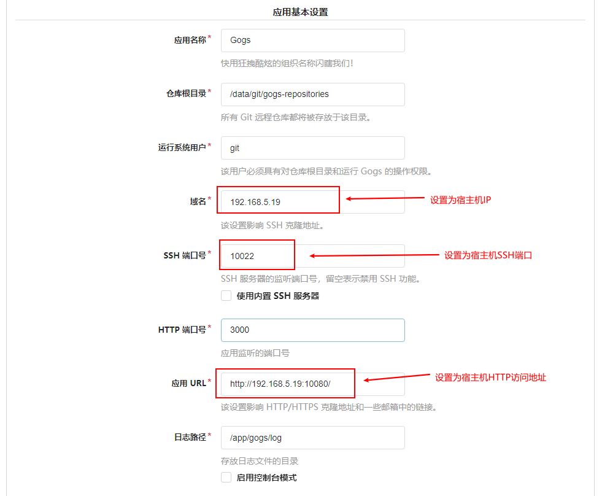

## 使用

### 注册

- 配置好以后会直接跳转到登录界面，首先注册一个帐户；

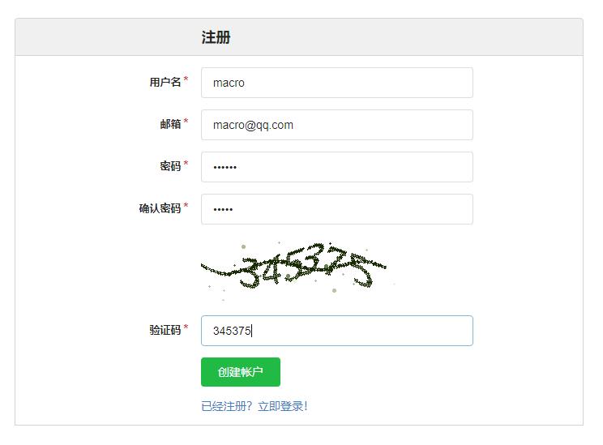

- 注册完成后，登录即可进入控制面板页面。

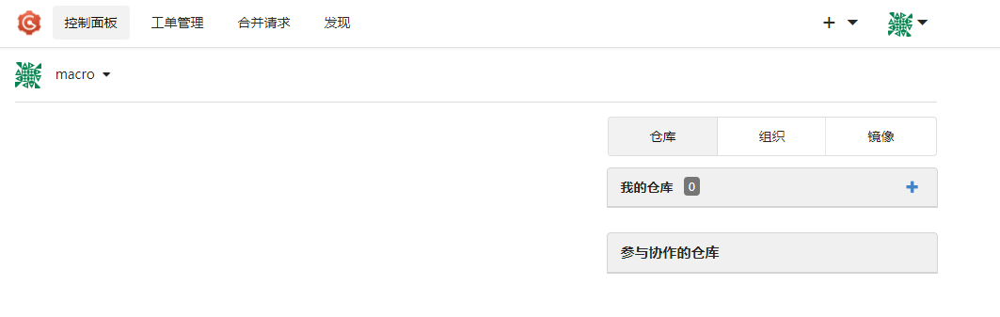

### 创建仓库

- 直接使用我的仓库右侧的加号即可创建仓库，简单设置下仓库名称和可见性来完成创建；


- 创建成功后直接使用克隆地址即可克隆该仓库；

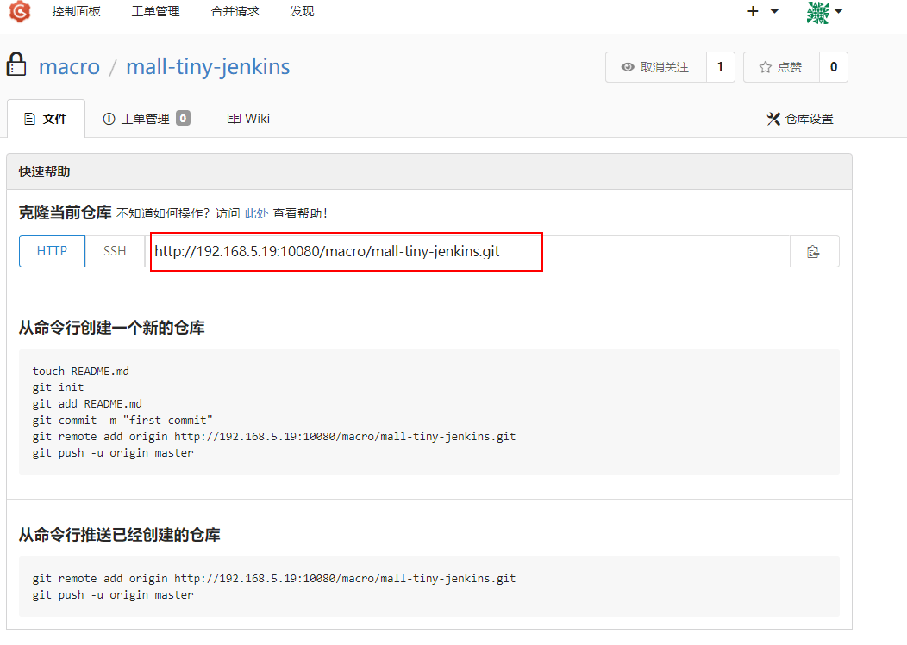

- 我们可以直接使用IDEA的Git检出功能；

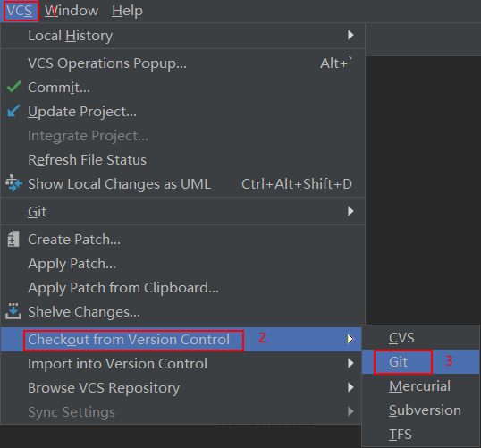

- 检出完成后，加入我们的代码直接提交、推送，在Gogs里面就可以看到我们提交的代码了。

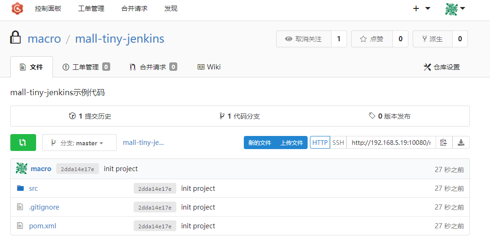

### 工单管理

- 这里的工单管理，有点类似Github上面的Issue的功能，我们可以通过`创建工单`按钮来创建；

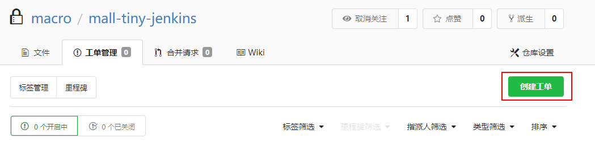

- 输入我们的标题、内容和标签以后即可创建；

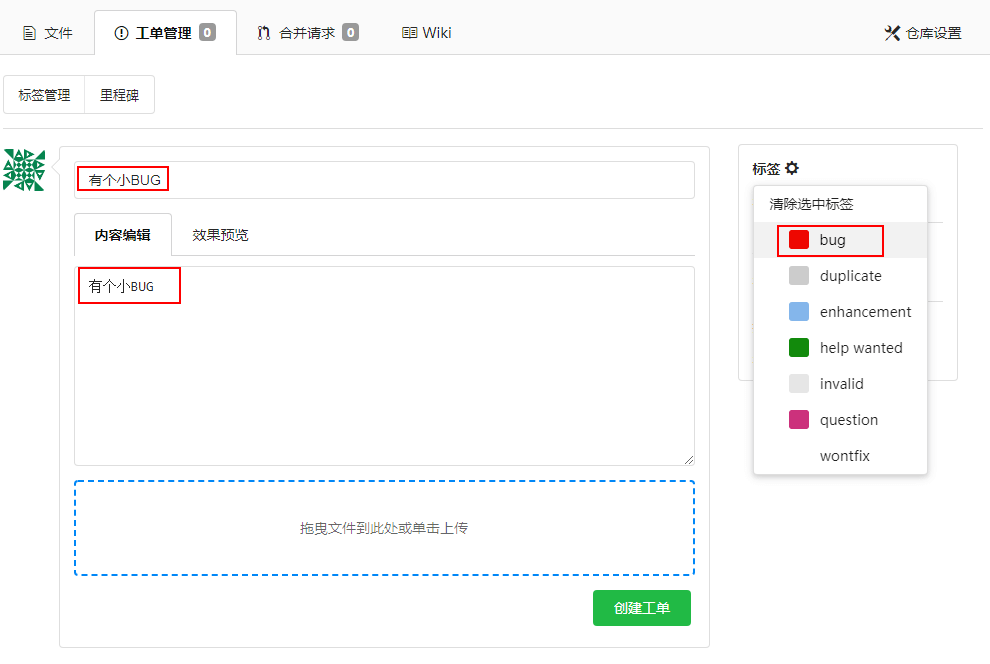

- 创建完成后显示效果如下。

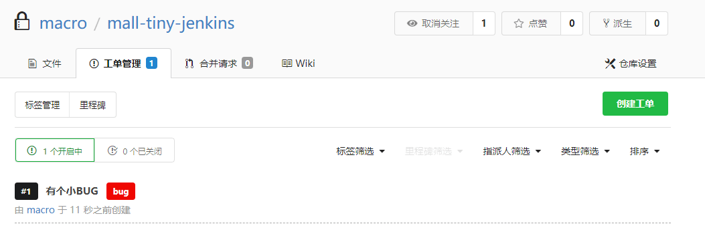

### 添加用户

- 有时候管理员需要新建一些帐户来协作开发，此时我们只要点击`头像->管理面板->用户管理`即可打开用户管理界面；

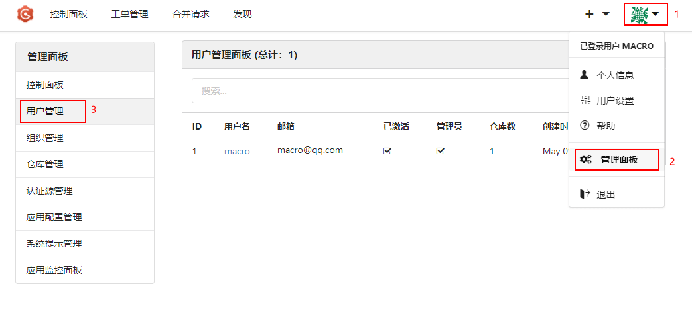

- 然后点击`创建新的帐户`，输入相关信息即可完成创建。

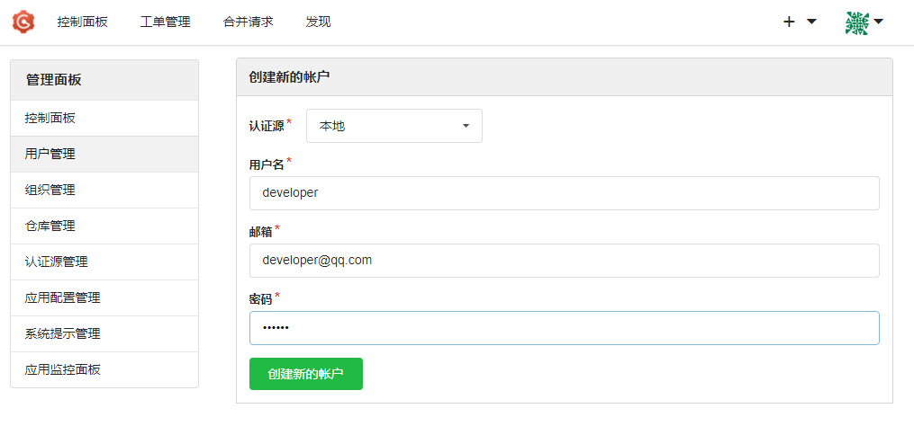

### 管理协作者

- 创建完成后，我们可以在仓库页面的`仓库设置`中打开`管理协作者`功能；

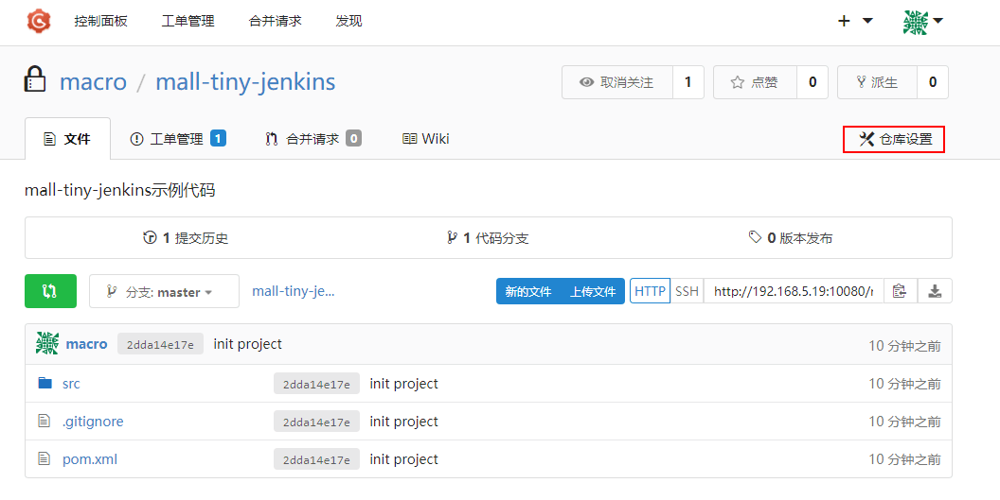

- 之后通过输入协作者账户，点击`增加新的协作者`并设置好权限即可，这样协作者就可以访问并向该仓库提交代码了。

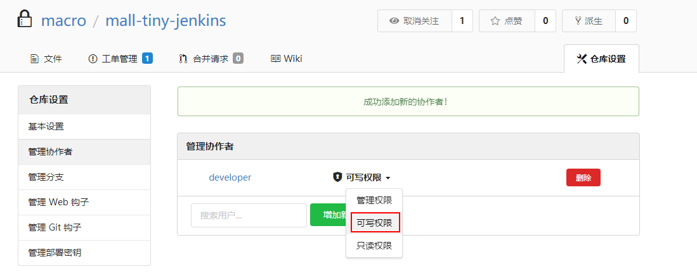

### 迁移外部仓库

- Gogs还提供了从外部仓库迁移代码的功能，通过头像左侧的加号，然后选择`迁移外部仓库`即可；

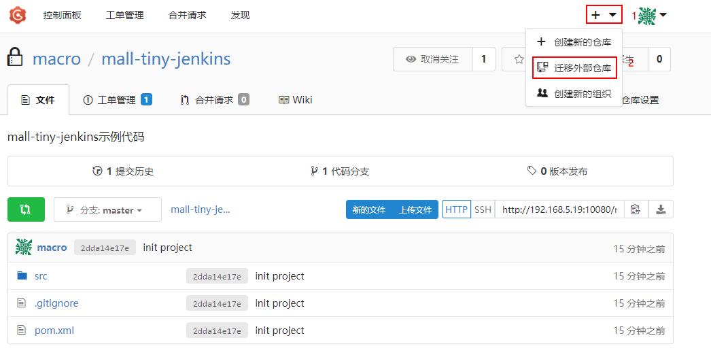

- 这里以迁移Gitee上的`mall`项目为例，项目地址：http://gitee.com/macrozheng/mall

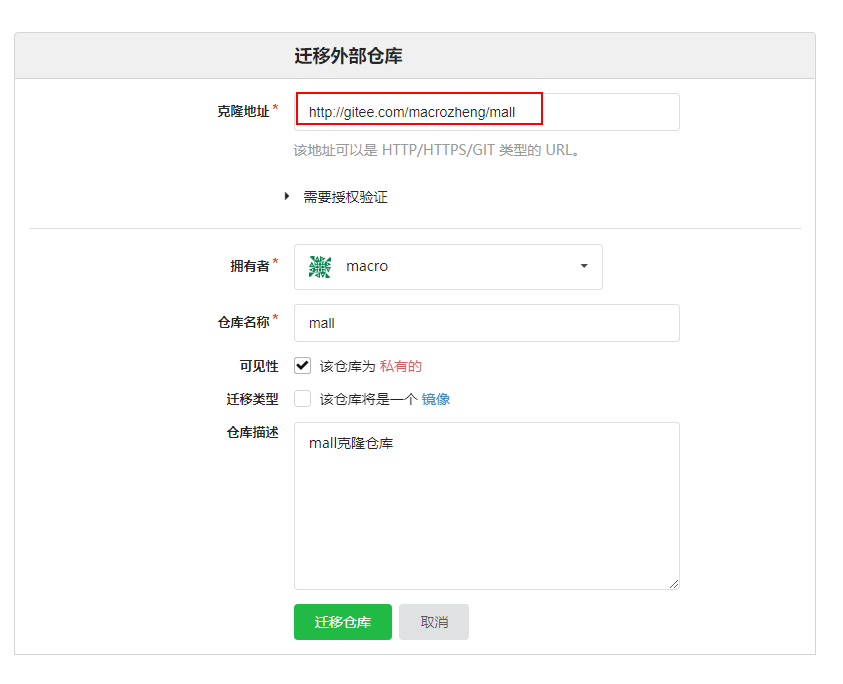

- 迁移成功后就可以在Gogs里面看到`mall`项目了！

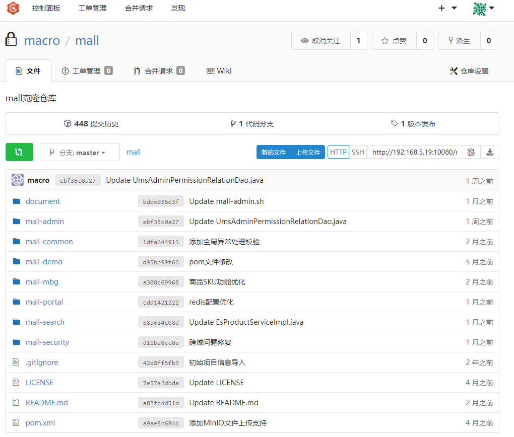

## Gogs VS Gitlab

> 之前有写过一篇[《10分钟搭建自己的Git仓库》](https://mp.weixin.qq.com/s/6GyYlR9lpVcjgYmHMYLi0w)，使用的是Gitlab，下面对比下Gogs和Gitlab在安装使用过程中的优缺点，仅代表个人观点。

| 比较方面       | Gogs               | Gitlab                     |
| -------------- | ------------------ | -------------------------- |
| Docker镜像大小 | 44MB               | 836MB                      |
| 启动速度       | 很快，几秒         | 很慢，机器配置不好要10分钟 |
| 配置要求       | 很低，树莓派都可以 | 很高，吃内存，吃CPU        |
| 访问速度       | 够快               | 机器配置好也还可以         |
| 功能           | 功能较少           | 功能很丰富                 |

## 公众号


