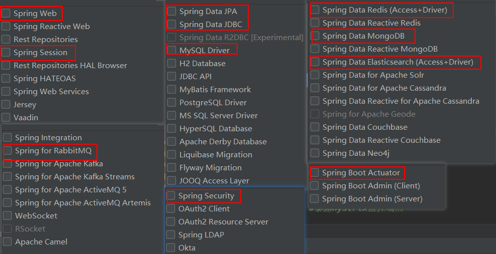
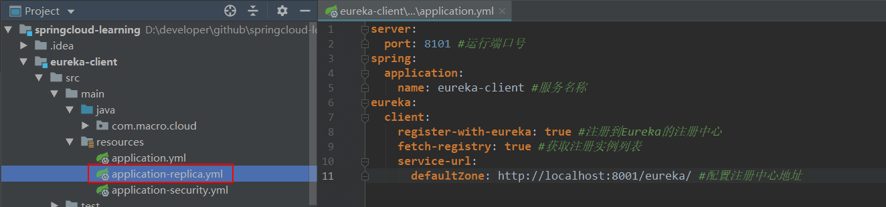
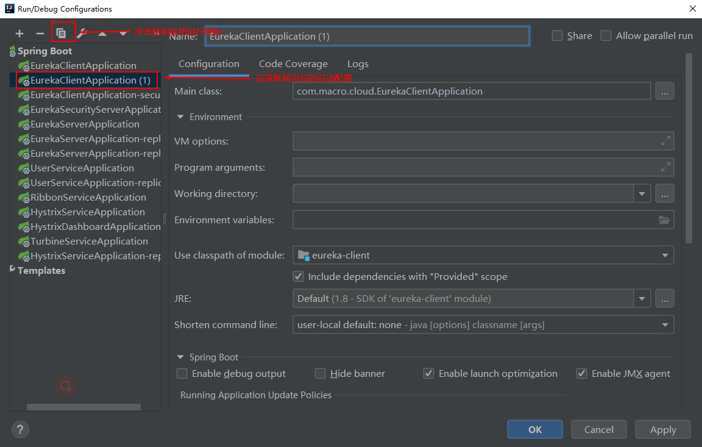
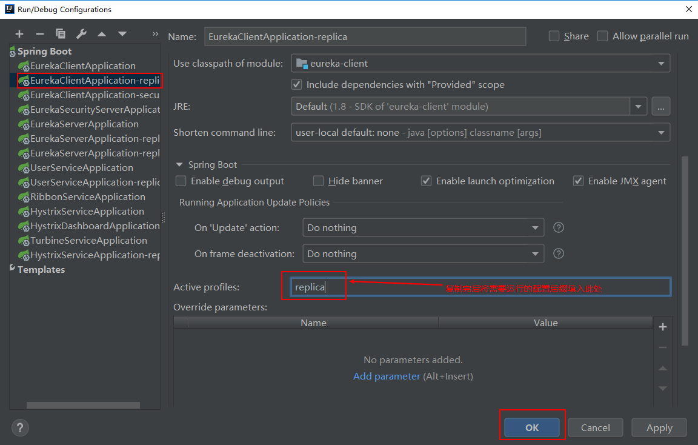
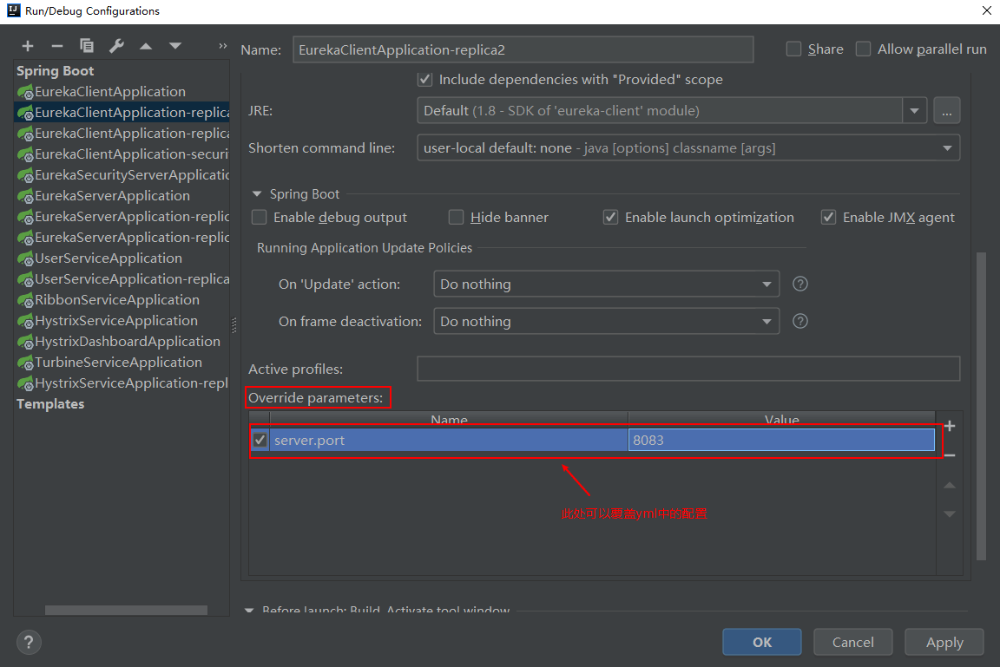
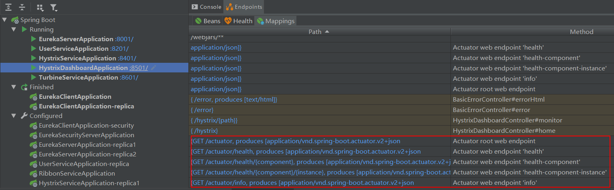

mall项目全套学习教程连载中，[关注公众号](#公众号)第一时间获取。

# IDEA中创建和启动SpringBoot应用的正确姿势

> 本文主要讲解如何在IDEA中创建、启动SpringBoot应用以及查看应用暴露监控端点的正确方式。

## 创建SpringBoot应用

> 由于SpringCloud应用也属于SpringBoot应用的一种，这里我们以创建Eureka注册中心为例来看看在IDEA中创建并运行SpringBoot应用的正确姿势。

### 使用IDEA来创建SpringBoot应用

- 创建一个Eureka注册中心模块，并使用Spring Initializer初始化一个SpringBoot项目：


- 填写应用信息：


- 选择你需要的SpringBoot或SpringCloud组件进行创建：


- 创建完成后会发现pom.xml文件中已经有了eureka-server的依赖：

```xml
<dependency>
    <groupId>org.springframework.cloud</groupId>
    <artifactId>spring-cloud-starter-netflix-eureka-server</artifactId>
</dependency>
```

- 当然你也可以使用其他组件来创建SpringBoot应用，IDEA中提供了很多SpringBoot中常用的组件，比如：




## 启动SpringBoot应用

> 创建完成的SpringBoot应用，直接运行启动类的main方法就可以运行了。但是有时候我们会启动很多应用，为了便于管理，我们使用IDEA的Run Dashboard来启动。

### 打开Run Dashboard的方式

默认情况下，当IDEA检查到你的项目中有SpringBoot应用时，会提示你开启，如果你没开启，可以用以下方法开启。


### 通过默认配置启动

> 直接在Run Dashboard中右键应用，点击run即可启动。


### 使用指定配置运行

> 我们曾经搭建过一个用于注册到注册中心的eureka-client服务，只使用默认配置启动的话，我们直接使用上面的启动方式即可，但是如果我们要用其他配置来启动，如果我们没使用IDEA的话，可能会把eureka-client打成jar包，然后使用java命令指定不同的配置来启动，接下来我们试试使用IDEA怎么用不同的配置启动同一个SpringBoot应用。

- 此时我们的eureka-client有三个不同的配置，默认配置为application.yml，我们将采用application-replica.yml来启动它；



- 首先我们复制eureka-client原来的启动配置：



- 复制完后设置启动文件为application-replica.yml：



- 直接在Run Dashboard中运行即可。

### 覆盖配置中的某个属性运行

> 如果我们启动只是需要覆盖某个SpringBoot的配置，比如说是运行的端口号，可以采用以下方式，还是以eureka-client为例。

复制eureka-client原来的启动配置，然后直接修改运行端口号即可：



## 查看SpringBoot应用暴露的监控端点

> 我们可以从IDEA的Run Dashboard中查看到所有暴露的Actuator监控端点，这里以hystrix-dashboard（断路器仪表盘服务）为例。



## 公众号


