学习不走弯路，[关注公众号](#公众号) 回复「学习路线」，获取mall项目专属学习路线！

# 使用Jenkins一键打包部署SpringBoot应用，就是这么6！

> 任何简单操作的背后，都有一套相当复杂的机制。本文将以SpringBoot应用的在Docker环境下的打包部署为例，详细讲解如何使用Jenkins一键打包部署SpringBoot应用。

## Jenkins简介

Jenkins是开源CI&CD软件领导者，提供超过1000个插件来支持构建、部署、自动化，满足任何项目的需要。我们可以用Jenkins来构建和部署我们的项目，比如说从我们的代码仓库获取代码，然后将我们的代码打包成可执行的文件，之后通过远程的ssh工具执行脚本来运行我们的项目。

## Jenkins的安装及配置

### Docker环境下的安装

- 下载Jenkins的Docker镜像：

```bash
docker pull jenkins/jenkins:lts
```

- 在Docker容器中运行Jenkins：

```bash
docker run -p 8080:8080 -p 50000:5000 --name jenkins \
-u root \
-v /mydata/jenkins_home:/var/jenkins_home \
-d jenkins/jenkins:lts
```

### Jenkins的配置

- 运行成功后访问该地址登录Jenkins，第一次登录需要输入管理员密码：http://192.168.6.132:8080/


- 使用管理员密码进行登录，可以使用以下命令从容器启动日志中获取管理密码：

```bash
docker logs jenkins
```

- 从日志中获取管理员密码：

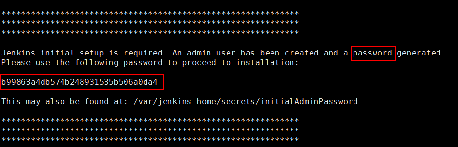

- 选择安装插件方式，这里我们直接安装推荐的插件：

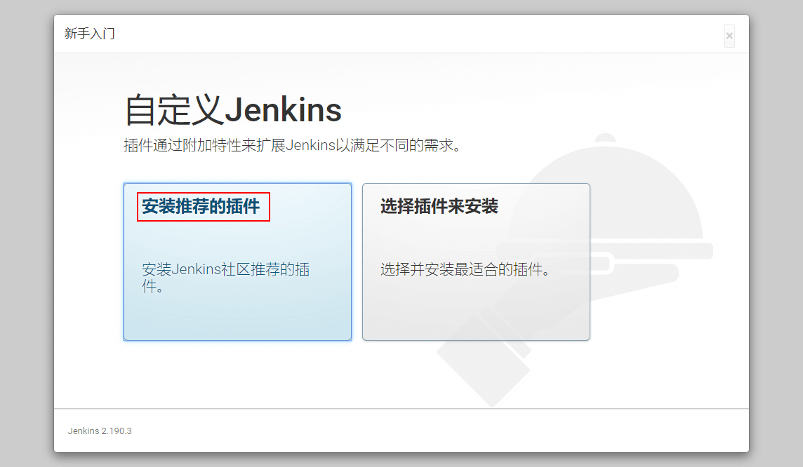

- 进入插件安装界面，联网等待插件安装：

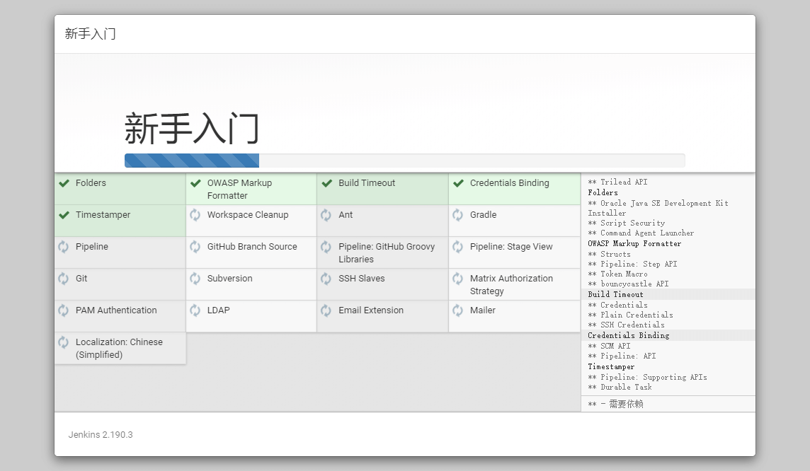

- 安装完成后，创建管理员账号：

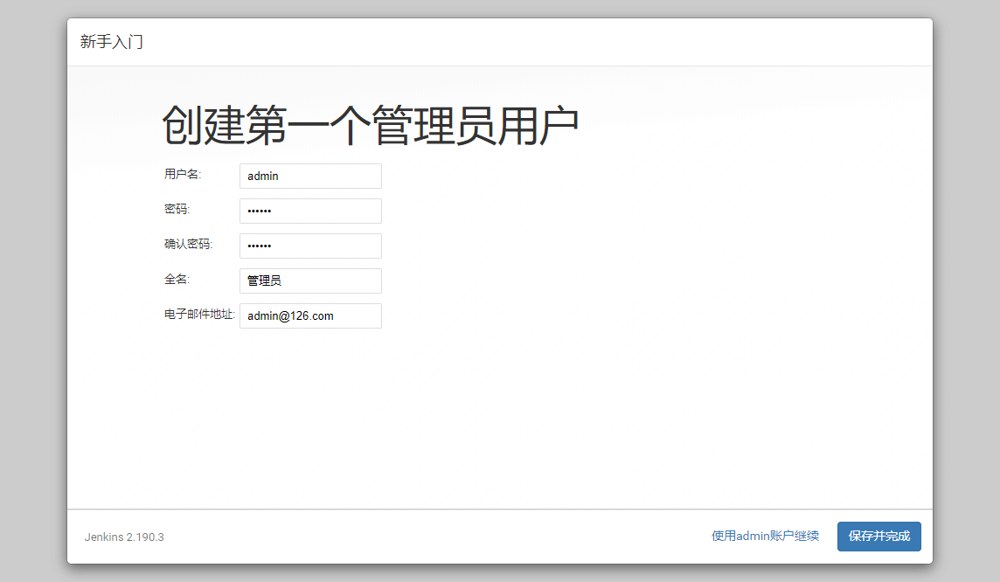

- 进行实例配置，配置Jenkins的URL：


- 点击系统管理->插件管理，进行一些自定义的插件安装：

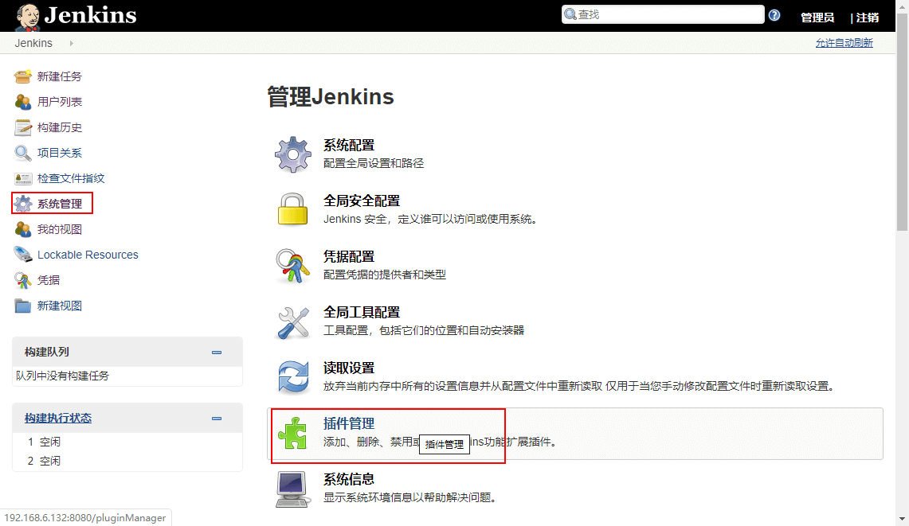

- 确保以下插件被正确安装：
    - 根据角色管理权限的插件：Role-based Authorization Strategy
    - 远程使用ssh的插件：SSH plugin

- 通过系统管理->全局工具配置来进行全局工具的配置，比如maven的配置：

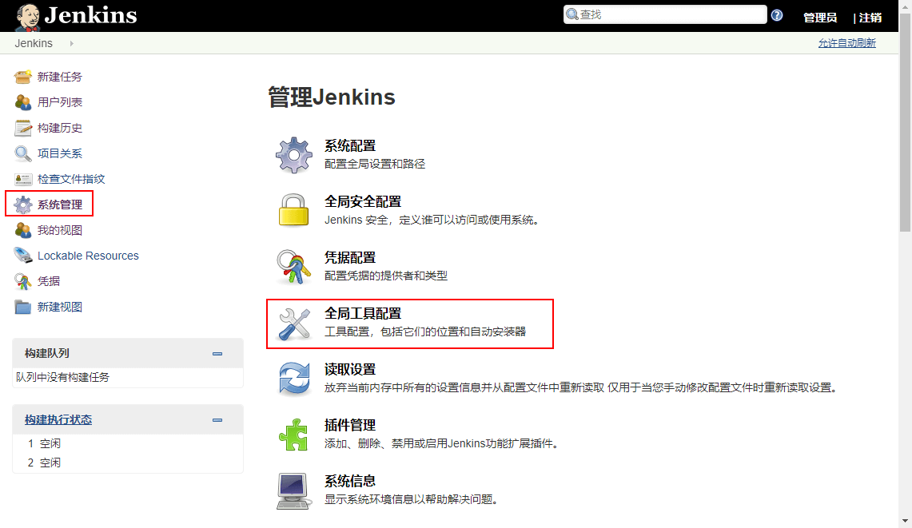

- 新增maven的安装配置：

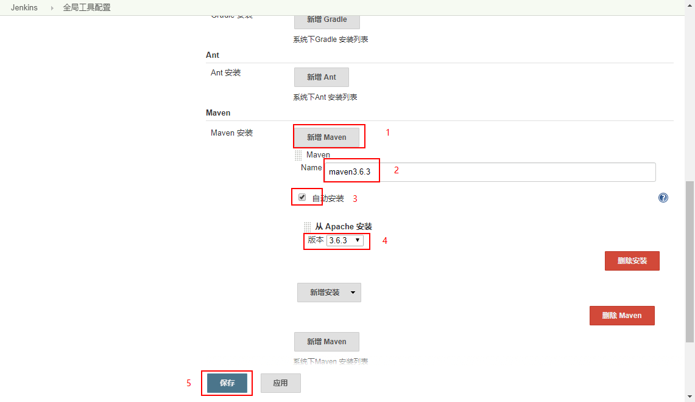

- 在系统管理->系统配置中添加全局ssh的配置，这样Jenkins使用ssh就可以执行远程的linux脚本了：

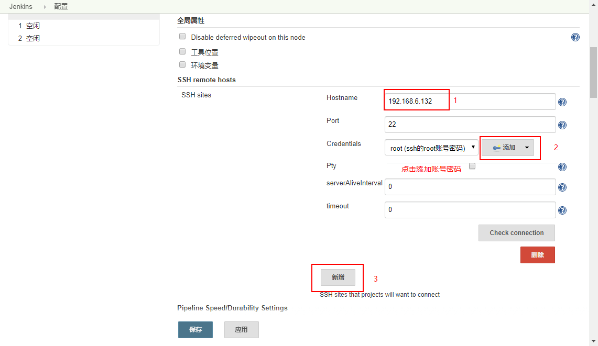

### 角色权限管理

> 我们可以使用Jenkins的角色管理插件来管理Jenkins的用户，比如我们可以给管理员赋予所有权限，运维人员赋予执行任务的相关权限，其他人员只赋予查看权限。

- 在系统管理->全局安全配置中启用基于角色的权限管理：

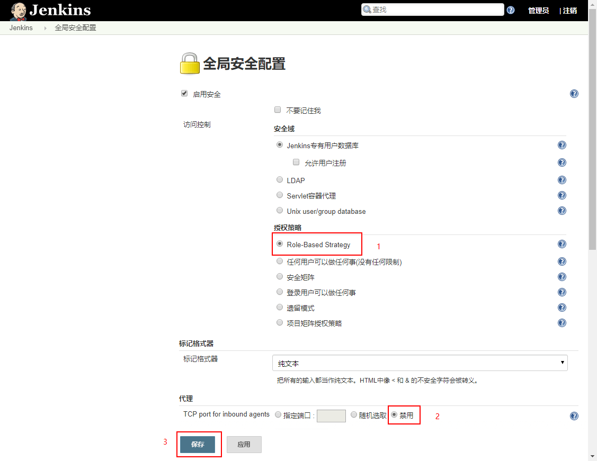

- 进入系统管理->Manage and Assign Roles界面：

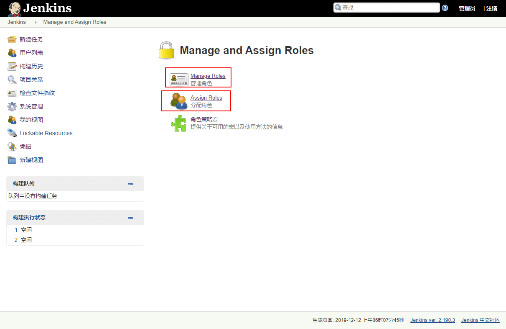

- 添加角色与权限的关系：

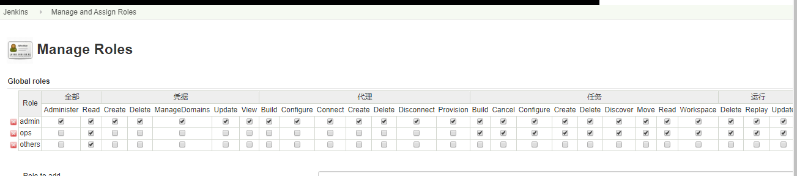

- 给用户分配角色：

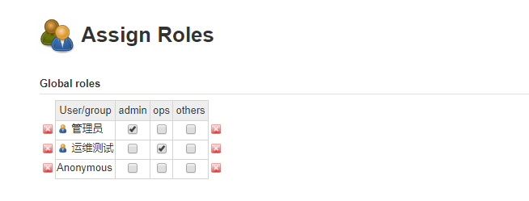

## 打包部署SpringBoot应用

> 这里我们使用`mall-learning`项目中的`mall-tiny-jenkins`模块代码来演示下如何使Jenkins一键打包部署SpringBoot应用。

### 将代码上传到Git仓库

- 首先我们需要安装Gitlab（当然你也可以使用Github或者Gitee），然后将`mall-tiny-jenkins`中的代码上传到Gitlab中去，Gitlab的使用请参考：[10分钟搭建自己的Git仓库](https://mp.weixin.qq.com/s/6GyYlR9lpVcjgYmHMYLi0w)

- `mall-tiny-jenkins`项目源码地址：https://github.com/macrozheng/mall-learning/tree/master/mall-tiny-jenkins

- 上传完成后Gitlab中的展示效果如下：

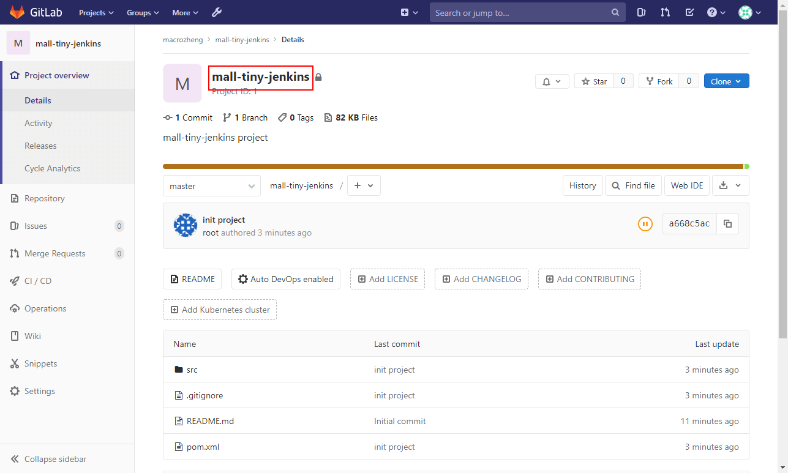

- 有一点需要`注意`，要将pom.xml中的dockerHost地址改成你自己的Docker镜像仓库地址：


### 执行脚本准备

- 将`mall-tiny-jenkins.sh`脚本文件上传到`/mydata/sh`目录下，脚本内容如下：

```bash
#!/usr/bin/env bash
app_name='mall-tiny-jenkins'
docker stop ${app_name}
echo '----stop container----'
docker rm ${app_name}
echo '----rm container----'
docker run -p 8088:8088 --name ${app_name} \
--link mysql:db \
-v /etc/localtime:/etc/localtime \
-v /mydata/app/${app_name}/logs:/var/logs \
-d mall-tiny/${app_name}:1.0-SNAPSHOT
echo '----start container----'
```

- 给.sh脚本添加可执行权限：

```bash
chmod +x ./mall-tiny-jenkins.sh  
```

- windows下的.sh脚本上传到linux上使用，需要修改文件格式，否则会因为有特殊格式存在而无法执行：

```bash
#使用vim编辑器来修改
vi mall-tiny-jenkins.sh
# 查看文件格式，windows上传上来的默认为dos
:set ff 
#修改文件格式为unix
:set ff=unix 
#保存并退出
:wq
```

- 执行.sh脚本，测试使用，可以不执行：
```bash
./mall-tiny-jenkins.sh
```

### 在Jenkins中创建执行任务

- 首先我们需要新建一个任务：

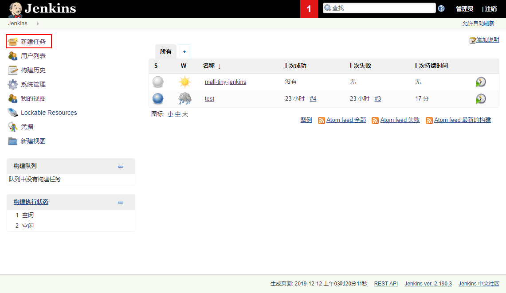

- 设置任务名称后选择构建一个自由风格的软件项目：


- 然后在源码管理中添加我们的git仓库地址：http://192.168.6.132:1080/macrozheng/mall-tiny-jenkins

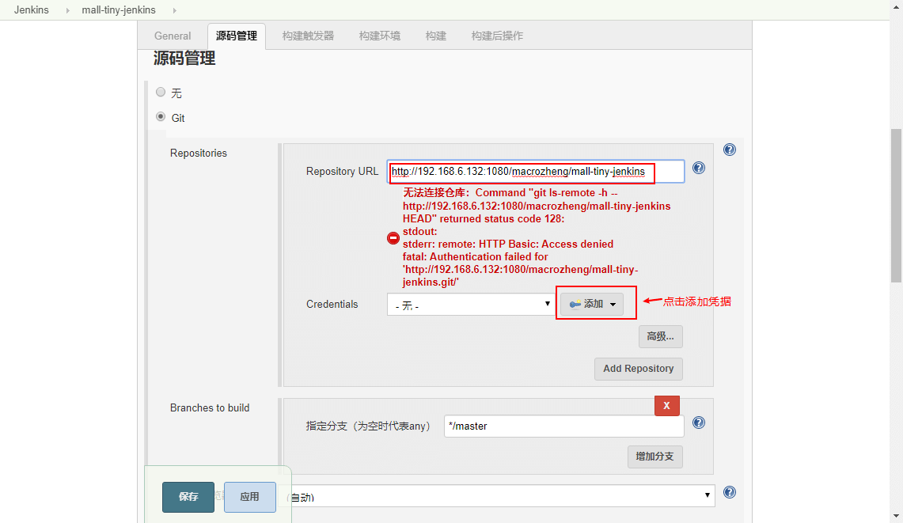

- 此时需要添加一个凭据，也就是我们git仓库的账号密码：

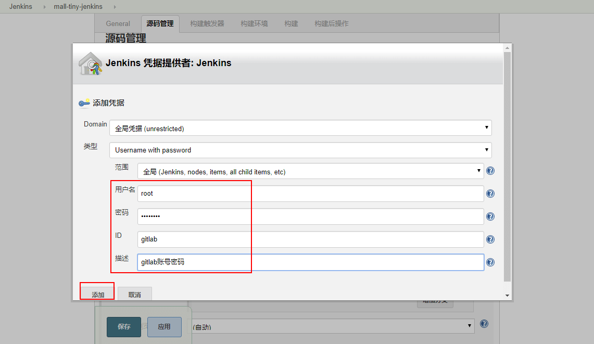

- 填写完成后选择该凭据，就可以正常连接git仓库了；

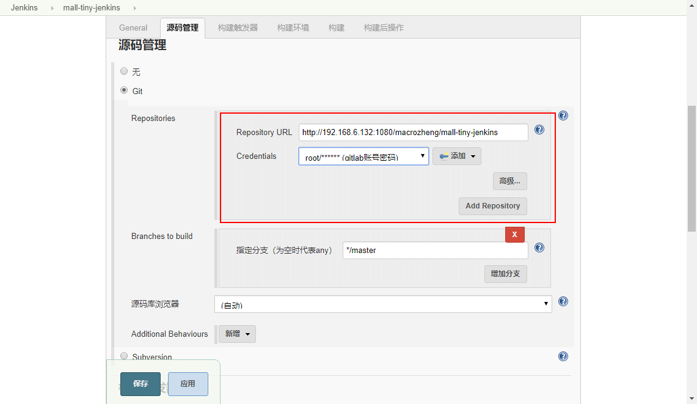

- 之后我们需要添加一个构建，选择调用顶层maven目标，该构建主要用于把我们的源码打包成Docker镜像并上传到我们的Docker镜像仓库去：

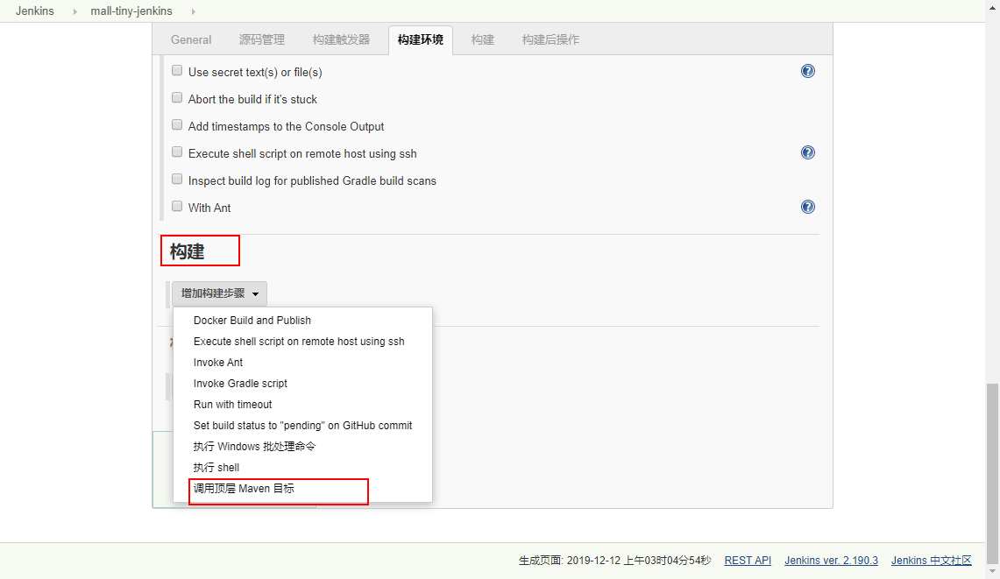

- 选择我们的maven版本，然后设置maven命令和指定pom文件位置：

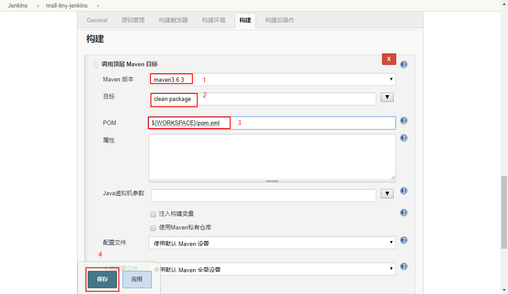

- 之后添加一个执行远程shell脚本的构建，用于在我们的镜像打包完成后执行启动Docker容器的.sh脚本：

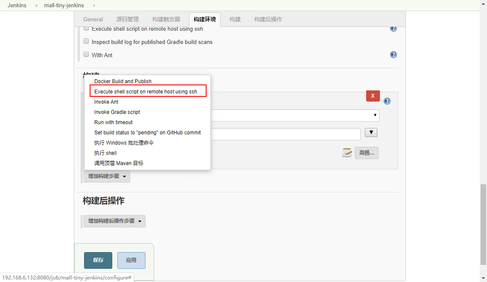

- 需要设置执行的shell命令如下：/mydata/sh/mall-tiny-jenkins.sh

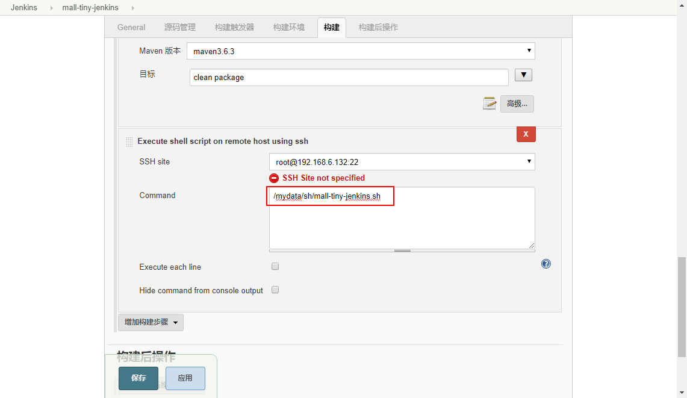

- 之后点击保存操作，我们的任务就创建完成了，在任务列表中我们可以点击运行来执行该任务；

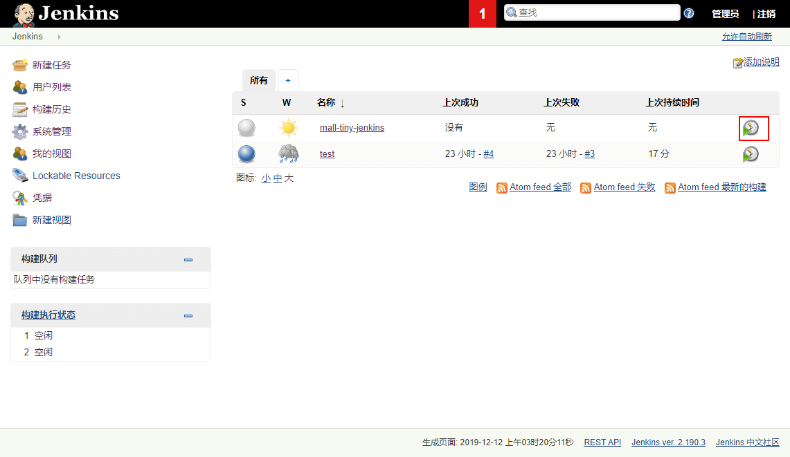

- 我们可以通过控制台输出来查看整个任务的执行过程：

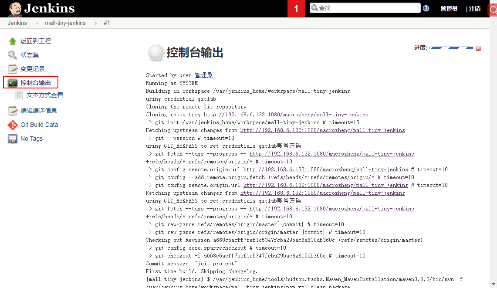

- 运行成功后，访问该地址即可查看API文档：http://192.168.6.132:8088/swagger-ui.html

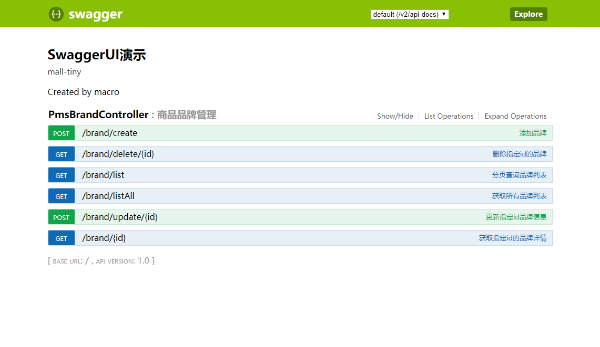

## 项目源码地址

https://github.com/macrozheng/mall-learning/tree/master/mall-tiny-jenkins

## 公众号


