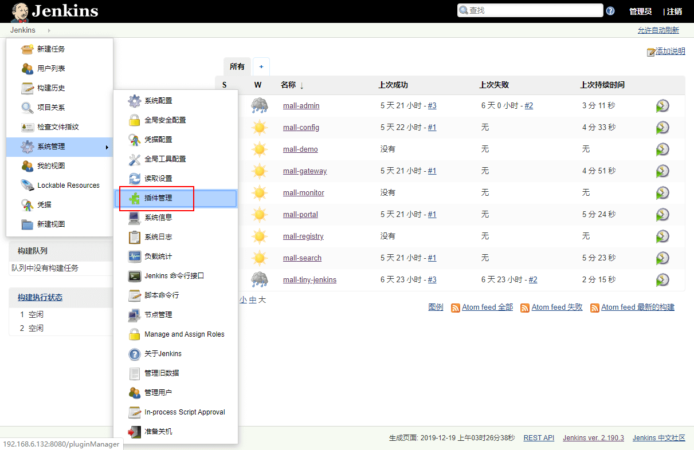
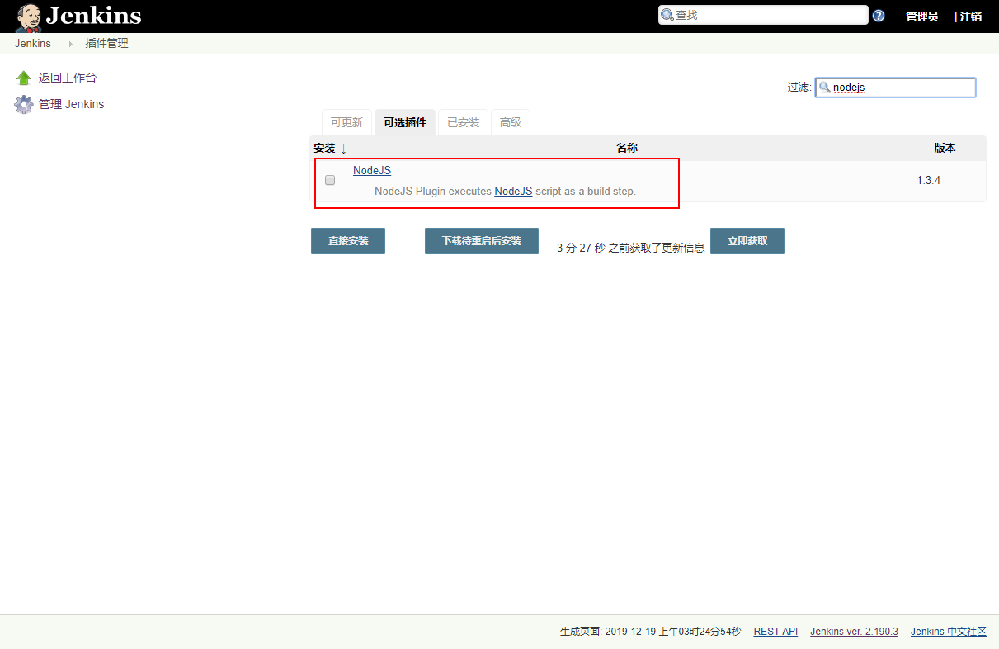
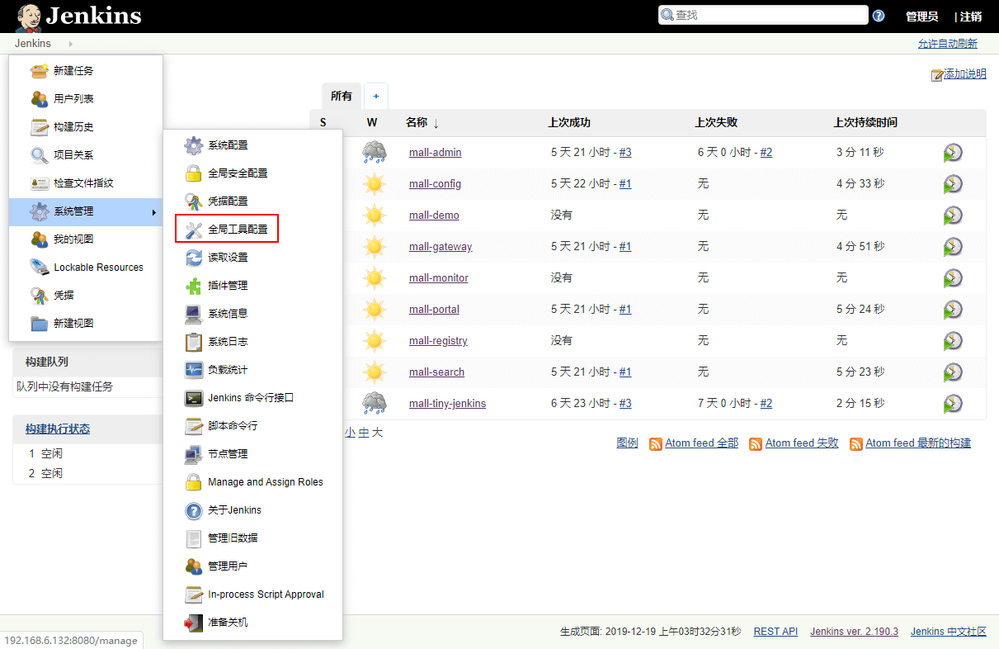
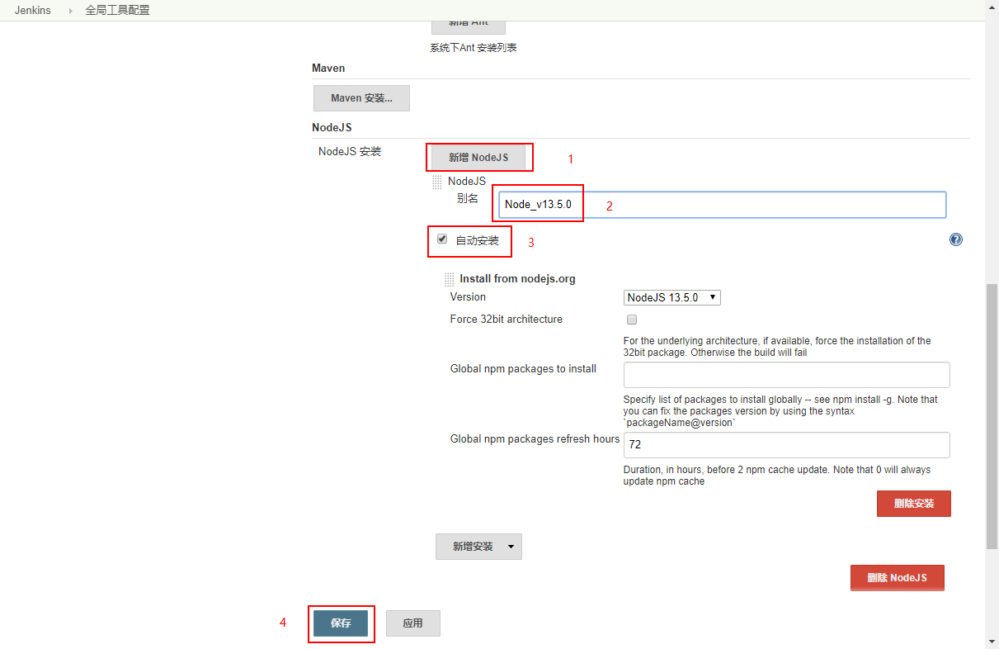
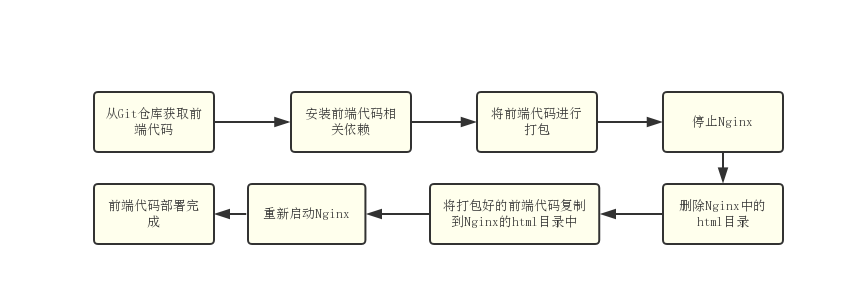
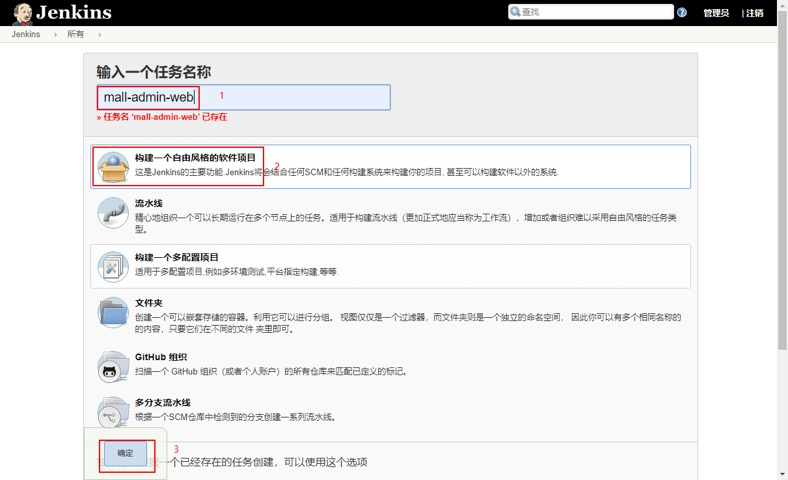
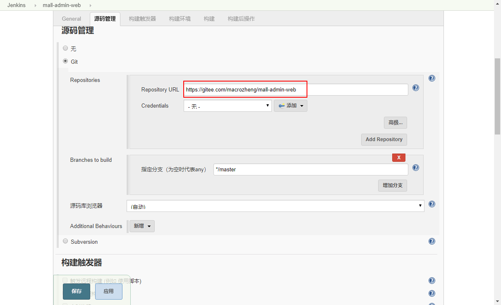
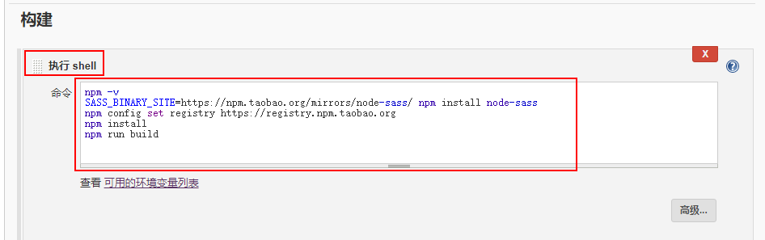
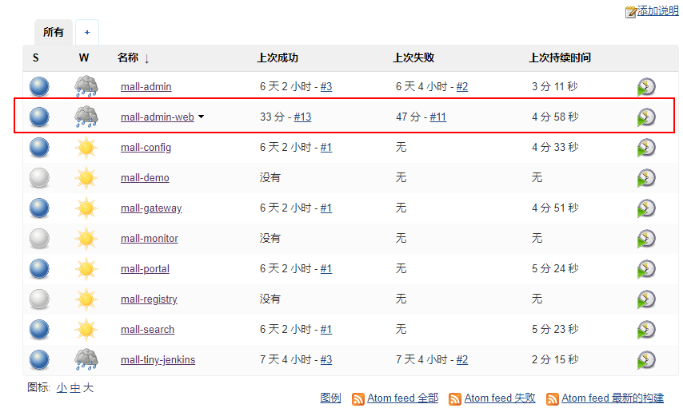

学习不走弯路，[关注公众号](#公众号) 回复「学习路线」，获取mall项目专属学习路线！

# 使用Jenkins一键打包部署前端应用，就是这么6！

> 上一次我们讲到了使用Jenkins一键打包部署SpringBoot应用，这一次我们来讲下如何一键打包部署前端应用，以Vue前端应用为例，这里我们使用`mall-admin-web`中的代码来进行演示。

## 学前准备

> 学习本文需要一些Jenkins和Nginx的知识，对这些不熟悉的小伙伴可以参考以下文章。

- [使用Jenkins一键打包部署SpringBoot应用，就是这么6！](https://mp.weixin.qq.com/s/tQqvgSc9cHBtnqRQSbI4aw)
- [Nginx的这些妙用，你肯定有不知道的！](https://mp.weixin.qq.com/s/9VZi2suAlomu1IRGy-qdCA)

## Jenkins中的自动化部署

> Vue前端应用的打包需要依赖NodeJS插件，所以我们先安装并配置该插件，然后创建任务来打包部署。

### 安装NodeJS插件

- 在系统设置->插件管理中选择安装插件；



- 搜索`NodeJS`插件并进行安装；



### 配置NodeJS插件

- 在系统设置->全局工具配置中进行插件配置；



- 选择`新增NodeJS`，配置好版本号以后，点击保存即可完成设置；



### 创建任务

> 我们需要创建一个任务来打包部署我们的前端应用，这里以我的`mall-admin-web`项目为例。

- 任务执行流程如下：



- 构建一个自由风格的软件项目：



- 在源码管理中添加Git代码仓库相关配置，这里我使用的Gitee上面的代码，地址为：https://gitee.com/macrozheng/mall-admin-web



- 在构建环境中把我们的`node`环境添加进去：


- 添加一个`执行shell`的构建，用于将我们的前端代码进行编译打包：



- 构建脚本如下：

```bash
# 查看版本信息
npm -v
# 解决存放在Github上的sass无法下载的问题
SASS_BINARY_SITE=https://npm.taobao.org/mirrors/node-sass/ npm install node-sass
# 将镜像源替换为淘宝的加速访问
npm config set registry https://registry.npm.taobao.org
# 安装项目依赖
npm install
# 项目打包
npm run build
```

- 添加一个`使用ssh执行远程脚本`的构建，用于将我们打包后的代码发布到Nginx中去：


- 远程执行脚本如下：

```bash
docker stop nginx
echo '----stop nginx----'
rm -rf /mydata/nginx/html
echo '----rm html dir----'
cp -r /mydata/jenkins_home/workspace/mall-admin-web/dist /mydata/nginx/html
echo '----cp dist dir to html dir----'
docker start nginx
echo '----start nginx----'
```

- 点击保存后，直接在任务列表中点击运行即可完成自动化部署：



## 遇到的坑

### node-sass无法下载导致构建失败

由于node-sass的源使用的是Github上面的，经常无法访问，我们构建的时候需要单独设置node-sass的下载地址。

```bash
# linux
SASS_BINARY_SITE=https://npm.taobao.org/mirrors/node-sass/ npm install node-sass
# window
set SASS_BINARY_SITE=https://npm.taobao.org/mirrors/node-sass&& npm install node-sass
```

### 有些依赖无法下载导致构建失败

由于npm源访问慢的问题，有些源可能会无法下载，改用淘宝的npm源即可解决。

```bash
# 设置为淘宝的镜像源
npm config set registry https://registry.npm.taobao.org
# 设置为官方镜像源
npm config set registry https://registry.npmjs.org
```

## 项目地址

[https://github.com/macrozheng/mall-admin-web](https://github.com/macrozheng/mall-admin-web)

## 公众号


