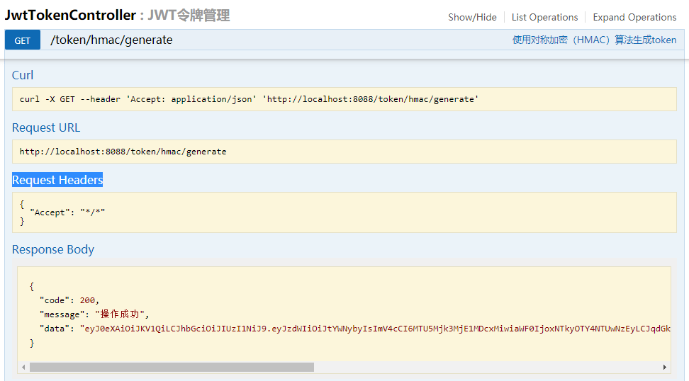
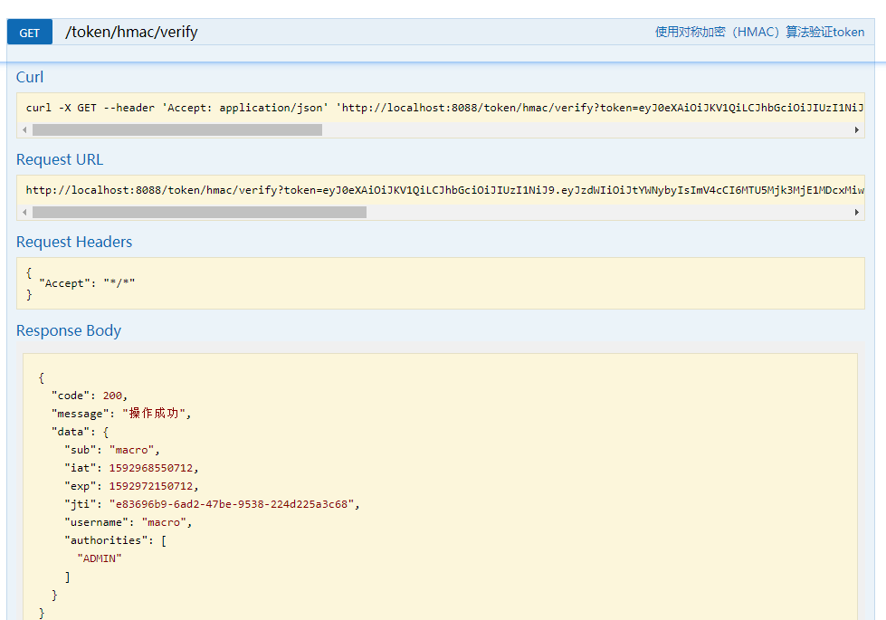
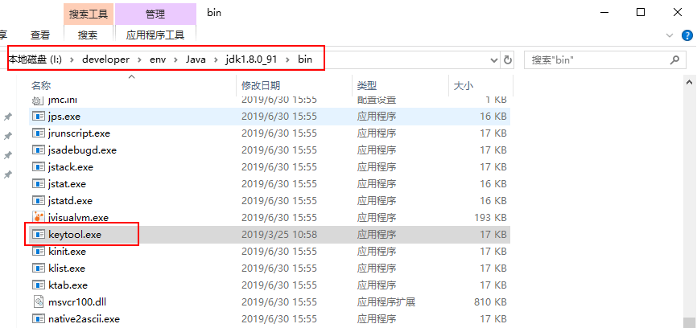
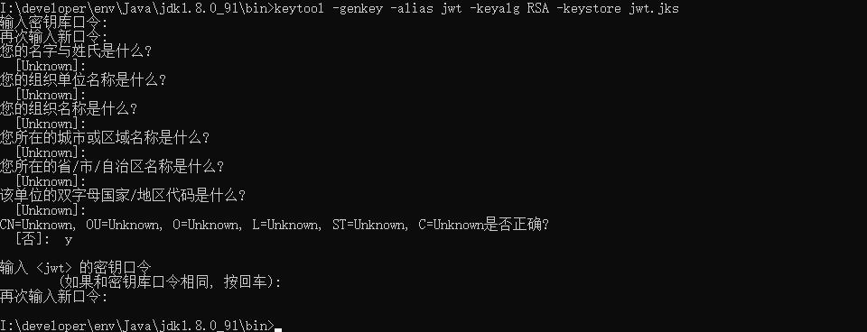
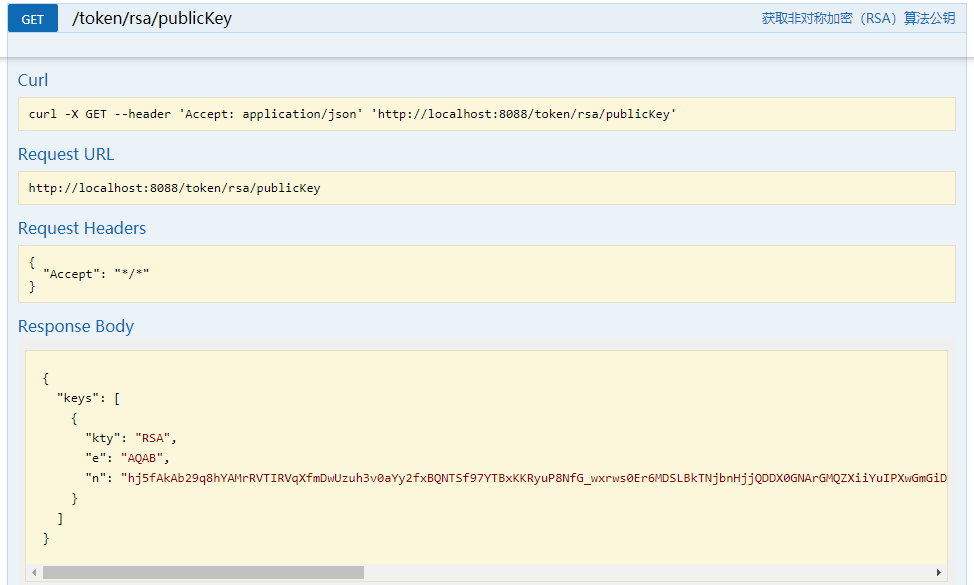
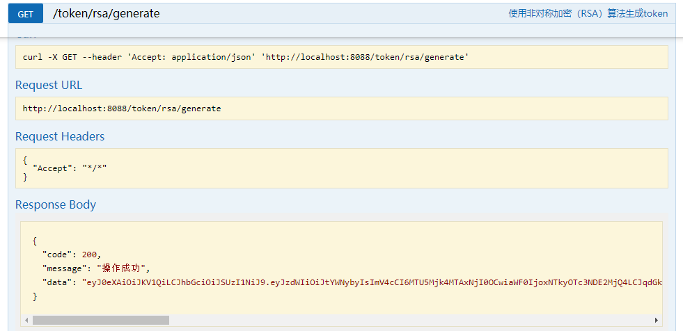
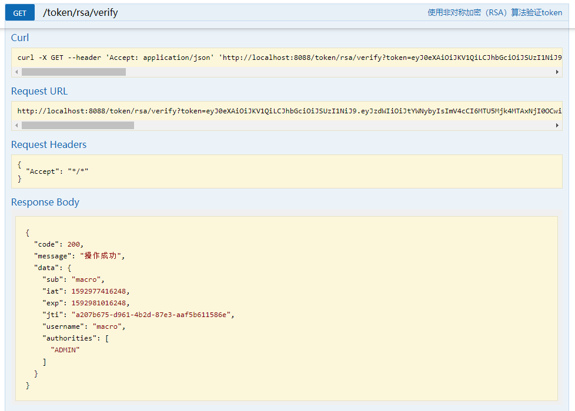

学习不走弯路，[关注公众号](#公众号) 回复「学习路线」，获取mall项目专属学习路线！

# 听说你的JWT库用起来特别扭，推荐一款贼好用的！

> 以前一直使用的是`jjwt`这个JWT库，虽然小巧够用, 但对JWT的一些细节封装的不是很好。最近发现了一个更好用的JWT库`nimbus-jose-jwt`，简单易用，API非常易于理解，对称加密和非对称加密算法都支持，推荐给大家！

## 简介

`nimbus-jose-jwt`是最受欢迎的JWT开源库，基于Apache 2.0开源协议，支持所有标准的签名(JWS)和加密(JWE)算法。

## JWT概念关系

这里我们需要了解下JWT、JWS、JWE三者之间的关系，其实JWT(JSON Web Token)指的是一种规范，这种规范允许我们使用JWT在两个组织之间传递安全可靠的信息。而JWS(JSON Web Signature)和JWE(JSON Web Encryption)是JWT规范的两种不同实现，我们平时最常使用的实现就是JWS。

## 使用

> 接下来我们将介绍下`nimbus-jose-jwt`库的使用，主要使用对称加密（HMAC）和非对称加密（RSA）两种算法来生成和解析JWT令牌。

### 对称加密（HMAC）

> 对称加密指的是使用`相同`的秘钥来进行加密和解密，如果你的秘钥不想暴露给解密方，考虑使用非对称加密。

- 要使用`nimbus-jose-jwt`库，首先在`pom.xml`添加相关依赖；

```xml
<!--JWT解析库-->
<dependency>
    <groupId>com.nimbusds</groupId>
    <artifactId>nimbus-jose-jwt</artifactId>
    <version>8.16</version>
</dependency>
```

- 创建`JwtTokenServiceImpl`作为JWT处理的业务类，添加根据`HMAC`算法生成和解析JWT令牌的方法，可以发现`nimbus-jose-jwt`库操作JWT的API非常易于理解；

```java
/**
 * Created by macro on 2020/6/22.
 */
@Service
public class JwtTokenServiceImpl implements JwtTokenService {
    @Override
    public String generateTokenByHMAC(String payloadStr, String secret) throws JOSEException {
        //创建JWS头，设置签名算法和类型
        JWSHeader jwsHeader = new JWSHeader.Builder(JWSAlgorithm.HS256).
                type(JOSEObjectType.JWT)
                .build();
        //将负载信息封装到Payload中
        Payload payload = new Payload(payloadStr);
        //创建JWS对象
        JWSObject jwsObject = new JWSObject(jwsHeader, payload);
        //创建HMAC签名器
        JWSSigner jwsSigner = new MACSigner(secret);
        //签名
        jwsObject.sign(jwsSigner);
        return jwsObject.serialize();
    }

    @Override
    public PayloadDto verifyTokenByHMAC(String token, String secret) throws ParseException, JOSEException {
        //从token中解析JWS对象
        JWSObject jwsObject = JWSObject.parse(token);
        //创建HMAC验证器
        JWSVerifier jwsVerifier = new MACVerifier(secret);
        if (!jwsObject.verify(jwsVerifier)) {
            throw new JwtInvalidException("token签名不合法！");
        }
        String payload = jwsObject.getPayload().toString();
        PayloadDto payloadDto = JSONUtil.toBean(payload, PayloadDto.class);
        if (payloadDto.getExp() < new Date().getTime()) {
            throw new JwtExpiredException("token已过期！");
        }
        return payloadDto;
    }
}
```

- 创建`PayloadDto`实体类，用于封装JWT中存储的信息；

```java
/**
 * Created by macro on 2020/6/22.
 */
@Data
@EqualsAndHashCode(callSuper = false)
@Builder
public class PayloadDto {
    @ApiModelProperty("主题")
    private String sub;
    @ApiModelProperty("签发时间")
    private Long iat;
    @ApiModelProperty("过期时间")
    private Long exp;
    @ApiModelProperty("JWT的ID")
    private String jti;
    @ApiModelProperty("用户名称")
    private String username;
    @ApiModelProperty("用户拥有的权限")
    private List<String> authorities;
}
```

- 在`JwtTokenServiceImpl`类中添加获取默认的PayloadDto的方法，JWT过期时间设置为`60min`；

```java
/**
 * Created by macro on 2020/6/22.
 */
@Service
public class JwtTokenServiceImpl implements JwtTokenService {
    @Override
    public PayloadDto getDefaultPayloadDto() {
        Date now = new Date();
        Date exp = DateUtil.offsetSecond(now, 60*60);
        return PayloadDto.builder()
                .sub("macro")
                .iat(now.getTime())
                .exp(exp.getTime())
                .jti(UUID.randomUUID().toString())
                .username("macro")
                .authorities(CollUtil.toList("ADMIN"))
                .build();
    }
}
```

- 创建`JwtTokenController`类，添加根据HMAC算法生成和解析JWT令牌的接口，由于HMAC算法需要长度至少为`32个字节`的秘钥，所以我们使用MD5加密下；

```java
/**
 * JWT令牌管理Controller
 * Created by macro on 2020/6/22.
 */
@Api(tags = "JwtTokenController", description = "JWT令牌管理")
@Controller
@RequestMapping("/token")
public class JwtTokenController {

    @Autowired
    private JwtTokenService jwtTokenService;

    @ApiOperation("使用对称加密（HMAC）算法生成token")
    @RequestMapping(value = "/hmac/generate", method = RequestMethod.GET)
    @ResponseBody
    public CommonResult generateTokenByHMAC() {
        try {
            PayloadDto payloadDto = jwtTokenService.getDefaultPayloadDto();
            String token = jwtTokenService.generateTokenByHMAC(JSONUtil.toJsonStr(payloadDto), SecureUtil.md5("test"));
            return CommonResult.success(token);
        } catch (JOSEException e) {
            e.printStackTrace();
        }
        return CommonResult.failed();
    }

    @ApiOperation("使用对称加密（HMAC）算法验证token")
    @RequestMapping(value = "/hmac/verify", method = RequestMethod.GET)
    @ResponseBody
    public CommonResult verifyTokenByHMAC(String token) {
        try {
            PayloadDto payloadDto  = jwtTokenService.verifyTokenByHMAC(token, SecureUtil.md5("test"));
            return CommonResult.success(payloadDto);
        } catch (ParseException | JOSEException e) {
            e.printStackTrace();
        }
        return CommonResult.failed();

    }
}
```

- 调用使用HMAC算法生成JWT令牌的接口进行测试；



- 调用使用HMAC算法解析JWT令牌的接口进行测试。



### 非对称加密（RSA）

> 非对称加密指的是使用公钥和私钥来进行加密解密操作。对于`加密`操作，公钥负责加密，私钥负责解密，对于`签名`操作，私钥负责签名，公钥负责验证。非对称加密在JWT中的使用显然属于`签名`操作。

- 如果我们需要使用固定的公钥和私钥来进行签名和验证的话，我们需要生成一个证书文件，这里将使用Java自带的`keytool`工具来生成`jks`证书文件，该工具在JDK的`bin`目录下；



- 打开CMD命令界面，使用如下命令生成证书文件，设置别名为`jwt`，文件名为`jwt.jks`；

```bash
keytool -genkey -alias jwt -keyalg RSA -keystore jwt.jks
```

- 输入密码为`123456`，然后输入各种信息之后就可以生成证书`jwt.jks`文件了；



- 将证书文件`jwt.jks`复制到项目的`resource`目录下，然后需要从证书文件中读取`RSAKey`，这里我们需要在`pom.xml`中添加一个Spring Security的RSA依赖；

```xml
<!--Spring Security RSA工具类-->
<dependency>
    <groupId>org.springframework.security</groupId>
    <artifactId>spring-security-rsa</artifactId>
    <version>1.0.7.RELEASE</version>
</dependency>
```

- 然后在`JwtTokenServiceImpl`类中添加方法，从类路径下读取证书文件并转换为`RSAKey`对象；

```java
/**
 * Created by macro on 2020/6/22.
 */
@Service
public class JwtTokenServiceImpl implements JwtTokenService {
    @Override
    public RSAKey getDefaultRSAKey() {
        //从classpath下获取RSA秘钥对
        KeyStoreKeyFactory keyStoreKeyFactory = new KeyStoreKeyFactory(new ClassPathResource("jwt.jks"), "123456".toCharArray());
        KeyPair keyPair = keyStoreKeyFactory.getKeyPair("jwt", "123456".toCharArray());
        //获取RSA公钥
        RSAPublicKey publicKey = (RSAPublicKey) keyPair.getPublic();
        //获取RSA私钥
        RSAPrivateKey privateKey = (RSAPrivateKey) keyPair.getPrivate();
        return new RSAKey.Builder(publicKey).privateKey(privateKey).build();
    }
}
```

- 我们可以在`JwtTokenController`中添加一个接口，用于获取证书中的公钥；

```java
/**
 * JWT令牌管理Controller
 * Created by macro on 2020/6/22.
 */
@Api(tags = "JwtTokenController", description = "JWT令牌管理")
@Controller
@RequestMapping("/token")
public class JwtTokenController {

    @Autowired
    private JwtTokenService jwtTokenService;
    
    @ApiOperation("获取非对称加密（RSA）算法公钥")
    @RequestMapping(value = "/rsa/publicKey", method = RequestMethod.GET)
    @ResponseBody
    public Object getRSAPublicKey() {
        RSAKey key = jwtTokenService.getDefaultRSAKey();
        return new JWKSet(key).toJSONObject();
    }
}
```

- 调用该接口，查看公钥信息，公钥是可以公开访问的；



- 在`JwtTokenServiceImpl`中添加根据`RSA`算法生成和解析JWT令牌的方法，可以发现和上面的`HMAC`算法操作基本一致；

```java
/**
 * Created by macro on 2020/6/22.
 */
@Service
public class JwtTokenServiceImpl implements JwtTokenService {
    @Override
    public String generateTokenByRSA(String payloadStr, RSAKey rsaKey) throws JOSEException {
        //创建JWS头，设置签名算法和类型
        JWSHeader jwsHeader = new JWSHeader.Builder(JWSAlgorithm.RS256)
                .type(JOSEObjectType.JWT)
                .build();
        //将负载信息封装到Payload中
        Payload payload = new Payload(payloadStr);
        //创建JWS对象
        JWSObject jwsObject = new JWSObject(jwsHeader, payload);
        //创建RSA签名器
        JWSSigner jwsSigner = new RSASSASigner(rsaKey, true);
        //签名
        jwsObject.sign(jwsSigner);
        return jwsObject.serialize();
    }

    @Override
    public PayloadDto verifyTokenByRSA(String token, RSAKey rsaKey) throws ParseException, JOSEException {
        //从token中解析JWS对象
        JWSObject jwsObject = JWSObject.parse(token);
        RSAKey publicRsaKey = rsaKey.toPublicJWK();
        //使用RSA公钥创建RSA验证器
        JWSVerifier jwsVerifier = new RSASSAVerifier(publicRsaKey);
        if (!jwsObject.verify(jwsVerifier)) {
            throw new JwtInvalidException("token签名不合法！");
        }
        String payload = jwsObject.getPayload().toString();
        PayloadDto payloadDto = JSONUtil.toBean(payload, PayloadDto.class);
        if (payloadDto.getExp() < new Date().getTime()) {
            throw new JwtExpiredException("token已过期！");
        }
        return payloadDto;
    }
}
```

- 在`JwtTokenController`类，添加根据RSA算法生成和解析JWT令牌的接口，使用默认的RSA钥匙对；

```java
/**
 * JWT令牌管理Controller
 * Created by macro on 2020/6/22.
 */
@Api(tags = "JwtTokenController", description = "JWT令牌管理")
@Controller
@RequestMapping("/token")
public class JwtTokenController {

    @Autowired
    private JwtTokenService jwtTokenService;

    @ApiOperation("使用非对称加密（RSA）算法生成token")
    @RequestMapping(value = "/rsa/generate", method = RequestMethod.GET)
    @ResponseBody
    public CommonResult generateTokenByRSA() {
        try {
            PayloadDto payloadDto = jwtTokenService.getDefaultPayloadDto();
            String token = jwtTokenService.generateTokenByRSA(JSONUtil.toJsonStr(payloadDto),jwtTokenService.getDefaultRSAKey());
            return CommonResult.success(token);
        } catch (JOSEException e) {
            e.printStackTrace();
        }
        return CommonResult.failed();
    }

    @ApiOperation("使用非对称加密（RSA）算法验证token")
    @RequestMapping(value = "/rsa/verify", method = RequestMethod.GET)
    @ResponseBody
    public CommonResult verifyTokenByRSA(String token) {
        try {
            PayloadDto payloadDto  = jwtTokenService.verifyTokenByRSA(token, jwtTokenService.getDefaultRSAKey());
            return CommonResult.success(payloadDto);
        } catch (ParseException | JOSEException e) {
            e.printStackTrace();
        }
        return CommonResult.failed();
    }
}
```

- 调用使用RSA算法生成JWT令牌的接口进行测试；



- 调用使用RSA算法解析JWT令牌的接口进行测试。

 

## 参考资料

官方文档：https://connect2id.com/products/nimbus-jose-jwt

## 项目源码地址

https://github.com/macrozheng/mall-learning/tree/master/mall-tiny-jwt

## 公众号

