学习不走弯路，[关注公众号](#公众号) 回复「学习路线」，获取mall项目专属学习路线！

# 还在百度Linux命令？推荐一套我用起来特顺手的命令！

> 作为一位Java后端开发，怎能不会点Linux命令？总结了一套非常实用的Linux命令（基于CentOS 7.6），希望对大家有所帮助！

## 系统服务管理

### systemctl

> `systemctl`命令是`service`和`chkconfig`命令的组合体，可用于管理系统。

- 输出系统中各个服务的状态：

```bash
systemctl list-units --type=service
```

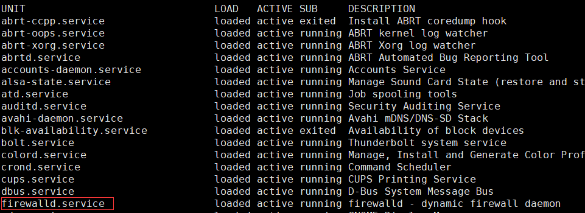

- 查看服务的运行状态：

```bash
systemctl status firewalld
```

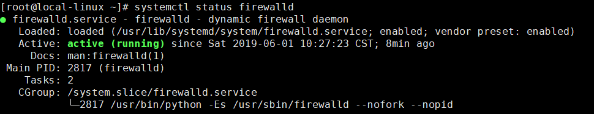

- 关闭服务：

```bash
systemctl stop firewalld
```

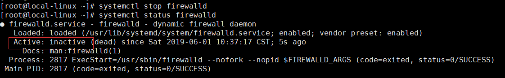

- 启动服务：

```bash
systemctl start firewalld
```
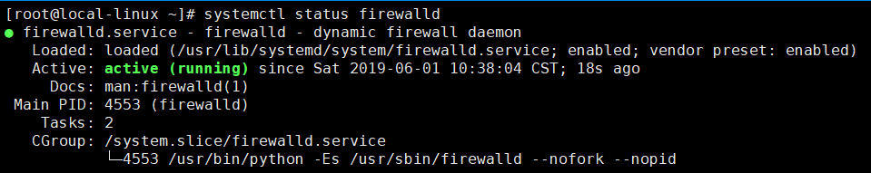

- 重新启动服务（不管当前服务是启动还是关闭）：

```bash
systemctl restart firewalld
```

- 重新载入配置信息而不中断服务：

```bash
systemctl reload firewalld
```

- 禁止服务开机自启动：

```bash
systemctl disable firewalld
```

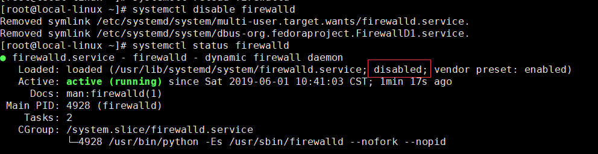

- 设置服务开机自启动：

```bash
systemctl enable firewalld
```

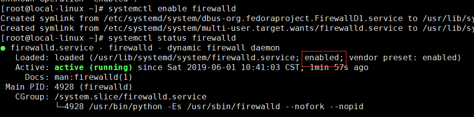

## 文件管理

### ls

列出指定目录下的所有文件，列出`/`目录下的文件：

```bash
ls -l /
```

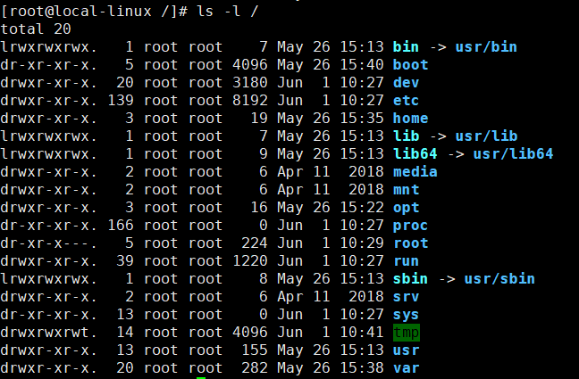

### pwd

获取目前所在工作目录的绝对路径：


### cd

改变当前工作目录：

```bash
cd /usr/local
```

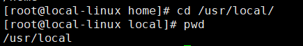

### date

显示或修改系统时间与日期；

```bash
date '+%Y-%m-%d %H:%M:%S'
```

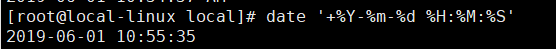

### passwd

用于设置用户密码：

```bash
passwd root
```


### su

改变用户身份（切换到超级用户）：

```bash
su -
```

### clear

用于清除屏幕信息

### man

显示指定命令的帮助信息：

```bash
man ls
```

### who

- 查询系统处于什么运行级别：

```bash
who -r
```


- 显示目前登录到系统的用户：
```bash
who -buT
```
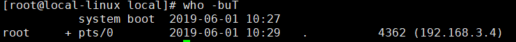

### free

显示系统内存状态（单位MB）：

```bash
free -m
```

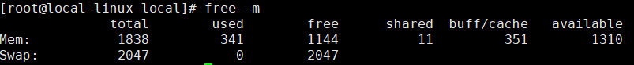

### ps

- 显示系统进程运行动态：

```bash
ps -ef
```

- 查看`sshd`进程的运行动态：

```bash
ps -ef | grep sshd
```

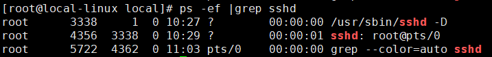

### top

查看即时活跃的进程，类似Windows的任务管理器。

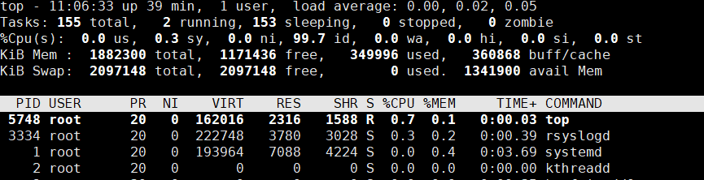

### mkdir

创建目录：

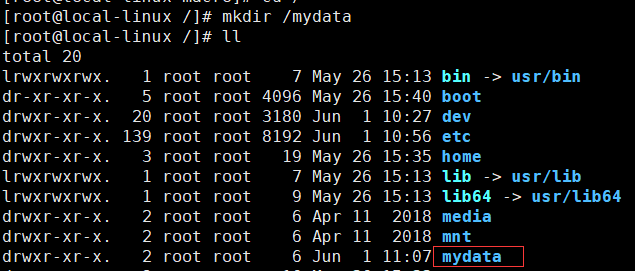

### more

用于分页查看文件，例如每页10行查看`boot.log`文件：

```bash
more -c -10 /var/log/boot.log
```

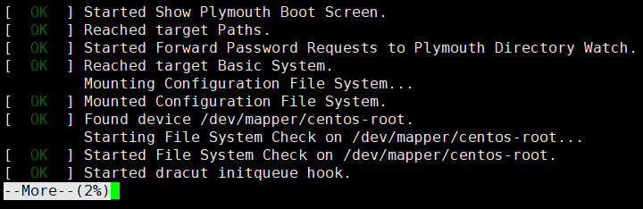

### cat

用于查看文件，例如查看Linux启动日志文件文件，并标明行号：

```bash
cat -Ab /var/log/boot.log
```


### touch

用于创建文件，例如创建`text.txt`文件：

```bash
touch text.txt
```

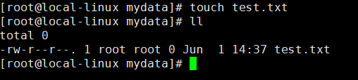

### rm

- 删除文件：

```bash
rm text.txt
```

- 强制删除某个目录及其子目录：

```bash
rm -rf testdir/
```

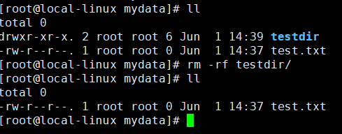

### cp

用于拷贝文件，例如将`test1`目录复制到`test2`目录

```bash
cp -r /mydata/tes1 /mydata/test2
```

### mv

用于移动或覆盖文件：

```bash
mv text.txt text2.txt
```

## 压缩与解压

### tar

- 将`/etc`文件夹中的文件归档到文件`etc.tar`（并不会进行压缩）：

```bash
tar -cvf /mydata/etc.tar /etc
```

- 用`gzip`压缩文件夹`/etc`中的文件到文件`etc.tar.gz`：

```bash
tar -zcvf /mydata/etc.tar.gz /etc
```

- 用`bzip2`压缩文件夹`/etc`到文件`/etc.tar.bz2`：

```bash
tar -jcvf /mydata/etc.tar.bz2 /etc
```

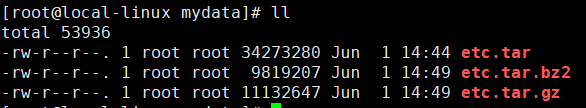

- 分页查看压缩包中内容（gzip）：

```bash
tar -ztvf /mydata/etc.tar.gz |more -c -10
```

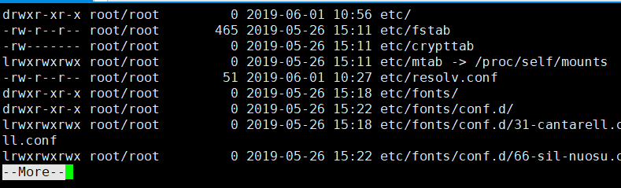

- 解压文件到当前目录（gzip）：

```bash
tar -zxvf /mydata/etc.tar.gz
```

- 解压文件到指定目录（gzip）：

```bash
tar -zxvf /mydata/etc.tar.gz -C /mydata/etc
```

## 磁盘和网络管理

### df

查看磁盘空间占用情况：

```bash
df -hT
```

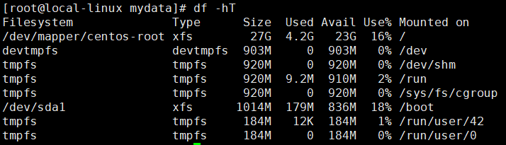

### dh

查看当前目录下的文件及文件夹所占大小：

```bash
du -h --max-depth=1 ./*
```


### ifconfig

显示当前网络接口状态：

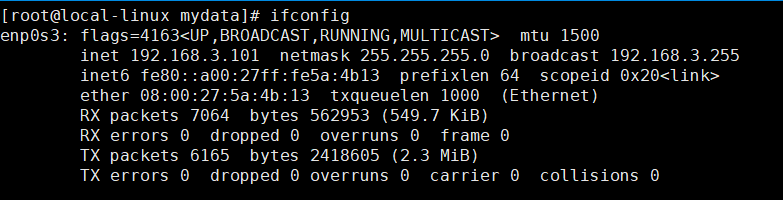

### netstat

- 查看当前路由信息：

```bash
netstat -rn
```

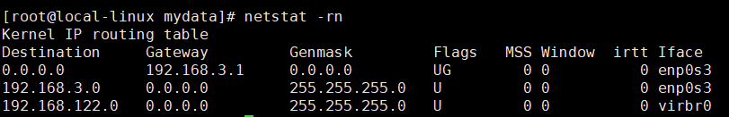

- 查看所有有效TCP连接：

```bash
netstat -an
```

- 查看系统中启动的监听服务：

```bash
netstat -tulnp
```

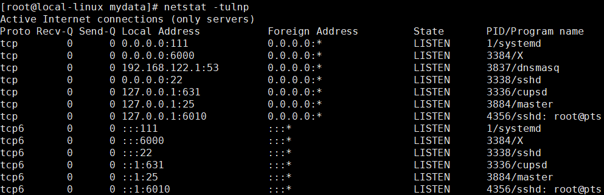

- 查看处于连接状态的系统资源信息：

```bash
netstat -atunp
```

### wget

从网络上下载文件

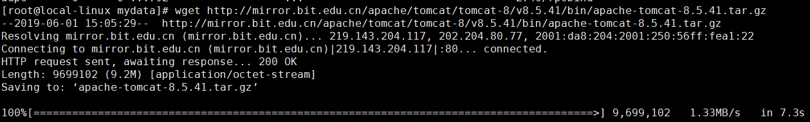

## 文件上传下载

- 安装上传下载工具`lrzsz`；

```bash
yum install -y lrzsz
```

- 上传文件，输入以下命令`XShell`会弹出文件上传框；

```bash
rz
```

- 下载文件，输入以下命令`XShell`会弹出文件保存框；

```bash
sz fileName
```

## 软件的安装与管理

### rpm

> RPM是`Red-Hat Package Manager`的缩写，一种Linux下通用的软件包管理方式，可用于安装和管理`.rpm`结尾的软件包。

- 安装软件包：

```bash
rpm -ivh nginx-1.12.2-2.el7.x86_64.rpm
```

- 模糊搜索软件包：

```bash
rpm -qa | grep nginx
```

- 精确查找软件包：

```bash
rpm -qa nginx
```

- 查询软件包的安装路径：

```bash
rpm -ql nginx-1.12.2-2.el7.x86_64
```

- 查看软件包的概要信息：

```bash
rpm -qi nginx-1.12.2-2.el7.x86_64
```
- 验证软件包内容和安装文件是否一致：

```bash
rpm -V nginx-1.12.2-2.el7.x86_64
```

- 更新软件包：

```bash
rpm -Uvh nginx-1.12.2-2.el7.x86_64
```

- 删除软件包：

```bash
rpm -e nginx-1.12.2-2.el7.x86_64
```

### yum

> Yum是`Yellow dog Updater, Modified`的缩写，能够在线自动下载RPM包并安装，可以自动处理依赖性关系，并且一次安装所有依赖的软件包，非常方便！

- 安装软件包： 

```bash
yum install nginx
```
- 检查可以更新的软件包：

```bash
yum check-update
```

- 更新指定的软件包：

```bash
yum update nginx
```

- 在资源库中查找软件包信息：

```bash
yum info nginx*
```

- 列出已经安装的所有软件包：

```bash
yum info installed
```
- 列出软件包名称：

```bash
yum list nginx*
```

- 模糊搜索软件包：

```bash
yum search nginx
```

## 用户管理

### 用户信息查看

- 查看用户信息：

```bash
cat /etc/passwd
```

- 用户信息格式如下（密码已过滤）：

```bash
# 用户名:密码:用户标识号:组标识号:组注释性描述:主目录:默认shell
root:x:0:0:root:/root:/bin/bash
macro:x:1000:982:macro:/home/macro:/bin/bash
```

- 查看用户组信息：

```bash
cat /etc/group
```

- 用户组信息格式如下：

```bash
# 组名:密码:组标识号:组内用户列表
root:x:0:
docker:x:982:macro,andy
```

### passwd

用于设置用户密码：

```bash
passwd root
```


### su

改变用户身份（切换到超级用户）：

```bash
# 切换到root用户
su -
# 切换到macro用户
su macro
```

### groupadd

添加用户组，使用`-g`可以设置用户组的标志号：

```bash
groupadd -g 1024 macrozheng
```

### groupdel

删除用户组：

```bash
groupdel macrozheng
```

### useradd

添加用户，`-u`设置标志号，`-g`设置主用户组：

```bash
useradd -u 1024 -g macrozheng macro
```

### usermod

修改用户所属用户组：

```bash
usermod -g docker macro
```

### userdel

删除用户，使用`-r`可以删除用户主目录：

```bash
userdel macro -r
```

## 公众号


