mall项目全套学习教程连载中，[关注公众号](#公众号)第一时间获取。

# 虚拟机安装及使用Linux，看这一篇就够了！

> 本文将从虚拟机安装、Linux系统安装、SSH客户端工具使用三方面来详细介绍Linux系统的安装及使用。

## 虚拟机安装

> VirtualBox 是一款开源虚拟机软件，由Sun公司出品，现在则由Oracle进行开发。VirtualBox号称是最强的免费虚拟机软件，它性能优异且简单易用。可虚拟的系统包括Windows、Linux、MacOS、Android等操作系统！本文将使用VirtualBox作为虚拟机来安装Linux系统。

### VirtualBox的安装

- 我们先下载VirtualBox安装包，下载地址：https://www.virtualbox.org/wiki/Downloads
- 下载完成后双击运行安装包一路点击下一步即可：

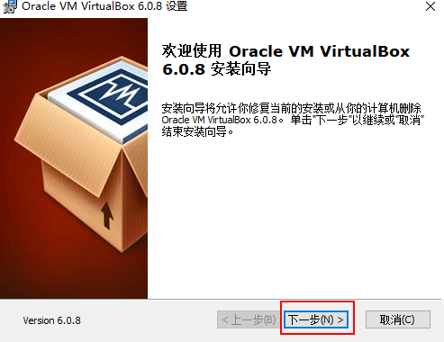

- 中途需要自定义一下安装路径：

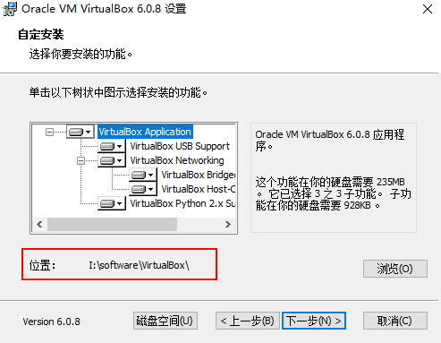

- 最后点击完成，完成安装。

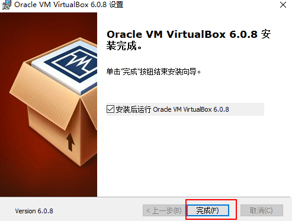

### 创建虚拟机

- 创建一个Linux虚拟机：

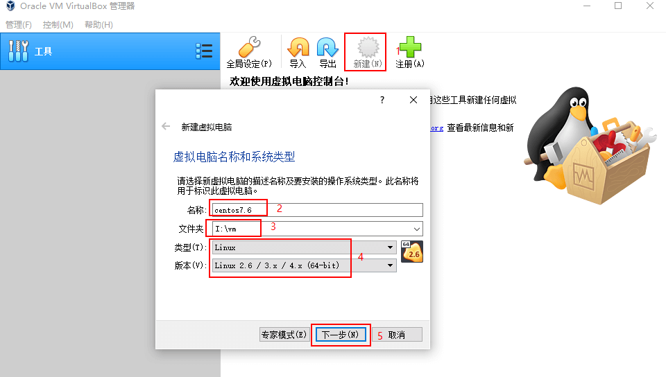

- 分配虚拟机内存大小，可以根据自己电脑配置来决定：

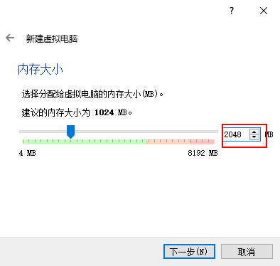

- 创建虚拟硬盘：

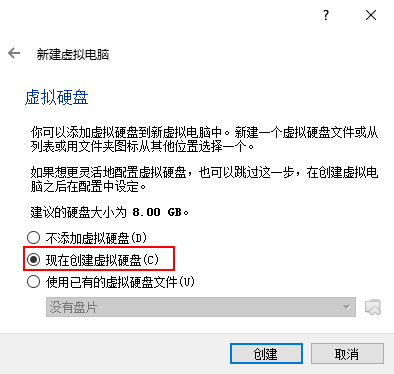

- 设置虚拟硬盘文件类型，这里选择DVI格式：

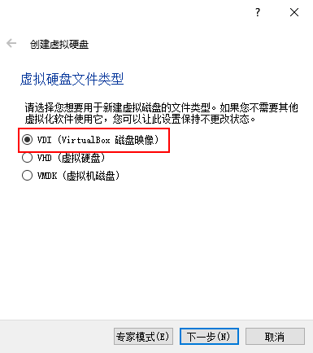

- 选择动态分配空间大小，如果你的硬盘空间比较大的话，可以选择固定大小：

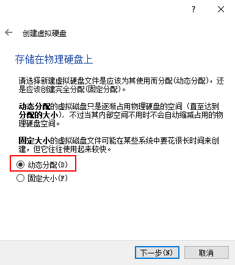

- 设置虚拟硬盘的位置和大小：

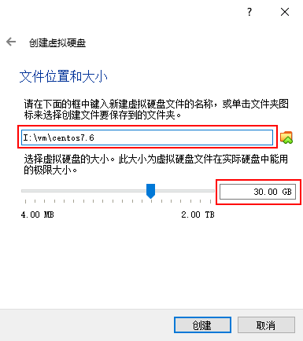

## Linux安装

> CentOS（Community Enterprise Operating System）是Linux发行版之一，中文意思为社区企业操作系统。它是来自于商业版 Red Hat Enterprise Linux依照开放源代码规定释出的源代码所编译而成，因此具有高度稳定性且完全开源。本文将以CentOS 7.6为例来介绍Linux系统的安装。

### 下载

- 下载地址：http://vault.centos.org/7.6.1810/isos/x86_64/
- 下载文件：CentOS-7-x86_64-DVD-1810.iso

### 安装

- 为虚拟机添加虚拟光盘，虚拟光盘指定为我们下载的ISO镜像文件：

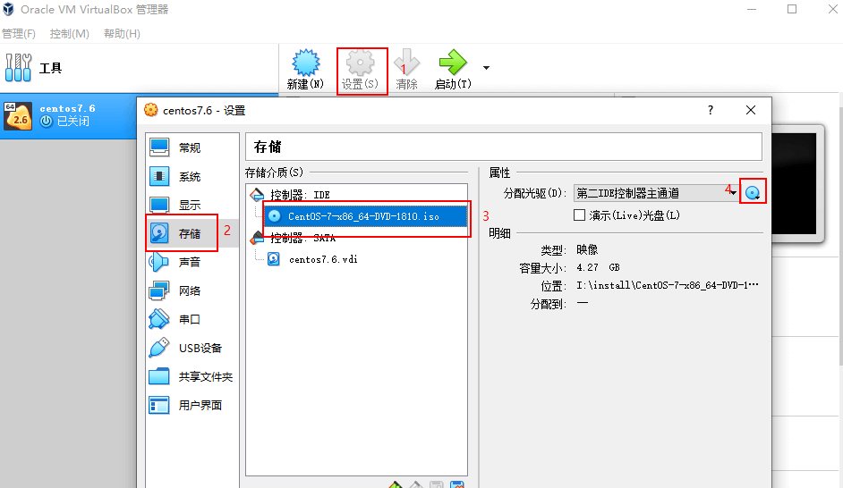

- 点击启动运行虚拟机：


- 运行成功后，选择`Install CentOS 7`进行安装：

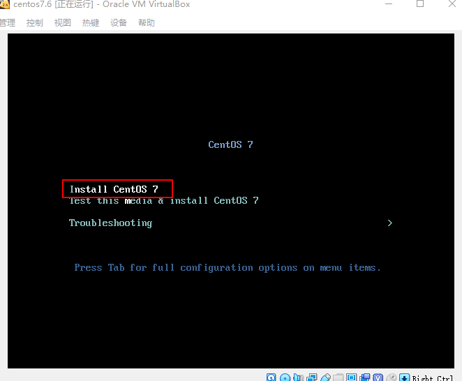

- 选择系统安装过程中的语言，建议选择`English`选项：

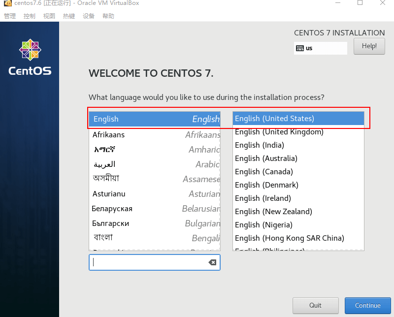

- 需要进行设置的部分示意图：

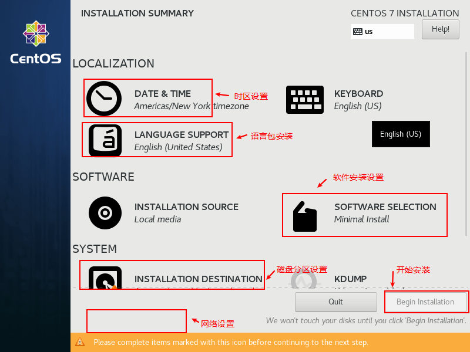

- 时区设置，地区选择`Asia`，城市选择`Shanghai`：

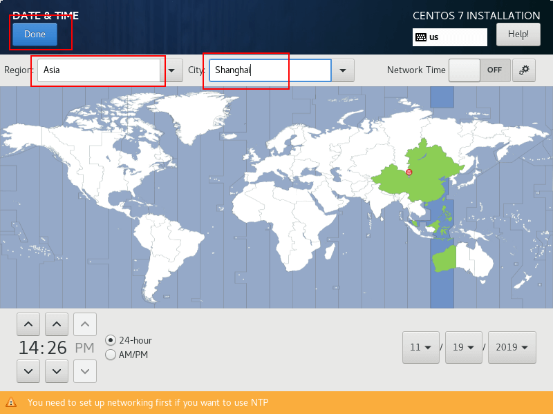

- 语言支持选择安装英文、简体中文两种语言安装包：

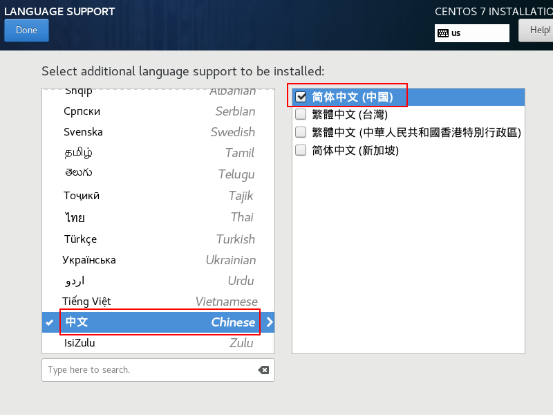

- 软件安装设置选择`Server with GUI`，同时选择如图三种附加环境：

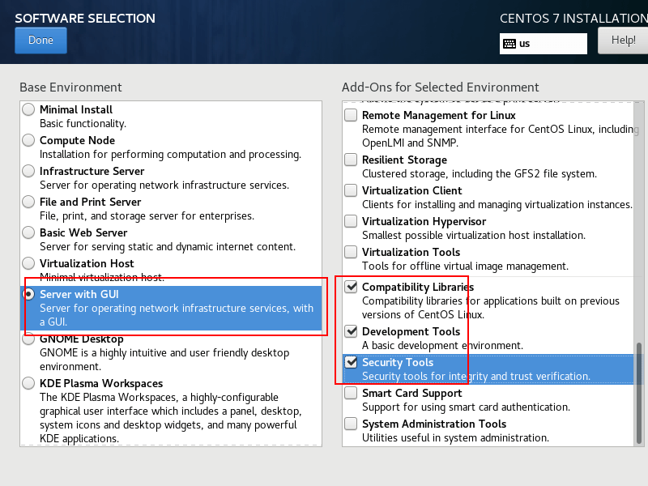

- 磁盘分区设置，由于我的虚拟机设置的内存较小，需要创建一个较大的`swap`分区，内存设置较大的直接选择自动分区即可，这里我们使用手动分区：

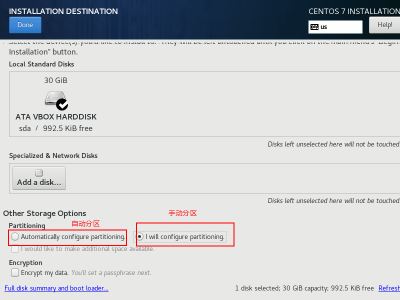

- 按如图所示进行手动分区操作；


- 关于分区的几个目录的说明：
    - /：根分区；
    - swap：交换分区，可以当虚拟内存使用；
    - /boot：存储系统的引导信息和内核信息；
    - /usr：存储系统应用软件安装信息；
    - /var：存储系统日志信息。

- 网络设置，设置主机名称和进行网络激活操作：

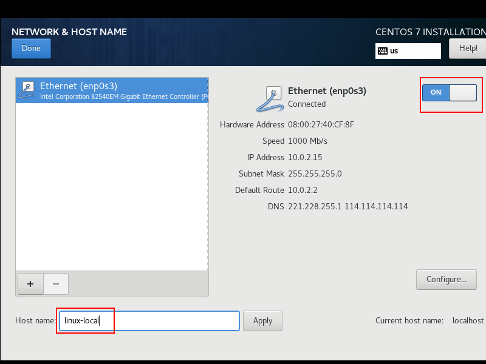

- 单击`Begin Installation`进行安装：

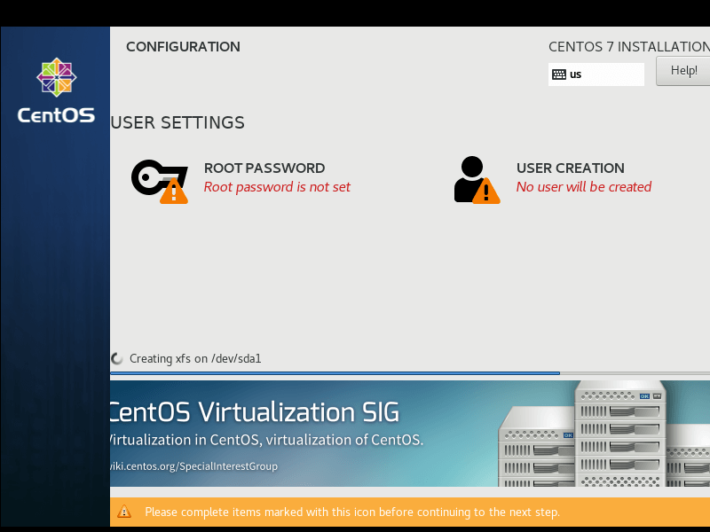

- 安装过程中可以设置`root`用户的密码；

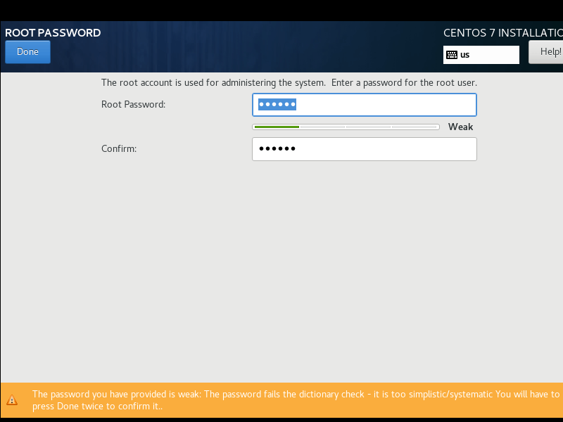

- 完成安装后重新启动即可进入系统，第一次启动需要同意协议并完成配置：

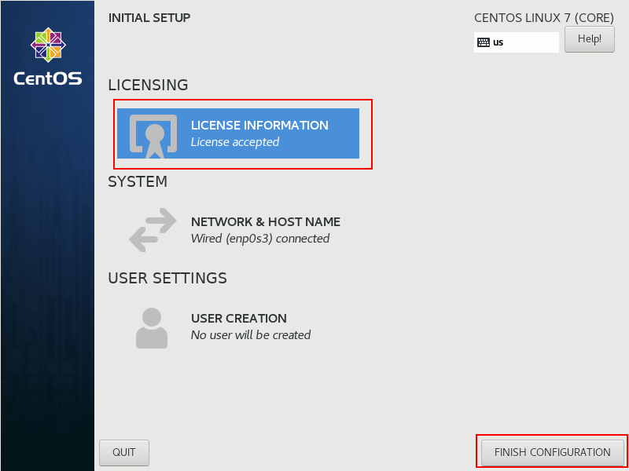

- 此时宿主机还无法直接访问虚拟机，需要将虚拟机的网络模式改为桥接模式才可以。

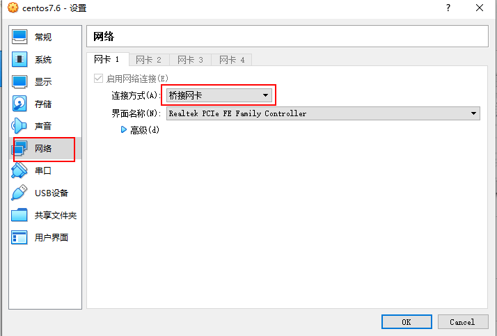


## Xshell使用

> Xshell是一款SSH连接客户端工具，可以用于远程操作Linux系统。Xshell对于家庭和学校可以免费使用，提供一个有效邮箱，下载链接就会发送到你的的邮箱。

- 免费版本申请地址：https://www.netsarang.com/zh/free-for-home-school/

- 下载并安装完成Xshell以后，在Linux系统中打开命令行：

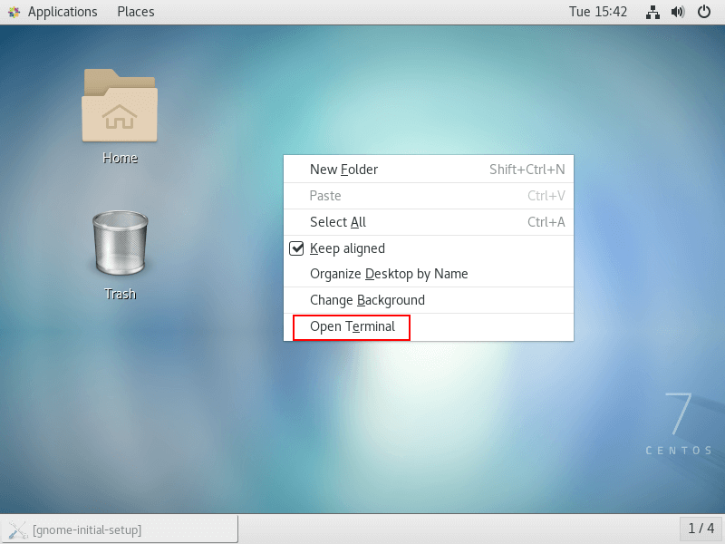

- 输入`ifconfig`命令获取IP地址；

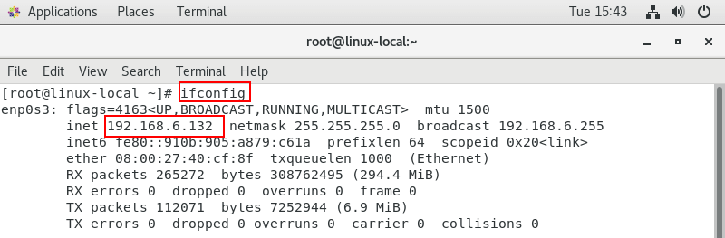

- 获取完成后通过Xshell进行连接，并输入账号和密码：

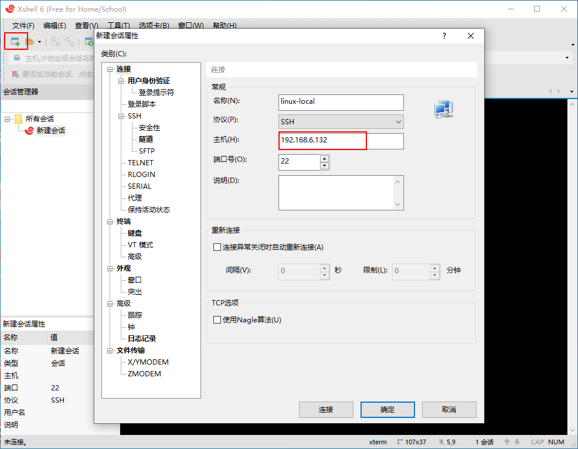

- 连接完成后即可远程使用Linux系统了。

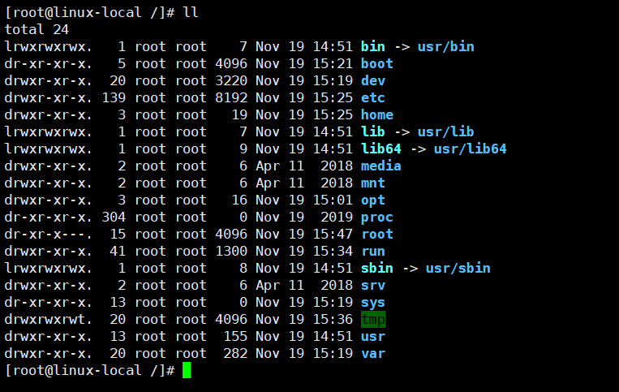

## 其他相关

### 修改默认启动模式

如果不想默认启动图形化界面的话，可以修改默认的启动模式，因为图形化界面还是比较占用内存的，使用命令如下。

```bash
# 将默认级别修改为多用户文本模式
systemctl set-default multi-user.target
# 将默认级别修改为图形用户界面模式
systemctl set-default graphical.target
# 重启
reboot
```

### Linux常用命令

可以参考下这个：[开发者必备Linux命令](/reference/linux)

## 公众号

