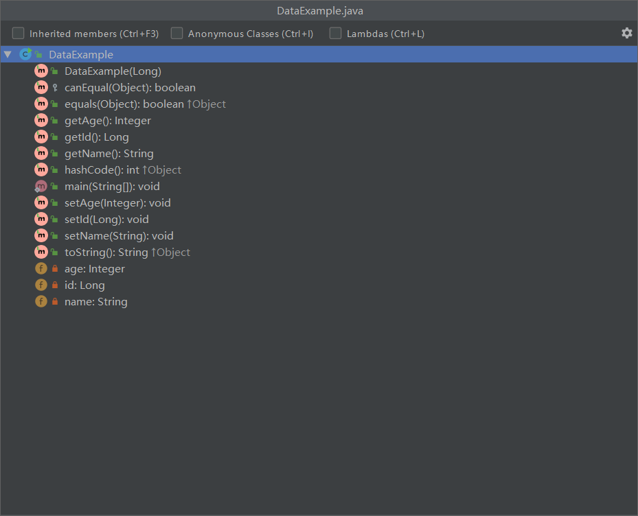

学习不走弯路，[关注公众号](#公众号) 回复「学习路线」，获取mall项目专属学习路线！

# Lombok有啥牛皮的？SpringBoot和IDEA官方都要支持它！

> 最近[IDEA 2020最后一个版本发布了](https://mp.weixin.qq.com/s/4eo3hRwItD5ZoFxQKTBpCQ)，已经内置了Lombok插件，SpringBoot 2.1.x之后的版本也在Starter中内置了Lombok依赖。为什么他们都要支持Lombok呢？今天我来讲讲Lombok的使用，看看它有何神奇之处！

## Lombok简介

Lombok是一款Java代码功能增强库，在Github上已有9.8k+Star。它会自动集成到你的编辑器和构建工具中，从而使你的Java代码更加生动有趣。通过Lombok的注解，你可以不用再写getter、setter、equals等方法，Lombok将在编译时为你自动生成。

## Lombok集成

首先我们需要在IDEA中安装好Lombok插件，如果你使用的是最新版IDEA 2020.3，则Lombok插件已经内置，无需安装。


之后在项目的pom.xml文件中添加Lombok依赖，SpringBoot 2.1.x版本后无需指定Lombok版本，SpringBoot在`spring-boot-dependencies`中已经内置。

```xml
<!--lombok依赖-->
<dependency>
    <groupId>org.projectlombok</groupId>
    <artifactId>lombok</artifactId>
    <optional>true</optional>
</dependency>
```

## Lombok使用

> Lombok中有很多注解，这些注解使得我们可以更加方便的编写Java代码，下面介绍下这些注解的使用。

### val

使用val注解可以取代任意类型作为局部变量，这样我们就不用写复杂的ArrayList和Map.Entry类型了，具体例子如下。

```java
/**
 * Created by macro on 2020/12/16.
 */
public class ValExample {

    public static void example() {
        //val代替ArrayList<String>和String类型
        val example = new ArrayList<String>();
        example.add("Hello World!");
        val foo = example.get(0);
        System.out.println(foo.toLowerCase());
    }

    public static void example2() {
        //val代替Map.Entry<Integer,String>类型
        val map = new HashMap<Integer, String>();
        map.put(0, "zero");
        map.put(5, "five");
        for (val entry : map.entrySet()) {
            System.out.printf("%d: %s\n", entry.getKey(), entry.getValue());
        }
    }

    public static void main(String[] args) {
        example();
        example2();
    }
}
```

当我们使用了val注解后，Lombok会从局部变量的初始化表达式推断出具体类型，编译后会生成如下代码。

```java
public class ValExample {
    public ValExample() {
    }

    public static void example() {
        ArrayList<String> example = new ArrayList();
        example.add("Hello World!");
        String foo = (String)example.get(0);
        System.out.println(foo.toLowerCase());
    }

    public static void example2() {
        HashMap<Integer, String> map = new HashMap();
        map.put(0, "zero");
        map.put(5, "five");
        Iterator var1 = map.entrySet().iterator();

        while(var1.hasNext()) {
            Entry<Integer, String> entry = (Entry)var1.next();
            System.out.printf("%d: %s\n", entry.getKey(), entry.getValue());
        }

    }
}
```

### @NonNull

在方法上使用@NonNull注解可以做非空判断，如果传入空值的话会直接抛出NullPointerException。

```java
/**
 * Created by macro on 2020/12/16.
 */
public class NonNullExample {
    private String name;
    public NonNullExample(@NonNull String name){
        this.name = name;
    }

    public static void main(String[] args) {
        new NonNullExample("test");
        //会抛出NullPointerException
        new NonNullExample(null);
    }
}
```

编译后会在构造器中添加非空判断，具体代码如下。

```java
public class NonNullExample {
    private String name;

    public NonNullExample(@NonNull String name) {
        if (name == null) {
            throw new NullPointerException("name is marked non-null but is null");
        } else {
            this.name = name;
        }
    }

    public static void main(String[] args) {
        new NonNullExample("test");
        new NonNullExample((String)null);
    }
}
```

### @Cleanup

当我们在Java中使用资源时，不可避免地需要在使用后关闭资源。使用@Cleanup注解可以自动关闭资源。

```java
/**
 * Created by macro on 2020/12/16.
 */
public class CleanupExample {
    public static void main(String[] args) throws IOException {
        String inStr = "Hello World!";
        //使用输入输出流自动关闭，无需编写try catch和调用close()方法
        @Cleanup ByteArrayInputStream in = new ByteArrayInputStream(inStr.getBytes("UTF-8"));
        @Cleanup ByteArrayOutputStream out = new ByteArrayOutputStream();
        byte[] b = new byte[1024];
        while (true) {
            int r = in.read(b);
            if (r == -1) break;
            out.write(b, 0, r);
        }
        String outStr = out.toString("UTF-8");
        System.out.println(outStr);
    }
}
```

编译后Lombok会生成如下代码。

```java
public class CleanupExample {
    public CleanupExample() {
    }

    public static void main(String[] args) throws IOException {
        String inStr = "Hello World!";
        ByteArrayInputStream in = new ByteArrayInputStream(inStr.getBytes("UTF-8"));

        try {
            ByteArrayOutputStream out = new ByteArrayOutputStream();

            try {
                byte[] b = new byte[1024];

                while(true) {
                    int r = in.read(b);
                    if (r == -1) {
                        String outStr = out.toString("UTF-8");
                        System.out.println(outStr);
                        return;
                    }

                    out.write(b, 0, r);
                }
            } finally {
                if (Collections.singletonList(out).get(0) != null) {
                    out.close();
                }

            }
        } finally {
            if (Collections.singletonList(in).get(0) != null) {
                in.close();
            }

        }
    }
}
```

### @Getter/@Setter

有了@Getter/@Setter注解，我们再也不用编写getter/setter方法了。试想下之前即使我们使用IDEA自动生成getter/setter方法，如果类属性的类型和名称改了，又要重新生成getter/setter方法也是一件很麻烦的事情。

```java
/**
 * Created by macro on 2020/12/17.
 */
public class GetterSetterExample {
    @Getter
    @Setter
    private String name;
    @Getter
    @Setter(AccessLevel.PROTECTED)
    private Integer age;

    public static void main(String[] args) {
        GetterSetterExample example = new GetterSetterExample();
        example.setName("test");
        example.setAge(20);
        System.out.printf("name:%s age:%d",example.getName(),example.getAge());
    }
}
```

编译后Lombok会生成如下代码。

```java
public class GetterSetterExample {
    private String name;
    private Integer age;

    public GetterSetterExample() {
    }

    public String getName() {
        return this.name;
    }

    public void setName(final String name) {
        this.name = name;
    }

    public Integer getAge() {
        return this.age;
    }

    protected void setAge(final Integer age) {
        this.age = age;
    }
}
```

### @ToString

把所有类属性都编写到toString方法中方便打印日志，是一件多么枯燥无味的事情。使用@ToString注解可以自动生成toString方法，默认会包含所有类属性，使用@ToString.Exclude注解可以排除属性的生成。

```java
/**
 * Created by macro on 2020/12/17.
 */
@ToString
public class ToStringExample {
    @ToString.Exclude
    private Long id;
    private String name;
    private Integer age;
    public ToStringExample(Long id,String name,Integer age){
        this.id =id;
        this.name = name;
        this.age = age;
    }

    public static void main(String[] args) {
        ToStringExample example = new ToStringExample(1L,"test",20);
        //自动实现toString方法，输出ToStringExample(name=test, age=20)
        System.out.println(example);
    }
}
```

编译后Lombok会生成如下代码。

```java
public class ToStringExample {
    private Long id;
    private String name;
    private Integer age;

    public ToStringExample(Long id, String name, Integer age) {
        this.id = id;
        this.name = name;
        this.age = age;
    }

    public String toString() {
        return "ToStringExample(name=" + this.name + ", age=" + this.age + ")";
    }
}
```

### @EqualsAndHashCode

使用@EqualsAndHashCode注解可以自动生成hashCode和equals方法，默认包含所有类属性，使用@EqualsAndHashCode.Exclude可以排除属性的生成。

```java
/**
 * Created by macro on 2020/12/17.
 */
@Getter
@Setter
@EqualsAndHashCode
public class EqualsAndHashCodeExample {
    private Long id;
    @EqualsAndHashCode.Exclude
    private String name;
    @EqualsAndHashCode.Exclude
    private Integer age;

    public static void main(String[] args) {
        EqualsAndHashCodeExample example1 = new EqualsAndHashCodeExample();
        example1.setId(1L);
        example1.setName("test");
        example1.setAge(20);
        EqualsAndHashCodeExample example2 = new EqualsAndHashCodeExample();
        example2.setId(1L);
        //equals方法只对比id，返回true
        System.out.println(example1.equals(example2));
    }
}
```

编译后Lombok会生成如下代码。

```java
public class EqualsAndHashCodeExample {
    private Long id;
    private String name;
    private Integer age;

    public EqualsAndHashCodeExample() {
    }

    public boolean equals(final Object o) {
        if (o == this) {
            return true;
        } else if (!(o instanceof EqualsAndHashCodeExample)) {
            return false;
        } else {
            EqualsAndHashCodeExample other = (EqualsAndHashCodeExample)o;
            if (!other.canEqual(this)) {
                return false;
            } else {
                Object this$id = this.getId();
                Object other$id = other.getId();
                if (this$id == null) {
                    if (other$id != null) {
                        return false;
                    }
                } else if (!this$id.equals(other$id)) {
                    return false;
                }

                return true;
            }
        }
    }

    protected boolean canEqual(final Object other) {
        return other instanceof EqualsAndHashCodeExample;
    }

    public int hashCode() {
        int PRIME = true;
        int result = 1;
        Object $id = this.getId();
        int result = result * 59 + ($id == null ? 43 : $id.hashCode());
        return result;
    }
}
```

### @XxConstructor

使用@XxConstructor注解可以自动生成构造方法，有@NoArgsConstructor、@RequiredArgsConstructor和@AllArgsConstructor三个注解可以使用。

- @NoArgsConstructor：生成无参构造函数。
- @RequiredArgsConstructor：生成包含必须参数的构造函数，使用@NonNull注解的类属性为必须参数。
- @AllArgsConstructor：生成包含所有参数的构造函数。

```java
/**
 * Created by macro on 2020/12/17.
 */
@NoArgsConstructor
@RequiredArgsConstructor(staticName = "of")
@AllArgsConstructor
public class ConstructorExample {
    @NonNull
    private Long id;
    private String name;
    private Integer age;

    public static void main(String[] args) {
        //无参构造器
        ConstructorExample example1 = new ConstructorExample();
        //全部参数构造器
        ConstructorExample example2 = new ConstructorExample(1L,"test",20);
        //@NonNull注解的必须参数构造器
        ConstructorExample example3 = ConstructorExample.of(1L);
    }
}
```

编译后Lombok会生成如下代码。

```java
public class ConstructorExample {
    @NonNull
    private Long id;
    private String name;
    private Integer age;

    public ConstructorExample() {
    }

    private ConstructorExample(@NonNull final Long id) {
        if (id == null) {
            throw new NullPointerException("id is marked non-null but is null");
        } else {
            this.id = id;
        }
    }

    public static ConstructorExample of(@NonNull final Long id) {
        return new ConstructorExample(id);
    }

    public ConstructorExample(@NonNull final Long id, final String name, final Integer age) {
        if (id == null) {
            throw new NullPointerException("id is marked non-null but is null");
        } else {
            this.id = id;
            this.name = name;
            this.age = age;
        }
    }
}
```

### @Data

@Data是一个方便使用的组合注解，是@ToString、@EqualsAndHashCode、@Getter、@Setter和@RequiredArgsConstructor的组合体。

```java
/**
 * Created by macro on 2020/12/17.
 */
@Data
public class DataExample {
    @NonNull
    private Long id;
    @EqualsAndHashCode.Exclude
    private String name;
    @EqualsAndHashCode.Exclude
    private Integer age;

    public static void main(String[] args) {
        //@RequiredArgsConstructor已生效
        DataExample example1 = new DataExample(1L);
        //@Getter @Setter已生效
        example1.setName("test");
        example1.setAge(20);
        //@ToString已生效
        System.out.println(example1);
        DataExample example2 = new DataExample(1L);
        //@EqualsAndHashCode已生效
        System.out.println(example1.equals(example2));
    }
}
```

编译后Lombok会生成如下代码。

```java
public class DataExample {
    @NonNull
    private Long id;
    private String name;
    private Integer age;

    public DataExample(@NonNull final Long id) {
        if (id == null) {
            throw new NullPointerException("id is marked non-null but is null");
        } else {
            this.id = id;
        }
    }

    @NonNull
    public Long getId() {
        return this.id;
    }

    public String getName() {
        return this.name;
    }

    public Integer getAge() {
        return this.age;
    }

    public void setId(@NonNull final Long id) {
        if (id == null) {
            throw new NullPointerException("id is marked non-null but is null");
        } else {
            this.id = id;
        }
    }

    public void setName(final String name) {
        this.name = name;
    }

    public void setAge(final Integer age) {
        this.age = age;
    }

    public boolean equals(final Object o) {
        if (o == this) {
            return true;
        } else if (!(o instanceof DataExample)) {
            return false;
        } else {
            DataExample other = (DataExample)o;
            if (!other.canEqual(this)) {
                return false;
            } else {
                Object this$id = this.getId();
                Object other$id = other.getId();
                if (this$id == null) {
                    if (other$id != null) {
                        return false;
                    }
                } else if (!this$id.equals(other$id)) {
                    return false;
                }

                return true;
            }
        }
    }

    protected boolean canEqual(final Object other) {
        return other instanceof DataExample;
    }

    public int hashCode() {
        int PRIME = true;
        int result = 1;
        Object $id = this.getId();
        int result = result * 59 + ($id == null ? 43 : $id.hashCode());
        return result;
    }

    public String toString() {
        return "DataExample(id=" + this.getId() + ", name=" + this.getName() + ", age=" + this.getAge() + ")";
    }
}
```

### @Value

使用@Value注解可以把类声明为不可变的，声明后此类相当于final类，无法被继承，其属性也会变成final属性。

```java
/**
 * Created by macro on 2020/12/17.
 */
@Value
public class ValueExample {
    private Long id;
    private String name;
    private Integer age;

    public static void main(String[] args) {
        //只能使用全参构造器
        ValueExample example = new ValueExample(1L,"test",20);
        // example.setName("andy") //没有生成setter方法，会报错
        // example.name="andy" //字段被设置为final类型，会报错
    }
}
```

编译后Lombok会生成如下代码。

```java
public final class ValueExample {
    private final Long id;
    private final String name;
    private final Integer age;

    public static void main(String[] args) {
        new ValueExample(1L, "test", 20);
    }

    public ValueExample(final Long id, final String name, final Integer age) {
        this.id = id;
        this.name = name;
        this.age = age;
    }

    public Long getId() {
        return this.id;
    }

    public String getName() {
        return this.name;
    }

    public Integer getAge() {
        return this.age;
    }
}
```

### @Builder

使用@Builder注解可以通过建造者模式来创建对象，建造者模式加链式调用，创建对象太方便了！

```java
/**
 * Created by macro on 2020/12/17.
 */
@Builder
@ToString
public class BuilderExample {
    private Long id;
    private String name;
    private Integer age;

    public static void main(String[] args) {
        BuilderExample example = BuilderExample.builder()
                .id(1L)
                .name("test")
                .age(20)
                .build();
        System.out.println(example);
    }
}
```

编译后Lombok会生成如下代码。

```java
public class BuilderExample {
    private Long id;
    private String name;
    private Integer age;

    BuilderExample(final Long id, final String name, final Integer age) {
        this.id = id;
        this.name = name;
        this.age = age;
    }

    public static BuilderExample.BuilderExampleBuilder builder() {
        return new BuilderExample.BuilderExampleBuilder();
    }

    public String toString() {
        return "BuilderExample(id=" + this.id + ", name=" + this.name + ", age=" + this.age + ")";
    }

    public static class BuilderExampleBuilder {
        private Long id;
        private String name;
        private Integer age;

        BuilderExampleBuilder() {
        }

        public BuilderExample.BuilderExampleBuilder id(final Long id) {
            this.id = id;
            return this;
        }

        public BuilderExample.BuilderExampleBuilder name(final String name) {
            this.name = name;
            return this;
        }

        public BuilderExample.BuilderExampleBuilder age(final Integer age) {
            this.age = age;
            return this;
        }

        public BuilderExample build() {
            return new BuilderExample(this.id, this.name, this.age);
        }

        public String toString() {
            return "BuilderExample.BuilderExampleBuilder(id=" + this.id + ", name=" + this.name + ", age=" + this.age + ")";
        }
    }
}
```

### @SneakyThrows

还在手动捕获并抛出异常？使用@SneakyThrows注解自动实现试试！

```java
/**
 * Created by macro on 2020/12/17.
 */
public class SneakyThrowsExample {

    //自动抛出异常，无需处理
    @SneakyThrows(UnsupportedEncodingException.class)
    public static byte[] str2byte(String str){
        return str.getBytes("UTF-8");
    }

    public static void main(String[] args) {
        String str = "Hello World!";
        System.out.println(str2byte(str).length);
    }
}
```

编译后Lombok会生成如下代码。

```java
public class SneakyThrowsExample {
    public SneakyThrowsExample() {
    }

    public static byte[] str2byte(String str) {
        try {
            return str.getBytes("UTF-8");
        } catch (UnsupportedEncodingException var2) {
            throw var2;
        }
    }
}
```

### @Synchronized

当我们在多个线程中访问同一资源时，往往会出现线程安全问题，以前我们往往使用synchronized关键字修饰方法来实现同步访问。使用@Synchronized注解同样可以实现同步访问。

```java
package com.macro.mall.tiny.example;

import lombok.*;

/**
 * Created by macro on 2020/12/17.
 */
@Data
public class SynchronizedExample {
    @NonNull
    private Integer count;

    @Synchronized
    @SneakyThrows
    public void reduceCount(Integer id) {
        if (count > 0) {
            Thread.sleep(500);
            count--;
            System.out.println(String.format("thread-%d count:%d", id, count));
        }
    }

    public static void main(String[] args) {
        //添加@Synchronized三个线程可以同步调用reduceCount方法
        SynchronizedExample example = new SynchronizedExample(20);
        new ReduceThread(1, example).start();
        new ReduceThread(2, example).start();
        new ReduceThread(3, example).start();
    }


    @RequiredArgsConstructor
    static class ReduceThread extends Thread {
        @NonNull
        private Integer id;
        @NonNull
        private SynchronizedExample example;

        @Override
        public void run() {
            while (example.getCount() > 0) {
                example.reduceCount(id);
            }
        }
    }
}
```

编译后Lombok会生成如下代码。

```java
public class SynchronizedExample {
    private final Object $lock = new Object[0];
    @NonNull
    private Integer count;

    public void reduceCount(Integer id) {
        try {
            synchronized(this.$lock) {
                if (this.count > 0) {
                    Thread.sleep(500L);
                    Integer var3 = this.count;
                    Integer var4 = this.count = this.count - 1;
                    System.out.println(String.format("thread-%d count:%d", id, this.count));
                }

            }
        } catch (Throwable var7) {
            throw var7;
        }
    }
}
```

### @With

使用@With注解可以实现对原对象进行克隆，并改变其一个属性，使用时需要指定全参构造方法。

```java
@With
@AllArgsConstructor
public class WithExample {
    private Long id;
    private String name;
    private Integer age;

    public static void main(String[] args) {
        WithExample example1 = new WithExample(1L, "test", 20);
        WithExample example2 = example1.withAge(22);
        //将原对象进行clone并设置age，返回false
        System.out.println(example1.equals(example2));
    }
}
```

编译后Lombok会生成如下代码。

```java
public class WithExample {
    private Long id;
    private String name;
    private Integer age;

    public WithExample withId(final Long id) {
        return this.id == id ? this : new WithExample(id, this.name, this.age);
    }

    public WithExample withName(final String name) {
        return this.name == name ? this : new WithExample(this.id, name, this.age);
    }

    public WithExample withAge(final Integer age) {
        return this.age == age ? this : new WithExample(this.id, this.name, age);
    }

    public WithExample(final Long id, final String name, final Integer age) {
        this.id = id;
        this.name = name;
        this.age = age;
    }
}
```

### @Getter(lazy=true)

当我们获取某一个属性比较消耗资源时，可以给@Getter添加`lazy=true`属性实现懒加载，会生成Double Check Lock 样板代码对属性进行懒加载。

```java
/**
 * Created by macro on 2020/12/17.
 */
public class GetterLazyExample {
    @Getter(lazy = true)
    private final double[] cached = expensive();

    private double[] expensive() {
        double[] result = new double[1000000];
        for (int i = 0; i < result.length; i++) {
            result[i] = Math.asin(i);
        }
        return result;
    }

    public static void main(String[] args) {
        //使用Double Check Lock 样板代码对属性进行懒加载
        GetterLazyExample example = new GetterLazyExample();
        System.out.println(example.getCached().length);
    }
}
```

编译后Lombok会生成如下代码。

```java
public class GetterLazyExample {
    private final AtomicReference<Object> cached = new AtomicReference();

    public GetterLazyExample() {
    }

    private double[] expensive() {
        double[] result = new double[1000000];

        for(int i = 0; i < result.length; ++i) {
            result[i] = Math.asin((double)i);
        }

        return result;
    }

    public double[] getCached() {
        Object value = this.cached.get();
        if (value == null) {
            synchronized(this.cached) {
                value = this.cached.get();
                if (value == null) {
                    double[] actualValue = this.expensive();
                    value = actualValue == null ? this.cached : actualValue;
                    this.cached.set(value);
                }
            }
        }

        return (double[])((double[])(value == this.cached ? null : value));
    }
}
```

### @Log

使用@Log注解，可以直接生成日志对象log，通过log对象可以直接打印日志。

```java
/**
 * Created by macro on 2020/12/17.
 */
@Log
public class LogExample {
    public static void main(String[] args) {
        log.info("level info");
        log.warning("level warning");
        log.severe("level severe");
    }
}
```

编译后Lombok会生成如下代码。

```java
public class LogExample {
    private static final Logger log = Logger.getLogger(LogExample.class.getName());

    public LogExample() {
    }

    public static void main(String[] args) {
        log.info("level info");
        log.warning("level warning");
        log.severe("level severe");
    }
}
```

### @Slf4j

使用Lombok生成日志对象时，根据使用日志实现的不同，有多种注解可以使用。比如@Log、@Log4j、@Log4j2、@Slf4j等。

```java
/**
 * Created by macro on 2020/12/17.
 */
@Slf4j
public class LogSlf4jExample {
    public static void main(String[] args) {
        log.info("level:{}","info");
        log.warn("level:{}","warn");
        log.error("level:{}", "error");
    }
}
```

编译后Lombok会生成如下代码。

```java
public class LogSlf4jExample {
    private static final Logger log = LoggerFactory.getLogger(LogSlf4jExample.class);

    public LogSlf4jExample() {
    }

    public static void main(String[] args) {
        log.info("level:{}", "info");
        log.warn("level:{}", "warn");
        log.error("level:{}", "error");
    }
}
```

## Lombok原理

如果IDEA不安装Lombok插件的话，我们打开使用Lombok的项目是无法通过编译的。装了以后IDEA才会提示我们Lombok为我们生成的方法和属性。

使用了@Data注解以后，查看类结构可以发现getter、setter、toString等方法。



打开target目录下的`.class`文件，我们可以看到Lombok为我们生成的代码，可见Lombok是通过解析注解，然后在编译时生成代码来实现Java代码的功能增强的。


## 参考资料

官方文档：https://projectlombok.org/features/all

## 项目源码地址

https://github.com/macrozheng/mall-learning/tree/master/mall-tiny-lombok

## 公众号


