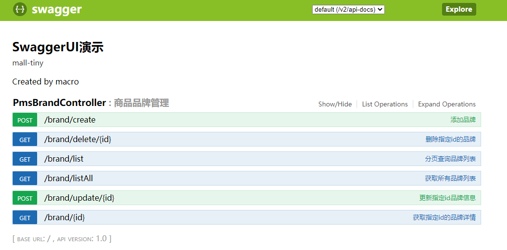
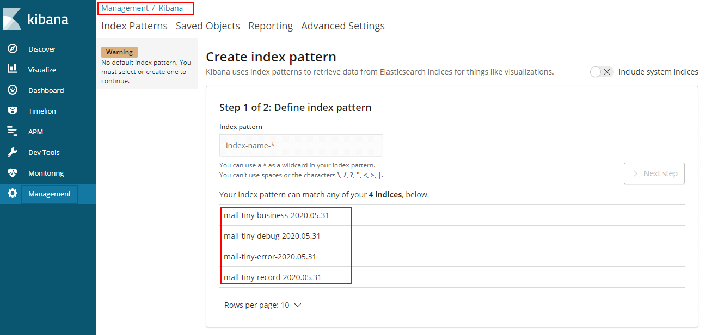
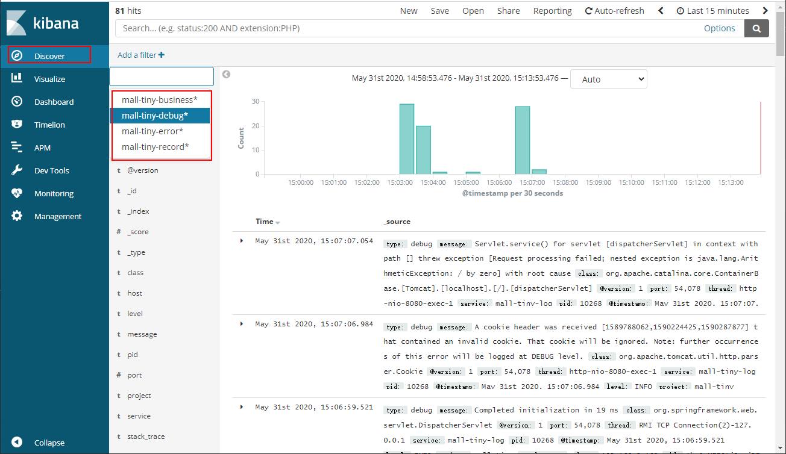
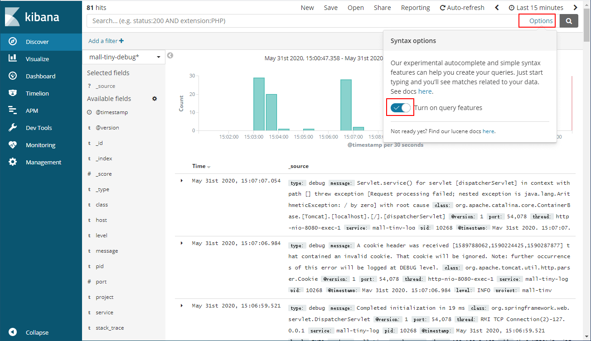
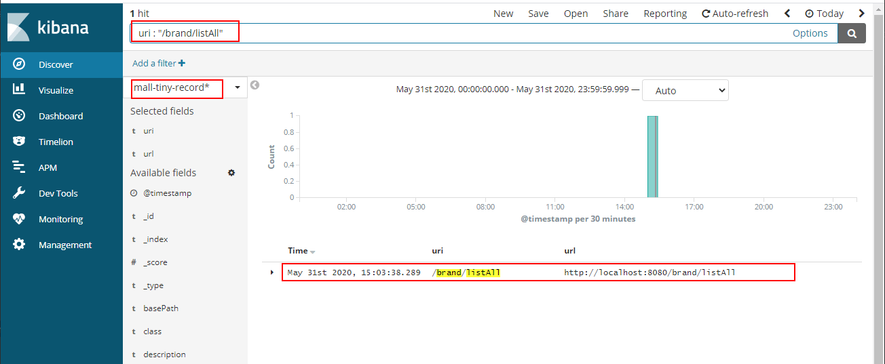
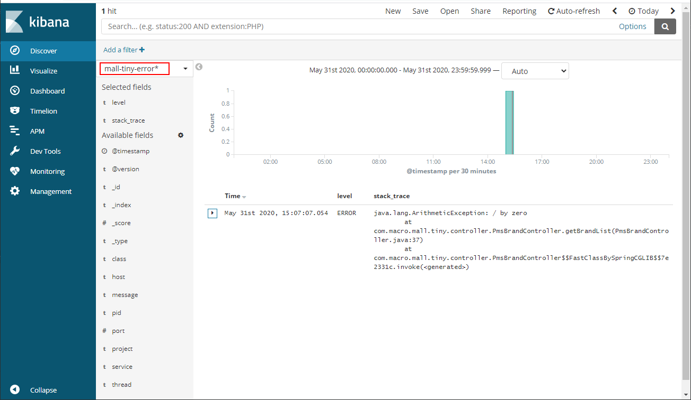
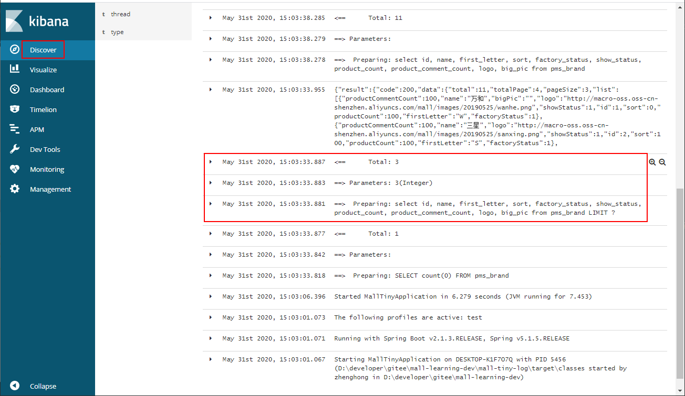
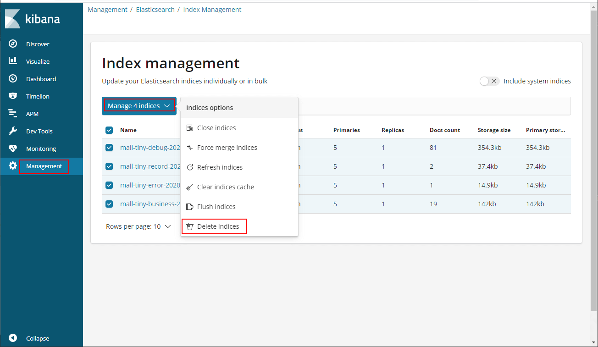

mall项目全套学习教程连载中，[关注公众号](#公众号)第一时间获取。

# 你居然还去服务器上捞日志，搭个日志收集系统难道不香么！

> ELK日志收集系统进阶使用，本文主要讲解如何打造一个线上环境真实可用的日志收集系统。有了它，你就可以和去服务器上捞日志说再见了！

## ELK环境安装

> ELK是指Elasticsearch、Kibana、Logstash这三种服务搭建的日志收集系统，具体搭建方式可以参考[《SpringBoot应用整合ELK实现日志收集》](https://mp.weixin.qq.com/s/ll_A6ddBaU99LSYmKdttYw)。这里仅提供最新版本的docker-compose脚本和一些安装要点。

### docker-compose脚本

```yaml
version: '3'
services:
  elasticsearch:
    image: elasticsearch:6.4.0
    container_name: elasticsearch
    environment:
      - "cluster.name=elasticsearch" #设置集群名称为elasticsearch
      - "discovery.type=single-node" #以单一节点模式启动
      - "ES_JAVA_OPTS=-Xms512m -Xmx512m" #设置使用jvm内存大小
      - TZ=Asia/Shanghai
    volumes:
      - /mydata/elasticsearch/plugins:/usr/share/elasticsearch/plugins #插件文件挂载
      - /mydata/elasticsearch/data:/usr/share/elasticsearch/data #数据文件挂载
    ports:
      - 9200:9200
      - 9300:9300
  kibana:
    image: kibana:6.4.0
    container_name: kibana
    links:
      - elasticsearch:es #可以用es这个域名访问elasticsearch服务
    depends_on:
      - elasticsearch #kibana在elasticsearch启动之后再启动
    environment:
      - "elasticsearch.hosts=http://es:9200" #设置访问elasticsearch的地址
      - TZ=Asia/Shanghai
    ports:
      - 5601:5601
  logstash:
    image: logstash:6.4.0
    container_name: logstash
    environment:
      - TZ=Asia/Shanghai
    volumes:
      - /mydata/logstash/logstash.conf:/usr/share/logstash/pipeline/logstash.conf #挂载logstash的配置文件
    depends_on:
      - elasticsearch #kibana在elasticsearch启动之后再启动
    links:
      - elasticsearch:es #可以用es这个域名访问elasticsearch服务
    ports:
      - 4560:4560
      - 4561:4561
      - 4562:4562
      - 4563:4563
```

### 安装要点

- 使用`docker-compose`命令运行所有服务：

```bash
docker-compose up -d
```

- 第一次启动可能会发现Elasticsearch`无法启动`，那是因为`/usr/share/elasticsearch/data`目录没有访问权限，只需要修改`/mydata/elasticsearch/dat`a目录的权限，再重新启动；

```bash
chmod 777 /mydata/elasticsearch/data/
```

- Logstash需要安装`json_lines`插件。

```bash
logstash-plugin install logstash-codec-json_lines
```

## 分场景收集日志

> 这里为了方便我们查看日志，提出一个分场景收集日志的概念，把日志分为以下四种。

- 调试日志：最全日志，包含了应用中所有`DEBUG`级别以上的日志，仅在开发、测试环境中开启收集；
- 错误日志：只包含应用中所有`ERROR`级别的日志，所有环境只都开启收集；
- 业务日志：在我们应用`对应包下`打印的日志，可用于查看我们自己在应用中打印的业务日志；
- 记录日志：每个接口的`访问记录`，可以用来查看接口执行效率，获取接口访问参数。

## Logback配置详解

> 要实现上面的分场景收集日志，主要通过Logback的配置来实现，我们先来了解下Logback的配置吧！

### 完全配置

> 在SpringBoot中，如果我们想要自定义Logback的配置，需要自行编写`logback-spring.xml`文件，下面是我们这次要使用的完全配置。

```xml
<?xml version="1.0" encoding="UTF-8"?>
<!DOCTYPE configuration>
<configuration>
    <!--引用默认日志配置-->
    <include resource="org/springframework/boot/logging/logback/defaults.xml"/>
    <!--使用默认的控制台日志输出实现-->
    <include resource="org/springframework/boot/logging/logback/console-appender.xml"/>
    <!--应用名称-->
    <springProperty scope="context" name="APP_NAME" source="spring.application.name" defaultValue="springBoot"/>
    <!--日志文件保存路径-->
    <property name="LOG_FILE_PATH" value="${LOG_FILE:-${LOG_PATH:-${LOG_TEMP:-${java.io.tmpdir:-/tmp}}}/logs}"/>
    <!--LogStash访问host-->
    <springProperty name="LOG_STASH_HOST" scope="context" source="logstash.host" defaultValue="localhost"/>

    <!--DEBUG日志输出到文件-->
    <appender name="FILE_DEBUG"
              class="ch.qos.logback.core.rolling.RollingFileAppender">
        <!--输出DEBUG以上级别日志-->
        <filter class="ch.qos.logback.classic.filter.ThresholdFilter">
            <level>DEBUG</level>
        </filter>
        <encoder>
            <!--设置为默认的文件日志格式-->
            <pattern>${FILE_LOG_PATTERN}</pattern>
            <charset>UTF-8</charset>
        </encoder>
        <rollingPolicy class="ch.qos.logback.core.rolling.SizeAndTimeBasedRollingPolicy">
            <!--设置文件命名格式-->
            <fileNamePattern>${LOG_FILE_PATH}/debug/${APP_NAME}-%d{yyyy-MM-dd}-%i.log</fileNamePattern>
            <!--设置日志文件大小，超过就重新生成文件，默认10M-->
            <maxFileSize>${LOG_FILE_MAX_SIZE:-10MB}</maxFileSize>
            <!--日志文件保留天数，默认30天-->
            <maxHistory>${LOG_FILE_MAX_HISTORY:-30}</maxHistory>
        </rollingPolicy>
    </appender>

    <!--ERROR日志输出到文件-->
    <appender name="FILE_ERROR"
              class="ch.qos.logback.core.rolling.RollingFileAppender">
        <!--只输出ERROR级别的日志-->
        <filter class="ch.qos.logback.classic.filter.LevelFilter">
            <level>ERROR</level>
            <onMatch>ACCEPT</onMatch>
            <onMismatch>DENY</onMismatch>
        </filter>
        <encoder>
            <!--设置为默认的文件日志格式-->
            <pattern>${FILE_LOG_PATTERN}</pattern>
            <charset>UTF-8</charset>
        </encoder>
        <rollingPolicy class="ch.qos.logback.core.rolling.SizeAndTimeBasedRollingPolicy">
            <!--设置文件命名格式-->
            <fileNamePattern>${LOG_FILE_PATH}/error/${APP_NAME}-%d{yyyy-MM-dd}-%i.log</fileNamePattern>
            <!--设置日志文件大小，超过就重新生成文件，默认10M-->
            <maxFileSize>${LOG_FILE_MAX_SIZE:-10MB}</maxFileSize>
            <!--日志文件保留天数，默认30天-->
            <maxHistory>${LOG_FILE_MAX_HISTORY:-30}</maxHistory>
        </rollingPolicy>
    </appender>

    <!--DEBUG日志输出到LogStash-->
    <appender name="LOG_STASH_DEBUG" class="net.logstash.logback.appender.LogstashTcpSocketAppender">
        <filter class="ch.qos.logback.classic.filter.ThresholdFilter">
            <level>DEBUG</level>
        </filter>
        <destination>${LOG_STASH_HOST}:4560</destination>
        <encoder charset="UTF-8" class="net.logstash.logback.encoder.LoggingEventCompositeJsonEncoder">
            <providers>
                <timestamp>
                    <timeZone>Asia/Shanghai</timeZone>
                </timestamp>
                <!--自定义日志输出格式-->
                <pattern>
                    <pattern>
                        {
                        "project": "mall-tiny",
                        "level": "%level",
                        "service": "${APP_NAME:-}",
                        "pid": "${PID:-}",
                        "thread": "%thread",
                        "class": "%logger",
                        "message": "%message",
                        "stack_trace": "%exception{20}"
                        }
                    </pattern>
                </pattern>
            </providers>
        </encoder>
        <!--当有多个LogStash服务时，设置访问策略为轮询-->
        <connectionStrategy>
            <roundRobin>
                <connectionTTL>5 minutes</connectionTTL>
            </roundRobin>
        </connectionStrategy>
    </appender>

    <!--ERROR日志输出到LogStash-->
    <appender name="LOG_STASH_ERROR" class="net.logstash.logback.appender.LogstashTcpSocketAppender">
        <filter class="ch.qos.logback.classic.filter.LevelFilter">
            <level>ERROR</level>
            <onMatch>ACCEPT</onMatch>
            <onMismatch>DENY</onMismatch>
        </filter>
        <destination>${LOG_STASH_HOST}:4561</destination>
        <encoder charset="UTF-8" class="net.logstash.logback.encoder.LoggingEventCompositeJsonEncoder">
            <providers>
                <timestamp>
                    <timeZone>Asia/Shanghai</timeZone>
                </timestamp>
                <!--自定义日志输出格式-->
                <pattern>
                    <pattern>
                        {
                        "project": "mall-tiny",
                        "level": "%level",
                        "service": "${APP_NAME:-}",
                        "pid": "${PID:-}",
                        "thread": "%thread",
                        "class": "%logger",
                        "message": "%message",
                        "stack_trace": "%exception{20}"
                        }
                    </pattern>
                </pattern>
            </providers>
        </encoder>
        <!--当有多个LogStash服务时，设置访问策略为轮询-->
        <connectionStrategy>
            <roundRobin>
                <connectionTTL>5 minutes</connectionTTL>
            </roundRobin>
        </connectionStrategy>
    </appender>

    <!--业务日志输出到LogStash-->
    <appender name="LOG_STASH_BUSINESS" class="net.logstash.logback.appender.LogstashTcpSocketAppender">
        <destination>${LOG_STASH_HOST}:4562</destination>
        <encoder charset="UTF-8" class="net.logstash.logback.encoder.LoggingEventCompositeJsonEncoder">
            <providers>
                <timestamp>
                    <timeZone>Asia/Shanghai</timeZone>
                </timestamp>
                <!--自定义日志输出格式-->
                <pattern>
                    <pattern>
                        {
                        "project": "mall-tiny",
                        "level": "%level",
                        "service": "${APP_NAME:-}",
                        "pid": "${PID:-}",
                        "thread": "%thread",
                        "class": "%logger",
                        "message": "%message",
                        "stack_trace": "%exception{20}"
                        }
                    </pattern>
                </pattern>
            </providers>
        </encoder>
        <!--当有多个LogStash服务时，设置访问策略为轮询-->
        <connectionStrategy>
            <roundRobin>
                <connectionTTL>5 minutes</connectionTTL>
            </roundRobin>
        </connectionStrategy>
    </appender>

    <!--接口访问记录日志输出到LogStash-->
    <appender name="LOG_STASH_RECORD" class="net.logstash.logback.appender.LogstashTcpSocketAppender">
        <destination>${LOG_STASH_HOST}:4563</destination>
        <encoder charset="UTF-8" class="net.logstash.logback.encoder.LoggingEventCompositeJsonEncoder">
            <providers>
                <timestamp>
                    <timeZone>Asia/Shanghai</timeZone>
                </timestamp>
                <!--自定义日志输出格式-->
                <pattern>
                    <pattern>
                        {
                        "project": "mall-tiny",
                        "level": "%level",
                        "service": "${APP_NAME:-}",
                        "class": "%logger",
                        "message": "%message"
                        }
                    </pattern>
                </pattern>
            </providers>
        </encoder>
        <!--当有多个LogStash服务时，设置访问策略为轮询-->
        <connectionStrategy>
            <roundRobin>
                <connectionTTL>5 minutes</connectionTTL>
            </roundRobin>
        </connectionStrategy>
    </appender>

    <!--控制框架输出日志-->
    <logger name="org.slf4j" level="INFO"/>
    <logger name="springfox" level="INFO"/>
    <logger name="io.swagger" level="INFO"/>
    <logger name="org.springframework" level="INFO"/>
    <logger name="org.hibernate.validator" level="INFO"/>

    <root level="DEBUG">
        <appender-ref ref="CONSOLE"/>
        <!--<appender-ref ref="FILE_DEBUG"/>-->
        <!--<appender-ref ref="FILE_ERROR"/>-->
        <appender-ref ref="LOG_STASH_DEBUG"/>
        <appender-ref ref="LOG_STASH_ERROR"/>
    </root>

    <logger name="com.macro.mall.tiny.component" level="DEBUG">
        <appender-ref ref="LOG_STASH_RECORD"/>
    </logger>

    <logger name="com.macro.mall" level="DEBUG">
        <appender-ref ref="LOG_STASH_BUSINESS"/>
    </logger>
</configuration>
```

### 配置要点解析

#### 使用默认的日志配置

> 一般我们不需要自定义控制台输出，可以采用默认配置，具体配置参考`console-appender.xml`，该文件在`spring-boot-${version}.jar`下面。

```xml
<!--引用默认日志配置-->
<include resource="org/springframework/boot/logging/logback/defaults.xml"/>
<!--使用默认的控制台日志输出实现-->
<include resource="org/springframework/boot/logging/logback/console-appender.xml"/>
```

#### springProperty

> 该标签可以从SpringBoot的配置文件中获取配置属性，比如说在不同环境下我们的Logstash服务地址是不一样的，我们就可以把该地址定义在`application.yml`来使用。

例如在`application-dev.yml`中定义了这些属性：

```yaml
logstash:
  host: localhost
```

在`logback-spring.xml`中就可以直接这样使用：

```xml
<!--应用名称-->
<springProperty scope="context" name="APP_NAME" source="spring.application.name" defaultValue="springBoot"/>
<!--LogStash访问host-->
<springProperty name="LOG_STASH_HOST" scope="context" source="logstash.host" defaultValue="localhost"/>
```

#### filter

> 在Logback中有两种不同的过滤器，用来过滤日志输出。

ThresholdFilter：临界值过滤器，过滤掉低于指定临界值的日志，比如下面的配置将过滤掉所有低于INFO级别的日志。

```xml
<filter class="ch.qos.logback.classic.filter.ThresholdFilter">
    <level>INFO</level>
</filter>
```

LevelFilter：级别过滤器，根据日志级别进行过滤，比如下面的配置将过滤掉所有非ERROR级别的日志。

```xml
<filter class="ch.qos.logback.classic.filter.LevelFilter">
    <level>ERROR</level>
    <onMatch>ACCEPT</onMatch>
    <onMismatch>DENY</onMismatch>
</filter>
```

#### appender

> Appender可以用来控制日志的输出形式，主要有下面三种。

- ConsoleAppender：控制日志输出到控制台的形式，比如在`console-appender.xml`中定义的默认控制台输出。

```xml
<appender name="CONSOLE" class="ch.qos.logback.core.ConsoleAppender">
	<encoder>
		<pattern>${CONSOLE_LOG_PATTERN}</pattern>
	</encoder>
</appender>
```

- RollingFileAppender：控制日志输出到文件的形式，可以控制日志文件生成策略，比如文件名称格式、超过多大重新生成文件以及删除超过多少天的文件。

```xml
<!--ERROR日志输出到文件-->
<appender name="FILE_ERROR"
          class="ch.qos.logback.core.rolling.RollingFileAppender">
    <rollingPolicy class="ch.qos.logback.core.rolling.SizeAndTimeBasedRollingPolicy">
        <!--设置文件命名格式-->
        <fileNamePattern>${LOG_FILE_PATH}/error/${APP_NAME}-%d{yyyy-MM-dd}-%i.log</fileNamePattern>
        <!--设置日志文件大小，超过就重新生成文件，默认10M-->
        <maxFileSize>${LOG_FILE_MAX_SIZE:-10MB}</maxFileSize>
        <!--日志文件保留天数，默认30天-->
        <maxHistory>${LOG_FILE_MAX_HISTORY:-30}</maxHistory>
    </rollingPolicy>
</appender>
```

- LogstashTcpSocketAppender：控制日志输出到Logstash的形式，可以用来配置Logstash的地址、访问策略以及日志的格式。

```xml
<!--ERROR日志输出到LogStash-->
<appender name="LOG_STASH_ERROR" class="net.logstash.logback.appender.LogstashTcpSocketAppender">
    <destination>${LOG_STASH_HOST}:4561</destination>
    <encoder charset="UTF-8" class="net.logstash.logback.encoder.LoggingEventCompositeJsonEncoder">
        <providers>
            <timestamp>
                <timeZone>Asia/Shanghai</timeZone>
            </timestamp>
            <!--自定义日志输出格式-->
            <pattern>
                <pattern>
                    {
                    "project": "mall-tiny",
                    "level": "%level",
                    "service": "${APP_NAME:-}",
                    "pid": "${PID:-}",
                    "thread": "%thread",
                    "class": "%logger",
                    "message": "%message",
                    "stack_trace": "%exception{20}"
                    }
                </pattern>
            </pattern>
        </providers>
    </encoder>
    <!--当有多个LogStash服务时，设置访问策略为轮询-->
    <connectionStrategy>
        <roundRobin>
            <connectionTTL>5 minutes</connectionTTL>
        </roundRobin>
    </connectionStrategy>
</appender>
```

#### logger

> 只有配置到logger节点上的appender才会被使用，logger用于配置哪种条件下的日志被打印，root是一种特殊的appender，下面介绍下日志划分的条件。

- 调试日志：所有的DEBUG级别以上日志；
- 错误日志：所有的ERROR级别日志；
- 业务日志：`com.macro.mall`包下的所有DEBUG级别以上日志；
- 记录日志：`com.macro.mall.tiny.component.WebLogAspect`类下所有DEBUG级别以上日志，该类是统计接口访问信息的AOP切面类。

#### 控制框架输出日志

> 还有一些使用框架内部的日志，DEBUG级别的日志对我们并没有啥用处，都可以设置为了INFO以上级别。

```xml
<!--控制框架输出日志-->
<logger name="org.slf4j" level="INFO"/>
<logger name="springfox" level="INFO"/>
<logger name="io.swagger" level="INFO"/>
<logger name="org.springframework" level="INFO"/>
<logger name="org.hibernate.validator" level="INFO"/>
```

## Logstash配置详解

> 接下来我们需要配置下Logstash，让它可以分场景收集不同的日志，下面详细介绍下使用到的配置。

### 完全配置

```
input {
  tcp {
    mode => "server"
    host => "0.0.0.0"
    port => 4560
    codec => json_lines
    type => "debug"
  }
  tcp {
    mode => "server"
    host => "0.0.0.0"
    port => 4561
    codec => json_lines
    type => "error"
  }
  tcp {
    mode => "server"
    host => "0.0.0.0"
    port => 4562
    codec => json_lines
    type => "business"
  }
  tcp {
    mode => "server"
    host => "0.0.0.0"
    port => 4563
    codec => json_lines
    type => "record"
  }
}
filter{
  if [type] == "record" {
    mutate {
      remove_field => "port"
      remove_field => "host"
      remove_field => "@version"
    }
    json {
      source => "message"
      remove_field => ["message"]
    }
  }
}
output {
  elasticsearch {
    hosts => ["es:9200"]
    action => "index"
    codec => json
    index => "mall-tiny-%{type}-%{+YYYY.MM.dd}"
    template_name => "mall-tiny"
  }
}
```

### 配置要点

- input：使用不同端口收集不同类型的日志，从4560~4563开启四个端口；
- filter：对于记录类型的日志，直接将JSON格式的message转化到source中去，便于搜索查看；
- output：按类型、时间自定义索引格式。

## SpringBoot配置

> 在SpringBoot中的配置可以直接用来覆盖Logback中的配置，比如`logging.level.root`就可以覆盖`<root>`节点中的`level`配置。

- 开发环境配置：application-dev.yml

```yaml
logstash:
  host: localhost
logging:
  level:
    root: debug
```

- 测试环境配置：application-test.yml

```yaml
logstash:
  host: 192.168.3.101
logging:
  level:
    root: debug
```

- 生产环境配置：application-prod.yml

```yaml
logstash:
  host: logstash-prod
logging:
  level:
    root: info
```

## Kibana进阶使用

> 进过上面ELK环境的搭建和配置以后，我们的日志收集系统终于可以用起来了，下面介绍下在Kibana中的使用技巧！

- 首先启动我们的测试Demo，然后通用调用接口（可以使用Swagger），产生一些日志信息；



- 调用完成后在`Management->Kibana->Index Patterns`中可以创建`Index Patterns`，Kibana服务访问地址：http://192.168.3.101:5601



- 创建完成后可以在`Discover`中查看所有日志，调试日志只需直接查看`mall-tiny-debug*`模式的日志即可；



- 对于日志搜索，kibana有非常强大的提示功能，可以通过搜索栏右侧的`Options`按钮打开；



- 记录日志只需直接查看`mall-tiny-record*`模式的日志即可，如果我们想要搜索uri为`/brand/listAll`的记录日志，只需在搜索栏中输入`uri : "/brand/listAll"`；



- 错误日志，只需直接查看`mall-tiny-error*`模式的日志即可；



- 业务日志，只需直接查看`mall-tiny-business*`模式的日志即可，这里我们可以查看一些SQL日志的输出；



- 如果日志太大了，可以通过`Elasticsearch->Index Management`选择删除即可。



## 项目源码地址

https://github.com/macrozheng/mall-learning/tree/master/mall-tiny-log

## 公众号

