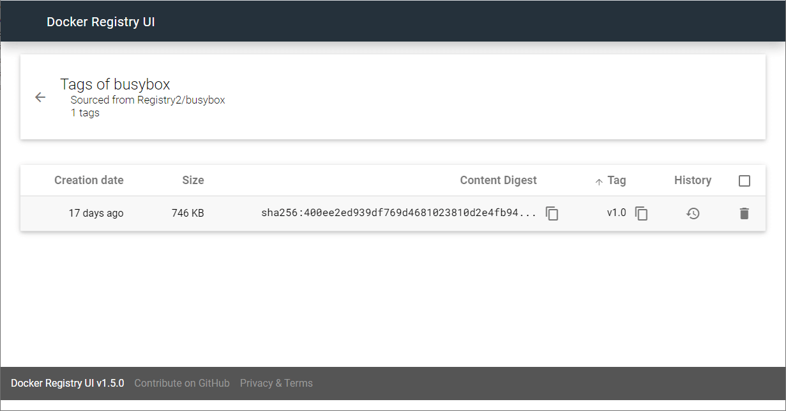
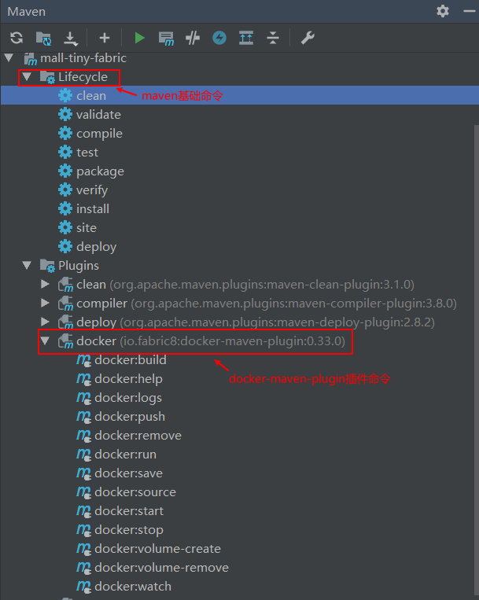
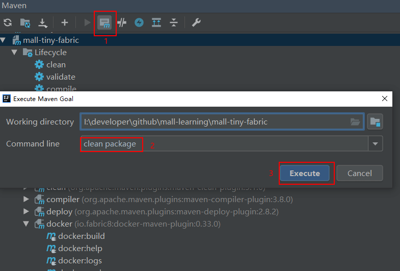
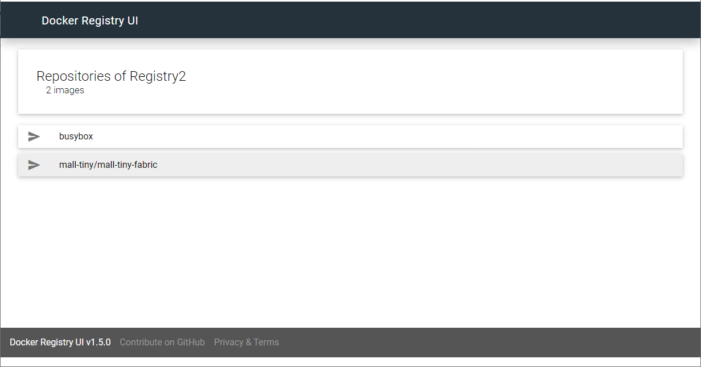

学习不走弯路，[关注公众号](#公众号) 回复「学习路线」，获取mall项目专属学习路线！

# 还在手动部署SpringBoot应用？试试这个自动化插件！

> 最近又发现了一款好用的Maven插件，fabric8io出品的`docker-maven-plugin`，可以把SpringBoot应用方便的部署到Docker容器中去。该插件可以实现打包镜像、推送到镜像仓库、运行应用等一系列操作，本文将对其用法进行详细介绍，希望对大家有所帮助！

## 安装私有镜像仓库

> 由于之后我们需要推送到私有镜像仓库，我们预先安装好，使用的是Docker公司开发的私有镜像仓库Registry。

- 下载Registry的Docker镜像；

```bash
docker pull registry:2
```

- 使用Docker容器运行Registry服务，需要添加环境变量`REGISTRY_STORAGE_DELETE_ENABLED=true`开启删除镜像的功能；

```bash
docker run -p 5000:5000 --name registry2 \
--restart=always \
-e REGISTRY_STORAGE_DELETE_ENABLED="true" \
-d registry:2
```

- 修改Docker Daemon的配置文件，文件位置为`/etc/docker/daemon.json`，由于Docker默认使用HTTPS推送镜像，而我们的镜像仓库没有支持，所以需要添加如下配置，改为使用HTTP推送；

```json
{
  "insecure-registries": ["192.168.3.101:5000"]
}
```

- 最后使用如下命令重启Docker服务。

```bash
systemctl daemon-reload && systemctl restart docker
```

## 镜像仓库可视化

> 由于私有镜像仓库管理比较麻烦，而`docker-registry-ui`有专门的页面可以方便地管理镜像，所以我们安装它来管理私有镜像仓库。

- 下载`docker-registry-ui`的Docker镜像；

```bash
docker pull joxit/docker-registry-ui:static
```

- 使用Docker容器运行`docker-registry-ui`服务；

```bash
docker run -p 8280:80 --name registry-ui \
--link registry2:registry2 \
-e REGISTRY_URL="http://registry2:5000" \
-e DELETE_IMAGES="true" \
-e REGISTRY_TITLE="Registry2" \
-d joxit/docker-registry-ui:static
```

- 我们先来试试私有镜像仓库是否可用，首先下载一个测试用的镜像`busybox`；

```bash
docker pull busybox
```

- 给镜像`busybox`打上私有仓库的标签，并设置版本为`v1.0`；

```bash
docker tag busybox 192.168.3.101:5000/busybox:v1.0
```

- 之后推送到私有镜像仓库去；

```bash
docker push 192.168.3.101:5000/busybox:v1.0
```

- 访问`docker-registry-ui`管理界面，即可查看到`busybox`镜像，地址：http://192.168.3.101:8280



## 插件使用

> fabric8io出品的`docker-maven-plugin`是一款集Docker镜像管理和容器管理于一身的插件，动动手指就可以把我们的SpringBoot应用部署到Docker容器中了，非常好用，下面来讲讲它的用法。

### 在IDEA中正确使用Maven插件

- 一般我们如果没有使用IDEA，都是手敲Maven命令来执行，在IDEA中我们只要双击右侧面板中的Maven命令即可执行，非常方便。



- 如果你想使用自定义命令的话，可以使用`Execute Maven Goal`这个功能，这里我使用的是`mvn clean package`命令。



### 构建镜像

- 要想使用`docker-maven-plugin`，需要在`pom.xml`中添加该插件；

```xml
<build>
    <plugins>
        <plugin>
            <groupId>io.fabric8</groupId>
            <artifactId>docker-maven-plugin</artifactId>
            <version>0.33.0</version>
            <configuration>
                <!-- Docker 远程管理地址-->
                <dockerHost>http://192.168.3.101:2375</dockerHost>
                <!-- Docker 推送镜像仓库地址-->
                <pushRegistry>http://192.168.3.101:5000</pushRegistry>
                <images>
                    <image>
                        <!--由于推送到私有镜像仓库，镜像名需要添加仓库地址-->
                        <name>192.168.3.101:5000/mall-tiny/${project.name}:${project.version}</name>
                        <!--定义镜像构建行为-->
                        <build>
                            <!--定义基础镜像-->
                            <from>java:8</from>
                            <args>
                                <JAR_FILE>${project.build.finalName}.jar</JAR_FILE>
                            </args>
                            <!--定义哪些文件拷贝到容器中-->
                            <assembly>
                                <!--定义拷贝到容器的目录-->
                                <targetDir>/</targetDir>
                                <!--只拷贝生成的jar包-->
                                <descriptorRef>artifact</descriptorRef>
                            </assembly>
                            <!--定义容器启动命令-->
                            <entryPoint>["java", "-jar","/${project.build.finalName}.jar"]</entryPoint>
                            <!--定义维护者-->
                            <maintainer>macrozheng</maintainer>
                        </build>
                    </image>
                </images>
            </configuration>
        </plugin>
    </plugins>
</build>
```

- 我们构建镜像之前需要先将项目打包，然后再构建，否则会出错，直接使用如下命令即可；

```bash
mvn package docker:build
```

- 打包完成后就可以在我们的服务器上看到这个镜像了；

```bash
[root@linux-local mydata]# docker images
REPOSITORY                                     TAG                 IMAGE ID            CREATED             SIZE
192.168.3.101:5000/mall-tiny/mall-tiny-fabric   0.0.1-SNAPSHOT      6b8bc6faeb0b        9 seconds ago       680MB
```

- 当然我们也可以设置使用`package`命令时直接打包镜像，修改`pom.xml`，在`<plugin>`节点下添加`<executions>`配置即可；

```xml
<plugin>
    <groupId>io.fabric8</groupId>
    <artifactId>docker-maven-plugin</artifactId>
    <version>0.33.0</version>
    <executions>
        <!--如果想在项目打包时构建镜像添加-->
        <execution>
            <id>build-image</id>
            <phase>package</phase>
            <goals>
                <goal>build</goal>
            </goals>
        </execution>
    </executions>
</plugin>
```

- 使用不同的Maven插件构建Docker镜像时方法往往不同，这时候直接使用`Dockerfile`来构建会比较好，我们先写好Dockerfile文件并放到项目根目录下；

```dockerfile
# 该镜像需要依赖的基础镜像
FROM java:8
# 将当前maven目录生成的文件复制到docker容器的/目录下
COPY maven /
# 声明服务运行在8080端口
EXPOSE 8080
# 指定docker容器启动时运行jar包
ENTRYPOINT ["java", "-jar","/mall-tiny-fabric-0.0.1-SNAPSHOT.jar"]
# 指定维护者的名字
MAINTAINER macrozheng
```

- 然后修改`pom.xml`文件，将`<build>`节点配置替换为如下内容，仅需配置Dockerfile所在目录即可。

```xml
<build>
     <dockerFileDir>${project.basedir}</dockerFileDir>
</build>
```

### 推送到镜像仓库

- 接下来我们使用`docker:push`命令即可把镜像推送到私有镜像仓库；

```bash
mvn docker:push
```

- 之后在我们的私有镜像仓库就可以看到镜像了；



### 操作容器

- `docker-maven-plugin`不仅可以操作镜像，还可以操作容器，比如我们以前需要使用如下Docker命令来运行容器；

```bash
docker run -p 8080:8080 --name mall-tiny-fabric \
--link mysql:db \
-v /etc/localtime:/etc/localtime \
-v /mydata/app/mall-tiny-fabric/logs:/var/logs \
-d 192.168.3.101:5000/mall-tiny/mall-tiny-fabric:0.0.1-SNAPSHOT
```

- 现在我们只需在插件中配置即可，在`<image>`节点下添加`<run>`节点可以定义容器启动的行为：

```xml
<!--定义容器启动行为-->
<run>
    <!--设置容器名，可采用通配符-->
    <containerNamePattern>${project.artifactId}</containerNamePattern>
    <!--设置端口映射-->
    <ports>
        <port>8080:8080</port>
    </ports>
    <!--设置容器间连接-->
    <links>
        <link>mysql:db</link>
    </links>
    <!--设置容器和宿主机目录挂载-->
    <volumes>
        <bind>
            <volume>/etc/localtime:/etc/localtime</volume>
            <volume>/mydata/app/${project.artifactId}/logs:/var/logs</volume>
        </bind>
    </volumes>
</run>
```

- 之后直接使用`docker:start`命令即可启动了；

```bash
mvn docker:start
```

```bash
[root@linux-local mydata]# docker ps
CONTAINER ID        IMAGE                                                         COMMAND                  CREATED             STATUS              PORTS                                            NAMES
95ce77c0394b        192.168.3.101:5000/mall-tiny/mall-tiny-fabric:0.0.1-SNAPSHOT   "java -jar /mall-tin…"   32 seconds ago      Up 31 seconds       0.0.0.0:8080->8080/tcp                           mall-tiny-fabric
```

- 停止容器使用`docker:stop`命令即可；

```bash
mvn docker:stop
```

- 删除容器使用`docker:remove`命令，是不是很方便！

```bash
mvn docker:remove
```

## 项目源码地址

https://github.com/macrozheng/mall-learning/tree/master/mall-tiny-fabric

## 公众号

