mall项目全套学习教程连载中，[关注公众号](#公众号)第一时间获取。

# MongoDB快速入门，掌握这些刚刚好！

> 虽说现在关系型数据库还是主流，但是面对某些需求的时候，需要非关系型数据库来补充它，学习一个主流的NoSQL数据库还是很有必要的。MongoDB是一个功能丰富的NoSQL数据库，本文整理了它最常用的部分形成了这篇入门教程，希望对大家有所帮助。

## 简介

MongoDB是一个基于分布式文件存储的数据库。由C++语言编写，旨在为WEB应用提供可扩展的高性能数据存储解决方案。MongoDB是一个介于关系型数据库和非关系型数据库之间的产品，是非关系型数据库当中功能最丰富，最像关系型数据库的。

## 安装

> 以前写的MongoDB安装教程是基于3.2版本的，发现有的朋友使用新版本安装有问题，这次我们使用最新版本再来安装一次，本文所使用的MongoDB版本为4.2.5，总的来说，新版本的安装更简单了。

### Windows下的安装

- 下载MongoDB安装包，选择`Windows x64`版本安装，下载地址：https://www.mongodb.com/download-center/community

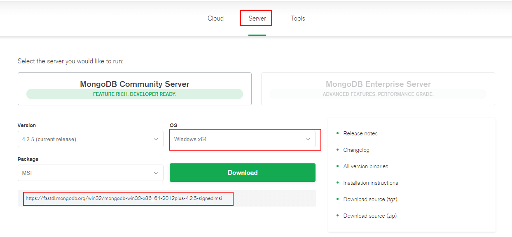

- 运行MongoDB安装包并选择自定义安装，设置好安装路径；

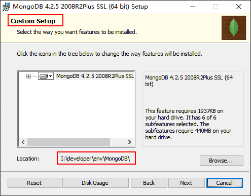

- 配置MongoDB，让MongoDB作为服务运行，并配置好数据目录和日志目录；

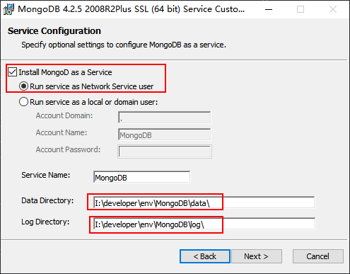

- 取消MongoDB Compass的安装选项（不取消安装极慢），需要可自行安装；

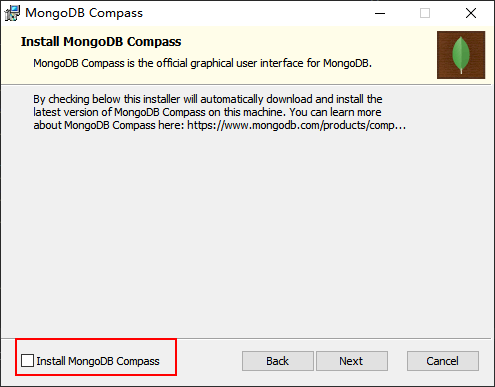

- 双击`mongo.exe`可以运行MongoDB自带客户端，操作MongoDB；

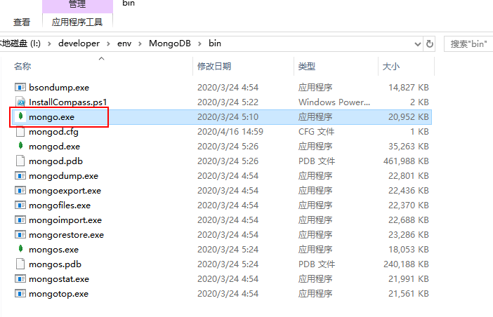

- 连接成功后会显示如下信息；

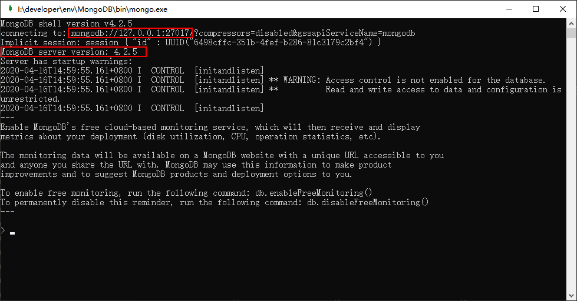

- 如果需要移除MongoDB服务，只需使用管理员权限运行`cmd`工具，并输入如下命令。

```bash
sc.exe delete MongoDB
```

### Linux下的安装

- 下载MongoDB的Docker镜像；

```bash
docker pull mongo:4.2.5
```

- 使用Docker命令启动MongoDB服务；

```bash
docker run -p 27017:27017 --name mongo \
-v /mydata/mongo/db:/data/db \
-d mongo:4.2.5
```

- 有时候我们需要为MongoDB设置账号，可以使用如下命令启动；

```bash
docker run -p 27017:27017 --name mongo \
-v /mydata/mongo/db:/data/db \
-d mongo:4.2.5 --auth
```

- 然后我们需要进入容器中的MongoDB客户端；

```bash
docker exec -it mongo mongo
```

- 之后在`admin`集合中创建一个账号用于连接，这里创建的是基于`root`角色的超级管理员帐号；

```
use admin
db.createUser({ 
    user: 'mongoadmin', 
    pwd: 'secret', 
    roles: [ { role: "root", db: "admin" } ] });
```

- 创建完成后验证是否可以登录；

```
db.auth("mongoadmin","secret")
```

- 整个账号创建过程可以参考下图。

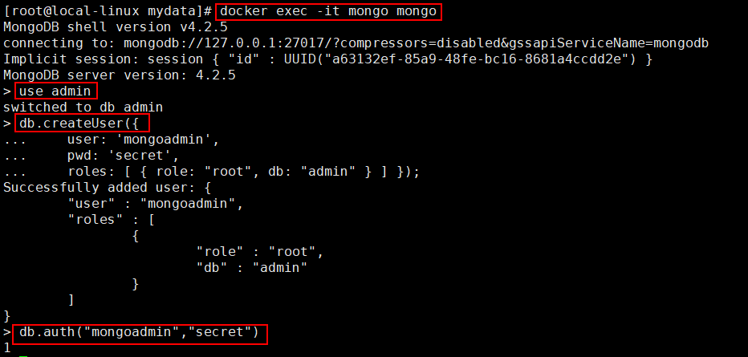

### 客户端工具

> MongoDB的客户端工具有很多，上面没安装的MongoDB Compass就是其中之一，另外Navicat 15版本也有MongoDB的管理功能。这里我们使用的是一款免费的客户端工具Robo 3T（以前叫Robomongo）。

- 首先下载客户端工具，下载地址：https://robomongo.org/download

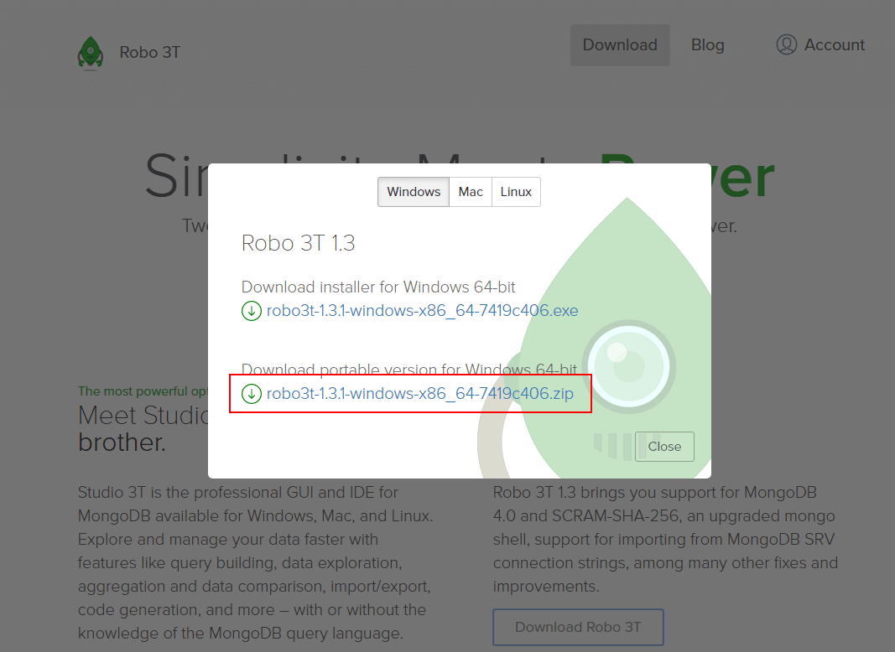

- 下载完成后解压，双击`robo3t.exe`即可使用；

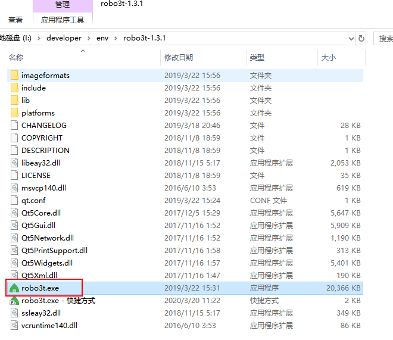

- 之后创建一个到MongoDB的连接；

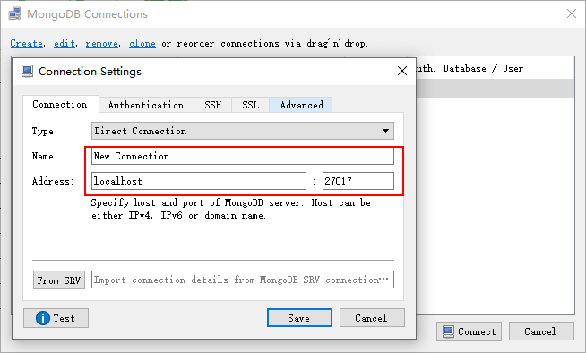

- 创建连接成功以后，就可以操作MongoDB了。

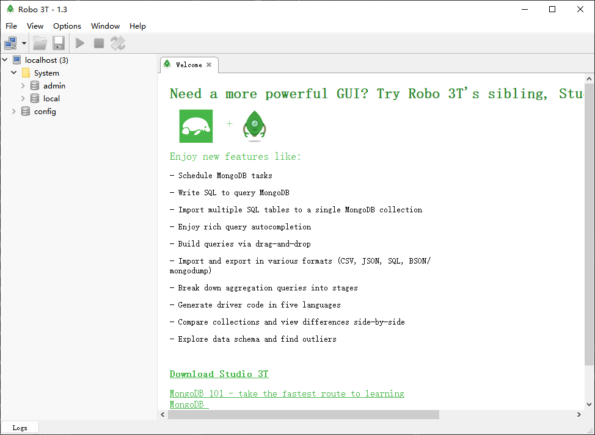

## 相关概念

> MongoDB是非关系型数据库当中最像关系型数据库的，所以我们通过它与关系型数据库的对比，来了解下它的概念。

| SQL概念     | MongoDB概念 | 解释/说明                           |
| :---------- | :---------- | :---------------------------------- |
| database    | database    | 数据库                              |
| table       | collection  | 数据库表/集合                       |
| row         | document    | 数据记录行/文档                     |
| column      | field       | 数据字段/域                         |
| index       | index       | 索引                                |
| primary key | primary key | 主键,MongoDB自动将_id字段设置为主键 |

## 数据库操作

- 创建数据库，使用`use`命令去创建数据库，当插入第一条数据时会创建数据库，例如创建一个`test`数据库；

```
> use test
switched to db test
> db.article.insert({name:"MongoDB 教程"})
WriteResult({ "nInserted" : 1 })
> show dbs
admin   0.000GB
config  0.000GB
local   0.000GB
test    0.000GB
```

- 删除数据库，使用db对象中的`dropDatabase()`方法来删除；

```
> db.dropDatabase()
{ "dropped" : "test", "ok" : 1 }
> show dbs
admin   0.000GB
config  0.000GB
local   0.000GB
```

## 集合操作

- 创建集合，使用db对象中的`createCollection()`方法来创建集合，例如创建一个`article`集合；

```
> use test
switched to db test
> db.createCollection("article")
{ "ok" : 1 }
> show collections
article
```

- 删除集合，使用collection对象的`drop()`方法来删除集合，例如删除一个`article`集合；

```
> db.article.drop()
true
> show collections
```

## 文档操作

> 上面的数据库和集合操作是在MongoDB的客户端中进行的，下面的文档操作都是在Robomongo中进行的。

### 插入文档

- MongoDB通过collection对象的`insert()`方法向集合中插入文档，语法如下；

```
db.collection.insert(document)
```

- 使用collection对象的`insert()`方法来插入文档，例如插入一个`article`文档；

```
db.article.insert({title: 'MongoDB 教程', 
    description: 'MongoDB 是一个 Nosql 数据库',
    by: 'Andy',
    url: 'https://www.mongodb.com/',
    tags: ['mongodb', 'database', 'NoSQL'],
    likes: 100
})
```

- 使用collection对象的`find()`方法可以获取文档，例如获取所有的`article`文档；

```
db.article.find({})
```

```
{
    "_id" : ObjectId("5e9943661379a112845e4056"),
    "title" : "MongoDB 教程",
    "description" : "MongoDB 是一个 Nosql 数据库",
    "by" : "Andy",
    "url" : "https://www.mongodb.com/",
    "tags" : [ 
        "mongodb", 
        "database", 
        "NoSQL"
    ],
    "likes" : 100.0
}
```

### 更新文档

- MongoDB通过collection对象的`update()`来更新集合中的文档，语法如下；

```
db.collection.update(
   <query>,
   <update>,
   {
     multi: <boolean>
   }
)
# query：修改的查询条件，类似于SQL中的WHERE部分
# update：更新属性的操作符，类似与SQL中的SET部分
# multi：设置为true时会更新所有符合条件的文档，默认为false只更新找到的第一条
```

- 将title为`MongoDB 教程`的所有文档的title修改为`MongoDB`；

```
db.article.update({'title':'MongoDB 教程'},{$set:{'title':'MongoDB'}},{multi:true})
```

- 除了`update()`方法以外，`save()`方法可以用来替换已有文档，语法如下；

```
db.collection.save(document)
```

- 这次我们将ObjectId为`5e9943661379a112845e4056`的文档的title改为`MongoDB 教程`；

```
db.article.save({
    "_id" : ObjectId("5e9943661379a112845e4056"),
    "title" : "MongoDB 教程",
    "description" : "MongoDB 是一个 Nosql 数据库",
    "by" : "Andy",
    "url" : "https://www.mongodb.com/",
    "tags" : [ 
        "mongodb", 
        "database", 
        "NoSQL"
    ],
    "likes" : 100.0
})
```
### 删除文档

- MongoDB通过collection对象的`remove()`方法来删除集合中的文档，语法如下；

```
db.collection.remove(
   <query>,
   {
     justOne: <boolean>
   }
)
# query：删除的查询条件，类似于SQL中的WHERE部分
# justOne：设置为true只删除一条记录，默认为false删除所有记录
```

- 删除title为`MongoDB 教程`的所有文档；

```
db.article.remove({'title':'MongoDB 教程'})
```

### 查询文档

- MongoDB通过collection对象的`find()`方法来查询文档，语法如下；

```
db.collection.find(query, projection)
# query：查询条件，类似于SQL中的WHERE部分
# projection：可选，使用投影操作符指定返回的键
```

- 查询`article`集合中的所有文档；

```
db.article.find()
```

```
/* 1 */
{
    "_id" : ObjectId("5e994dcb1379a112845e4057"),
    "title" : "MongoDB 教程",
    "description" : "MongoDB 是一个 Nosql 数据库",
    "by" : "Andy",
    "url" : "https://www.mongodb.com/",
    "tags" : [ 
        "mongodb", 
        "database", 
        "NoSQL"
    ],
    "likes" : 50.0
}

/* 2 */
{
    "_id" : ObjectId("5e994df51379a112845e4058"),
    "title" : "Elasticsearch 教程",
    "description" : "Elasticsearch 是一个搜索引擎",
    "by" : "Ruby",
    "url" : "https://www.elastic.co/cn/",
    "tags" : [ 
        "elasticearch", 
        "database", 
        "NoSQL"
    ],
    "likes" : 100.0
}

/* 3 */
{
    "_id" : ObjectId("5e994e111379a112845e4059"),
    "title" : "Redis 教程",
    "description" : "Redis 是一个key-value数据库",
    "by" : "Andy",
    "url" : "https://redis.io/",
    "tags" : [ 
        "redis", 
        "database", 
        "NoSQL"
    ],
    "likes" : 150.0
}
```

- MongoDB中的条件操作符，通过与SQL语句的对比来了解下；

| 操作       | 格式                     | SQL中的类似语句                |
| :--------- | :----------------------- | :----------------------------- |
| 等于       | `{<key>:<value>}`        | `where title = 'MongoDB 教程'` |
| 小于       | `{<key>:{$lt:<value>}}`  | `where likes < 50`             |
| 小于或等于 | `{<key>:{$lte:<value>}}` | `where likes <= 50`            |
| 大于       | `{<key>:{$gt:<value>}}`  | `where likes > 50`             |
| 大于或等于 | `{<key>:{$gte:<value>}}` | `where likes >= 50`            |
| 不等于     | `{<key>:{$ne:<value>}}`  | `where likes != 50`            |

- 条件查询，查询title为`MongoDB 教程`的所有文档；

```
db.article.find({'title':'MongoDB 教程'})
```

- 条件查询，查询likes大于50的所有文档；

```
db.article.find({'likes':{$gt:50}})
```

- AND条件可以通过在`find()`方法传入多个键，以逗号隔开来实现，例如查询title为`MongoDB 教程`并且by为`Andy`的所有文档；

```
db.article.find({'title':'MongoDB 教程','by':'Andy'})
```

- OR条件可以通过使用`$or`操作符实现，例如查询title为`Redis 教程`或`MongoDB 教程`的所有文档；

```
db.article.find({$or:[{"title":"Redis 教程"},{"title": "MongoDB 教程"}]})
```
- AND 和 OR条件的联合使用，例如查询likes大于50，并且title为`Redis 教程`或者`"MongoDB 教程`的所有文档。

```
db.article.find({"likes": {$gt:50}, $or: [{"title": "Redis 教程"},{"title": "MongoDB 教程"}]})
```

## 其他操作

### Limit与Skip操作

- 读取指定数量的文档，可以使用`limit()`方法，语法如下；

```
db.collection.find().limit(NUMBER)
```

- 只查询article集合中的2条数据；

```
db.article.find().limit(2)
```

- 跳过指定数量的文档来读取，可以使用`skip()`方法，语法如下；

```
db.collection.find().limit(NUMBER).skip(NUMBER)
```

- 从第二条开始，查询article集合中的2条数据；

```
db.article.find().limit(2).skip(1)
```

### 排序

- 在MongoDB中使用`sort()`方法对数据进行排序，`sort()`方法通过参数来指定排序的字段，并使用1和-1来指定排序方式，1为升序，-1为降序；

```
db.collection.find().sort({KEY:1})
```

- 按article集合中文档的likes字段降序排列；

```
db.article.find().sort({likes:-1})
```

### 索引

- 索引通常能够极大的提高查询的效率，如果没有索引，MongoDB在读取数据时必须扫描集合中的每个文件并选取那些符合查询条件的记录。

- MongoDB使用`createIndex()`方法来创建索引，语法如下；

```
db.collection.createIndex(keys, options)
# background：建索引过程会阻塞其它数据库操作，设置为true表示后台创建，默认为false
# unique：设置为true表示创建唯一索引
# name：指定索引名称，如果没有指定会自动生成
```

- 给title和description字段创建索引，1表示升序索引，-1表示降序索引，指定以后台方式创建；

```
db.article.createIndex({"title":1,"description":-1}, {background: true})
```

- 查看article集合中已经创建的索引；

```
db.article.getIndexes()
```

````
/* 1 */
[
    {
        "v" : 2,
        "key" : {
            "_id" : 1
        },
        "name" : "_id_",
        "ns" : "test.article"
    },
    {
        "v" : 2,
        "key" : {
            "title" : 1.0,
            "description" : -1.0
        },
        "name" : "title_1_description_-1",
        "ns" : "test.article",
        "background" : true
    }
]
````

### 聚合

- MongoDB中的聚合使用`aggregate()`方法，类似于SQL中的group by语句，语法如下；

```
db.collection.aggregate(AGGREGATE_OPERATION)
```

- 聚合中常用操作符如下；

| 操作符 | 描述       |
| :----- | :--------- |
| $sum   | 计算总和   |
| $avg   | 计算平均值 |
| $min   | 计算最小值 |
| $max   | 计算最大值 |

- 根据by字段聚合文档并计算文档数量，类似与SQL中的count()函数；

```
db.article.aggregate([{$group : {_id : "$by", sum_count : {$sum : 1}}}])
```

```
/* 1 */
{
    "_id" : "Andy",
    "sum_count" : 2.0
}

/* 2 */
{
    "_id" : "Ruby",
    "sum_count" : 1.0
}
```

- 根据by字段聚合文档并计算likes字段的平局值，类似与SQL中的avg()语句；

```
db.article.aggregate([{$group : {_id : "$by", avg_likes : {$avg : "$likes"}}}])
```

```
/* 1 */
{
    "_id" : "Andy",
    "avg_likes" : 100.0
}

/* 2 */
{
    "_id" : "Ruby",
    "avg_likes" : 100.0
}
```

### 正则表达式

- MongoDB使用`$regex`操作符来设置匹配字符串的正则表达式，可以用来模糊查询，类似于SQL中的like操作；

- 例如查询title中包含`教程`的文档；

```
db.article.find({title:{$regex:"教程"}})
```

- 不区分大小写的模糊查询，使用`$options`操作符；

```
db.article.find({title:{$regex:"elasticsearch",$options:"$i"}})
```

## 结合SpringBoot使用

具体参考：[《mall整合Mongodb实现文档操作》](https://mp.weixin.qq.com/s/YZUnpp3QRHGKyuvN7UnWNw)

## 公众号


