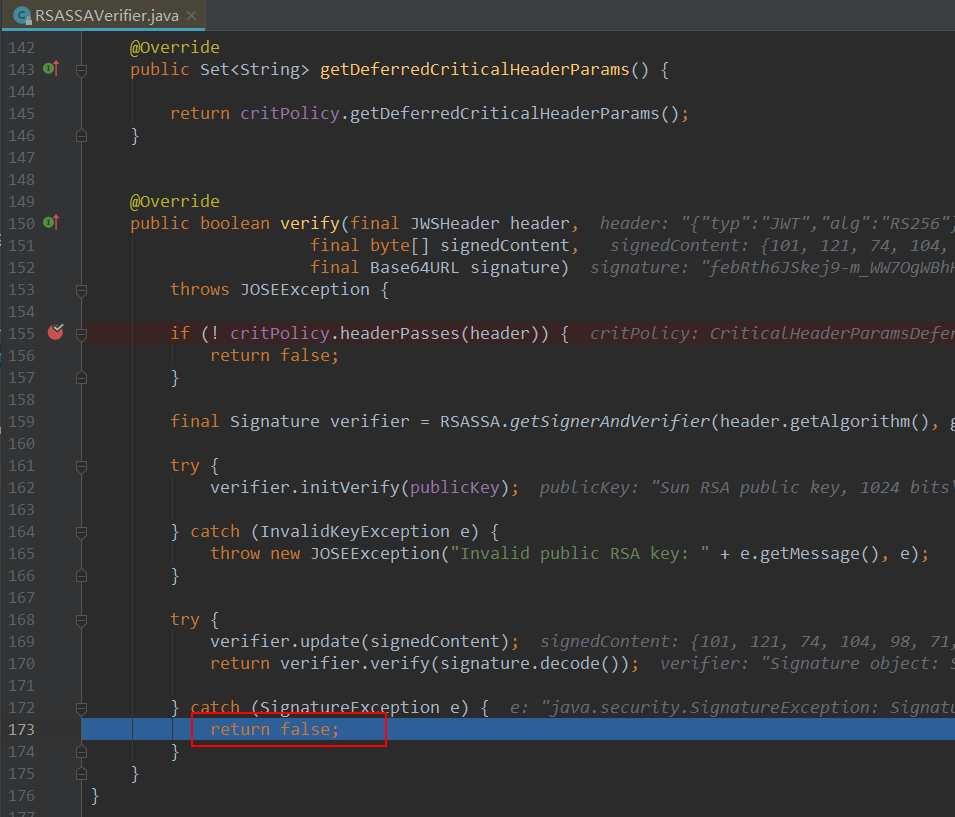
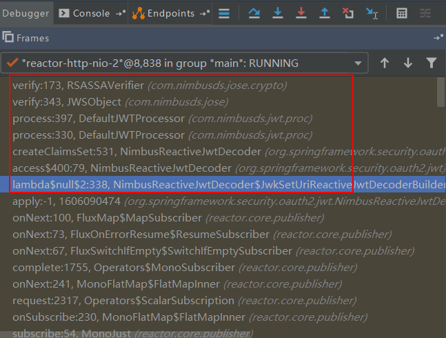
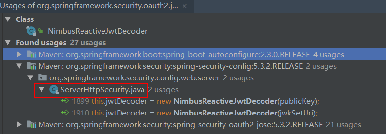
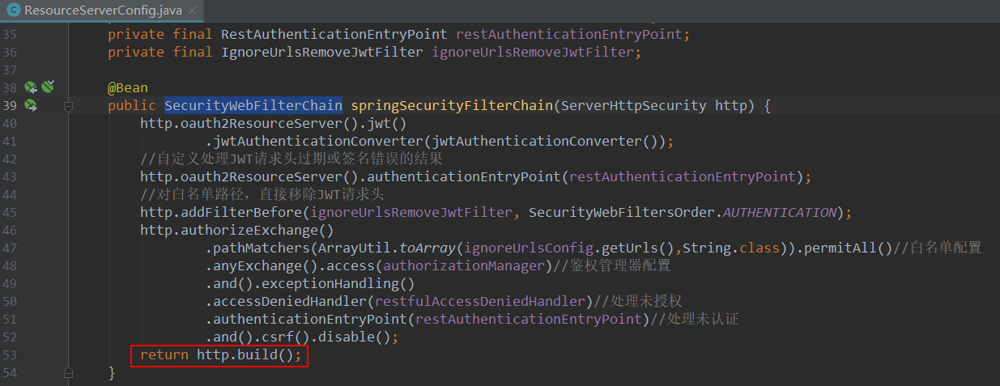
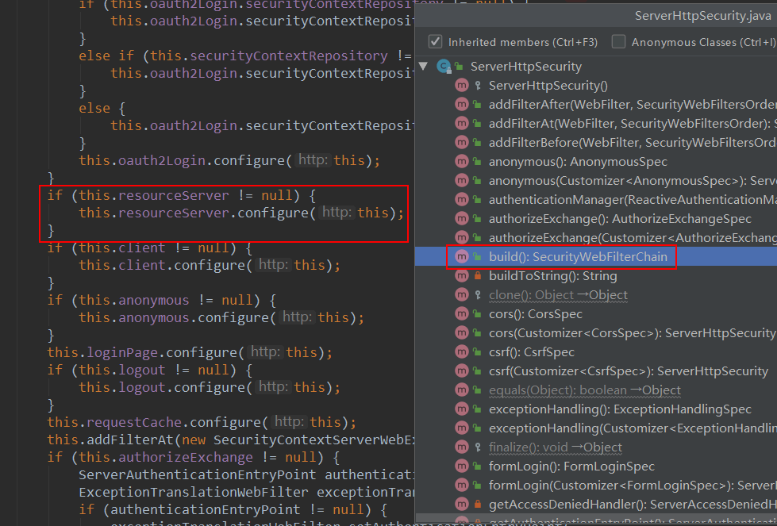
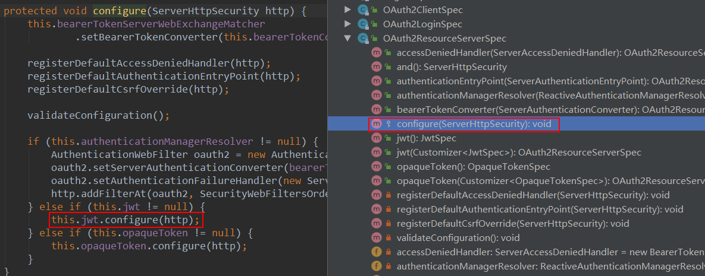
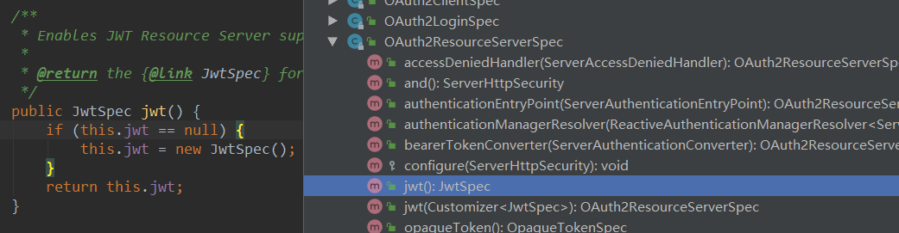
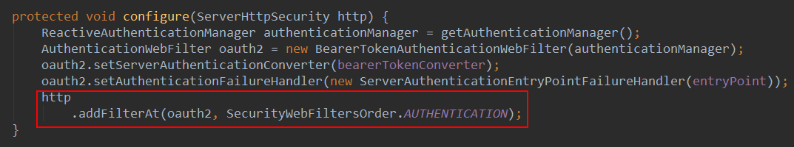
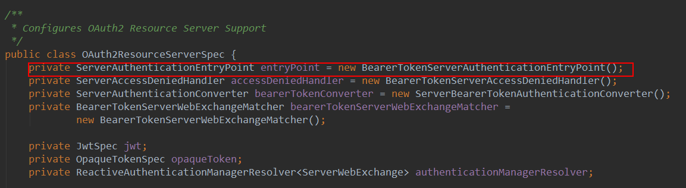

学习不走弯路，[关注公众号](#公众号) 回复「学习路线」，获取mall项目专属学习路线！

# 被我用烂的DEBUG调试技巧，专治各种搜索不到的问题！

> 在开发过程中，遇到问题，我们经常会使用搜索引擎来查找问题的解决方案，然后予以解决。但是有些问题一时半会搜索不到解决方案，需要自己去解决。这里分享下我解决这些问题使用的调试技巧，给大家一个解决问题的新思路！

## 问题描述

在[《我扒了半天源码，终于找到了Oauth2自定义处理结果的最佳方案！》](https://mp.weixin.qq.com/s/f1fDd98nnMJRexyJ3bydiw)一文中，当JWT令牌过期或者签名不正确时，我们想要自定义网关认证失败的返回结果。这个问题解决起来很简单，只需修改一行代码即可。但是当时查找解决方案确实花费了一番功夫，通过DEBUG源码才找到了Spring Security中提供的自定义配置，解决了该问题。下面讲讲我是如何通过DEBUG源码找到这个解决方案的！

## 解决过程

- 首先我们需要找到一个切入点，既然问题是由于JWT令牌过期或者签名不正确才产生的，我们很容易想到`RSASSAVerifier`这个关键类，它的`verify()`方法是用来验证签名是否正确的，我们可以在该方法上面打个断点DEBUG一下，发现程序执行过程果然会经过这里，要是签名不正确会直接返回false;



- 这时候我们可以查下堆栈信息，了解下这次调用的整个过程，可以看到红框以下的调用都是WebFlux里面的调用，没有参考意义，所以调用最早是从`NimbusReactiveJwtDecoder`类开始的；



- 我们搜索下`NimbusReactiveJwtDecoder`在哪里被使用到了，可以找到又一个关键类`ServerHttpSecurity`，我们在网关的安全配置`ResourceServerConfig`中曾经用到过它，猜想下如果Spring Security提供了自定义配置，那估计就在这个类里面了；



- 查看下`ServerHttpSecurity`的类注释，我们可以发现它相当于WebFlux版本的Spring Security配置；

```java
/**
 * A {@link ServerHttpSecurity} is similar to Spring Security's {@code HttpSecurity} but for WebFlux.
 * It allows configuring web based security for specific http requests. By default it will be applied
 * to all requests, but can be restricted using {@link #securityMatcher(ServerWebExchangeMatcher)} or
 * other similar methods.
 **/
```

- 在我们网关的`ResourceServerConfig`中，我们曾经调用过`ServerHttpSecurity`的`build()`方法，用于生成`SecurityWebFilterChain`;



- 让我们看看这个`build()`方法干了点啥，其中有段比较关键的是它调用了`OAuth2ResourceServerSpec`类的`configure()`方法；



- 而`OAuth2ResourceServerSpec`类的`configure()`方法又调用了`JwtSpec`类的`configure()`方法；



- 这个`JwtSpec`对象是不会为空的，因为我们在`ResourceServerConfig`中调用了`OAuth2ResourceServerSpec`类的`jwt()`方法创建了它；



- `JwtSpec`类的`configure`方法很关键，使用过滤器来进行认证是Spring Security实现认证的老套路了，于是我们找到了默认的认证过滤器`BearerTokenAuthenticationWebFilter`；



- `BearerTokenAuthenticationWebFilter`使用了`OAuth2ResourceServerSpec`中的`entryPoint`来处理认证失败，默认实现为`BearerTokenServerAuthenticationEntryPoint`；



- 之后我们在`BearerTokenAuthenticationWebFilter`的`filter()`方法，`BearerTokenServerAuthenticationEntryPoint`的`commence()`方法上分别打个断点，来验证下，调用过程中都经过了，完全正确；


- 也就是说我们只要把默认的认证失败处理器换成我们自定义的就行了，直接通过如下代码把`OAuth2ResourceServerSpec`中的`entryPoint`来设置成自定义的即可。

```java
/**
 * 资源服务器配置
 * Created by macro on 2020/6/19.
 */
@AllArgsConstructor
@Configuration
@EnableWebFluxSecurity
public class ResourceServerConfig {
    private final RestAuthenticationEntryPoint restAuthenticationEntryPoint;

    @Bean
    public SecurityWebFilterChain springSecurityFilterChain(ServerHttpSecurity http) {
       //省略若干代码...
       //自定义处理JWT请求头过期或签名错误的结果
       http.oauth2ResourceServer().authenticationEntryPoint(restAuthenticationEntryPoint);
       //省略若干代码...
       return http.build();
    }
}
```

## 总结

对于一时找不到解决方法的问题，我推荐使用DEBUG源码的方式来解决。首先寻找一个突破口，可以从你熟悉的一些类中去寻找一个必定会执行的方法，然后打断点，进行DEBUG，从调用的栈信息中查找出关键的类，之后通过这些关键类顺藤摸瓜就能找解决方法了！

## 项目源码地址

https://github.com/macrozheng/springcloud-learning/tree/master/micro-oauth2

## 公众号


